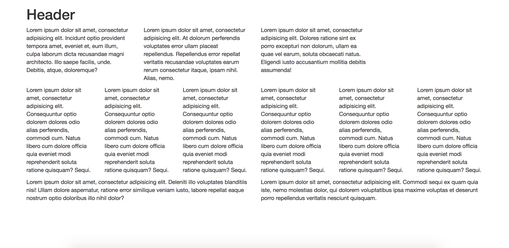

### File

* *None*

### Instruction

* Using Twitter bootstrap, create a layout that looks like:

  

* **HINT:** Spend some time prior to coding on drawing out the grid layout.

* **HINT:** Count the number of rows and columns.

* **HINT:** Then use the bootstrap grid syntax to code it out.
