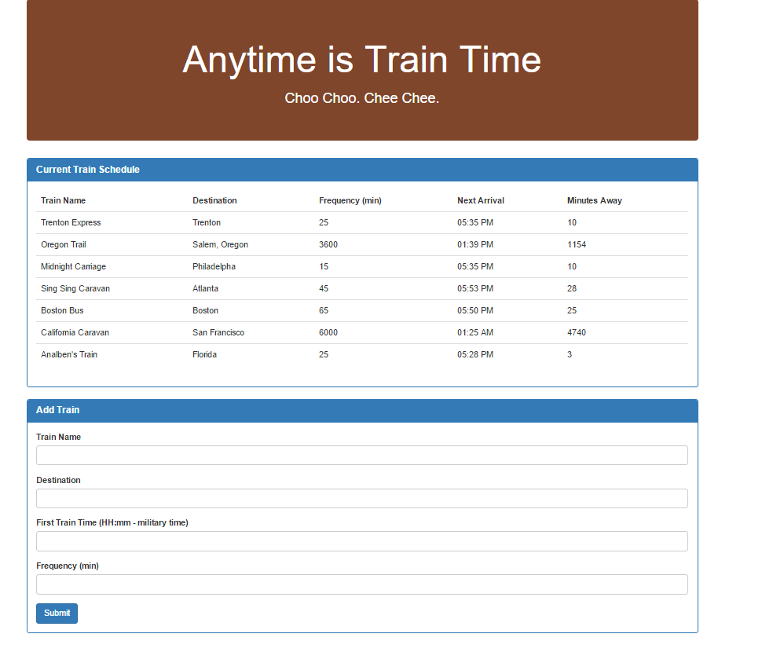

# Firebase Assignment - Train Scheduler (Basic - Recommended)

##### _Because that Rock Paper Scissors Game is Too Damn Hard_

### Overview

In this assignment, you'll create a train schedule application that incorporates Firebase to host arrival and departure data. Your app will retrieve and manipulate this information with Moment.js. This website will provide up-to-date information about various trains, namely their arrival times and how many minutes remain until they arrive at their station.

- - -

### Setup

* We'll leave that up to you -- however you like. Just make sure you're using Firebase to store data, GitHub to backup your project, and GitHub Pages to host your finished site.

### Submission on BCS

* Please submit both the deployed Github.io link to your homework AND the link to the Github Repository!

### Instructions

* Make sure that your app suits this basic spec:
  
  * When adding trains, administrators should be able to submit the following:
    
    * Train Name
    
    * Destination 
    
    * First Train Time -- in military time
    
    * Frequency -- in minutes
  
  * Code this app to calculate when the next train will arrive; this should be relative to the current time.
  
  * Users from many different machines must be able to view same train times.
  
  * Styling and theme are completely up to you. Get Creative!

### Example Site

### Bonus (Extra Challenges)

* Consider updating your "minutes to arrival" and "next train time" text once every minute. This is significantly more challenging; only attempt this if you've completed the actual activity and committed it somewhere on GitHub for safekeeping (and maybe create a second GitHub repo).

* Try adding `update` and `remove` buttons for each train. Let the user edit the row's elements-- allow them to change a train's Name, Destination and Arrival Time (and then, by relation, minutes to arrival).

* As a final challenge, make it so that only users who log into the site with their Google or GitHub accounts can use your site. You'll need to read up on Firebase authentication for this bonus exercise.

### Reminder: Submission on BCS

* Please submit both the deployed Github.io link to your homework AND the link to the Github Repository!

- - -

### Minimum Requirements

Attempt to complete homework assignment as described in instructions. If unable to complete certain portions, please pseudocode these portions to describe what remains to be completed. Adding a README.md as well as adding this homework to your portfolio are required as well and more information can be found below.

- - -

### Create a README.md

Add a `README.md` to your repository describing the project. Here are some resources for creating your `README.md`. Here are some resources to help you along the way:

* [About READMEs](https://help.github.com/articles/about-readmes/)

* [Mastering Markdown](https://guides.github.com/features/mastering-markdown/)

- - -

### Add To Your Portfolio

After completing the homework please add the piece to your portfolio. Make sure to add a link to your updated portfolio in the comments section of your homework so the TAs can easily ensure you completed this step when they are grading the assignment. To receive an 'A' on any assignment, you must link to it from your portfolio.

- - -

### One More Thing

If you have any questions about this project or the material we have covered, please post them in the community channels in slack so that your fellow developers can help you! If you're still having trouble, you can come to office hours for assistance from your instructor and TAs.

**Good Luck!**
