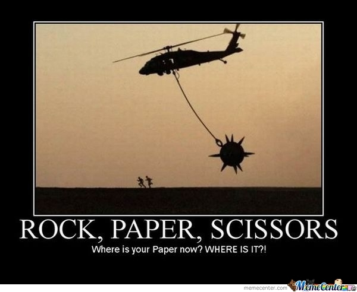

# RPS Multiplayer

### Statement of completion

If the student completed both the easier assignment and the recommended assignment, please provide the letter grade for the recommended assignment and leave short commentary for each, including a note of encouragement for attempting or completing both. 

Be subjective, grading & feedback should not take more than 5 minutes per assignment.

Student utilized jQuery & Firebase to create a multiplayer RPS game. Only two players maximum. Players each choose R, P, or S and are then told whether they won, lost, or tied. Wins, losses, and ties are tracked for each user. The deployed assignment has been added to their deployed portfolio with a link provided in the submission.

**Is the above statement correct?**

1. **Yes**: Grade will be an A or a B

2. **No**: Grade will be a C

3. **No idea, can't test**: Grade will be a D or an  F

4. **Empty Repository**: Grade will be an I
- - - 

### Yes (A or B)

If the student's assignment was pristine, give them an A, and an encouraging sentence for feedback.

If the student's assignment had a few areas for improvement, give them a B, and 2 or 3 specific pieces of feedback.

### No (C)

Give the student a C, and 2 or 3 specific pieces of feedback. Invite the student to office hours to go over topics not mastered.

### No idea (D or F)

If the project isn't deployed, the student receives a D.

If the student submitted a homework but nothing works or functions, the student receives an F.

Either way, explain to the student why they received that grade and invite them to visit office hours for help.

### Empty Repository (I)

Students should receive this grade **only** if they submit an empty repository. If the student attempted the homework assignment and was simply unable to get it fully functioning, they should still receive a normal letter grade, not an 'Incomplete'.

- - - 

**Good Luck!**
