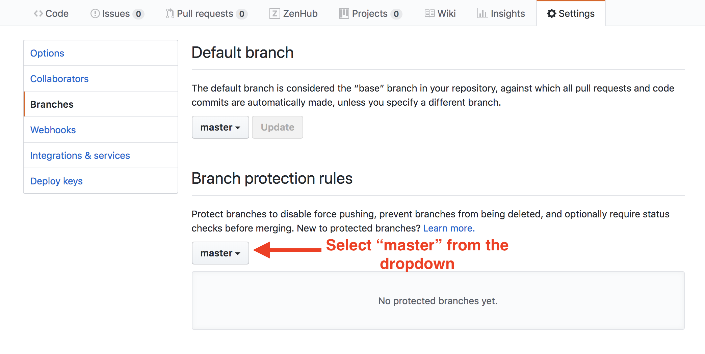
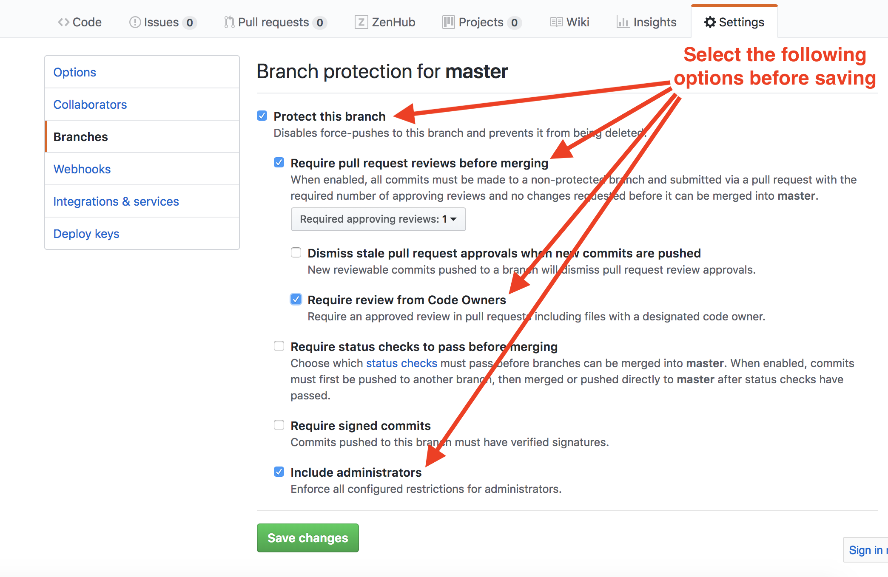
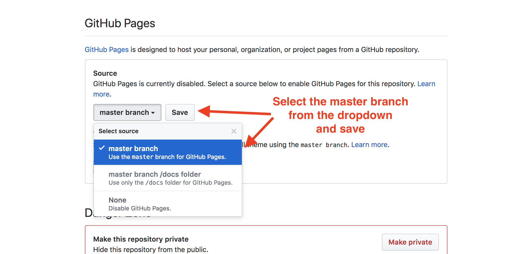

# Continuous Deployment

In this activity we will protect our project master branches and set up continuous deployment from the master branch, or _confirm_ that these have already been done.

## Instructions

### Part I: Protect Master

* Navigate to your repo's "Settings" page. Select "master" under the "Branch protection rules" dropdown. Then on the next screen, select the following options:

  1. "Protect this branch"

  2. "Require pull request reviews before merging"

  3. "Require review from Code Owners"

  4. "Include administrators"

  

  

### Part II: Set Up Continuous Deployment

* Go back to your repo's main "Settings" page and scroll down to the "Github Pages" section. Select "master branch" from the dropdown and save.

  

* You should be provided a URL for the deployed app if you scroll back down to this section. It may take a few minutes for the website to deploy. Ask an instructor or TA for assistance if you can't verify this worked.

### Hints

* Ensure the there's an `index.html` file at the root of the repo. 
