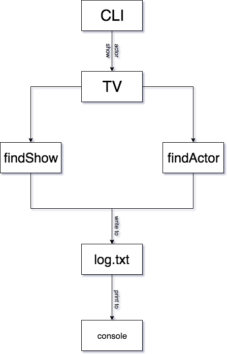

# Architecture Solved

## Modules

* **CLI**

  * The CLI takes in command line arguments and determines whether we're searching for a TV Show or a TV Actor. It also determines which show or actor the user wants to search for and uses the TV module to make the appropriate search.

* **TV**

  * The TV module is a constructor function. It creates an object that contains methods for searching the [TV Maze API](http://www.tvmaze.com/api) for either a TV show or a TV actor. Once a result it found, it should save some information to a text file and then print the result to the console.
