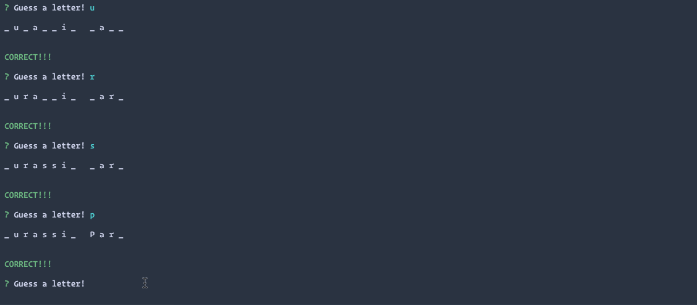

# Advanced JavaScript Assignment: Constructor Word Guess

### Overview

This homework assignment is **optional**.

In this unit's assignment, you will create a Word Guess command-line game using constructor functions.

### Submission on BCS

* Please submit the link to the Github Repository!

## Instructions

The completed game should meet the following criteria:

1. The completed game should be able to receive user input using the `inquirer` or `prompt` npm packages.

2. Your solution should have, at minimum, three files:

* **Letter.js**: Contains a constructor, Letter. This constructor should be able to either display an underlying character or a blank placeholder (such as an underscore), depending on whether or not the user has guessed the letter. That means the constructor should define:

  * A string value to store the underlying character for the letter

  * A boolean value that stores whether that letter has been guessed yet

  * A function that returns the underlying character if the letter has been guessed, or a placeholder (like an underscore) if the letter has not been guessed

  * A function that takes a character as an argument and checks it against the underlying character, updating the stored boolean value to true if it was guessed correctly

* **Word.js**: Contains a constructor, Word that depends on the Letter constructor. This is used to create an object representing the current word the user is attempting to guess. That means the constructor should define:

  * An array of `new` Letter objects representing the letters of the underlying word

  * A function that returns a string representing the word. This should call the function on each letter object (the first function defined in `Letter.js`) that displays the character or an underscore and concatenate those together.

  * A function that takes a character as an argument and calls the guess function on each letter object (the second function defined in `Letter.js`)

* **index.js**: The file containing the logic for the course of the game, which depends on `Word.js` and:

  * Randomly selects a word and uses the `Word` constructor to store it

  * Prompts the user for each guess and keeps track of the user's remaining guesses

3. `Letter.js` *should not* `require` any other files.

4. `Word.js` *should only* require `Letter.js`

5. **HINT:** Write `Letter.js` first and test it on its own before moving on, then do the same thing with `Word.js`

6. **HINT:** If you name your letter's display function `toString`, JavaScript will call that function automatically whenever casting that object to a string (check out this example: <https://jsbin.com/facawetume/edit?js,console>)

- - -

### Notes

* Since this assignment is a command-line application, you don't need to deploy it anywhere. You will, however, be required to upload it to Github.

* Remember to include a `package.json` file containing your project dependencies in your Github repo!

### Reminder: Submission on BCS

* Please submit the link to the Github Repository!

### Minimum Requirements

Attempt to complete homework assignment as described in instructions. If unable to complete certain portions, please pseudocode these portions to describe what remains to be completed. Adding a README.md as well as adding this homework to your portfolio are required as well and more information can be found below.

- - -

### Create a README.md

Add a `README.md` to your repository describing the project. Here are some resources for creating your `README.md`. Here are some resources to help you along the way:

* [About READMEs](https://help.github.com/articles/about-readmes/)

* [Mastering Markdown](https://guides.github.com/features/mastering-markdown/)

- - -

### Add To Your Portfolio

After completing the homework please add the piece to your portfolio. Make sure to add a link to your updated portfolio in the comments section of your homework so the TAs can easily ensure you completed this step when they are grading the assignment. To receive an 'A' on any assignment, you must link to it from your portfolio.

- - -

### One More Thing

If you have any questions about this project or the material we have covered, please post them in the community channels in slack so that your fellow developers can help you! If you're still having trouble, you can come to office hours for assistance from your instructor and TAs.

**Good Luck!**

- - -
