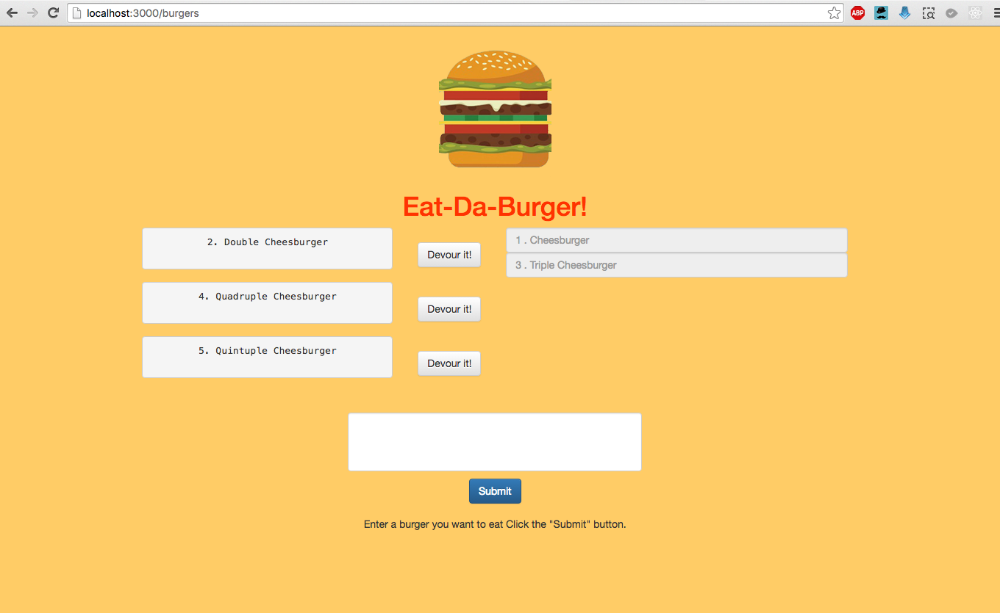
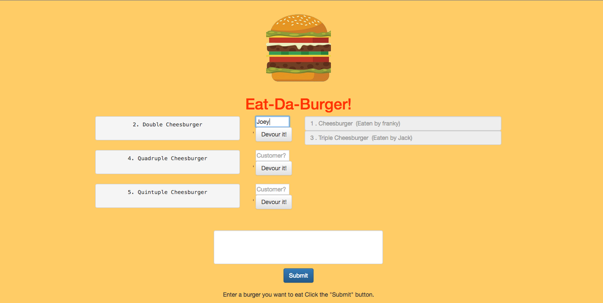

# Burger 2: The Sequel

### Overview

This homework assignment is **optional**. 

In this assignment, you're going to Sequelize the `Burger` app you made last unit. We've split this exercise into three different tiers, all with different tasks and expectations. Finish whichever tier will provide you with the most reasonable challenge.

### Before you Begin

1. Create a new folder called `sequelizedBurger`
2. Copy the contents of your completed assignment from last unit.
   * Remove the older git connection with `rm -R .git`. 
   * Then connect this folder with a new github repo.
3. Run `sequelize init` to create the necessary files.

4. **Note**: If for any reason you don't have a finished assignment for last unit, no problem. Message the instructor, who will provide you will a skeleton file to work of for this unit.

### Submission on BCS

* Please submit both the deployed Heroku link to your homework AND the link to the Github Repository!

## Instructions

Put in your best efforts to complete one of the three available challenge tiers. Remember to deploy your assignment to Heroku once complete.

#### Tier 1: Sequelized! (Basic to Moderate)

* Remove all references to your vanilla MySQL queries and replace them with Sequelize queries.

* That means:

  * Replacing your MySQL `Burger` model with a Sequelized equivalent.

    * Don't forget to edit the model and initial migration file to make the burger's devoured field carry a default value of false -- otherwise you might encounter bugs.
      * There's no option to include that default in the command line, so you'll need to open up your editor to make this change. 
    * Don't forget to sync the models!

    * Edit your new `config.json` file to include your database configurations. Place your JawsDB details in the `production` property of your json file; the details of your local database go in the `developer` property.

    * Remove your old ORM file, as well as any references to it in `burgers_controller.js`. Replace those references with Sequelize's ORM methods.

* When you finish, your site should function just like your last one:
     

#### Tier 2: Customer Associations (Challenge)

* Add in a Customer association to the project. This will involve creating at least one new Customer model and connecting it with your Burger model.

* What kind of association you would like to use is up to you. Does a Customer have one Burger? Many Burgers?

* For example, you could make a site that logs the name of which Customer ate which Burger, where each Customer only gets one Burger. If you can't think of another type of association, try this one!

    

* If you do go select this tier, you must edit the handlebars files and CSS stylesheets to implement some sort of additional feature to the site. We don't want you to just connect two models and submit your project. Make your site do something relevant to this association.

#### Bonus! (Challenge)

* Add validations to your models where:

  * A burger's name cannot be null
  * A burger's devoured status is false by default
  * A Customer's name cannot be null

* Order the Burgers you send back to the user in alphabetical order using the Sequelize "order" option.

### Reminder: Submission on BCS

* Please submit both the deployed Heroku link to your homework AND the link to the Github Repository!

- - -

### Minimum Requirements

Attempt to complete homework assignment as described in instructions. If unable to complete certain portions, please pseudocode these portions to describe what remains to be completed. Hosting on Heroku and adding a README.md are required for this homework. In addition, add this homework to your portfolio, more information can be found below.

- - -

### Hosting on Heroku

Now that we have a backend to our applications, we use Heroku for hosting. Please note that while **Heroku is free**, it will request credit card information if you have more than 5 applications at a time or are adding a database. 

Please see [Heroku’s Account Verification Information](https://devcenter.heroku.com/articles/account-verification) for more details. 

- - -

### Create a README.md

Add a `README.md` to your repository describing the project. Here are some resources for creating your `README.md`. Here are some resources to help you along the way:

* [About READMEs](https://help.github.com/articles/about-readmes/)

* [Mastering Markdown](https://guides.github.com/features/mastering-markdown/)

- - -

### Add To Your Portfolio

After completing the homework please add the piece to your portfolio. Make sure to add a link to your updated portfolio in the comments section of your homework so the TAs can easily ensure you completed this step when they are grading the assignment. To receive an 'A' on any assignment, you must link to it from your portfolio.

- - -

### One More Thing

If you have any questions about this project or the material we have covered, please post them in the community channels in slack so that your fellow developers can help you! If you're still having trouble, you can come to office hours for assistance from your instructor and TAs.

**Good Luck!**
