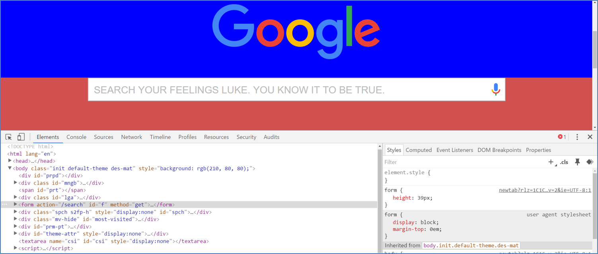
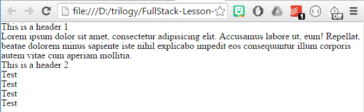

## 2.1 Lesson Plan - Going Live <!--links--> &nbsp; [⬅️](../../01-Week/03-Day/03-Day-LessonPlan.md) &nbsp; [➡️](../02-Day/02-Day-LessonPlan.md)

### Overview

Today's class is focused on empowering students with GitHub Pages for live deployments and the concept of Git pull requests for better collaboration. 

`Summary: Complete activities 1-6 in Unit 02`

##### Instructor Priorities

* Students should be given a recap of what's been covered so far
* Students should learn how to incorporate CSS resets
* Students should learn to deploy their websites using Github Pages
* Students should be exposed to the concept of pull requests in GitHub

##### Instructor Notes

* Welcome back to Week 2! In this class, your primary focus as instructors/TAs is to ensure students are able to utilize Github Pages to deploy their websites. Going forward from today, students will be expected to submit Homework with links to both their GitHub repository and a live deployed website. Be ready to have your troubleshooting hat on for helping them debug deploys, as the surface area for problems is somewhat large.

* Towards the end of this lesson plan, we've included a "Common Issues" section. This is intended to help you as an instructor/TA better assist your students by offering possible solutions to students' bugs.

* Lastly, the slideshow and lesson plan for today include an extra section on Git Pull Requests. Consider this section to be used only if you have spare time. If students are stuck on deployment issues, focus on resolving these first and foremost. There will be time to discuss Git Pull requests at a later date in the program. 

* Have your TAs reference [01-Day-TimeTracker](01-Day-TimeTracker.xlsx) to help keep track of time during class.

### Sample Class Video (Highly Recommended)
* To view an example class lecture visit (Note video may not reflect latest lesson plan): [Class Video](https://codingbootcamp.hosted.panopto.com/Panopto/Pages/Viewer.aspx?id=368ef618-e835-4ef6-818b-7f220e562281)

- - -

### Class Objectives

* To recap the basic topics covered to date
* To offer a conceptual introduction to CSS reset and downloadable style sheets
* To work with Google Developer tools for site inspection
* To utilize Github Pages for website deployment 

- - -

### 1. Everyone Do: Check-Up Session (7 min)

* Spend the first few moments of class engaging students to offer feedback and reflections so far. In my personal class I use [Poll Everywhere](https://www.polleverywhere.com) and have students text their responses to generic questions. The results (whether a poll or anonymous feedback) appear on screen. How you engage with students is up to your personal preference, but do take a few moments to elicit students' honest feedback in some way. Give them a chance to offer perspective on: "pace", "content", "challenges", etc. If students feel like they can help guide the classroom experience, they will feel even more invested.

### 2. Instructor Do: Offer Feedback to Students (5 min)

* Take a few moment to offer encouraging feedback to students. Let them know what's impressed you so far about their work ethic, learning speed, collaboration. Feel encouraged to customize the feedback slide to your own class's personality. 

### 3. Instructor Do: Admin Items (5 min)

* Remind students that Homework #1 is due in the next few days. 

* Try to be firm with but also encouraging of students by saying they **need** to submit something for their homework -- even if it's not done. If you start early you can establish a culture in which students submit their homework, even despite not feeling 100% comfortable with what they've made. 

* Suggested lines you might use:

  > **Softer Tone:** Trust me, in this course there will be many instances in which you don't feel like your homework is fully complete. You may have unresolved bugs. Your design may not have turned out quite right. You may not have had as much time as you would have liked to work on the assignment. But here's the thing: submit anyway. It's important that as a developer you get used to imperfection. And the only way we can help you is if we know where you're at.
  >
  > **Harder Tone:** As part of the program, student success actively monitors homework submission rates. If you fall below two homework submissions, they will bar you from career services. Don't let that be you! 

* Then let students know when Office Hours + Additional Help are available (using the slide). Make sure to change the links according to your class's repo in advance. 

### 4. Instructor Do: Recapping (10 min)

* Spend the next 10 minutes flipping through the "recap" slides. The purpose of these slides is to remind students of all that we have covered so far. Don't get sucked into the details too much. Stay at a high level.

* At various points in the slides, there will be obvious opportunities to ask students questions. For instance: 

  * Before again defining "Full Stack Development" have them define it for you. 

  * When talking about console, have them answer questions about which console command is used to `make new files` or `switch directories`.

  * When talking about GitHub, have them explain back to you the two big reasons why Git Collaboration is so important (Code Conflicts + Version History).

* When you arrive at the slide titled "How to Learn", emphasize the fact that in their fumblings they've already learned one of the most important lessons of all: how to find things out on their own. 

* Then give them a few moments to ask questions or present issues should they have any lingering questions, issues, confusions, uncertainties. 

### 5. Instructor Do: Double Take (10 min)

* The purpose of this section is to dive more deeply into subjects that students may be confused about. 

* The biggest question students often ask at this point is "What's the difference between a 'div' and a 'section'?" Use the slides offered to give students context about these elements. Namely:

  * `div`s and `section`s are both effectively "containers". In creating HTML, you create `div`s and sections to "wrap" around content like paragraphs, headers, images, etc.

  * `div`s are the more basic container. With HTML5 there came the opportunity for "semantic layouts", meaning `div`s could be given more specific names. This supposedly offers more readable code, better organization, and search engine optimized sites.

  * That said, many many sites still use `div`s -- including the W3 website itself as there are other ways to "identify" different containers. (Interestingly enough, W3 uses plain `div`s even on the page about semantic elements itself.)

  * Mention that there is no hard-and-fast rule here. 

* Then point out the difference between classes and IDs. Namely:

  * Classes are reusable elements. Essentially blocks of CSS that you plan on using to style many different elements on the page.

  * IDs are single use styles. They offer specificity and uniqueness.

### 6. Chrome Developer Tools (0:10)

* Then talk about Google Developer Tools again. Mention that it is incredibly important for developers. Then walk students through a demo of its use when prompted. Be sure to point out how Google Developer Tools can be used to change both:

  * HTML Elements

  * CSS Elements (show them how to change the box model in particular)

    

### 7. Students Do: Modify a Website (15 min)

* Then Slack out the following activity:

* **Instructions:**

  * For the next 15 minutes, take a website that you commonly use (Amazon, Google, Huff Po, etc.) and heavily modify it using the Chrome Developer Tools.

  * Be sure to at least modify:

    * Content (Change words)
    * Colors
    * Spacing
    * Etc.

  * Slack out a screenshot to the class when you’re done.

* **Instructor/TAs:** 

  * Walk around during this time and ensure that students are making progress.

  * Remember students can still drop-out! Help them to enjoy fun activities like this.

  * Once the activity is complete showcase a few of the students' creations on the screen for everyone to see. 

### 8. Students Do: Modify Own Websites (10 mins)

* Then Slack out the following activity:

* **Instructions:**

  * For the next 10 minutes, take a website that you yourself worked on (ex: In-Class activities, homework assignments, etc.), and utilize the Chrome Developer Tools to help you test changes in real-time. 

  * Note: Focus on getting more comfortable using the Developer Tools. Trust us. You will WANT to use these Developer Tools as you proceed in this course. 

- - -

### 9. BREAK (15 min)

- - -

### 10. Instructor Do: Multiple CSS/CSS Resets (10 min)

* Take a few moments to explain that CSS can be loaded in multiple files, each of which is additive on the last. To assist you in this regard, see the examples in `03-MultipleCSS`. In each example, the CSS file is split between 1, 2, or 3 files. In each instance the end result is the same.

```html
<!-- This critical line points your HTML to the CSS file. Notice the "relative" pathway -->
<link  rel="stylesheet" type="text\css" href="style.css">
<link  rel="stylesheet" type="text\css" href="style2.css">
<link  rel="stylesheet" type="text\css" href="style3.css">
```

* Point out to students that the order matters, and that later CSS files will "overwrite" previous ones if there is a repeat. Feel encouraged to demonstrate this by modifying the examples in `03-MultipleCSS`.

* Have students first show by hands the browsers they use. 

* Then proceed to the series of slides on reset.css and browser differences. Point out that as of now, each browser determines for itself how things like headers, paragraphs, and tables should look. The font and thickness is all pre-set by the browser. This can create situations where your website will look one way in one browser and another way in another browser. 

* After pointing out that browsers work differently in how they render pages, emphasize that cross-browser compatibility is critical in web development. This is particularly important when you are creating an app with millions of users.

* Point out that you can incorporate a `reset.css` file, made available online, that ensures your site will look the very same in different browsers. (It resets any default styling that the browser adds.)

* Then demonstrate the use of a CSS reset. To do this:

  * Open the file `example.html`

  * Then Google Search "CSS reset". The first link will be one found on the meyerweb website. <http://meyerweb.com/eric/tools/css/reset/>.

  * Copy the CSS made available on that site and paste it into your editor. Save that file somewhere locally on your computer.

  * Then link the CSS file into the HTML.

  * Run the HTML file again in browser and point out how it has been stripped of any pre-built browser styling, thereby allowing you to style everything from scratch.

     

* Then point out that reset.css is important because of:

  * Cross Browser Compatibility

  * Ability to use pre-made CSS from someone else (an idea we will exploit repeatedly)

  * It's a common front-end question

### 11. Students Do: CSS Resets (10 min)

* Slack out the following instructions to students.

  * Slack out the files inside `04-ResetCSS`

* **Instructions:**

  * Follow the instructions in the HTML document to incorporate a reset.css file into a basic HTML file.

  * Note the impact the reset file makes after its inclusion. 

  * Hint: You should be using the CSS made available on this link: <http://meyerweb.com/eric/tools/css/reset/>

    * Bonus: Incorporate a CSS reset into any page you've worked on to date.

### 12. Instructor Do: Deploying to GitHub Pages - Personal (0:15)

* Now that our class has created a few basic webpages locally, it's about time we started putting these pages online for the world to see. In order to do this, we are going to be hosting our websites on GitHub Pages.

* Spend a few moments explaining the concept of "deployment", namely the idea that as of yet, students' websites have only been accessible on their own computers. In order for their websites to be accessible by the public, it needs to be deployed on a server.
  * Explain to the class what the concept of a "host" is.
  * A web host is the activity or business of providing storage space and access for websites. You cannot put a website online without it being hosted on a server somewhere.

* Open up the [GitHub Pages website](https://pages.github.com/) and explain how it essentially allows us to turn GitHub repositories into live webpages without having to worry about pushing our code to another web host provider.

* GitHub Pages allows you to create two different types of sites (we will be going over both methods):
  1. Personal/organization sites for your account
  2. Sites that are specific to a project/repository

* Start out with a walk through of the first method: creating a personal website using GitHub Pages.
  1. Create a new repository on GitHub called `_username_.github.io` where `_username_` is your account name on GitHub.
  2. Next, open up Git Bash or Terminal on your computer. Navigate into the folder that you would like to store your project in and then clone the repository you just created.
  3. Within this new folder, add an HTML file called `index.html` which contains the code for the website you would like to publish.
  4. Add, commit, and push your changes to the repository and... That's it! Whenever anyone navigates to `_username_.github.io` they will now land on your webpage!
  5. Navigate to the website on your browser to show your class that the webpage is now fully online.

* Recap the steps for deploying to GitHub Pages one more time before continuing onto the next activity.
  1. Create a new repo that is named `_username_.github.io`
  2. Navigate into a folder and clone the repo into it
  3. Add an HTML file named `index.html` and code out your webpage
  4. Add, commit, and push your changes into the repository

### 13. Students Do: Deploying Personal Bios to GitHub Pages (0:15)

* For this activity, students will be deploying the bio pages they made in the last activity to Github Pages.

* **Instructions:** `05-GithubPagesPersonal/README.md`

### 14. Instructor Do: Deploying to GitHub Pages - Projects (0:15)

Not every website can be a personal website, however, as there are many times in which we will want to create websites that are customized for specific projects. Luckily for us, GitHub Pages includes a VERY simple way to deploy webpages for individual projects as well!

* Walk through the steps required to create a website for a specific repository...

  1. Create a new repository on your GitHub account. You can name this repository whatever you would like.
  2. Once inside of the repository, create a new file and name it `index.html`
  3. Add some very basic HTML into this file, save it, and then navigate into your repository's Settings tab.
  4. Scroll down to the GitHub Pages section and then, in the section labeled "Source", select that you would like to use the master branch as your source.
  5. Navigate to `_username_.github.io/_repositoryname_` and you will find that your new web page has gone live!

* It is very likely that your students will be wondering how to get a custom domain for their projects as opposed to a site that is clearly linked to their GitHub account...

  * Mention that custom domains are more heavily coveted since they are more easily searchable online. This means that custom domains have to be purchased from companies known as "DNS Providers". These companies allow users to buy and register unique domain names and connect that name to an IP address. **GitHub Pages does not sell domain names.**

  * Tell your students not to worry about custom domains at this time since it is not necessary for the web work that we will be doing. If they really wish to link a webpage of theirs to a custom domain, however, GitHub Pages has great documentation on how to go about doing this.

### 15. Students Do: Creating a Project Site (0:15)

* For this activity, students will be creating a web page about their favorite animal. Students will deploy the HTML document to a GitHub Pages project page.

* **Instructions:** `06-GithubPagesProject/README.md`

### 16. Instructor Do: Homework 1 Help (13 min)

* With the remainder of class, offer to help students looking to complete Homework 1. 

* If there is significant time remaining, unhide the slides on Git Pull Requests and go through those. 

- - -

### 17. END

- - -

### Troubleshooting Guide

* Below is a list of the most common issues that students present when trying to do Github Pages deployments.

* **Forgetting to git "add -A, git commit -m":** Often students will completely skip the step where they save and commit their changes prior to pushing to GitHub. This will mean their web page is essentially blank. As a starting point, ensure their code is present in GitHub.

* **Didn't name the repo correctly:** Students will likely not name the repository for their custom site correctly - ensure it follows the pattern `_username_.github.io`

* **Images and/or CSS not appearing:** All filenames and paths are case sensitive. Ensure that all links in HTML are using case-sensitive paths that match the folder directories casing.

* **Not using relative paths:** Many students are still using absolute paths to reference their CSS or image files. Help them to convert these to relative paths. 

* **Not knowing where their site deployed:** Show students that they need to login to the site and they will see the new app deployed on their menu. Give them guidance as to what the URL for their repo will be.

* Beyond that... Good luck!

### Lesson Plan Feedback

How did today's class go?

[Went Well](http://www.surveygizmo.com/s3/4325914/FS-Curriculum-Feedback?format=pt&sentiment=positive&lesson=02.01)

[Went Poorly](http://www.surveygizmo.com/s3/4325914/FS-Curriculum-Feedback?format=pt&sentiment=negative&lesson=02.01)
