## 2.3 Lesson Plan - Bootstrap Layouts and Responsive Designs <!--links--> &nbsp; [⬅️](../02-Day/02-Day-LessonPlan.md) &nbsp; [➡️](../../03-Week/01-Day/01-Day-LessonPlan.md)

Today's class is focused on introducing students to the concept of grid-based web design and the utilization of Bootstrap for grid-layouts. Towards the end of the class, we will also be covering mobile-responsive web design using media queries and viewports. 

`Summary: Complete Activities 12-18 in Unit 02`

##### Attention: If you’re teaching a part time section and this isn’t a Saturday, please use the “Weekday” tab inside of the "03-Day-TimeTracker.xlsx" for activity lengths instead of those printed on this lesson plan 

##### Instructor Priorities

* Students should complete each of the layout "workshops" as a class.
* Students should complete the two Bootstrap grid (coding) activities.
* Students should complete the media query activities.

##### Instructor Notes

* Today's class has historically been one of our most fun classes. It's fun because we go through the process of showing students both how to visualize websites as grids as well as how to create their own grid-based layouts. Many students have an "Aha!" moment as they realize just how CSS frameworks like Bootstrap can dramatically save time when it comes to layout building.

* Much of today's slideshow is intended to be a series of in-class engagement exercises. Spend ample time in class asking students pointed questions, when appropriate, to make sure they're following.

* Also, today's class is an opportunity for Instructors/TAs to share a few of their own experiences learning web development. Some students may be feeling a bit rushed by the pace, so it's important for them to hear firsthand that the rate of their learning is "incredible." They aren't "behind" just because they haven't learned everything. That will come with years of experience. But the reality is, they don't need to learn "everything" to get a job as a web developer.

* The latter portion of today's class (media queries and viewports) is a bit less important in the grand scheme. However, these elements are very relevant to the homework, so make a strong effort to get to them as well. 

* Depending on how well you are doing on time, feel free to create mini-exercises on the fly to ensure students understand the grid. 

* Have your TAs reference [03-Day-TimeTracker](03-Day-TimeTracker.xlsx) to help keep track of time during class. (Note: If this class falls on a Saturday, click the "Saturday" tab on the spreadsheet to see the appropriate schedule.) 

### Sample Class Video (Highly Recommended)
* To view an example class lecture visit (Note video may not reflect latest lesson plan): [Class Video](https://codingbootcamp.hosted.panopto.com/Panopto/Pages/Viewer.aspx?id=72ccb911-dfd1-465c-90fd-9929bc460c14)

- - -

### Class Objectives

* To gain a conceptual understanding of the role of grid-based web design in modern web development
* To utilize the Bootstrap grid system to create complete web layouts
* To understand the concept of mobile responsive web design and the use of media queries to achieve it

- - -

### 1. Instructor Do: Welcome Students

* Welcome students back to class. Then open the Powerpoint [BeholdBootstrap](Slide-Shows/).

### 2. Instructor / TA Do: Emotional Monologue (10 min)

* Begin class by going through the slides for building a positive vibe in the class. Use the following points as suggestions for what to say. 

  * **Help ME Slide:**

    * Have students raise their hands as you ask each of the following questions.

    * Ask students how many of them come to class feeling anxious?

    * Ask students how many students have felt confused in class?

    * **Most Importantly** Ask students how many of them feel like they're 'behind'?

      * Then rhetorically ask students, "What does it mean to feel behind?"

      * **Also Important** Have students raise their hand if "feeling behind means..."

      * ...Feeling like you are behind other students in class.

      * ...Feeling like you aren't learning the material fast enough to get a job.

      * ...Feeling like you aren't learning the material as quickly as you expected.

  * **Deep Breath:** 

    * Have students take 5 deep breaths.

  * **It's all going to be okay:**

    * Then let students know it's going to be okay. 

  * **You are awesome:**

    * Let students know that they are learning material at a breakneck speed. And that other self-taught developers take months to learn the same amount of material they've learned in weeks.  

    * Then **very importantly**  take a few moments to have yourself and your TAs share their own experience struggling through coding. If your TAs went through Boot Camps, have them share their own advice and emotional perspectives. How hard was it? When did it finally click? Etc.

    * And let them know it's going to be okay. And that you and the TAs are available to help. 

    * Let them know that, if they are ever staring at a blank screen for more than 2 hours, they should reach out for help.

    * Then **importantly** open it up for questions or comments from the class.

### 3. Instructor Do: Today's Class (1 min)

* Briefly discuss the topics to be treated today. (You can have students read these out loud if you like.)

* Let students know that today's class really matters, because we will be building layouts with Bootstrap all throughout. 

### 4. Instructor Do: Recap Bootstrap (5 min)

* Take a few brief moments to recap the context of Bootstrap. 

* Point out that the HTML + CSS of creating the last homework assignment was incredibly challenging, and that finagling with CSS is taxing.

* Point out that Bootstrap lets you take advantage of pre-built CSS, in which you utilize pre-assigned classes that get styled using Bootstrap's library.

* Point out that using Bootstrap requires two steps:

  1. Including the CSS link

  2. Including the specific classes associated with bootstrap styles (found on the website's documentation).

* Point out that this is a big deal because it lets us use predefined CSS Styles, a concept we will be revisiting repeatedly. 

* Then either ask students what the two advantages to using Bootstrap are, or just show them the slides.

  * UI Kit 

  * Mobile responsiveness

### 5. Students Do: Warmup Bootstrap Component Activity (5 min)

* Slack out the following instruction to students (or show them the slide). 

* Don't spend too much time on this activity. It's just a warm-up!

* **Instructions:**

  * As a repeat of last class, quickly create an HTML web page.

  * Then add in a Bootstrap component of your choosing.

  * Hint: Copy the Bootstrap CSS link. Then copy the code from any Bootstrap element or CSS.

### 6. Instructor Do: Review Warmup Bootstrap Component Activity (1 min)

* Open the file `index.html` (12-WarmupBootstrap) and walk students through the solution. 

* Point out that you've added the CSS reference link and the specific jumbotron class. 

### 7. Instructor Do: Sketching / Grid Layouts (7 min)

* First have students take another huge breath. Because this is one of the most important concepts in the course.

* Let them know that many of them will be targeting Junior Front-end developer jobs. Having a strong grasp of grid layouts is incredibly important in UI/UX design. 

* Then let them know it won't be hard.

* Let students know that every good web design begins with a sketch. As they've discovered, everything in CSS has to be mathematically laid out. You need to have dimensions for your margins, padding, etc. This requires that these sketches are built with a "grid" in mind to help with alignments. 

* Walk through the wireframes and website examples and show students how the grid looks when overlaid.

* If you'd like, open a random website of your choosing and show how a grid principle applies. It may not be obvious, but the key point is that elements line up/are ordered in a grid.

* Point out that there are many tools for wireframes and that Balsamiq is among the best. (We will later share with them a Balsamiq ID that they can use in the class during project week.)

### 8. Instructor Do: Rows and Columns Workshop (25 min)

* This section is the crown jewel of today's class. Essentially, it is a series of "wireframes" in which you will ask the class to "count" the number of rows and columns they see. These observations will directly dovetail into the next discussion of Bootstrap's grid system. Take the time needed in this section to make sure your students understand this stuff.  In each example, have students talk to the person next to them to come up with the number of rows and columns. 

* Let students know that every website effectively started as a wireframe. The wireframe places text, titles, images, etc., all in their respective general positions.

* Point out how it's important to break down websites into rows and columns. 

* Then show the following slide:

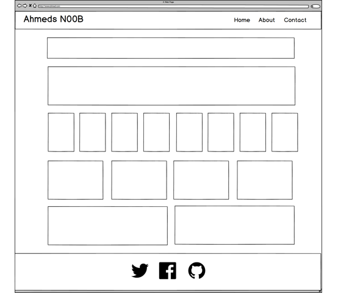

* Ask students how many rows and columns they see. If they seem stumped go ahead and help them with this first example by flipping to the next slide. 

* In each example, I include the footer as a row, but exclude the header. This is a rather arbitrary choice, but partially based on the fact that navbars aren't a part of the bootstrap grid system. Let students know this and tell them to use this approach for each of the exercises. 

* After showing students the solution to this example, the slideshow immediately returns to a "You Try" example. Cue them to talk with their partners about the number of rows and columns.

* Then call on a student randomly and ask them to count the number of rows and columns for you.

* Proceed through the more challenging examples using the same approach. In each example, have students talk to the person next to them about the number of rows and columns. As you point out the various layouts, note how each wireframe represents a different kind of website (one is a blog, one is a corporate site, one is an image gallery, etc.).

* In a few examples I've lumped together the images and the text into a single row. Again this is a style choice on my end, however, it makes sense to do this when the images and text are essentially "tied" to one another.

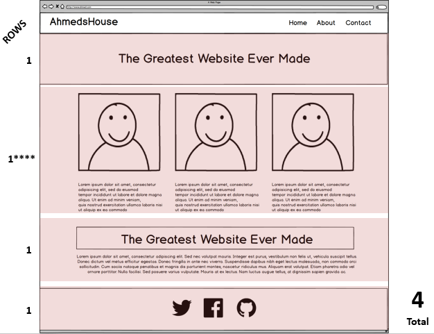

* Once you get to the "tricky" example, be prepared to talk about sub-rows and sub-columns. Essentially, the way to access sub-elements is to put rows inside columns that are inside of larger rows. 

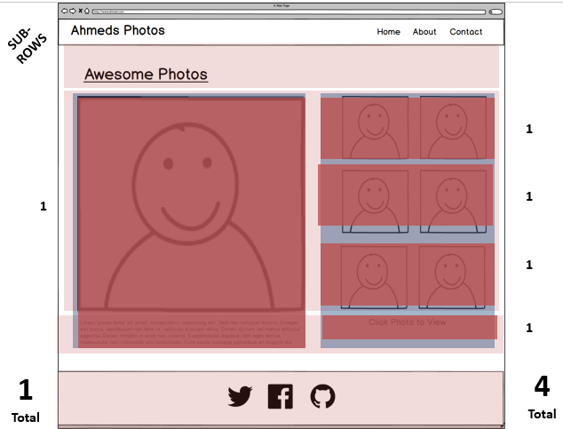

* Once done with all the activities, take a celebratory moment with students. 

* Then ask if there are any questions before proceeding to the next section.

### 9. Instructor Do: Grid Design with Bootstrap (10 min)

* Flip through the slides explaining how Bootstrap grids work in relation to the abstract workshop they've just concluded. 

* Be sure to mention that:

  * In Bootstrap all content is organized in rows and columns. 

  * Columns fit inside of rows. Rows fit inside containers. 

  * Columns are defined by the number of "spans" they take up, with a total of 12 spans.

* Slides on the coded portion of the grid will show up in the next section. Wait until then to talk about syntax.

* Be sure to explain the syntax for containers; rows; and columns **prior** to the next activity.

  * Be sure students understand the "formula" for column classes is `col-size-span`, and that `span` is any integer between 1 and 12. 

    * They don't need to understand the various choices for `size` at this stage.

### 10. Students Do: Containers, Rows, Columns Discussion (5 min)

* Use the slide as a cue to have students explain to one another the relationship between rows, columns, and containers.

* Then call a random student to explain it back to you.

### 11. Instructor Demo: Coding Grids (10 min)

* Using the file `QuickGrid.html` (`13-InstructorGrids`) as a starting point, walk students through the syntax of creating grids in Bootstrap. Feel free to create new rows and columns on the fly.

  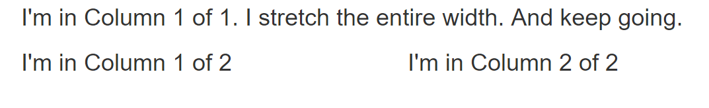

* In discussing the code, be sure to point out:

  * How the column widths work and that they all add to 12. 

    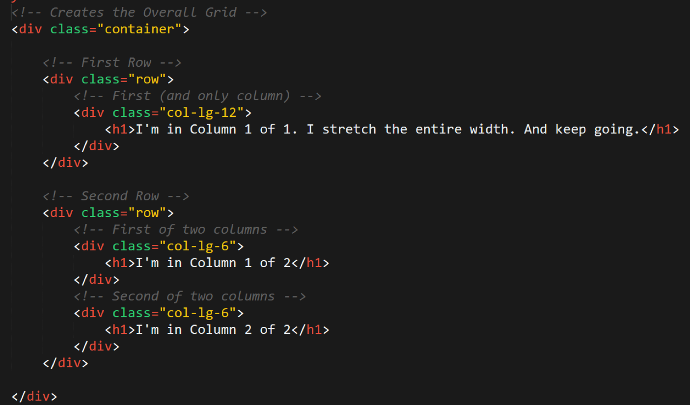

  * How rows always go inside of the larger container. And that columns ALWAYS go inside the rows.

* Slack out the file when done.

### 12. Instructor Do: Coding Grids (10 min)

* Once again, talk students through the slides that reexamine the syntax.

* **IMPORTANT** TAs should slack out screenshots of each of these slides, so students can reference them. Alternatively, TAs can slack out the powerpoint at this point to help students in the next set of activities. 

### 13. Students Do: Text Layout Activity (20 min)

* Then open the file `lorem.html` (`14-TextLayout`) and show students what they will be building for the next activity.

* TAs should then slack out a screenshot of the final product as well as the following instructions:

  * **Instructions:**

    * Using Bootstrap CSS, create a layout that looks like the one shown on the next screen.

    * Hint: Spend some time prior to coding on drawing out the grid layout.

    * Hint: Count the number of rows and columns.

    * Hint: Then use the bootstrap grid syntax to code it out.

### 14. Instructor Do: Review Text Layout Activity (5 min)

* Review with students the solution to the last activity. 

* Have students tell you the number of rows and columns prior to talking about the code.

* Then point out how the layout begins with a container and then has individual rows inside, and that the column widths always add up to 12.

  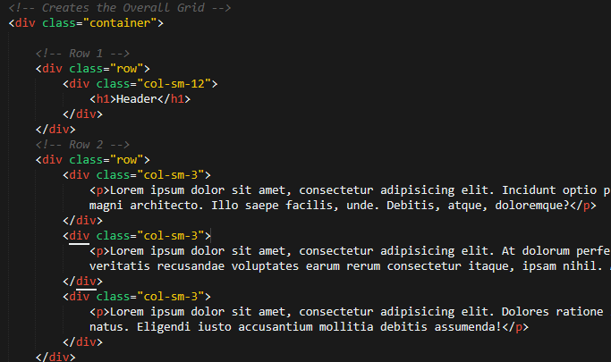

* Slack out the video guide for the activity which can be found [here](https://www.youtube.com/watch?v=wQovwgW020g)

- - -

### 15. BREAK (40 min)

* Regroup with TAs to ensure you're keeping on schedule. If not, skip low-priority activities.

- - -

### 16. Instructor Demo: Bootstrap Wireframe Layout (15 min)

* Depending on the amount of time you have left in class and/or your speed at building layouts, create a quick bootstrap layout OR open the file `InClass-DemoLayout.html` (`15-InstructorLayout.html`) and walk students through the process of building a layout.

* In your demonstration, at the very least, do the following:

  * The Bootstrap file required the Bootstrap CSS link

  * Then show students how you can easily copy and paste code to create a Navbar. (You can copy and paste this from W3 Schools <http://www.w3schools.com/bootstrap/bootstrap_navbar.asp>).

  * Show students how the main body goes into a container and that individual rows hold the various components

  * Point students to the use of _cards_ on the Bootstrap website. <https://getbootstrap.com/docs/4.0/components/card/>

### 17. Students Do: Bootstrap Wireframe Activity (30 min)

* Then open the file  `layout.html` (`16-CardLayout`) in your browser. Show students what they will be building for the next activity. 

* Then slack out a screenshot of the final design as well as the following instructions.

* **Instructions:**

  * Working in pairs and using Bootstrap CSS make the following design.

  * Be sure to note the:

    * Grid Layout 
    * Navbar
    * Sidebar card
    * Thumbnail

### 18. Instructor Do: Review Bootstrap Wireframe Activity (7 min)

* Spend a few moments reviewing the code for the previous activity with students.

* Point out the: 

  * Simplified navbar (where elements were removed)

    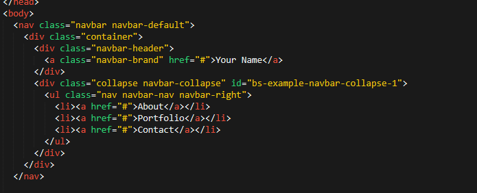

  * The sidebar cards

    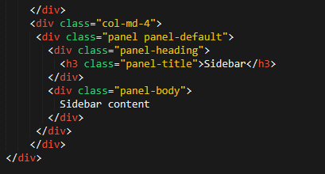

  * The dummy image

    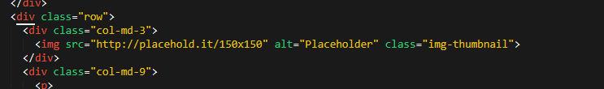

  * And anything else students were confused by.

### 18. Instructor Do: Common Questions (5 min)

* Flip to the slide on common questions. Address them as necessary. 

### 19. Instructor Do: Mobile Responsiveness (5 min)

* Talk about the basics of mobile responsiveness and that media queries effectively create "conditional css". If a particular width of the screen is met, then the CSS within that media query will be triggered. Otherwise it will be ignored.

* Let students know that media queries are what allow Bootstrap CSS to have a fully mobile responsive website. But its important to be familiar with media queries so you can roll out your own custom mobile responsive designs in the future. 

### 20. Instructor Demo: Media Queries (5 min)

* Open the file `media_basic.html` (`17-InstructorMedia`) in your browser. Show how the page changes colors when you shrink or increase the width of the page. 

* Then open the code. But don't explain it yet. Instead, go back to the slideshow to the following activity.

### 21. Students Do: Explain Media Queries (2 min)

* Have students explain the media query code to one another for a few moments.

* Then hear their answers, before explaining that the `@media screen` section has particular styling that kicks in when the page is less then 768px wide. 

* Then slack out all the files associated with this demo (HTML and CSS). Students will be using this for the next activity.

### 22. Students Do: Build Media Query (15 min)

* Open the file `media_solved.html` (`18-StudentMedia > Solved`) in chrome. Widen and shrink the page and point out that whereas your previous version of the code stacked the two boxes on top of each other, this version creates a nice degree of padding for separation.

  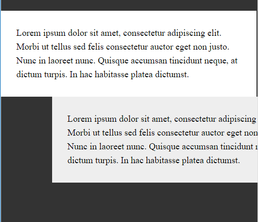

  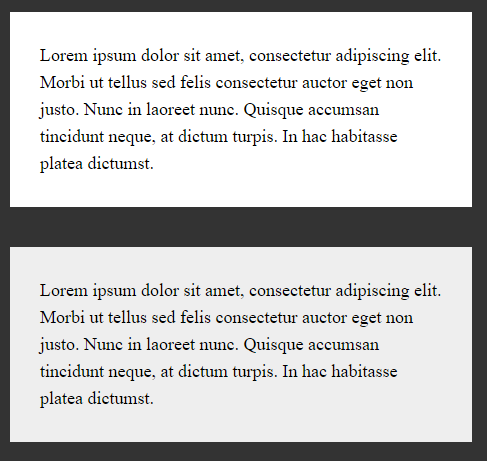

* Then slack out the following instructions:

* **Instructions:**

  * Add more styling to the CSS file such that the `@media screen` code creates padding and margins for the two boxes when the page is below 768px.

  * Note: This isn't easy. Just give it your best shot. Even if you don't get the exact solution, but are able to better understand how media queries work, that's a solid takeaway.

### 23. Instructor Do: Build Media Query (5 min)

* Quickly go over the solution for the previous activity, letting them know that it wasn't intuitive.

* Use the below details as a guide.

  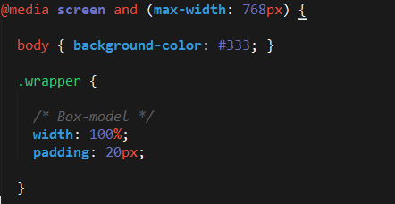

* Slack out the video for this activity. [Lesson 2.3 - Media Queries](https://www.youtube.com/watch?v=x_wlcp-W27c)

### 24. Instructor Do: Viewport (5 min)

* Lastly, cover the viewport slides. You can let students know that this section is lower priority. 

* Let them know that the fix is simple. Just include the `viewport` line in the head and then include the usual `@media queries`. 

* TAs should slack out the following link for any students interested in learning more: <http://www.w3schools.com/css/css_rwd_viewport.asp>.

### 25. Students Do: Viewport Activity (5 min)

* Slack out the following instructions:

* **Instructions:**

  * Spend the next few moments on this site <http://www.viewportemulator.com/> and visit your favorite websites using various viewports. Notice how the sites change resolution-wise. 

### 26. Instructor Do: Questions

* Take a few moments to celebrate.

* Then open the floor for questions. 

- - -

### 26. EXTRA CONTENT: Harder Layout (40 min)

* If any time remains, have students try to recreate a layout of their own choice from scratch. You can offer the sample layout `InClassDemoLayout.html` (`15-InstructorLayout`) as a code sample for them.

- - -

### 27. Slack out this Week's Video Guide

* Slack out the video guide for this week's key activities and last week's homework! Emphasize how helpful a tool these videos can be if a student feels as if they are falling behind or simply wants to review the material once again.

* [Video Guide](../VideoGuide.md)

- - -

### 28. Next Week's Homework

* Students who chose the easier `Building a Wireframe` option last week should be provided the `recommended-homework-solution` as starter code for this week's homework assignment. Please verify that the student turned in the wireframing assignment before distributing this starter code.

# Instructor Do: Private Self-Reflection (0 min)

Take some time on your own after class to think about the following questions. If there's anything that you're not sure how to answer, feel free to reach out to the curriculum team!

1. How did today's class go?
2. How did you teach it?
3. How well do you feel you did teaching it?
4. Why are you teaching it?
5. Why did you teach it that way?
6. What evidence can I collect to show my students are understanding?
7. How will my students know they are getting it?

### Lesson Plan Feedback

How did today's class go?

[Went Well](http://www.surveygizmo.com/s3/4325914/FS-Curriculum-Feedback?format=pt&sentiment=positive&lesson=02.03)

[Went Poorly](http://www.surveygizmo.com/s3/4325914/FS-Curriculum-Feedback?format=pt&sentiment=negative&lesson=02.03)
