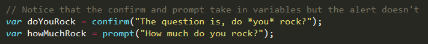

## 3.1 Lesson Plan - Joys of JavaScript <!--links--> &nbsp; [⬅️](../../02-Week/03-Day/03-Day-LessonPlan.md) &nbsp; [➡️](../02-Day/02-Day-LessonPlan.md)

### Overview

Today's class is focused on providing students with the very basics of JavaScript. For many, this will be their first foray into JavaScript as a programming language.

`Summary: Complete Activities 1-13 in Unit 03`

##### Instructor Priorities

* Students should understand what each of the following terms means: `console.log`, `alert`, `prompt`, `confirm`, `variable`, `array`, and `if/else`.
* Students should complete the `03-PizzaVariables` activity.
* Students should complete the `07-SushiPrompt` activity.
* Students should complete the `09-ConditionalActivity` activity.
* Students should be given a primer on arrays and guided through examples of their use.

##### Instructor Notes

* Welcome to Week 3! In this class you will be giving students their first primer on JavaScript as a programming language. Many of your students will have little clue what JavaScript is, let alone how to use it. Be prepared for the simplest bugs, from missing quotation marks to utter confusion in setting a variable. Today you suckle your children with the wisdom of the fundamentals!

* Today's class also aims to cover a lot of ground very quickly. For perspective, today's class will cover the following: Variables, Conditionals, Console Logging / Alerts, and Arrays. The homework activity is also fairly challenging, and it will really require students to keep up. Try to move through the material as quickly as you can without sacrificing comprehension from the baseline student.

* In every case for today, pre-coded instructor demos are provided for you. However, because of the simplicity of today's class, feel free to code your own examples on the fly. Part of the reason we have pre-coded versions is for when we share the directory with students since it becomes easy to copy over into the in-class repo. Don't let that limit your imagination though!

* **Important Point:** In today's class you will be Slacking out JavaScript files to students. For whatever reason, Slack adds hidden characters to JavaScript which render the code dysfunctional. To avoid this happening, make sure that students are downloading the file directly from Slack and that they're NOT just copying and pasting from the snippets you send out. This will single-handedly confuse a ton of students. Make sure they are doing this.

* After each activity, be sure to Slack out the complete solution so students can use them during the next activity.

* You may want to Slack the slides out to students in advance as well. Your choice!

* Have your TAs reference [01-Day-TimeTracker](01-Day-TimeTracker.xlsx) to help keep track of time during class.

### Sample Class Video (Highly Recommended)
* To view an example class lecture visit (Note video may not reflect latest lesson plan): [Class Video](https://codingbootcamp.hosted.panopto.com/Panopto/Pages/Viewer.aspx?id=b6546197-13d6-4922-b516-08490303c913)

- - -

### Class Objectives

* To gain a preliminary grasp of JavaScript definitions and of basic syntax.
* To utilize variables, logging, arrays, and if/else statements to create simple JavaScript applications.

- - -

### 1. Everyone Do: Welcome Students (1 min)

* Welcome students and see how they are doing while opening up the PowerPoint [JoysofJS](Slide-Shows).

### 2. Instructor Do: Today's Class (1 min)

Begin going through the slides.

* Take a moment to let students know the agenda for today.

### 3. Instructor Do: How to Learn JavaScript (5 mins)

* Students may be unnerved by the fact that they are learning JavaScript. Help them know how to learn it correctly.

* You can use the following verbiage as a guide to how to talk about each slide:
  * **Your Brain on JavaScript:** Learning JavaScript will require having a lot of "little pieces" of code in your mind floating around. The key is in knowing how these pieces fit together to build useful things.
  * **Take Notes:** Self-explanatory, but basically students should likely be taking a few notes here and there; primarily on your explanations of why some JavaScript piece matters and/or of how to use it.
  * **Keep Organized:** Many students around this time start to have files in literally every location possible. It gets incredibly confusing trying to help them when everything is so scattered. Let them know that a little folder organization can go a long way in creating easy-to-read applications.
  * **Overall Tips:** Just read these. Self-explanatory. Key point&mdash;encourage students to REDO coding exercises on their own. Many students just go home and re-flip through slides or read through code without actually trying to do it themselves. Hands on experience is a lot better than looking code over secondhand.

### 4. Partners Do: Code Dissection (7 mins)

* Let students know that a big part of JavaScript learning requires you to "learn on the fly".

* Then Slack out the following file and instructions to students:

  * **File**

    * `js-dissect.html` (01-CodeDissection)

  * **Instructions**

    * Download the file sent to you via Slack.

    * IMPORTANT: When downloading any code going forward, be sure to hit "Download". **If you copy and paste directly from Slack, your code will not work!**

    * Open the file in Chrome, and observe what happens.

    * With a partner, try to explain how the code connects to the events that happen on the page.

    * Note: We haven't covered JavaScript before, but a big part of being a developer is learning on the fly!

* **Instructor / TA Note:** Do not go over this activity after the time is done. Just move onto the next activity. Students will come back to this later after they've learned more.  

### 5. Instructor Do: What is JavaScript (2 mins)

* Spend a few brief moments explaining what JavaScript is. Try to emphasize what it does in relation to HTML/CSS (i.e. JavaScript is the language that creates "interactivity and more").

### 6. Instructor Do: Variables Slides + Demo (6 mins)

* Go through the preliminary slides on Variables. Wait for the "Instructor Demo" slide before live-coding.

* At this point students should just understand that variables can be strings, numbers, and booleans (leave out the bit about functions, objects, etc. for the time being since this could confuse them).

* When doing the demo, feel free to create your own example on the fly. Otherwise, there is an example inside `02-BasicVariablesDemo`.

* Make sure students know that strings require quotation marks but that numbers and booleans do not.

### 7. Students Do: Variable Activity (10 mins)

* Slack out the following files and instructions to students.

  * **Files**

    * `pizza-variables.html` in `03-PizzaVariables/Unsolved`

  * **Instructions**

    * Using the instructions in the file sent to you, fill in the missing JavaScript code to create variables.

    * When you are done, open the file in Chrome and check the output.

    * If you successfully completed the activity, you should see a series of pop-up windows with text inside.

    * Finally, look at the rest of the code and try to figure out why the text displayed the way it did.

### 8. Instructor Do: Review Variable Activity (4 mins)

* Spend a few moments reviewing the activity `03-PizzaVariables/Solved`. In discussing the solution, explain both the variable assignment and the way strings are combined in the alerts.

    

    

### 9. Instructor Demo: Console Log (4 mins)

* Proceed with the slides and the console log demo. You can either open the solution found in `04-ConsoleLogDemo` or create your own example to show what console log does.

* Be sure to point out how you can console.log either strings or variable values.

    

* Also show students where in Google Inspector the line `console.log` outputs to.

    

* Briefly explain the concept of a function as "code that does a thing and lives somewhere else."

  * Explain that `console.log` is a function that prints a message and that "lives" in the JavaScript engine.

  * Explain that we can often give functions "things to work with." In this case, we give `console.log` a _message_ to print.

  * Explain that later on, student will write their own functions, which they'll use the same way.

  * Refrain from a more detailed discussion of arguments, etc. This explanation is simply to provide context for entities such as `alert`, `console.log`, etc.

### 10. Instructor Do: Console Log Slides (5 mins)

* Start to go through the slides on console log.

* Make certain to show students how the `console.log` statement can be used to display text, variables, or a combination of the two.

### 11. Students Do: Console Log Activity (7 mins)

* Slack out the following files and instructions:

  * **Files**

    * `pizza-variables-2.html` in `05-PizzaConsole/Unsolved`

  * **Instructions**

    * Using the file sent to you as a guide, modify the code so that it uses `console.log` instead of alerts to display messages.

    * With a partner, discuss the difference between using `console.log` and `alert`.

### 12. Instructor Do: Review Console.log Activity (7 mins)

* Have students offer their answers to the assignment, and have them explain their changes.

* Also ask students why they might use one form of output versus another.

- - -

### 13. BREAK (15 mins)

* Check in with TAs regarding time.

- - -

### 14. Instructor Demo: Alerts, Prompts, Confirms (5 mins)

* Use the file inside `06-PromptDemo`, and walk students through the code.

* Be sure to point out the differences between `confirm`, `alert`, and `prompt`.

* **Important:** Be sure to point out how `prompt` and `confirm` create data that can be stored in a variable directly.

  * Remind students that `alert`, `prompt`, and `confirm` are _functions_.

  * Explain that functions that "give you something back" are said to _return_ something.

  * Explain that `prompt` and `confirm` _return_ whatever the user enters in the text prompt.

      

### 15. Instructor Do: Alerts, Prompts, Confirms Slides (5 mins)

* Go over the remaining slides on this section. Create engagement by having students remind you of the differences between the three functions.

### 16. Students Do: Alert Activity (15 min)

* At this point, Slack out the following files and instructions.

  * **Files**
    * `prompt-sushi.html` in `07-PromptSushi/Unsolved`

  * **Instructions**
    * Write JavaScript code that does the following:
      * Using a confirm, ask the user, "Do you like \_?" Store their response in a variable.
      * Using a prompt, ask the user, "What kind of \_ do you like?" Store their response in a variable.
      * Alert both variables to the screen.

### 17. Instructor Do: Review Alert Activity (4 mins)

* Go over the previous activity using `prompt-sushi.html` in `07-PromptSushi/Solved`.

### 18. Instructor Do: Document.write (4 mins)

* Go over the slide on `document.write`. We'll be demonstrating it in code in a future slide.

### 19. Instructor Demo: If/Else Statement (8 mins)

* Proceed with the slides to the demo of conditionals. Use the file inside `08-ConditionalDemo` as a starting point. Walk students through the fact that the confirm prompt is used to grab a boolean.

    

### 20. Instructor Slides: If/Else Statement (5 mins)

* Proceed through the instructor slides on conditionals.

### 21. Partners Do: If/Else Activity #1 (15 mins)

* Slack out the instructions below.

  * **Files**

    * None

  * **Instructions**

    * Create a website (from scratch) that asks users if they eat steak.

    * If they respond with "yes", write the following to the page: "Here’s a Steak Sandwich!"

    * If they respond with "no", write the following to the page: "Here’s a Tofu Stir-Fry!"

    * Bonus: Ask what the user’s birth year is. If they are under 21, alert the following: "No Sake for you!"

    * Hint: You will need to use `document.write()` from a few slides back.

### 22. Instructor Do: Review If/Else Activity #1 (10 mins)

* Review the solution found in `09-ConditionalActivity`. Point out the uses of conditionals and of `document.write`. For the bonus, run the program with various ages, and show students how each elicits a different output.

    

* Slack out the video review for this activity which can be found [here](https://www.youtube.com/watch?v=rlhhRVO5EOg).

### 23. Everyone Do: If/Else Activity #2 (10 mins)

* Show the following file on screen: `conditional-demo-2.html` in `10-ConditionalActivity2`.

* Then, as a class, go through `if` statements and try to predict which of the alerts will get triggered.

* Then run the program to see if your expectation matched how it functioned.

    

### 24. Instructor Do: Arrays Slides (5 mins)

* Run through the Array example in the slides. Describe arrays as being like "lists" or "collections" of variables. Each variable has its own index ID (sort of like the "pen" number for our Zoo example).

* We can retrieve any value in the array by referencing its index.

* Indexes start at 0.

### 25. Instructor Do: Array Demo (6 mins)

* Open the file `arrays-demo.html` in `11-ArraysDemo`. Show students how this example matches the one in the slides.

* Point out how the index system works (i.e. starts at 0 and ends one before the length).

### 26. Everyone Do: Class Code Dissection (7 mins)

* Slack out the following file and instructions to students.

  * **File:**

    * `arrays-activity.html` in `12-ArraysActivity/Unsolved`

  * **Instructions:**

    * With a partner, take a few moments to look over the following code.

    * Above each `console.log()` write a comment "predicting" what you think the output will be.

    * HINT: Comments are the grayed lines that begin with `//`. These lines are ignored by JavaScript, and they allow you to explain your code. Commenting your code is an extremely useful habit to get into as it allows other developers to more easily read your code. It will also help you better understand your own applications when you look back at them.

* **Instructor / TAs:** Review with the class when complete.

### 27. Instructor Do: Questions (3 mins)

* If time remains and there isn't sufficient time for the challenges, spend the remainder of the class answering questions.

* If no time remains for the challenges, then encourage students to work on them at home.

### EXTRA: Challenge 1 (15 mins)

* If time permits Slack out the instructions associated with the example in `13-Bands`. This activity is intended to be done from scratch.

  * **Instructions**

    * Create a website that accomplishes the following:

      * Create an array of your favorite bands.

      * With a prompt, ask the user's favorite band.

      * If it's one of your favorites, alert: "YEAH I LOVE THEM!"

      * If it's not, alert: "Nah. They're pretty lame."

      * Hint:  You will need to research how to use `.indexOf()`.

      * Hint: You will need to research how to use `.toLowerCase()`.

### EXTRA: Challenge 2 (12 mins)

* For the second challenge, students should go back to the first example shown in class (the `js-dissect.html` file in `01-CodeDissection`. Have them re-examine the code to see if they understand it better.

### Lesson Plan Feedback

How did today's class go?

[Went Well](http://www.surveygizmo.com/s3/4325914/FS-Curriculum-Feedback?format=pt&sentiment=positive&lesson=03.01)

[Went Poorly](http://www.surveygizmo.com/s3/4325914/FS-Curriculum-Feedback?format=pt&sentiment=negative&lesson=03.01)
