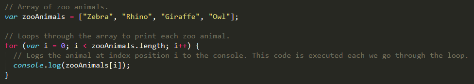
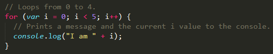
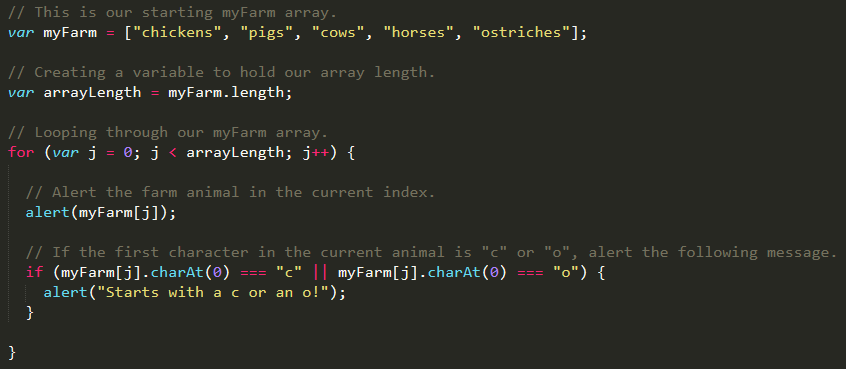
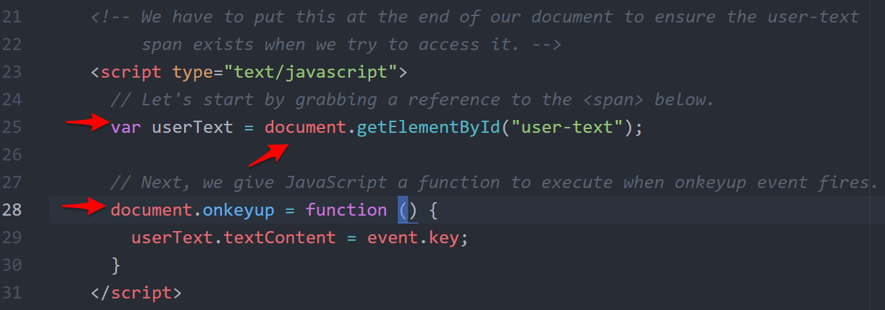
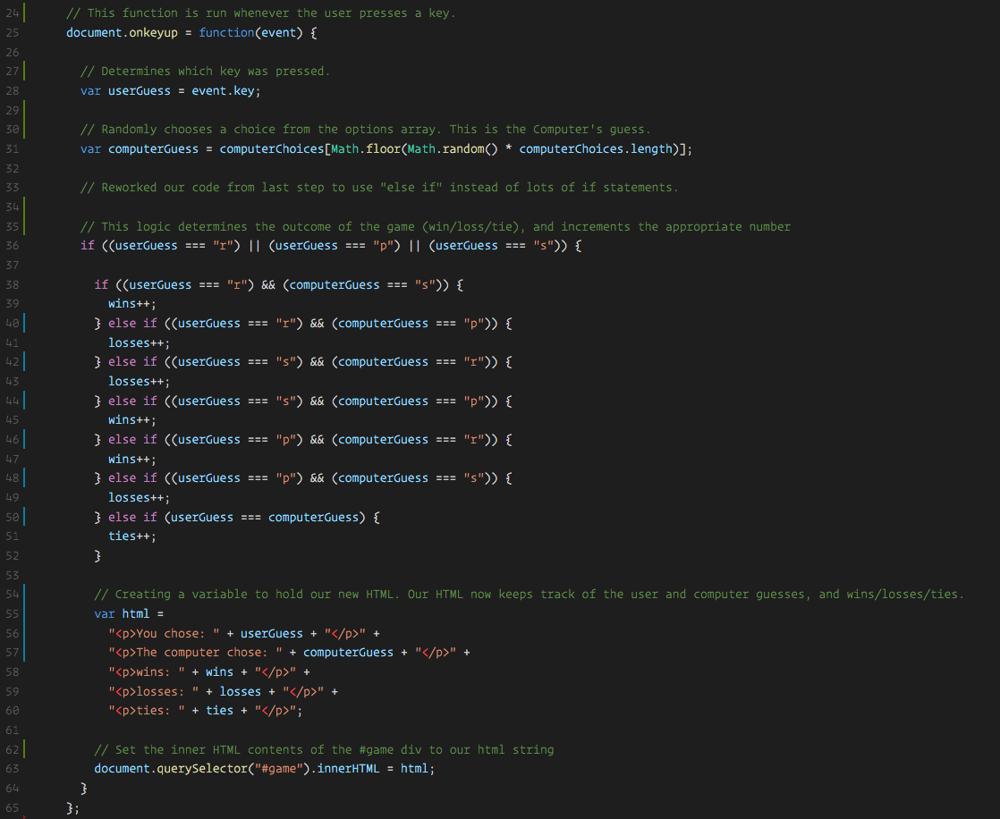

## 3.2 Lesson Plan - Jumping for JavaScript <!--links--> &nbsp; [⬅️](../01-Day/01-Day-LessonPlan.md) &nbsp; [➡️](../03-Day/03-Day-LessonPlan.md)

### Overview

Today's class is focused on introducing students to the concept of `for` loops and of how they can be used in combination with arrays, if/else statements, and other common programming tools to create a Rock-Paper-Scissors game.

`Summary: Complete Activities 14-24 in Unit 03`

##### Instructor Priorities

* Students should understand what a `for` loop is and how to use one to loop through an array.
* Students should complete the `18-ZooLoop`.
* Students should complete the `23-RPS-Coded`.

##### Instructor Notes

* In today's class you will be covering the concept of `for` loops and subsequently, the concept of combining arrays, conditionals, `for` loops, and user inputs to create more sophisticated JavaScript applications. Much of what students have learned to date will culminate in the last activity of the day where they will work together to build a rock-paper-scissors game.

* Today's lesson plan is packed to the brim with activities. Realistically assess your usual pace; if you are an instructor who tends to fall behind, skip activities which say "TIME PERMITTING" on the slides. If you tend to speak and present at a fast pace, take the time to complete as many of these exercises as you like. Alternatively, you can always just show students the solutions to these activities in live demos, and then Slack them the answers. Just BE SURE to leave around 1 hour of class time for students to work on the rock-paper-scissors activity. This activity is extremely important, and it's a close match to their homework assignment.

* Students should be given a substantial amount of time to complete the rock-paper-scissors activity. They will not have been given everything they need to complete the activity. The idea is for students to become more comfortable with the idea of working without knowing _everything_. Reveal bits of the solution using the code in the `23-RPS-Coded` directory while students are working. Throughout class, show these bits of the solution on the projector, and try to help guide students through the problem.

* Have your TAs reference [02-Day-TimeTracker](02-Day-TimeTracker.xlsx) to help keep track of time during class. Your instructor NEEDS to leave enough time for students to complete the rock-paper-scissors game.

* **Note**: Even if you don't cover an activity in class, still include it in the list of activities you share into your local repo. Students will be able to look back at these activities on their own time.

### Sample Class Video (Highly Recommended)
* To view an example class lecture visit (Note video may not reflect latest lesson plan): [Class Video](https://codingbootcamp.hosted.panopto.com/Panopto/Pages/Viewer.aspx?id=19f39e82-ccdc-4ef8-973d-23c6679512b3)

- - -

### Class Objectives

* To understand the use and syntax of JavaScript's `for` loops.
* To use `for` loops, arrays, and conditional logic to create a rock-paper-scissors game.

- - -

### 1. Instructor Do: Welcome Students (1 min)

* Welcome students. Then open the PowerPoint [JumpingForJS](Slide-Shows).

### 2. Instructor Do: Today's Class (1 min)

* Introduce students to the overall objectives of today's class.

### 3. Everyone Do: Basics Recap (10 mins)

* Spend a few moments helping students to remember what was covered during the last class. Try to move swiftly through these slides. Ideally this should take you less than 10 minutes.

* Always call on individual students as you go through the slides.

### 4. Everyone Do: Basic JS Dissection (3 mins)

* Slack out the following file from yesterday and have students re-examine it.

* Give them a few minutes to examine it, and immediately have a few students explain it to the class.

  * **File**

    * `js-dissect-unsolved.html`in `14-JSDissect/Unsolved/`

  * **Instructions**

    * Take a few minutes to quickly look through the attached file. With a partner, discuss what you expect to happen when the code is run.

    * Prepare to share your thoughts with the class.

* After you go over the activity, if there are still questions, Slack out the fully commented file `js-dissect-solved.html` in `14-JSDissect/Solved`.

### 5. Everyone Do: Array Logging (5 mins)

* Slack out the file and the instructions below.

* Read the instructions aloud, and call on students to help you live-code the activity.

  * **File**

    * `array-logs-unsolved.html` in `15-CoolPeopleArray/Unsolved`

  * **Instructions**

    * Follow the instructions provided in the file to `console.log` each of the names in the `coolPeople` variable.

    * Hint: You should be repeating the same line 6 times.

* Slack out `array-logs-solved.html` in `15-CoolPeopleArray/Solved`	 when finished.

### 6. Everyone Do: Array Setting (5 mins)

* Slack out the file and the instructions below.

* Read the instructions aloud, and call on students to help you live-code the activity.

  * **File**

    * `array-setting-unsolved.html` in `16-ArraySetting/Unsolved`

  * **Instructions**

    * Follow the instructions in the file provided to convert each item in the array to lower case.

    * Make sure to only add in lines of code where instructed.

    * Hint: You will need to use the `.toLowerCase()` method. Research if you don’t remember how to use it.

    * Be prepared to share when time is up.

* Slack out [`array-setting-solved.html`in `16-ArraySetting/Solved` when finished.

### 7. Instructor Do: For Loops (5 mins)

* Go through the slides introducing the concept of `for` loops. Re-use the example of the Zoo Array as shown on the slides.

### 8. Students Do: For Loop Dissection (5 mins)

* Slack out the file and the instructions below.

  * **File**

    * `my-first-loop.html`in `17-MyFirstLoop/`

  * **Instructions**

    * With a partner, spend a few moments trying to dissect the code sent to you.

    * Try to explain to one another what is happening with each line of code.

    * Feel free to do research if you are stumped. As a hint, look into the phrase “for loop.”

### 9. Instructor Do: For Loops Cont. (10 mins)

* Continue through the slides and demonstrate how the previous example worked.

* Point out that the iteration index, `i`, continually increments to it until it reaches the value `array.length - 1`.

  * Point out how the selected vegetable changes on each loop iteration.

### 10. Students Do: For Loop Zoo (15 mins)

* Slack out the file and the instructions below.

  * **File**

    * `zoo-loop-unsolved.html` in `18-ZooLoop/Unsolved`

  * **Instructions**

    * Use `for` loops  to rewrite the file sent to you via Slack.

    * If you need help, use the code from the previous example as a guide.

    * Once you think your code is functioning properly, share it with the person sitting next to you.  

### 11. Instructor Do: Review Activity (5 mins)

* Review `zoo-loop-solved.html` in `18-ZooLoop/Solved`.

    

* Then Slack the solution out to students.

* Slack out the [video review for this activity](https://www.youtube.com/watch?v=zJO9g7S2_Xo) as well.

* Before moving on, review the concept of functions.

  * Explain that a function is a piece of code that lives somewhere and that performs a repeatable action.

  * Use `console.log` as an example to demonstrate the concept of arguments.

  * Finally, write a function that accepts an array as an argument and that logs the value at each of its indices.

  * Explain that just as `for` loops allow us to generalize _the process_ of looping through a given array, this function allows us to generalize _the array itself_ that we loop through.

- - -

### 12. BREAK (15 mins)

* Touch base with TAs regarding pace at this point in time. Decide what assignments you can and cannot include so that students have at least one hour to work on the rock-paper-scissors assignment.

- - -

### 13. Students Do: Another Loop (0 min)

* If you are AHEAD of schedule and feel like students could benefit from another example, Slack out the following instructions.

  * **Instructions**

    * Starting from scratch, create a `for` loop that console logs the following lines:
      ```
      I am 0
      I am 1
      I am 2
      I am 3
      I am 4
      ```
    * Don't use an array!

### 14. Instructor Do: Review Activity (5 mins)

* Review `another-loop-solved.html` in `19-AnotherLoop/Solution`.

  * Point out that in this case, the iterator is not an array length but an integer.

  * Point out that the length is **one less than** the final number desired.

      

* Then Slack out `another-loop-solved.html`

### 15. Partners Do: Loop with Conditions (Optional) (10 mins)

* **Instructions**

  * Starting from scratch, write code that loops through the following array and that logs the name of each animal on the farm to the console:

    ```
    var myFarm = ["chickens", "pigs", "cows", "horses", "ostriches"];
    ```

  * Then check if the first letter in the animal's name begins with a "c" or "o." If it does, create an alert saying, "Starts with 'c' or 'o'!"

  * **Hint**: You can access the first character of a string as if it were the first element of an array.

### 16. Instructor Do: Review Activity (5 mins)

* Review `hard-loop.html` in `20-HardLoop/Solution`.

    

### 17. Everyone Do: Browser Events (10 mins)

* Explain that the next activity requires students to be familiar with the notion of browser events.

* Explain that when a user interacts with a web page, the page "keeps track" of many of the users actions.

  * For example, explain that the browser keeps track of what users click on and of where they click.

  * As another example, explain that the browser also keeps track of which keys a user presses.

* Open `events-examples.html` in `21-Events`.

* Briefly demonstrate the code in Chrome.

* Then open the code in your text editor, and explain the following points:

  * We can "hook onto" the event of a user pressing and releasing a key by referring to `document.onkeyup`.

  * Setting `document.onkeyup` equal to a function tells JavaScript to execute that function _whenever the event occurs_.

    * Point out that the `event` is available within the function.

  * We can get the _key_ that the user pressed by writing `event.key`.

  * We can get our hands on an element on the page that has an ID by using `document.getElementById`.

    * Explain that this always returns a _single_ element.

    * Explain that this gives us access to what is called a DOM node.

      * Explain that a DOM node is a browser's way of representing an HTML element on the page.

      * Explain that unlike the code in an HTML document, this DOM node can be modified "live" by our JavaScript.

  * Finally, explain that this DOM node has a property called `textContent`, which represents the _text_ displayed _inside_ of the element.

    * We've avoided `innerHTML` in this demonstration as a best practice.

* Let students know that they don't have to remember all of this right now.

  * Instead, Slack out the file, and encourage them to refer to it during their next activity whenever necessary.


_This short snippet demonstrates most of the concepts students will need for the RPS activity._

### 18. Instructor Do: Demo RPS (2 mins)

* Take a couple of minutes to demonstrate the final application `23-RPS-Coded`.

* Be brief. Show students what they'll be building, but don't fiddle with the app for more than a minute.

* Explain that the core logic of the application is the decision as to which player wins, based on whether they've played rock, paper, or scissors.

  * Remind students that they'll need to use conditional statements and the `&&`/`||` operators to make things work.

  * Remind students that it's okay if they have to write a long chain of `if`/`else if`/`else` statements. If they find themselves doing this, they're on the right track.

### 19. Students Do: Pseudocode RPS (3 mins)

* Once they've played a few rounds, have them create a pseudocoded solution that lays out the steps involved in playing rock-paper-scissors against a computer.

* Slack out the following instructions.

  * **Instructions**

    * With a partner, spend a few moments outlining all the steps and conditions that go into a single game of rock paper scissors.

    * Try to break it down into steps that you could code out.

    * Think of basic elements like loops, if-else statements, arrays, alerts, etc.

    * Be prepared to share your outlined approach.

* **Instructor Note:** When time is up, show `pseudocode-rps.html` in `22-PseudoCode/Solution`.

* Encourage students to use this pseudocode as a starting point or as a guide with which to finish their own sketch of the application.

### 20. Partners Do: Coding out RPS (60 mins)

* Slack out the following files and instructions to students.

  * **File**:

    * `rps-2.html` in `23-RPS-Coded/Unsolved`

  * **Instructions**:

    * In groups of 4, begin the process of coding out the rock-paper-scissors game.

    * Do as much as you can on your own, but don't be afraid to ask for help if you feel your team is struggling.

    * **Note**: Don't use `document.write` as it will delete the contents of the body, including your JavaScript. Instead, use `document.getElementById` in conjunction with the `textContent` property, as you were shown earlier.

    * **Note**: Don’t worry. We know this is a very challenging assignment. We also know that you won’t know where to start. In fact, we haven’t shown you EVERYTHING you need yet, but that’s okay. Part of being a developer is figuring things out on your own through trial and error.

### 21. Instructor Do: Review RPS (10 mins)

* Open `rps-7.html` in `23-RPS-Coded/Solved`, and walk students through the solution. Use the comments in the solution to help guide the conversation.

    

* Slack out the [video review](https://www.youtube.com/watch?v=Tio88WjwFO0) for this activity and emphasize how helpful videos for challenging activities like this can be.

- - -

### 22. END

### 23. Everyone Do: Recap Activity (0 min)

* If there is time still left over, complete the recap activity with students as a class `24-Recap`.

### Lesson Plan Feedback

How did today's class go?

[Went Well](http://www.surveygizmo.com/s3/4325914/FS-Curriculum-Feedback?format=pt&sentiment=positive&lesson=03.02)

[Went Poorly](http://www.surveygizmo.com/s3/4325914/FS-Curriculum-Feedback?format=pt&sentiment=negative&lesson=03.02)
