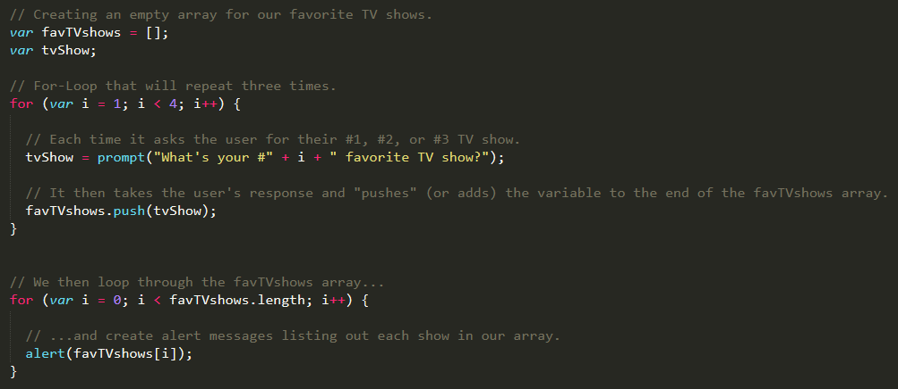
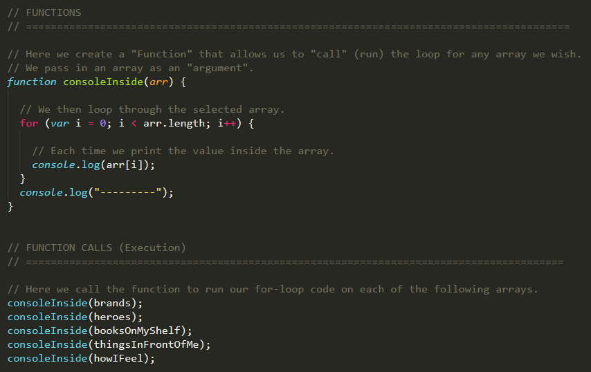
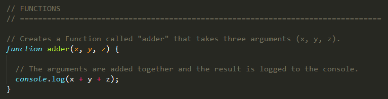
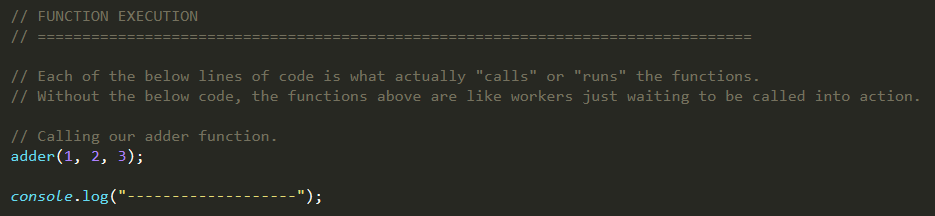
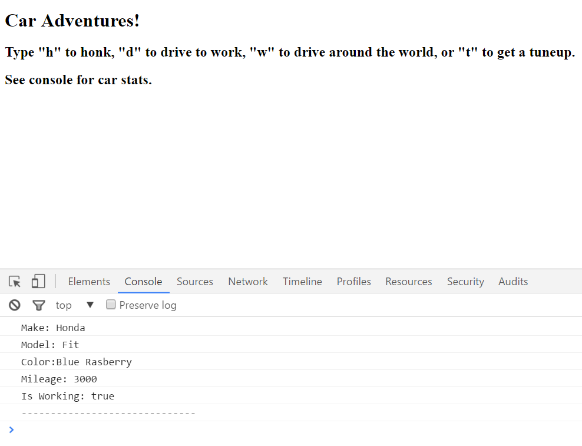
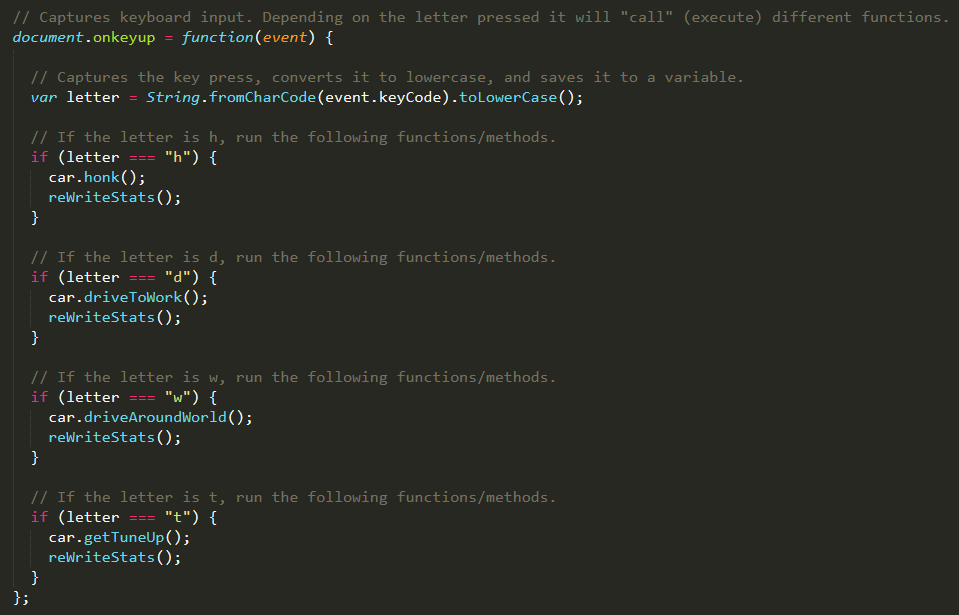

## 3.3 Lesson Plan - JavaScript Juggernauts (10:00 AM) <!--links--> &nbsp; [⬅️](../02-Day/02-Day-LessonPlan.md) &nbsp; [➡️](../../04-Week/01-Day/01-Day-LessonPlan.md)

### Overview

In this class, we will be introducing students to the concept of JavaScript Functions and of JavaScript Objects.

`Summary: Complete activities 25-34 in Unit 03`

##### Attention: If you’re teaching a part time section and this isn’t a Saturday, please use the “Weekday” tab inside of the "03-Day-TimeTracker.xlsx" for activity lengths instead of those printed on this lesson plan

##### Instructor Priorities

* Students should understand what a function is and why it is useful (to DRY up code).
* Students should understand what an object is and what its syntax conveys (properties and values).
* Students should complete the `27-MyFirstFunctions` and `32-CarGame` activities.
* Students should understand how the `30-GandalfTheGreyObjects` example works.
* Student should complete the HTML/CSS/Git Checkpoint.

##### Instructor Notes

* This class is relatively light in terms of activities and content. Feel free to sprinkle in examples when you feel it will be helpful. Towards the end of class there is an optional trivia example that might be very helpful to students homework-wise.

* As usual, have your TAs reference [03-Day-TimeTracker](03-Day-TimeTracker.xlsx) to help keep track of time during class.

### Sample Class Video (Highly Recommended)
* To view an example class lecture visit (Note video may not reflect latest lesson plan): [Class Video](https://codingbootcamp.hosted.panopto.com/Panopto/Pages/Viewer.aspx?id=b8cde2b6-4f25-44d0-954b-e8e728ab0992)

- - -

### Class Objectives

* To gain an understanding of JavaScript Functions and Objects.
* To begin utilizing the basic JavaScript learned so far to build simple JavaScript games.
* To complete the HTML/CSS/Git Checkpoint.

- - -

### 1. Instructor Do: Welcome Students (0 mins)

* Welcome students and open the PowerPoint for the day: [JSJuggernaut](Slide-Shows/JSJuggernaut.pptx).

### 2. Instructor Do: Today's Class (0 mins)

* Introduce students to the day's objectives.

### 3. Partners Do: Array Building (10 mins)

* In this activity, students just fill in the empty comments for each line of code. This is intended to passively show them how to use `for` loops to populate arrays.

* Slack out the following files and instructions:

  * **File**

    * `loop-tv-unsolved.html` in `25-LoopTV/Unsolved`

  * **Instructions**

    * Run the program sent to you via Slack.

    * Then with a partner, fill in the missing comments for each line of code.

    * Make sure both of you can fully explain what each line means.

    * Be prepared to share with the class!

### 4. Instructor Do: Review Activity (5 mins)

* Go over the solution. First have them try to explain each line of code to you as a class.

* Open `loop-tv-solved.html` in `25-LoopTV/Solved`, and walk them through the solution.

* Slack out the file when done.

    

### 5. Instructor Do: Logging - No Functions (5 mins)

* Open `superhero-logging-solved-no-functions.html` in `26-SuperheroLogging` in Chrome and in your editor.

* Walk students through the basics of how this application works. In essence, the application has a series of repeated `for` loops which print out the contents of each of the 6 arrays.

* The key point to emphasize to students is that this code is _extremely_ repetitive and is kind of bulky because of it. This code is intended to offer them perspective on why functions are useful.

* Slack out the file when done with your explanation.

### 6. Instructor Do: Logging - With Functions (10 mins)

* Open `superhero-logging-solved-with-functions.html` in `26-SuperheroLogging` in Chrome and in your editor.

* Walk students through this solution as well. Point out how this application greatly simplifies the previous activity by reducing the number of `for` loops to just one.

    

* Be sure to point out how the function is composed of two parts.

  * The function **definition**.

    * Pay special attention to the notion of **arguments**.

    * Explain how arguments bind on function calls, and demonstrate that argument names are only visible inside of the function body.

  * The function **call** (or execution).

* Ask if there are any questions, and then proceed to Slack out the file so students can use it as an example for the next activity.

### 7. Partners Do: My First Functions (20 mins) (Critical)

* This next exercise requires students to build simple functions for performing mathematical and string operations.

* Slack out the following file and instructions.

  * **File**

    * `my-first-functions-unsolved.html` in `27-MyFirstFunctions/Unsolved`

  * **Instructions**

    * Working in pairs and using the starter file sent to you via Slack, fill in the missing functions and function calls.

    * Note: Try to finish all four functions if you can, but don’t be distressed if you only get one or two. The important thing is that you get at least one function fully done.

    * Hint: Look back to the previous example if you need help.

### 8. Instructor Do: Review Activity (10 mins)

* Review `my-first-functions-solved.html` in `27-MyFirstFunctions/Solved`, pointing out that each of the functions takes on a similar structure.

  * Emphasize that each function requires the **definition** and **call** (execution).

    * Explain that the _things_ we _give_ the function to work on are called **arguments**.

  * Finally, point out that functions can _hand back_ values with `return` statements.

    * Change the implementations of `adder` and `multiplier` to `return` their results rather than log them.

    * Demonstrate that we can store these `return` values in a `var`, just as we can store the `return` values of functions like `prompt` and `confirm`.


* Oftentimes you will find that students forget to call functions after defining them or that they mistakenly assume the execution has the definition logic. Encourage them to cement these two parts as they will be using functions repeatedly as developers.

    

    

### 9. Instructor Do: Good Array (5 mins)

* Open `good-array.html` in `28-GoodArray`.

* The purpose of this activity is to show students that arrays are useful for looping through lists of numbers.

* This example will then be contrasted by the next example, in which we have two arrays that are related to one another, thus requiring the use of an object pattern instead.

### 10. Instructor Do: Joan of Arc (Bad Arrays) (10 mins)

* Open `joan-of-arc-arrays-unsolved.js` in `29-JoanOfArcArrays/Unsolved` in your editor.

* Take a moment to explain this pattern. The first array has various labels and the second array has the descriptions associated with these labels for our Joan of Arc character.

* This is a perfect example of the limitations of arrays—namely, that they are not useful for describing associations across arrays.

* Have students think for a few moments about how they would link these two arrays so that they could easily determine what Joan of Arc's "Real Name" is or what "Scars" she has.

* Point out that any array combination strategy is going to be overly complex and that there is a much simpler solution to this problem.

* Show how the relationship would be with `joan-of-arc-arrays-solved.js` in `29-JoanOfArcArrays/Solved`.

### 11. Instructor Do: Gandalf The Grey Objects (10 mins) (Critical)

* Now open `gandalf-the-grey-objects.html` in `30-GandalfTheGreyObjects`.

  * Point out how the `gandalf` object takes on a different form where each property matches up with its value.

  * Also, point out how we can access the values for each property using either square bracket notation (`object["property"]`) or dot notation (`object.property`).

  * Based on the current code, ask students: Why would we need to use bracket notation over dot notation?

    * Bracket notation is required when the property we want to access is a string with spaces. e.g. the code `object["multi-word property"]` would work, but `object.multi-word property` or `object."multi-word property"` would not.

    * We also need to use bracket notation whenever we want to pass a variable to be interpreted as an object property. The gandalf-the-grey-objects example demonstrates this:

      ```js
      var ageProperty = "age (est)";
      var years = gandalf[ageProperty];
      alert("My 401k has been gathering interest for " + years + " years!")
      ```

    * Had we just written `gandalf.ageProperty`, it would have returned `undefined`, since the `gandalf` object has no property literally named `ageProperty`.
  
  * Also point out how these objects are very useful for storing related data and how we will be using them more often later when it comes to APIs and to data recall.

  * Let them know that objects are EXTREMELY important.

### 12. Instructor Do: Gandalf The Grey (Slides) (10 mins) (Critical)

* Proceed with the slides that visually lay out the structure of JavaScript objects.

* Talk through them as you go, and encourage questions frequently. The more readily students understand objects the better.

### 13. Instructor Do: Gandalf The Grey Objects (Repeat) (5 mins) (Critical)

* Once again go over the same Gandalf The Grey Objects example. Explain the concepts once more. This time feel free to create add-on examples of your own:

  * Consider adding new properties.

  * Ask students how they would retrieve specific properties.

  * Go over how you could utilize properties in combination with one another.

* Make sure students understand the gist, and then Slack out the file to them.

### 14. Partners Do: Basic Objects (15 mins) (Critical)

* Slack out the following file and instructions:

  * **File**

    * `car-object-unsolved.html` in `31-MyFirstObject/Unsolved`

  * **Instructions**

    * With a partner, spend the next few moments studying the code just Slacked to you.

    * Then write code below each comment to log the relevant information about the provided `car` object.

    * Bonus: If you finish early, create a brand new object of your own. Slack out a snippet of the code to the class when you are done. Be creative!

- - -

### 15. BREAK (35 mins)

- - -

### 16. Instructor Do: Review Activity (10 mins) (Critical)

* Walk students through `car-object-solved.html` in `31-MyFirstObject/Solved`. In essence, you just need to show students how to retrieve various properties from the car object and how to execute various methods associated with the car object. In your discussion of the previous activity be sure to mention the following:

  * Objects like the `car` object can have properties as strings, numbers, and booleans as well as **methods** that are functions associated with the object.

  * Be sure to explain briefly that a method is simply a function associated with a specific object.

  * Point out the use of the word `this`. In your discussion of the keyword `this` explain that it is simply a way to reference the object itself.

  * You can explain that in later portions of the class we will effectively be creating many instances of the same object, in which case the `this` keyword let's us know which instance of the object we are referencing.

* See if there are any questions before proceeding to Slack out the solution.

### 17. Instructor Do: Car Game Solved (Browser) (5 mins)

* Open up `car-game-solved.html` in `32-CarGame/Solution` in your browser, and demo how the game works for the class. Make sure to go over how the page is taking in user inputs directly from the keyboard (without the use of `prompt`) to run methods stored within the `car` object.

    

### 18. Students Do: Run that Car (30 mins)

* Slack out the following files and instructions. It's up to you whether students work individually or whether they work in pairs.

  * **Instructions**

    * Using the code from the previous activity as a starting point, create a complete application that meets the following specifications:

      * Users can enter keyboard input (letters).

      * Each of the car's methods are assigned to a key.

      * When the user presses a key it calls the appropriate function.

      * These letters also trigger a global function called `reWriteStats()` that logs the car’s make, model, color, mileage, and `isWorking` status to the console.

    * HINT: You will need to use the `document.onkeyup()` function to collect input from the user's keyboard.

### 19. Instructor Do: Review Activity (10 mins)

* Open `car-game-solved.html` in `32-CarGame/Solution` in both the browser and in your editor.

* First, show students how the application works once more.

    

* Then walk students through the solution.

  * In demonstrating the solution, first point out how the code is organized.

  * Talk about how the code is effectively organized into a section for variables, a section for functions, and a section for function calls. Let them know that this is a helpful organization pattern for their upcoming homework assignment.

  * Walk students through how the keyboard input section works. Be sure to point out how the `document.onkeyup` function is being used to capture key presses and how all letters are converted to lower case.

  * From here, point out how the selected letter is stored into a variable and is then checked using `if` statements against the letters `h, d, w, t`.

  * If any of these letters are pressed, then the appropriate methods on the car are triggered.

  * Then proceed to explain how these key presses also trigger the `reWriteStats()` function to run as well.

  * Scroll up to the function's definition, and then point out how the function effectively just prints all of the updated car object data into the console.

* Ask if there are any questions, answer them, and then proceed to Slack out the solution.

    

* Slack out the [video review](https://www.youtube.com/watch?v=jtU6YrNPv7E&feature=youtu.be) for this activity.

### 20. Everyone Do: Scope & Callbacks (20 mins)

* Open and Slack out `scope-examples.html` in `33-Scope`.

* Explain that JavaScript has rules for where we can use the variables we define.

  * Explain that there are some variables we can see _everywhere_. These are called **global variables**.

    * Explain that variables we define inside of `<script>` tags are global.

  * Explain that there are some variables we can only see in _certain sections_ of our code.

    * Explain that variables inside of functions are _only_ visible inside of the function body.

    * Explain that variables _outside_ of the function are still visible.

    * Use `console.log` to illustrate this point.

  * Explain that this concept is called **scope**.

    * Explain that a system like this helps ensure that the names we use always refer to what we want them to refer to.

* Open and Slack out `scope-unsolved.html` in `33-Scope/Unsolved`.

  * Have students walk you through each step of the activity.

  * Emphasize the fact that we can assign functions to variables.

    * Create a function expression in the browser console to drive home the point.

  * When you reach the `forEach` statement, _demonstrate_ it before discussing it.

    * Emphasize that this example is mostly for exposure. Students don't need to remember all the details of this discussion—they just need to be aware of these ideas.

  * Then explain the following points:

    * `forEach` is a method on arrays that looks at each element of an array _without_ our having to write a `for` loop.

    * Explain that this means we don't have to write as much "boilerplate" to loop over arrays that already contain elements.

      * Point out that we also don't have to index into the array. Rather, we get the element on each iteration directly.

    * Remind students that we can assign functions to variables.

      * Explain that while `forEach` will automatically loop through an array for us, we still have to tell it what to do with each element.

      * Explain that to do this, we pass it a variable that refers to a function.

        * Demonstrate that we can alternatively define the function in-line.

    * Take this opportunity to explain the notion of a callback.

      * Remind students that `forEach` is a function.

      * Remind students that we pass `forEach` _another_ function.

      * Explain that the second function is called a **callback**.

        * A useful analogy goes as follows: "When a client wants a website for their business, they tell a designer to make something that looks good, and they give them their favorite developer's phone number. When the designer finishes the site mock-ups, they have to **call the developer**, who uses the design to build the site."

        * Explain that our code is a similar "pipeline."

          * We're the client, and we call `forEach` to do the job of looping through all the elements. We also give it the "number" of "someone" who can do what we want with each element.

          * `forEach` is the designer, and it does its job of looping through the array.

          * Along the way, it calls the "developer," who does other work for us.

* Slack out `scope-solved.html` in `33-Scope/Solved` before moving on.

### 21. TAs Do: Introduce Workbook and Homework (5 mins)

* Introduce the JavaScript Workbook:

  * "For those of you who are new to coding, this week probably felt overwhelming. It can be tempting to spend lots of time outside of class reviewing lectures and watching youtube videos on JavaScript, but the best way to learn to code is through practice"

  * "We've put together a workbook for you to help you practice the things we've learned this week. It's quite long, but don't worry, you don't need to read it or work through it from front to back. Instead you should use it as a reference through out the class. Spend some time this week reading and practicing the topics that you've struggled with and refer back to it whenever you need."

* Slack out the workbook link `https://javascript-workbook.netlify.com/`

* At this point, TAs should introduce students to the homework. This typically just means opening the homework solution in the browser and showing students what the final product looks like or showing the video and talking over it.

### 22. Instructor Do: Introduce Checkpoint - HTML/CSS/Git (5 mins) (Critical) 

* Let your class know that they will now be taking a short multiple choice assessment to check their understanding of HTML/CSS/Git

* DO NOT SKIP THIS INTRODUCTION. DO NOT JUST SEND OUT THE LINK WITHOUT CONTEXT

* Reassure the students that they need not be nervous about the Checkpoint:

  * "This will not affect your grade or graduation requirements."

  * "This is not like the tests and quizzes you might be used to from school or college. The purpose of these tests is not to motivate you to study or punish you for struggling."

  * "This is as much a test of me as an instructor and of the course content as it is of you. We are here to ensure your success, and this is one of the tools we use to make sure we are doing that effectively. This class moves _fast_, so if some or all of you misunderstand something important we as an instructional team need to find out as fast as possible so we can help."

  * "Long story short, this quiz can not hurt you. Only help you."

* Let students know that they should read carefully and focus on thinking about the right answer rather than using any test-taking skills they may have learned:

  * "There are no silly answers or obvious throwaway responses on this quiz, because those kinds of answers reduce the likelihood that we'll be able to figure out whether we've taught something effectively."

  * "Test taking strategies you may have learned for standardized tests _will not work_, so instead of focusing on eliminating wrong answers or looking for sneaky context cues, read the question and each of the possible choices carefully."

* Reassure students once again that the purpose of this is to help them, and remind them that the outcome does not impact their grade or graduation requirements. You should do this _every single time_ you give an Checkpoint.

* You or your TAs should now get the link specific to your class:

  * Navigate in your browser to: `https://www.switchboard.tech`

  * Select your class code (if it doesn't show up on its own)

    * For parallel cohorts (two classes combined on a Saturday) and doing a Checkpoint: You will **need** to select the classes in your cohort. You can multi select the cards by clicking the class that you need.

    * The class roster will be in the **one** link.

  * Select the Checkpoint and copy the resulting link

### 23. Students Do: Take Checkpoint - HTML/CSS/Git (10 mins) (Critical)

* Slack out the link to the Checkpoint

* Let your students know that once they select their name, it will take them to the Checkpoint

* Checkpoints must be completed in class, **not at home**, to ensure you will be able to effectively find and help struggling students 

* TAs should walk around the class to ensure students aren't looking up answers

* Keep in mind we do not use grades from assessments toward graduation requirements. However, students will be tempted to avoid feeling like they don't understand something.

* It's important for instructional teams to create an environment where it is safe to fail, but also where such failure is visible. You should not be worried about "cheating" on checkpoints, only making sure that students who need help aren't remaining invisible.

* Your SSM will have the results of the Checkpoint within an hour of its completion

### 24. End (0 mins)

### 25. TAs Do: Structured Office Hours - Review HTML/CSS/Git (30 min)

* Navigate in your browser to: `https://github.com/coding-boot-camp/checkpoint-bank/blob/master/checkpoints/multiple-choice/02-HTML-CSS-Git-MC/02-HTML-CSS-Git-MC.md`

* There you will find the questions and answers to the Checkpoint given.

* Please take the entire office hours time to review the questions with the students.

* Suggestion Format:

  * TAs ask a question at a time to the class.

  * Let the students try to answer it.

    * If you see that a majority of the class has a misunderstanding with a question:

      * Take your time on this question!

    * If you see that a small number of students has a misunderstanding with a question:

      * Do your best to reinforce the misunderstanding but be cautious of your time.

      * Make note of the students that are still struggling with the question and schedule a 1:1 with the students.

  * If applicable, demo the answer.

* Take your time on these questions!

* This is a great time to reinforce concepts and misunderstandings!

### 26. Slack out the Video Guide (0 mins)

* Slack out the video guide for this week's key activities and for last week's homework! Emphasize how helpful a tool these videos can be if a student feels as if they are falling behind or simply wants to review the material once again.

* [Video Guide](../VideoGuide.md)

### 27. EXTRA Students Do: Question Game (45 mins) (Extra)

* If sufficient time exists, do one last activity. (If limited on time, feel free to skip this activity or just go straight to the solution.)

* Slack out the following instructions:

  * **Instructions**

    * Starting from a blank HTML file, create an array with 10 question objects. Each object in the array should be structured as follows: 

      `{ q: "QUESTION", a: "ANSWER" }`

    * Then create code that will ask the user questions, one by one. The user must answer by hitting t (for true) or f (for false).

    * Check the user's answer against the correct answer, and provide them with an alert telling them if they are right or wrong.

    * Bonus: Keep track of the user's score.

    * Hint: Don’t worry about having DRY code to start with. Just focus on getting working code first.

### 28. Instructor Do: Review Activity (10 mins) (Extra)

* Review `question-game-solved.html` in `10-QuestionGame` with the class.

* Encourage students to go through the solution themselves at home.

# Instructor Do: Private Self-Reflection (0 min)

Take some time on your own after class to think about the following questions. If there's anything that you're not sure how to answer, feel free to reach out to the curriculum team!

1. How did today's class go?
2. How did you teach it?
3. How well do you feel you did teaching it?
4. Why are you teaching it?
5. Why did you teach it that way?
6. What evidence can I collect to show my students are understanding?
7. How will my students know they are getting it?

### Lesson Plan Feedback

How did today's class go?

[Went Well](http://www.surveygizmo.com/s3/4325914/FS-Curriculum-Feedback?format=pt&sentiment=positive&lesson=03.03)

[Went Poorly](http://www.surveygizmo.com/s3/4325914/FS-Curriculum-Feedback?format=pt&sentiment=negative&lesson=03.03)
