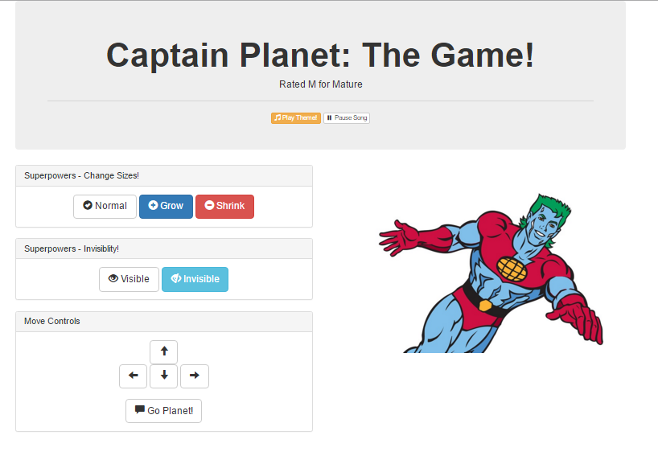
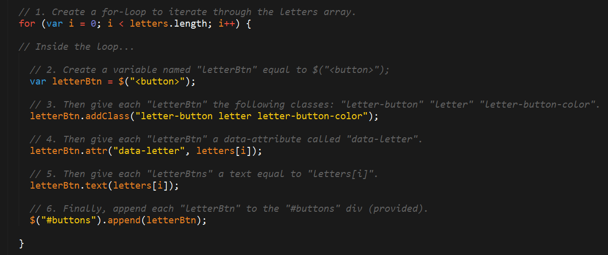
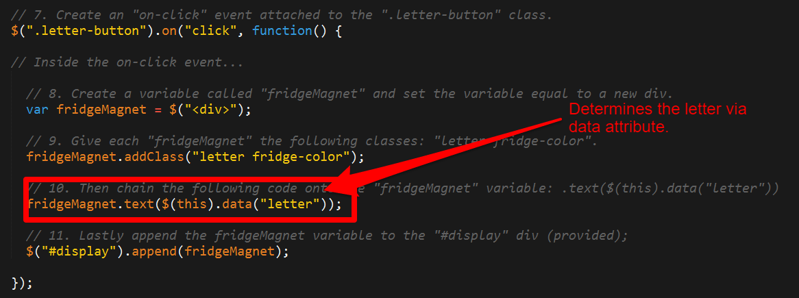
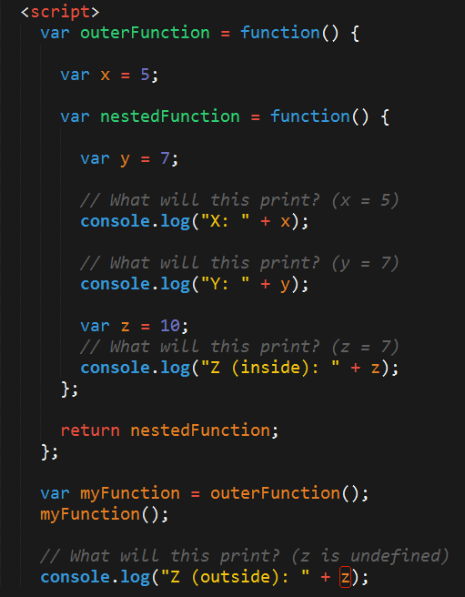
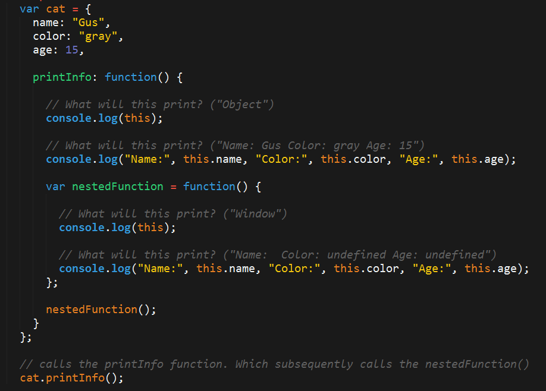

## 4.2 Lesson Plan - jQuery Jubilee <!--links--> &nbsp; [⬅️](../01-Day/01-Day-LessonPlan.md) &nbsp; [➡️](../03-Day/03-Day-LessonPlan.md)

### Overview

In this class, we will further students' understanding of DOM Manipulation using jQuery. Towards the end of class, we will also introduce them to the concept of lexical scope.

`Summary: Complete activities 10-15 in Unit 04`

##### Instructor Priorities

* Students should understand how the `10-CaptainPlanetGame` works and be able to add new on-click events to it.
* Students should complete the `11-FridgeGame` Activity.
* Students should be given a cursory overview of the concept of lexical scope

##### Instructor Notes

* Today's class is focused on providing students with additional exposure to jQuery for DOM manipulation. As an instructor, your primary focus is to ensure students understand the `10-CaptainPlanetGame` and the `11-FridgeGame`. If you are able to cover lexical scope in depth, consider that a significant bonus. Scope is important, but don't leave people in the dust when it comes to DOM manipulation.
* Also, as a heads-up, next week there will be an entire class allotted for reviewing JavaScript. So if you're students seem winded -- give them a heads-up as well.

* Have your TAs reference [02-Day-TimeTracker](02-Day-TimeTracker.xlsx) to help keep track of time during class.

### Sample Class Video (Highly Recommended)
* To view an example class lecture visit (Note video may not reflect latest lesson plan): [Class Video](https://codingbootcamp.hosted.panopto.com/Panopto/Pages/Viewer.aspx?id=09933d70-115a-4945-8633-e6965b29e53f)

- - -

### Class Objectives

* To use jQuery DOM manipulation to create simple games.
* To gain an initial understanding of lexical scope in JavaScript.

- - -

### 1. Instructor Do: Welcome Students (0:01)

* Welcome students, and open the PowerPoint: [`jQueryJubilee`](Slide-Shows/jQueryJubilee.pptx).

### 2.  Instructor Do: Monologue (0:05)

* Take the first few moments to offer students a few encouraging words. Word Guess was hard. HTML/CSS was hard. jQuery seems hard. Let them know that they've just completed the most challenging aspect of the course (Weeks 1-3 truly were).

* Let them know that the first weeks are challenging because everything is so new. Also, let them know that they've reached a point where they've learned far more than they may be giving themselves credit for.

* Remind them that one-on-ones during office hours are a great way to get caught up in the class.

### 3.  Instructor Do: Today's Class (0:01)

* Outline the focus of today's class as shown on the slides.

### 4.  Instructor Do: Captain Planet Game  (0:05)

* Open the file `captain-planet-game.html` in `10-CaptainPlanetGame/Solved` in the Browser. Click on various buttons and show students how Captain Planet is being modified in response to the clicks.

* **Important:** Be sure to play the theme song while doing so. Very, **very** important.

  

### 5.  Students Do: Pseudocode Captain Planet    (0:07)

* Proceed with the first activity, in which you ask students to pseudocode the game's logic and structure.

### 6.  Instructor Do: Review Pseudocode (0:05)

* Allow students to share their pseudocode breakdowns.

* Then show your own pseudocode outline (shown on slide).

### 7.  Students Do: Create a Superpower Captain Planet (0:12)

* Slack out the code for the game.

* Then task students with dissecting it, and adding additional code to create a new power for Captain Planet. At base, this requires them to create a new button, create a new on-click event, and then create code that changes the CSS for Captain Planet in response to button clicks.

* **Folder:**

  * `10-CaptainPlanetGame` in `10-CaptainPlanetGame/Unsolved`

* **Instructions:**

  * Look at the jQuery API Docs [(https://api.jquery.com/)](https://api.jquery.com/) and add a button of your own that gives Captain Planet a new power.

  * Examples:

    * Click to… Stretch Captain Planet!
    * Click to… Trigger a maniacal laugh!
    * Click to… Create clones of Captain Planet!
    * Click to… Create fire or water (hint: images)!

  * Slack out a screenshot of the working example.

* **Instructor:**
  * Feel free to give students additional time here if necessary. Make sure the majority of your students have at least a basic example that works.

### 8.  Instructor Do: Review Captain Planet    (0:05)

* Have a student with a working solution share their code with you. Then ask them to present at the front of class.

* If no one one has a working example, quickly create code of your own that "stretches" Captain Planet. You can use the version found in `Solved->captain-planet-game.html` as an example.

### 9.  Instructor Do: jQuery Recap   (0:07)

* Next, spend a few moments going through the jQuery recap slides. The most important thing to explain in discussing these slides is the fact that jQuery is "capturing" HTML elements using the `$()`, and that we are then applying various methods to that element (or a different one in response).

* Finally, point out that students shouldn't be expecting to memorize all of the jQuery library. Point out that coding is all about understanding a general concept, and then "looking up" the exact code when needed.

* Field any questions that remain before proceeding to the next activity.

### 10. Students Do: Fridge Game  (0:35)

* Open the solution file `11-FridgeGame` in `11-FridgeGame/Solved`, and show students how the application works. In short, the application allows users to click on letters from a menu and have those letters appear on the fridge.

* Then, slack out the below folder and instructions.

* **Folder:**

  * `Unsolved` in `11-FridgeGame/Unsolved`

* **Instructions:**

  * Working in groups of 3, complete the code for the fridge activity such that:

    1. JavaScript dynamically generates buttons for each of the letters on the screen.

    2. Clicking any of the buttons leads the SAME letter to be displayed on the screen.

    3. Hitting the clear button erases all of the letters from the fridge.

  * Note: This is a challenging exercise. You may want one person to type, while the other two watch over to catch bugs and/or research necessary snippets.

- - -

### 11. Break (0:15)

- - -

### 12. Instructor Do: Review Fridge Game       (0:10)

* Spend the time necessary to ensure that the majority of students have a conceptual understanding of how the Fridge Game's code works. In explaining the solution, point out the following:

  * The creation of an array that holds all of the letters;

  * The for loop used to take letters from the array, associate each with a data-attribute and text, and then append them onto the page. Students will be confused about the concepts of `.addClass`, `.attr`, and `.text`. Spend the time necessary to explain each.

    

  * The on-click event needed to capture button clicks. Be sure to point out how we use the data-attribute (via the `.data` method) to know which letter was clicked. This is a **KEY POINT**.

    

* Slack out the solution and the [video review](https://www.youtube.com/watch?v=gC529k3KzmE) for the activity.

### 13. Instructor Do: Crystal Example (0:10)

* Next, open the files found in the folder `12-CrystalExample`. These files closely match the students' homework assignment.

* They are included in the day's lesson primarily so students can refer back to them while working on their homework assignment. Use your discretion as to how much extra help your students need to complete their homework. If you feel students need a lot of help, feel free to spend time in class going over these examples. Otherwise, simply explain to students that the code is available, and offer a very high level explanation of how they can use the code provided.

### 14. Instructor Do: Intro Lexical Scope      (0:10)

* Proceed to the Lexical Scope slides. Warn students that this section is pretty heavy on theory.

* Proceed with basic definitions of scope, using analogies to boxes or other simple concepts when possible. Mention the concept of nested functions -- before moving to the first code dissection. (Students will be dissecting the code example shown in the slides).

### 15. Students Do: Lexical Scope  1   (0:05)

* Slack out the following files and instructions:

* **Files:**

  * `13-ScopeOne/Unsolved/lexical-scope-1-unsolved.html`

* **Instructions:**

* Take a few moments dissecting what I just said.

* Look at the file sent to you, and explain to the person next to you what is meant by:

  * The terms parent function and child function

  * The concept that child functions can access parent variables, but not vice versa.

* Be prepared to share!

### 16. Instructor Do: Review Lexical Scope 1       (0:05)

* First, ask students to try and explain the solution.

* Then, review the solution provided in `13-ScopeOne`.

* The key concept to explain is that the variable `z` is not accessible outside of the `nestedFunction`.

* If you'd like, you can show students that this can be corrected by making `var z` a global variable -- but then you should also point out that the second instance of `z` should NOT have the `var` keyword in front.

  

### 17. Students Do: Lexical Scope 2        (0:07)

* Proceed with the next activity.

* **File:**

  * `lexical-scope-2-unsolved.html` in `14-ScopeTwo`

* **Instructions:**

* Take a few moments to dissect the code just sent to you.

* Try to predict what will be printed in each of the examples.

* Be prepared to share!

* Note: Pay attention to the unusual use of the keyword: ‘this”

### 18. Instructor Do: Review Lexical Scope 2   (0:05)

* Proceed with the review. This example may have been more challenging to students, as we introduced the concept of `this` without explanation.

* The key takeaway here is that using the keyword `this` will only print content related to the object directly above it, **not** from the grandparent.

  

### 19. Students Do: Lexical Scope 3 (0:07)

* Proceed with the next activity.

* **Files:**

  * `lexical-scope-3-unsolved.html` in `15-ScopeThree/Unsolved`

* **Instructions:**

* Take a few moments to dissect the code just sent to you.

* Try to predict what will be printed in each of the examples.

* Be prepared to share!

* Note: Pay attention to the unusual use of the keyword: ‘this”

### 20. Instructor Do: Review Lexical Scope 3       (0:05)

* Try to have students explain the solutions to the last activity back to you.

* If no student can, try to explain it yourself using the solution provided. It's okay if you stumble as you explain -- that shows students that this stuff isn't obvious, and that you can be a great developer, even if these nested functions confuse you.

* Remind students that these are not easy activities. The key is simply for them to become familiar with the fact that JavaScript's handling of parent and nested functions isn't always intuitive, and that errors can arise if you aren't careful.

* Make sure they realize that studying these examples **is not** overly necessary.

### 21. Everyone Do: Brain Teaser   (0:20)

* If you have additional time available in class, proceed with this activity `16-ColorCorrecter`.

* It's challenging, and will likely take over 40 minutes to complete.  It is not necessary that students finish it.  At best, they may be able to get _started_ in class, but will likely need to spend additional time at home if they are interested in completing it.

* Play it by ear if you'd like to walk through the solution.

### Lesson Plan Feedback

How did today's class go?

[Went Well](http://www.surveygizmo.com/s3/4325914/FS-Curriculum-Feedback?format=pt&sentiment=positive&lesson=04.02)

[Went Poorly](http://www.surveygizmo.com/s3/4325914/FS-Curriculum-Feedback?format=pt&sentiment=negative&lesson=04.02)
