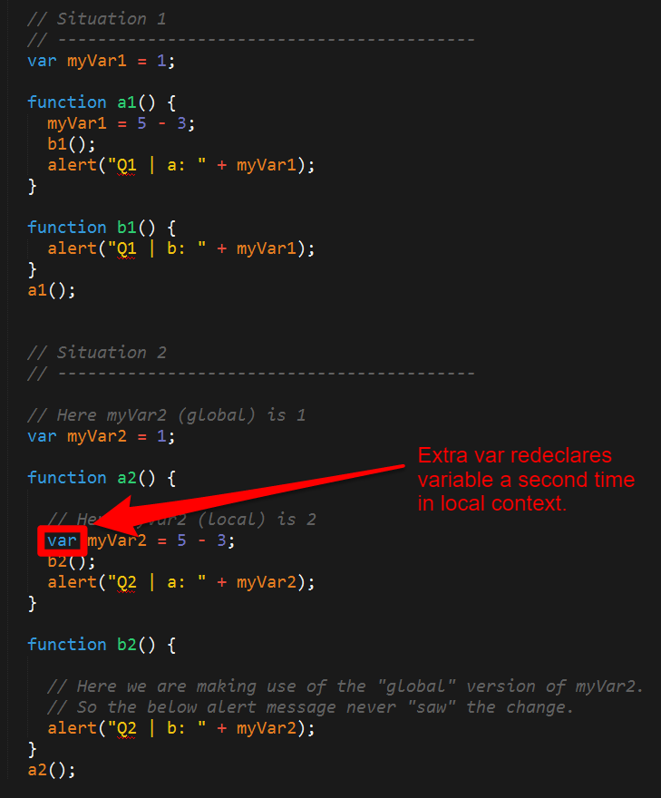
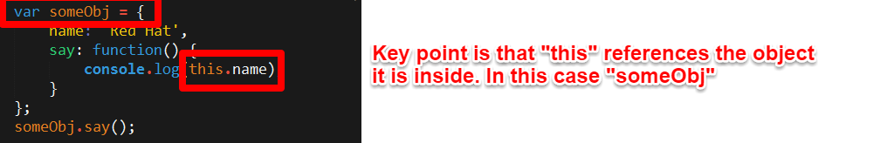
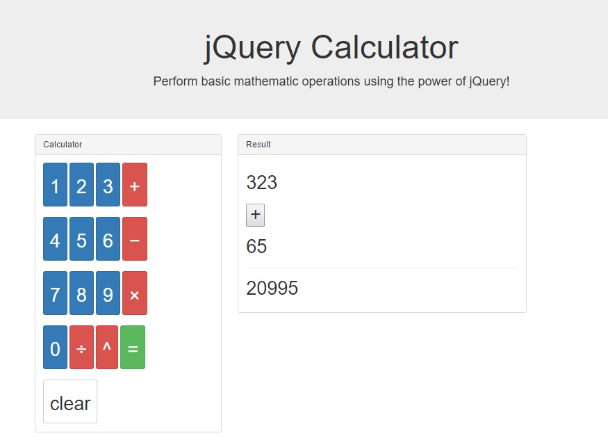
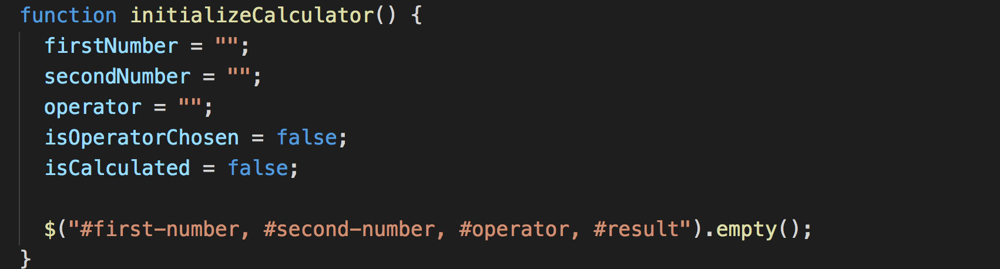
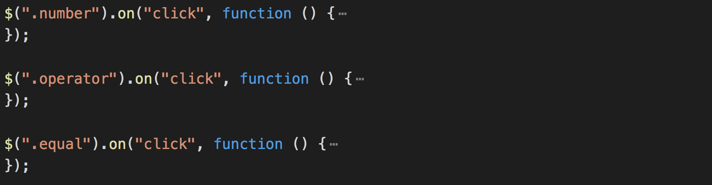
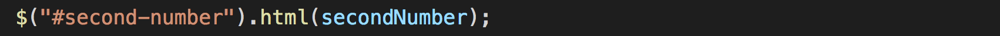
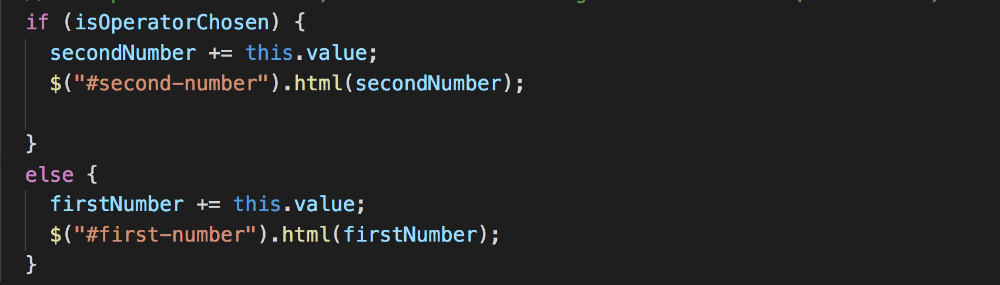
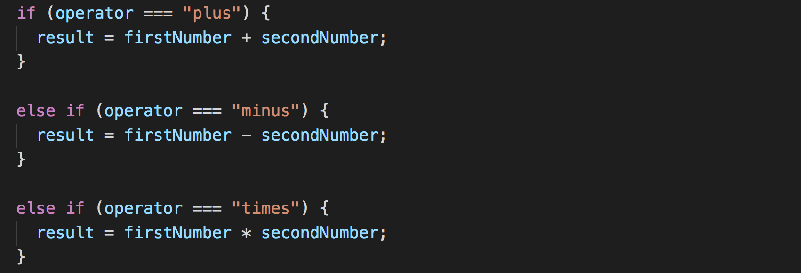

## 4.3 Lesson Plan - jQuery Calculator (10:00 AM) <!--links--> &nbsp; [⬅️](../02-Day/02-Day-LessonPlan.md) &nbsp; [➡️](../../05-Week/01-Day/01-Day-LessonPlan.md)

### Overview

In this class, we will be furthering students' understanding of jQuery by building a basic calculator. Students who are struggling with basic concepts should be assisted using a 1:1 format outside of class.

`Summary: Complete activities 16-21 in Unit 4`

##### Attention: If you’re teaching a part time section and this isn’t a Saturday, please use the “Weekday” tab inside of the "03-Day-TimeTracker.xlsx" for activity lengths instead of those printed on this lesson plan

##### Instructor Priorities

* Students should be guided through the creation of the jQuery calculator (`20-jQueryCalculator`) OR be given time to work 1:1 with TAs.
* Student should complete the JavaScript Checkpoint.

##### Instructor Notes

* Today's class is the first that will be PowerPoint-free. Most of your remaining class sessions will be activity-driven.

* The main focus for today is to provide students an opportunity to create a semi-complex jQuery application in class. Students will work in teams of four using a paired-programming approach—i.e. one person types, the other two "bug check". This will force students to actively "bug-check" as their partners type out code. Every so often, you will ask teams to rotate the typist.

* Because today is all about creating a large-scale application in class, use this opportunity to help small groups improve their JavaScript. Often in large-classes, it's hard to offer students the individual support they need to become fearless developers. Use this class day to help get them there.

* Because the calculator build is more of a "challenge" activity, consider using the time to also help struggling students "catch-up" in class. As has been tested in other sites, a good way to accomplish this is to ask students at the start of the activity to message TAs if they are in need of 1:1 crash courses. These crash courses are each 20 minute sessions, in which 1 or 2 TAs work closely with the student _outside_ of the classroom on basic code tasks. It is up to the TAs + Instructors to create an outline of topics. These sessions might cover:

  * Basic Variable assignment
  * Creation of an Array
  * Creation of a For Loop
  * Creation of a For Loop that loops through an array
  * Creation of a Function that prints a statement
  * Creation of an Object
  * Creation of an Object with a function associated
  * jQuery on-click events associated with buttons
  * Overall skeleton of an application (i.e. Variables, Functions, Function Calls)

* Use the file in `21-CrashCourse` as a starting point for 1:1s. Then use the conversation with students to move the conversation forward. Be sure to keep the 1:1 under 25 minutes, so more students can benefit.

* Additionally, the start of today's class also includes a series of exercises on scope and the concept of "this". Instructors should use their discretion as to how much time is spent on these exercises. However, **be sure to leave at least 90 minutes** for the calculator activity.

* Finally, as a heads-up, next week's 5.2 class is wholly devoted to JavaScript review of old activities. Just giving you a heads-up!

* Have your TAs reference [03-Day-TimeTracker](03-Day-TimeTracker.xlsx) to help keep track of time during class.

### Sample Class Video (Highly Recommended)
* To view an example class lecture visit (Note video may not reflect latest lesson plan): [Class Video](https://codingbootcamp.hosted.panopto.com/Panopto/Pages/Viewer.aspx?id=20b03de5-04df-4edb-a182-843308f5e246)

- - -

### Class Objectives

* To build a semi-complex jQuery calculator application in teams.
* To complete the JavaScript Checkpoint.

- - -

### 1. Instructor Do: Welcome Students (1 mins)

* Take a moment to welcome students. Let them know that today's class is Powerpoint free!

### 2. Instructor Do: Motivation + Pulse Check (15 mins) (High)

* Then, take an extended moment of time, to do a pulse-check of your class. Consider creating an anonymous Poll using Poll Everywhere (<https://www.polleverywhere.com/>), in advance of the class. You can ask them how they're feeling, what concepts have been the most challenging, or something more fun. The point is to give students an opportunity to chime in. Through Poll Everywhere you can also create polls where students post anonymous feedback -- viewable live. This can be a ballsy move, but if you are open to hearing and responding to feedback live, it can be a powerful tool for showing students that you are listening.

* Then, take a few moments to either respond to the pulse-check -- or simply giving your students a pep talk. It may be a good time to offer students perspective on how quickly they are progressing or the fact that as first-time developers -- they don't need to know "everything". Be creative here. But don't skip this pep talk. Many of your students are likely still feeling pretty defeated because of JavaScript.

* **Important Note:** This would also be a good time to let students know that an entire class day next week will be devoted to reviewing old JavaScript activities thoroughly.

* Let students know that the first half of the class will be a series of activities that build on their working knowledge of JavaScript scope. The second half (the more important one) will be focused on building a calculator using jQuery.

### 3. Partners Do: Scope Quiz (7 mins)

* The first activity is intended to point out a common error students make in working with variables. Often, during the first few weeks of class, students instantiate multiple instances of the same variable. This creates unexpected behaviors as JavaScript handles each variable declaration as its own "local instance".

* Slack out the following file and instructions:

* **File:**

  * `17-ScopeQuiz` in `17-ScopeQuiz/Unsolved`

* **Instructions:**

  * Spend a few moments studying the codefile with the person sitting next to you.

  * Then run the program in the browser.

  * Once you run the program, you'll find that Code Block 1 leads to different alerts than Code Block 2.

  * Ask your partner which Code Block is behaving the way you would expect.

  * Then work with your partner to try and identify the specific difference that is causing the issue with the faulty block.

  * Once you spot the issue, try to explain to your partner why JavaScript is handling these Code Blocks differently.

### 4. Instructor Do: Review Scope Quiz (5 mins)

* After giving students a few moments to dissect the code, point out the issue at hand. Specifically, Code Block 2 re-declares the `myVar2` variable inside of the function `a2`.

* This creates an issue where JavaScript creates a "local instance" of the variable `myVar2`. This local instance is only observable by the function `a2`. This means the function `b2` does not see the changes being made to the variable. Instead, `b2` refers back to the first declaration of `myVar2` and still thinks the value is equal to 1.

  

* Let students know that these scope issues are common sources of bugs for new developers.

### 5. Partners Do: This Example (10 mins) (High)

* Then proceed to the next example. Slack out the following file and example

* **File:**

  * `18-ThisExample` in `18-ThisExample`

* **Instructions:**

  * Using the comments in the guide answer each of the questions asked in the file.

  * Focus your attention on trying to wrap your mind around the concept of "this" and the unique role it can play in code.

  * Then try to explain to your partner how "this" works, focus on the first three examples.

### 6. Instructor Do: Review This Example (10 mins) (low)

* Go over the solution to this example by explaining the answers to each of the questions `this-solved.html`.

* Don't worry about the bonuses. These may confuse the bulk of your students. The key thing to explain is that the keyword `this` refers to the object it falls inside of. Most of the time, `this` is a good way to be self-referencing. (You can leave it at that. Your more advanced students will dig deeper, but don't overwhelm your average student).

  

### 7. Students Do: Cobwebs (10 mins) (low)

* Proceed with the next example.

* This example, simply asks students to become more familiar with deeply nested JavaScript Objects, which they will be immersed in during Week 6.

* For some of your students, this will be an enlightening exercise. For others, this will be very basic.

* For the students in need of an extra challenge, a very difficult bonus is included. The solution is included; students will likely need to continue working on this bonus for days after class.

* Slack out the following file and instructions.

* **File:**

  * `cobweb-starter.html` in `19-Cobweb`

* **Instructions:**

* Create the missing the code such that you can retrieve the requested item from the `theCobWeb` object.

* Note: This exercise is actually very relevant to work as a web developer, as data is often relayed across websites in the form of deeply nested JavaScript objects like this one.

* Bonus: If you finish early, begin pondering the bonus item. This is a **very** challenging exercise. It's impossible to complete in the allotted time. If you're feeling valiant - complete it outside of class and come back to instructors/TAs to go over it. This will arm you for difficult interview questions in the future.

### 8. Instructor Do: Review Cobwebs (10 mins)

* Go over the solution. In this case, feel encouraged to have students come up to the front and type out the code themselves.

* The solution involves referencing each parent object.

  

* Don't go over the bonus! It's too much. Do it after class during office hours.

### 9. Instructor Do: Intro Calculator + Group Formation (10 mins) (High)

* At this point, proceed to form groups for the calculator activity.

* In this case, have students form groups of 3-4 of their own choosing, but ensure that each group includes at least one member from the other section.

* Once students are in their groups, open the file: `jQueryCalculator.html` in the browser. Show students how the application works by pressing various buttons and computing the results.

* Point out that this is a challenging exercise that will require the entire group to work together.

* Encourage students to work in pairs

* Once all students are situated, slack out the following file and instructions.

* **File:**
  * `jquery-calculator.html` in `20-jQueryCalculator/Unsolved`

* **Instructions:**
  * Create the JavaScript logic necessary to add functionality to the jQuery Calculator.

  * Your calculator should be able to handle basic mathematical operations like addition, subtraction, multiplication, etc.

  * You should be making use of the existing buttons.

  * You should be making use of the existing placeholders for entering content (i.e. "firstNumber", "operator", "secondNumber", "result").

  * You should have fun and push yourselves! This is a challenge activity—which means, if you get it done, you are a King of jQuery. If you don't, no sweat. The important thing is that you learned at least a FEW things along the way.

* **Instructor/TAs:** At this time, you may want to let students know about the 1:1 option available during the exercise. Describe these "catch-up" sessions as being "crash-courses" intended to help students go over the basics. Alternatively, if you already have a good idea of which students need the catch-up sessions, avoid making the announcement completely, and simply invite those students to take advantage of the time.

### 10. Everyone Do: Phase 1: Getting Situated + Pseudocoding Stage (20 mins)

* Throughout the activity, you will be offering minimal suggestions about how students should be proceeding and focusing their time.

* Slack the below objectives:

* **Phase I Objectives**

  * For this first 20 minutes, your goals should be to:

    * Become familiar with the various elements of the HTML page as it is written now. (Identify the classes and IDs that matter!)

    * Create a general strategy for how you will accomplish the task:

      * How will you capture button clicks?
      * What will you do with the numbers clicked?
      * What will you do when the operator is clicked?
      * How will you differentiate numbers from operators?
      * How will you know the "value" of a number clicked?
      * How will you know when a user is done entering the first number?
      * Etc.

    * Create a few test "on-click" events. These could just trigger Alert messages for now. If you get further along, then have these buttons alert their "value".

### 11. Everyone Do: Phase 2: Begin Logic (30 mins)

* Slack the below objectives:

* **Phase II Objectives**

  * For the next 30 minutes, your goals should be to:

    * Begin creating sets of variables that you think you will need. As a few suggestions:

      * firstNumber, secondNumber, operator, result

    * Create code that captures the numbers from button clicks, and then displays them on the HTML.

    * Create code that captures an operator click, then immediately tells your code to begin recording the second number. (Example: If a user clicks the "plus" button, you know they are done typing the first number).

    * Create code that checks which operator the user has clicked, then saves this operator for later use in a conditional statement. (Example: If a user clicks the "plus" button, you know you will need to be adding two numbers. If a user clicks the "minus" button, you will need to be subtracting two numbers. Think: if-else statements!)

- - -

### 12. Lunch (35 mins)

- - -

### 13. Everyone Do: Continue Logic Building (35 mins)

* Slack out the below objectives:

* **Phase III Objectives**

  * For the next 40 minutes, your goals should be to:

    * Complete the functionality you are missing in your code.

    * Spend a few moments really assessing what you still have to do.

    * Get a TA/Instructor to help you set priorities if you are unsure as to how to proceed.

### 14. Everyone Do: Refinement (25 mins)

* Slack out the below objectives:

* **Phase IV Objectives**

  * For the last 25 minutes, your goals should be to:

    * Complete any remaining functionality in your calculator

    * Handle bugs and edge cases (Example: What if a user tries to type in more numbers after getting the result? Will that mess up the screen?)

    * Create code to "restart" the calculator after a user clicks "clear".

### 15. Instructor Do: Review Calculator (10 mins)

* Because this application is pretty massive, the main focus during review is to help students understand **how** they should be re-examining the code on their own. Starting with the code blocks collapsed may help with clarity (as in the below image with the `.on` methods).

* Give students the high points. Emphasize the following:

  * We set a number of variables in the `initializeCalculator` function.

    

  * We used JQuery to create separate on click listeners for numbers, operators, and equals.

    

  * We used `this.value` in the callback function to determine what the value was for a given number or operator.

    

  * We created code that would change the HTML content using `.html`

    

  * We took numeric inputs for `firstNumber` **until** a user clicks an operator. Once a user clicks an operator, we changed the value of a boolean, called `isOperatorChosen`, and immediately began recording the `secondNumber`.

    

  * Once a user clicks the "equal" button, we used conditionals to check which operation they had clicked, then ran that operation on the two numbers.

    

* Encourage students to spend some time re-examining this code. Even if they don't yet feel comfortable creating it from scratch, let them know that it has a number of key code snippets that they may find useful at various points in the class.

### 16. Instructor Do: Introduce Checkpoint - JavaScript (5 mins) (Critical) 

* Let your class know that they will now be taking a short multiple choice assessment to check their understanding of JavaScript

* DO NOT SKIP THIS INTRODUCTION. DO NOT JUST SEND OUT THE LINK WITHOUT CONTEXT

* Reassure the students that they need not be nervous about the Checkpoint:

  * "This will not affect your grade or graduation requirements."

  * "This is not like the tests and quizzes you might be used to from school or college. The purpose of these tests is not to motivate you to study or punish you for struggling."

  * "This is as much a test of me as an instructor and of the course content as it is of you. We are here to ensure your success, and this is one of the tools we use to make sure we are doing that effectively. This class moves _fast_, so if some or all of you misunderstand something important we as an instructional team need to find out as fast as possible so we can help."

  * "Long story short, this quiz can not hurt you. Only help you."

* Let students know that they should read carefully and focus on thinking about the right answer rather than using any test-taking skills they may have learned:

  * "There are no silly answers or obvious throwaway responses on this quiz, because those kinds of answers reduce the likelihood that we'll be able to figure out whether we've taught something effectively."

  * "Test taking strategies you may have learned for standardized tests _will not work_, so instead of focusing on eliminating wrong answers or looking for sneaky context cues, read the question and each of the possible choices carefully."

* Reassure students once again that the purpose of this is to help them, and remind them that the outcome does not impact their grade or graduation requirements. You should do this _every single time_ you give an Checkpoint.

* You or your TAs should now get the link specific to your class:

  * Navigate in your browser to: `https://www.switchboard.tech`

  * Select your class code (if it doesn't show up on its own)

    * For parallel cohorts (two classes combined on a Saturday) and doing a Checkpoint: You will **need** to select the classes in your cohort. You can multi select the cards by clicking the class that you need.

    * The class roster will be in the **one** link. 

  * Select the Checkpoint and copy the resulting link

### 17. Students Do: Take Checkpoint - JavaScript (10 mins) (Critical)

* Slack out the link to the Checkpoint

* Let your students know that once they select their name, it will take them to the Checkpoint

* Checkpoints must be completed in class, **not at home**, to ensure you will be able to effectively find and help struggling students 

* TAs should walk around the class to ensure students aren't looking up answers

* Keep in mind we do not use grades from assessments toward graduation requirements. However, students will be tempted to avoid feeling like they don't understand something.

* It's important for instructional teams to create an environment where it is safe to fail, but also where such failure is visible. You should not be worried about "cheating" on checkpoints, only making sure that students who need help aren't remaining invisible.

* Your SSM will have the results of the Checkpoint within an hour of its completion

### 18. End (0 mins)

### 19. TAs Do: Structured Office Hours - Review JavaScript (30 min)

* Navigate in your browser to: `https://github.com/coding-boot-camp/checkpoint-bank/blob/master/checkpoints/multiple-choice/03-JavaScript-MC/03-JavaScript-MC.md`

* There you will find the questions and answers to the Checkpoint given.

* Please take the entire office hours time to review the questions with the students.

* Suggestion Format:

  * TAs ask a question at a time to the class.

  * Let the students try to answer it.

    * If you see that a majority of the class has a misunderstanding with a question:

      * Take your time on this question!

    * If you see that a small number of students has a misunderstanding with a question:

      * Do your best to reinforce the misunderstanding but be cautious of your time.

      * Make note of the students that are still struggling with the question and schedule a 1:1 with the students.

  * If applicable, demo the answer.

* Take your time on these questions!

* This is a great time to reinforce concepts and misunderstandings!

### 20. Slack out the Video Guide (0 mins)

* Slack out the video guide for this week's key activities and last week's homework! Emphasize how helpful a tool these videos can be if a student feels as if they are falling behind or simply wants to review the material once again.

* [Video Guide](../VideoGuide.md)

# Instructor Do: Private Self-Reflection (0 min)

Take some time on your own after class to think about the following questions. If there's anything that you're not sure how to answer, feel free to reach out to the curriculum team!

1. How did today's class go?
2. How did you teach it?
3. How well do you feel you did teaching it?
4. Why are you teaching it?
5. Why did you teach it that way?
6. What evidence can I collect to show my students are understanding?
7. How will my students know they are getting it?

### Lesson Plan Feedback

How did today's class go?

[Went Well](http://www.surveygizmo.com/s3/4325914/FS-Curriculum-Feedback?format=pt&sentiment=positive&lesson=04.03)

[Went Poorly](http://www.surveygizmo.com/s3/4325914/FS-Curriculum-Feedback?format=pt&sentiment=negative&lesson=04.03)
