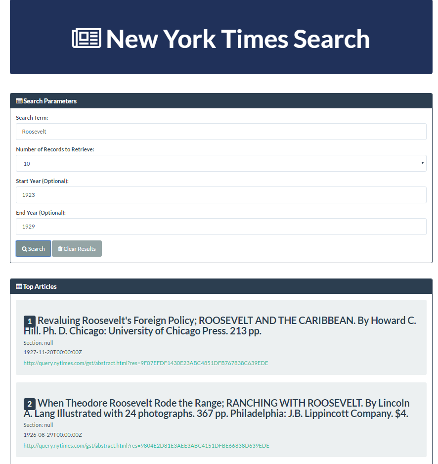
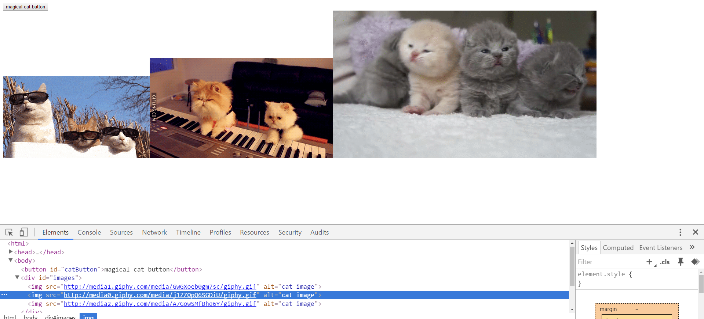
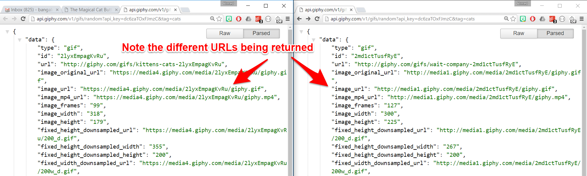
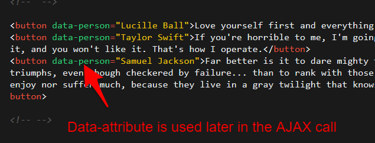
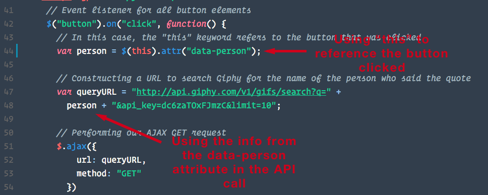
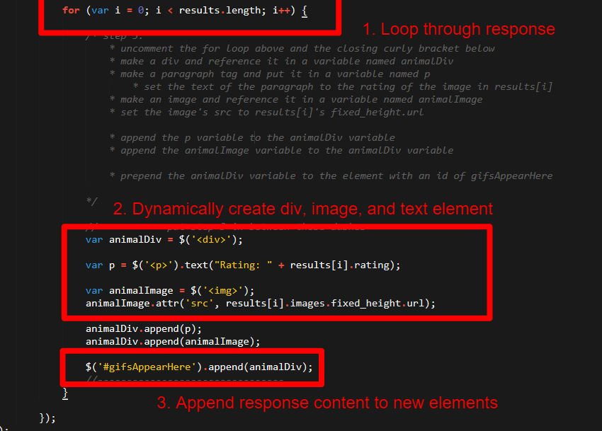
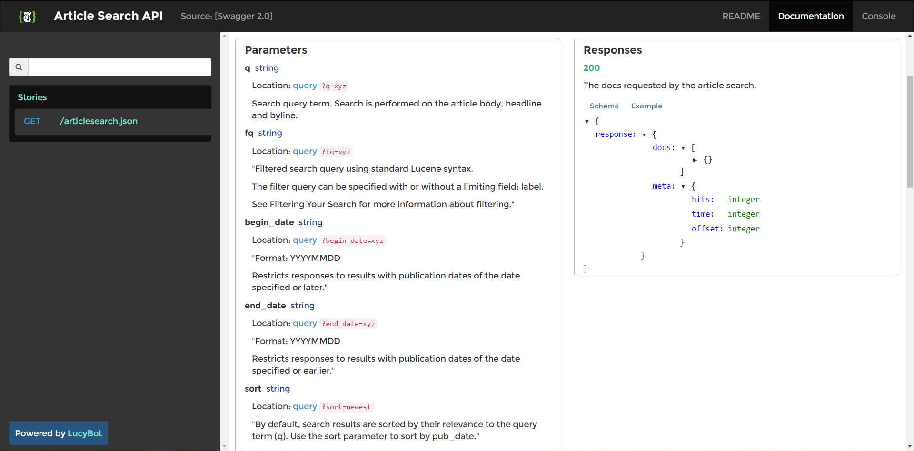
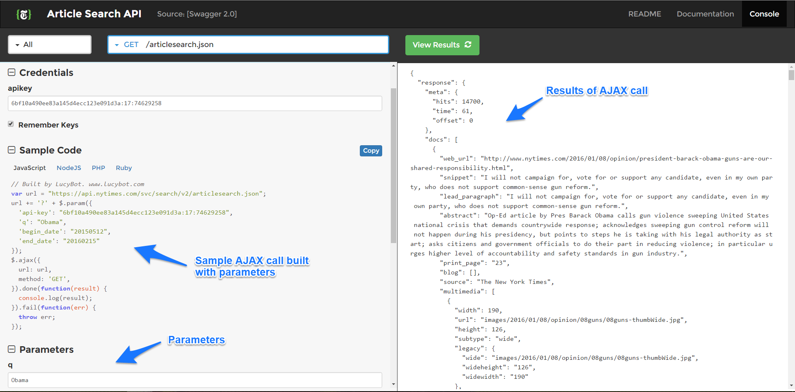
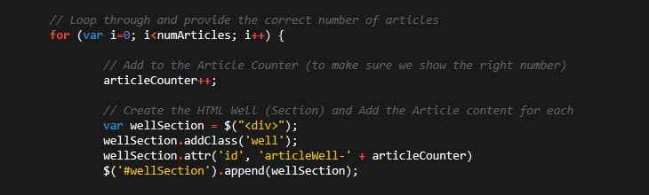
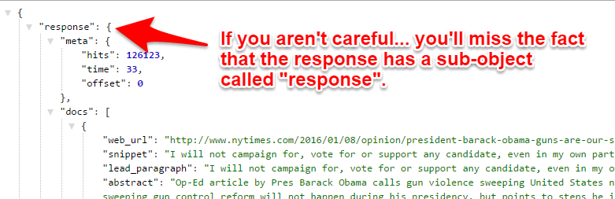

## 6.3 Lesson Plan - Real-World API Application Development <!--links--> &nbsp; [⬅️](../02-Day/02-Day-LessonPlan.md) &nbsp; [➡️](../../07-Week/01-Day/01-Day-LessonPlan.md)

### Overview

In this class, we will be culminating our introduction of APIs with a team-based "real-world" activity in which students create a New York Times Archive Search Application.

`Overview: Complete activities 12-16 in Unit 06`

##### Attention: If you’re teaching a part time section and this isn’t a Saturday, please use the “Weekday” tab inside of the "03-Day-TimeTracker.xlsx" for activity lengths instead of those printed on this lesson plan

##### Instructor Priorities

* Students should be praised for their progress so far -- they've just completed the front-end portion of our class!
* Students should complete each of the mini Ajax exercises in preparation for their homework assignment
* Students should be exposed to the idea of working in feature teams to complete a project.
* Students should be pushed to create a semi-complex "real-world" application that utilizes APIs
* Make sure students sign up and obtain THEIR OWN PERSONAL API KEY for any APIs we might use, as the publics keys that we provide could be deactivated at any time.

##### Instructor Notes

* Today's class is composed of two parts:

  1. Prior to the break -- students will be completing an assortment of AJAX activities that directly lends itself to the homework.
  2. After the break -- students will be completing a more extensive New York Times API application.

* Between these two priorities, the second half is the more important one as it will expose students to the process of building large-scale applications in a collaborative way. During this activity, continually walk around and help each group at whatever level they are at. The focus here is in both to help students catch up and to challenge students looking to further grow.

* Encourage paired coding. During the group activity, groups will be made up of four students -- with two students serving as the UI team and two students serving as the data team. In each of these pairs, only one member should be typing, while the other helps catch bugs and offers advice. This works well as students can help one another catch simple errors in real-time.

* Note to Instructors: The API for the New York Times has been going through a series of revamps since this lesson plan was created. The concepts and routes are the same, but the the documentation interface has changed. Be prepared to be flexible.

* TAs should reference [03-Day-TimeTracker](03-Day-TimeTracker.xlsx) to help keep track of time during class.

### Sample Class Video (Highly Recommended)
* To view an example class lecture visit (Note video may not reflect latest lesson plan): [Class Video](https://codingbootcamp.hosted.panopto.com/Panopto/Pages/Viewer.aspx?id=3ccc6363-7538-42db-95cc-bd21e9197d05)

- - -

### Class Objectives

* To further build mastery of dynamic element generation and AJAX calls
* To provide "real-world" application development scenario that requires collaborative coding

- - -

### 1. Instructor Do: Congratulatory Monologue on Full-Stack (5 min)

* Take a few moments at the start of class to offer students a few congratulatory words. They've undergone over 6 weeks of grueling (and often frustrating) work -- and are probably feeling a bit burnt out. Re-invigorate them! Let them know that the rate of their progress is astounding! And that they've learned in just a few short weeks what a self-taught developer might have taken months to learn.

* Give students a few moments to ask questions. Encourage them to ask questions about anything -- code, career, anxiety. Build a rapport here!

* Once you've taken a few minutes, open up [nytarticle-search.herokuapp.com](https://nytarticle-search-fsf.herokuapp.com/) in the browser and show them what they'll be building later today.

* Ask if any students are history buffs -- then ask them to give you a historic figure and the year in which they were around. Type in their name and a year-range to then pull up New York Times articles about the figure.

### 2. Partners Do: Random Cat Activity (10 min)

* ...But first, we have an activity on cats.

* Slack out the following folder and instructions to students

* **Folder:**

  * [12-CatButton/Unsolved](../../../../01-Class-Content/06-ajax/01-Activities/12-CatButton/Unsolved)

* **Instructions:**

  * Open the file `01-cat-button-students.html` in your browser. Then take a few moments to see what the application does.

  * Then fill in the missing comments for each line to describe what each section does.

### 3. Instructor Do: Review Cat Activity (10 min)

* Take a few moments to review the Activity.

* As a suggestion: call on students to explain each line of the code back to you.

* Then comment the code in real-time.

* Key points to discuss:

  * We're triggering an AJAX call upon button click.

  * We use a hard-coded API to generate a random URL to a cat.

    

  * We then pass this queryURL into our AJAX call to retrieve and generate Cat images dynamically.

  * You may want to point out how the `catImage` variable is being set to a generic `$("")` and that jQuery will self-close this tag upon creation.

    

  * Point out that each imageURL being generated is completely unique. This is because the API is giving us a random URL each time.

  * Point out that if you enter our queryURL <http://api.giphy.com/v1/gifs/random?api_key=dc6zaTOxFJmzC&tag=cats> directly into our browser, we'll get a different JSON
    each time.

      

* Slack out the solution when done reviewing.

* Ask students if there are any remaining questions before moving onto the next activity.

### 4. Partners Do: Ajax Triggered by Buttons (15 min)

* Open the file [13-ButtonTriggeredAJAX/Solved/button-triggered-ajax-solution.html](../../../../01-Class-Content/06-ajax/01-Activities/13-ButtonTriggeredAJAX/Solved/button-triggered-ajax-solution.html) in your browser. Show students that clicking any one of the buttons triggers a series of gifs by its author to emerge.

* Next slack out the following folder and instructions to students

* **Folder:**

  * [13-ButtonTriggeredAJAX/Unsolved](../../../../01-Class-Content/06-ajax/01-Activities/13-ButtonTriggeredAJAX/Unsolved)

* **Instructions:**

  * Using the sample code you've just been given and the code comments as a guide, re-create the functionality you just observed.

  * Your final application should trigger Gifs about your celebrity/author to appear.

### 5. Instructor Do: Ajax Triggered by Buttons Review (5 min)

* Take a few moments to review the Activity.

* As a suggestion: call on students to explain each line of the code back to you.

* Key points to discuss:

  * Point out that the solution was much simpler than some may have thought. We basically created buttons with text inside. The key distinction here is that we used a data-attribute with the author's name. Point out that we later used the JavaScript method `$(this).attr('data-person')` to retrieve the data inside the data-attribute. Confirm that students understand this!

    

  * Have a student remind you what `this` refers to in the code snippet below.

    

* Slack out the solution and the [video review](https://www.youtube.com/watch?v=K1JDUkF94cs) when done reviewing.

### 6. Partners Do: Creating Elements Dynamically (15 min)

* Next open [14-DynamicElements/Solved/dynamic-elements-solution.html](../../../../01-Class-Content/06-ajax/01-Activities/14-DynamicElements/Solved/dynamic-elements-solution.html)  and demonstrate the application in the browser.

* Point out the application (similarly to the last exercise) allows you to trigger gifs about animals.

* Then slack out the following folder and instructions

* **Folder:**

  * [14-DynamicElements/Unsolved](../../../../01-Class-Content/06-ajax/01-Activities/14-DynamicElements/Unsolved)

* **Instructions:**

  * Using the comments in the code as a guide -- replicate the functionality shown to you.

  * Your completed application should trigger gifs to appear related to the animal making the sound listed in the button.

### 7. Instructor Do: Creating Elements Dynamically Review (5 min)

* Take a few moments to review the Activity.

* As a suggestion: call on students to explain each line of the code back to you.

* Key points to discuss:

  * Solution required creating a for-loop that looped through the JSON objects that Giphy returned.

  * Then we created a `div`, text, and `img` element for each of the returned JSON objects.

  * These images were then appended to the HTML.

    

* Slack out the [video review](https://www.youtube.com/watch?v=UVBmX4cZkHY) for the activity.

### 8. Everyone Do: Reiterate Concepts (10 min)

* Spend a few moments re-iterating the high-level concepts we've been discussing in class.

* Have students answer the following questions back to you.

* Be encouraging throughout and clarify any answers for which students may be hazy.

  * What is an API?

  * What does API stand for? (// Application Programming Interface )

  * What are three use-cases for APIs? (// Retrieve Data. Utilize external snippets of code. Work with hardware / physical sensors)

  * What is a JSON?

  * What does JSON stand for? (// JavaScript Object Notation)

  * What is the jQuery method we've been using to retrieve data from online sources? (// AJAX)

  * Are AJAX requests synchronous or asynchronous? Why?

### 9. Partners Do: Pausing Gifs (15 min)

* Open the file [15-PausingGifs/Solved/pausing-gifs-solution.html](../../../../01-Class-Content/06-ajax/01-Activities/15-PausingGifs/Solved/pausing-gifs-solution.html) in your browser. Demonstrate that in this application you can start and pause the animation of each gif you click.

* Then slack out the following folder and instructions to students.

* **Folder:**

  * [15-PausingGifs/Unsolved](../../../../01-Class-Content/06-ajax/01-Activities/15-PausingGifs/Unsolved)

* **Instructions:**

  * Using the comments provided in the code, add in the code necessary to provide stop/start animation to your application.

### 10. Instructor Do: Review Pausing Gifs (5 min)

* Open the [15-PausingGifs/Solved/pausing-gifs-solution.html](../../../../01-Class-Content/06-ajax/01-Activities/15-PausingGifs/Solved/pausing-gifs-solution.html) file in your editor and walk students through the solution.

* During your discussion, be sure to point out the following:

  * That we are flipping `data-state` as though it were a toggle -- switching it on and off between `animate` and `still` whenever a click occurs.

    

### 11. Instructor Do: NYT Group Formation (5 min)

* Finally, break students into groups of four (with two students from each section). Before going on break, have students sign up for a New York Times API key via the following url: <https://developer.nytimes.com/signup>. It only takes a minute to sign up, but can take up to 10 minutes for a registered API key to be emailed, so it's best to take care of this before going on break.

- - -

### 12. BREAK (40 min)

- - -

### 13. Students Do: NYT Example Intro (5 min)

* Re-introduce the NYT Article Search Application by visiting this link [nytarticle-search.herokuapp.com](https://nytarticle-search-fsf.herokuapp.com/).

* Re-walk students through the high points of the application -- namely that it allows you to search the [New York Times Article API](http://developer.nytimes.com/article_search_v2.json).

* Then offer students the following commentary:

  * This is a **hard** activity to do completely right.

  * It will require you to code quickly, efficiently divide tasks, and deal with bugs in retrospect.

  * It's also a really great activity for gaining mastery.

  * Let them know that they should be partnering in sub-pairs. With one pair working on the user interface and the second pair working on API calls.

  * Let them know that they should take honest stock of their abilities and focus on what they feel comfortable doing.

  * Explain to students that a specific developer (or team of developers) is often designated to work on a specific feature. When working as separate teams they need to learn to communicate needs and expectations with other developers working on related features (i.e. data teams should expect text inputs from the UI team)

### 14. Students Do: NYT Example - Design and API (30 min)

* Then slack out the first set of instructions:

* **Instructions - Phase 1:**

  * UI Team:

    * Create the layout for the design above. Feel free to use Bootstrap or to do something more customized of your own.

    * Make sure to organize your code so as to have the necessary IDs.

    * Incorporate text boxes for capturing User Input. Then research how to retrieve the input values in JavaScript

  * Data Team:

    * Do preliminary research on the [API](http://developer.nytimes.com/article_search_v2.json).

    

    * Register for an API Key if you have not already done so.

    * Understand what format the URL should look like to make an Article Call. (Hint: Use the API Console!!)

    * Experiment with console logging various fields.

* Throughout this activity, be walking around the classroom assisting students throughout.

* From time to time, offer the below helpful HINTs to students who may be stuck.

  * All of you should be using the [API Console](http://developer.nytimes.com/article_search_v2.json#/Console/GET/articlesearch.json). The console allows you to create "test URLs". This way you can confirm that you are pinging the right URL.

      

  * For the data team, use hard-coded values whenever you can first. Then switch into "dynamic" URL construction.

  * Notice that you can't actually specify the Number of Records to Retrieve on the API side -- this means that instead you will need to filter records on the JavaScript side (using For-Loops)

     

  * Notice that the the NYT API responds with a sub-object called `response`. This means if you are using the traditional variable `response` to hold your data, you will need to reference individual entries as `response.response...`. You can avoid this if you store the object in something other than a variable called `response`.

     

### 15. Students Do: NYT Example - Coding the Logic (30 min)

* After time, let students know that they should be entering the second phase (Code Logic).

* Let them know that during this phase, they will likely need to work more closely together across teams.

* Then slack out the following instructions.

* **Instructions:**

  * UI Team:

    * Begin creating basic click events. Register the submit button

    * Get the data from the text-boxes and store as variables.

    * Experiment with creating content regions for where the article will go.

  * Data Team:

    * Create the AJAX call needed to retrieve data then console.log all of the relevant fields.

    * Incorporate various “optional parameters” (hard code these in initially).

    * Take note of various “bugs” that appear with certain searches.

  * All-Together:
    * Display the HTML content!!

* Continue helping students throughout this process. Be prepared to help students at very different levels in the process. Look back at the solution throughout the process as needed.

### 16. Students Do: NYT Example - Bug Cases (30 min)

* After time, let students know that they should ideally be working on bug handling.

* Slack out the instructions for this section.

* **Instructions:**

  * UI Team:

    * Continue polishing the display of content in the HTML.

    * Consider adding styling or other jQuery tricks.

    * Consider using Bootswatch and/or Font Awesome to add more visual appeal

  * Data Team:

    * Put in a hard-effort to deal with bugs. How can you handle missing fields?

### 17. Students Do: NYT Example - Refinement and Deploy (10 min)

* After the last phase is complete, let students know that its time to clean-up their apps and deploy them.

* Slack out the instructions for this section.

* **Instructions:**

  * All-Together:

    * Deploy your app to GitHub and Github Pages!

    * Then slack your links to your instructors + TAs

* As a hint suggest students consider trying the following test-cases:

  * Complete Dataset: "Obama"

  * Incomplete Dataset: "Bush" (missing various author and byline fields)

### 18. Students Do: NYT Recap / Review (10 min)

* Spend a few moments going around the room and having each group share at least ONE lesson they learned doing today's exercise.

* Recap the event by explaining that today's activity should have showed you that:

  * APIs are harder to use than you might expect;

  * Working in separate teams requires careful coordination; and

  * Working in teams can allow you to create cleaner code (as more eyes are fixing the same bugs).

* Finally, slack students the following YouTube URL so they can watch a [video solution for the NYT App](https://www.youtube.com/watch?v=QiIlhmeGYuk).

### 19. Slack out the Video Guide

* Slack out the video guide for this week's key activities and last week's homework! Emphasize how helpful a tool these videos can be if a student feels as if they are falling behind or simply wants to review the material once again.

* [Video Guide](../VideoGuide.md)

# Instructor Do: Private Self-Reflection (0 min)

Take some time on your own after class to think about the following questions. If there's anything that you're not sure how to answer, feel free to reach out to the curriculum team!

1. How did today's class go?
2. How did you teach it?
3. How well do you feel you did teaching it?
4. Why are you teaching it?
5. Why did you teach it that way?
6. What evidence can I collect to show my students are understanding?
7. How will my students know they are getting it?

### Lesson Plan Feedback

How did today's class go?

[Went Well](http://www.surveygizmo.com/s3/4325914/FS-Curriculum-Feedback?format=pt&sentiment=positive&lesson=06.03)

[Went Poorly](http://www.surveygizmo.com/s3/4325914/FS-Curriculum-Feedback?format=pt&sentiment=negative&lesson=06.03)
