## 7.2 Lesson Plan - Intro to Firebase <!--links--> &nbsp; [⬅️](../01-Day/01-Day-LessonPlan.md) &nbsp; [➡️](../03-Day/03-Day-LessonPlan.md)

### Overview

In this class, we will be introducing Firebase, an easy-to-use server-side database that makes it easy to power our front-end applications with expansive datasets.

`Overview: Complete activities 9-16 in Unit 07`

##### Instructor Priorities

* Students should understand the following:

  * How to setup and initialize a new Firebase
  * `.set({})`
  * `.on("value")`

* Students should complete + understand the Firebase "Down Counter" Application

* Students should complete + understand the CoderBay Application

* Students should be pushed to strengthen their fundamental JavaScript skills (e.g. Variables, Functions, Events)

##### Instructor Notes

* You will likely find that students are still struggling with basic JavaScript at this point in the class. Use today's class as an opportunity for JavaScript strengthening. If necessary, cut examples on Firebase Presence and Deployment in favor of JavaScript reinforcement. Maintain motivation through each of the basic examples.

* All databases can be accessed by logging into Firebase with:

  * Username: CodingBootcampExamples@Gmail.com
  * Password: rutgers0451

* Have your TAs reference [02-Day-TimeTracker](02-Day-TimeTracker.xlsx) to help keep track of time during class.

### Sample Class Video (Highly Recommended)
* To view an example class lecture visit (Note video may not reflect latest lesson plan): [Class Video](https://codingbootcamp.hosted.panopto.com/Panopto/Pages/Viewer.aspx?id=fa0ebbeb-f22f-45ec-96dc-f0b2e6429a07)

- - -

### Class Objectives

* To introduce the utility of server-side storage systems like Firebase
* To provide a grasp of the basic methods for storing and retrieving data in Firebase
* To introduce the concept of user "presence" in Firebase

- - -

### 1. Instructor Do: Welcome + Opening Questions (3 min)

* Welcome students to class and take a moment to celebrate their having completed nearly 2 months of an intense, high paced coding curriculum. Let them know that they have essentially completed the "front-end" aspect of the curriculum and that we will be diving deep into backend technologies starting today.

* Remind students that they have learned FAR more than they are likely giving themselves credit for. Even for those still struggling, it probably would have taken many, many months for a new developer to learn as much as they have. Stick with it!

* Open up the floor for pending questions or lingering concerns.

### 2. Instructor Talk: Homework 7 Warning (1 min)

* Offer a brief warning to students to begin working on Homework 7 as early as possible. Mention that it's a fairly challenging assignment and that what makes it challenging isn't the "new" stuff. The challenge is getting a handle on increasingly complex javascript logic.

* Mention that we won't cover everything they will need for the assignment today but suggest that they definitely take time tomorrow to review the material we cover today.

### 3. Everyone Talk: Discuss Client vs Server Persistence (3 min)

* Take a few moments to ask students the following discussion questions to recap last class.

  * What is "data persistence"?

  * What is the difference between "client side" and "server side" data storage?

  * What is one case where you might use one vs the other?

  * What is one advantage of using each?

### 4. Instructor Talk: Firebase Introduction (3 min)

* Navigate to the Firebase website (<https://firebase.google.com/>). Then, while having it on in the background, begin to concisely discuss the concept behind Firebase. Namely that...

  * Firebase offers an extremely easy to use system for relaying data between your application and their dedicated platforms.

  * It offers an easy to use, intuitive GUI for seeing your data in real-time.

  * It offers near instantaneous transmission of data between the Firebase database and your application. Of specific importance is the concept of "real-time" data binding (i.e. when your data changes in the database it will IMMEDIATELY reflect that change in your application.)

* Remember to be concise! Try to stay on time as there's plenty to do!

### 5. Everyone Do: My First Firebase Database (5 min)

* Have students follow your lead as you create a new Firebase Database. You can use the below steps as a guide.

  * Navigate to the Firebase website (<https://firebase.google.com/>), click 'GET STARTED FOR FREE', login with your Google account, and then create a Firebase app by clicking 'CREATE NEW PROJECT'. Have them call it whatever they would like (let students know that it needs to be a unique name though).

  * Once they have a Firebase app, have them click 'Database' on the left navbar.

    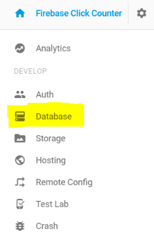

  * Show students that the displayed URL is where all of the data will get stored.

    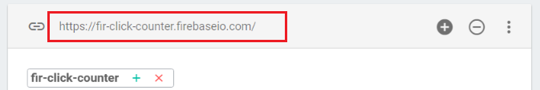

  * It is also important to note that by default Firebase requires authentication to read/write to a new database. For students to be able to complete exercises without worrying about authentication, they will need to set their database rules to 'public'.

    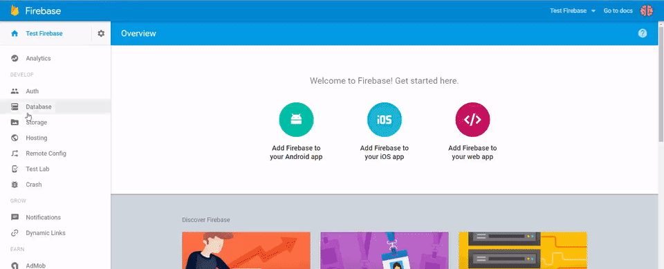

  * Have students click the 'RULES' tab, set both ".read" and ".write" to true, and then click Publish.

### 6. Instructor Do: Ex 1 - Click Button Counter - Firebase Console (7 min)

* Open the code in `instructor-do-clickbutton-fireconsole.html` in `09-clickbutton` (Do NOT slack out this code yet).

* Walk students through the key parts of this basic Firebase application. You can use the below steps as a guide:

  * Inclusion of the Firebase.js file

  * Firebase config and initialization

  * Creation of a reference to the database (i.e. `var database = firebase.database()` )

  * The use of `.set()` to save the data to the database

  * The use of `.ref()` to specify where the data will be saved. Since there is nothing inside the parentheses the data is saved to the database's root directory.

* Be sure to change the Firebase URL where appropriate.

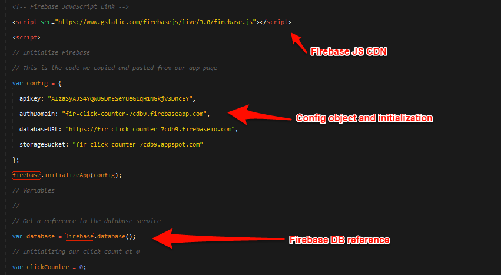
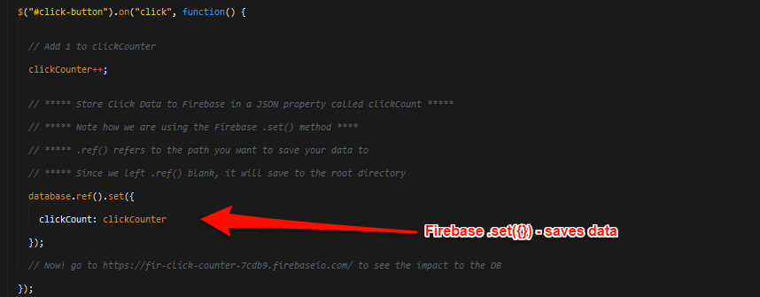

* Once you've walked them through the code, open up your Firebase database in the browser and then show students that, as you click the button, the database is changing to reflect this. (NOTE: At this point, HTML is not changing -- just the Firebase data).

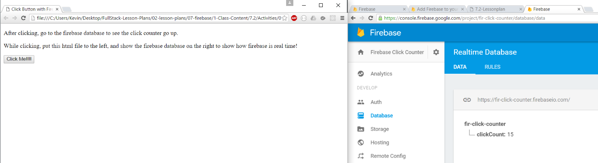

### 7. Everyone Do: My First Firebase App (3 min)

* Slack out the code for `instructor-do-clickbutton-fireconsole.html` in `09-clickbutton`.

* Have the students navigate to their app's overview page and click 'Add Firebase to your web app'. They should see a code snippet like this:

* Then instruct students to replace the Firebase config object with the config from their OWN Firebase database. This object tells Firebase the URL of their database.

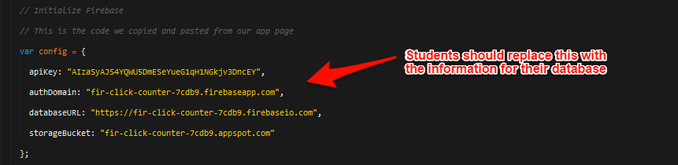

* Have them click the button a few times and notice the changes being made to the database. Confirm that students have a working connection at this point.

### 8. Everyone Do: Reflect on Firebase (5 min)

* Have students talk to those around them about the code they are now seeing.

* Encourage them to pay deep attention to the process of setting up a new Firebase and `.set` especially.

### 9. Instructor Do: Ex 1 - Click Button Counter - Complete (7 min)

* Open the file `instructor-do-clickbutton-fullcomments.html` in `10-clickbutton-complete`. Run the application in the browser.

* Point out how as you click the numbers change. Then point out that this isn't a big deal... because we could just be using a counter.

* So instead, do the following. Close your browser and re-open it. Point out that the number remained. That is a much bigger deal since we did not use localStorage.

* Next, open multiple tabs all pointing to the same file. Show them side by side. Then start clicking the button. Point out that the number is changing on both screens.

* Finally, open up [10-clickbutton-complete/Solved/instructor-do-clickbutton-fullcomments.html](../../../../01-Class-Content/07-firebase/01-Activities/09-clickbutton/instructor-do-clickbutton-fireconsole.html) in your web browser and demonstrate it for the class. 

* Then have the class open up the same file and have them click the button as well. Point out how the numbers change in every student's browser INSTANTLY &mdash; no refresh required! Let them simmer in amazement for a moment. This is a big deal since, even if we were to use localStorage, it would not be possible for the same click data to be altered and shared across multiple browsers, or multiple computers if we were to deploy this.

* Then walk them through the code. Point out the key aspects of this file, namely:
  * `database = firebase.database()` which references the database
  * `.set({})` which saves the data
  * `.ref()` which specifies where the data will be saved
  * `.on("value", function(){})` which effectively creates an "on-change" event so that the moment the page first loads or the moment the database changes, the impact is reflected immediately.

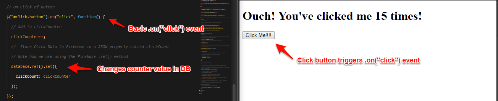
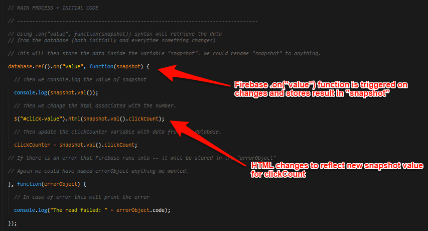

### 10. Everyone Do: Why is this so cool? (1 min)

* Briefly ask students to offer a few situations where instant transmission of data like this might be useful. Good answers include:

  * Chat services

  * Streaming content

  * Stock Market Tracking

### 11. Students Do: Re-comment Click Button Code (6 min)

* Slack out the file `instructor-do-clickbutton-nocomments.html` in `10-clickbutton-complete` (be sure to send the one WITHOUT comments). Then ask students to comment each of the lines of the code with what they think is happening on that line.

* Tell students that, if they finish this task early, they should visit [Realtime Database Getting Started Guide](https://firebase.google.com/docs/database/web/start).

### 12. Everyone Do: Discussion / Questions (5 min)

* Discuss the key comments of the previous assignment and open the floor to questions.

* Once the activity is complete, slack out the file `instructor-do-clickbutton-fullcomments.html` in `10-clickbutton-complete`. Tell them to look over this throughout class and when they get home.

### 13. Students Do: ClickDown Counter (15 min)

* Open the solved file `student-do-downbutton.html` in `11-countdownbutton/SOLVED` in your browser. Show how the final application should work (click down until 0).

* Let students know that for this activity they will be building this application and that they have two choices in difficulty. They can either use `logic.js` (easier) or `logicOption2.js` (harder) to start with. The difference between the two is the amount of starting code.

* Then slack out the following files and instructions.

* **Files**:

  * `student-do-downbutton.html`
  * `logic.js`
  * `logicOption2.js`.

* **Instructions**:

  * Using either `logic.js` (unsolved) (easier) or `logicOption2.js` (harder), create the click down activity using a Firebase database to store the click data on the backend.

  * Your application should be able to run on multiple browser windows simultaneously and register click events on each screen correctly.

### 14. Instructor Do: Review Click-Down Activity (5 min)

* Spend a few moments reviewing the activity, walking through the high points and any issues people faced. Again emphasize that there are effectively 2 pieces in play when transmitting and receiving data from a Firebase server: `on.("value")` for retrieval and `.set` for setting data.

* Let students know that this activity is extremely important for the homework as it serves as the basis that the homework builds on.

* Slack out the solution and the [video review](https://www.youtube.com/watch?v=0PHeP5bLqYE) for the activity.

### 15. Instructor Do: Multiple Properties (5 min)

* Create a new Firebase app and then open `instructor-do-more-properties.html` in `12-moreproperties`. Switch the link in the code included to the url for the firebase database you just created.

* Walk students through the code, making certain to point out that in this example we use `.set({})` to change multiple properties all associated with the same database.

* Show them how the changes are reflected in both the Firebase website and in the HTMl of this working application.

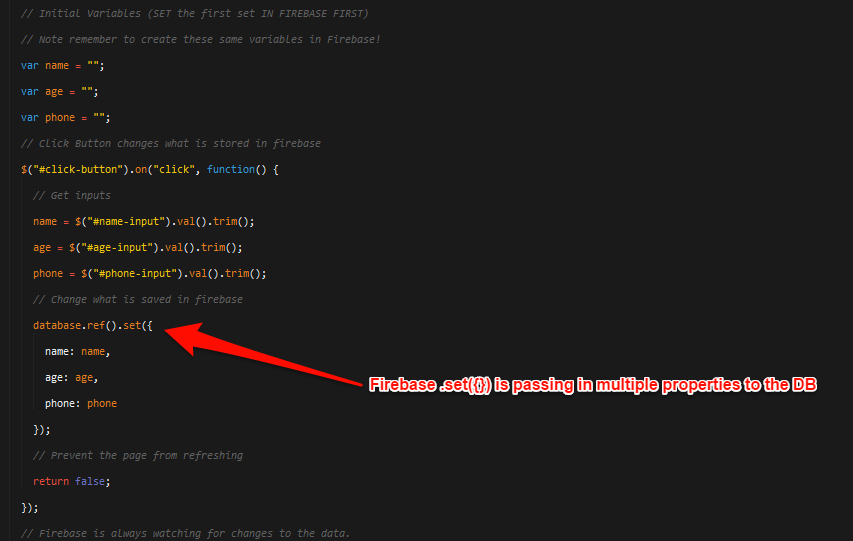

* Slack out this code when finished.

### 16. Student Do: Most Recent User Firebase Example (15 min)

* Demonstrate the `recentuser-solved.html` in `13-mostrecentuser` file in the browser. Show students that the most recent user is changing in real-time to replace the old content when new data is submitted.

* Then slack out the unsolved `recentuser.html` in `13-mostrecentuser` to students to attempt to create a webpage that does the same. The finished product should save the newest user to a Firebase database and change the HTML.

### 17. Instructor Do: Discuss / Explain Most Recent User (8 min)

* Review the `recentuser-solved.html` in `13-mostrecentuser`. Again focus on the key aspects: the `on.("value")` to track changes, the `.set({})` to add data, etc...

* Slack out the solution and [video review](https://www.youtube.com/watch?v=ZWH19t4ujRA) for this activity.

- - -

### 18. BREAK (15 min)

- - -

### 19. Students Do: CoderBay Example (35 min)

* Demonstrate [14-codersbay/Solved/index.html](../../../../01-Class-Content/07-firebase/01-Activities/14-codersbay/Solved/index.html). Walk students through the general gist of the application -- essentially it's a simplified version of eBay in which you can bid for a product. If you bid higher than someone else it alerts the screen to say: "You won!" and changes the highest bidder. If you weren't higher it tells you to bid higher.

* Slack out the url when done explaining so students can play around with it.

* Then slack out the following files and instructions.

* **Files**:

  * `codersbay.html` in `14-codersbay`
  * `logic.js` in `14-codersbay`
  * `logicOption2.js` in `14-codersbay`

* **Instructions**:

  * Using either `logic.js` (easier) or `logicOption2.js` (harder) as a starting point, create the CodersBay app using a Firebase database to store data on the backend.

  * Your application should be able to run on multiple browser windows simultaneously and register click events on each screen correctly.

### 20. Instructor Do: Review CoderBay Example (7 min)

* Slack out the solution to the assignment above.

* Then review the `CoderBay` activity, focusing once more on the key aspects of today's lesson: the `on.("value")` to track changes, the `.set({})` to add data, etc.

* Give people encouragement at the end of this. Let them know it was a very challenging activity and that this is all new material for them which may take a few hours of hard work to sink in fully.

* Encourage them to go home and study the code more deeply when they have time since understanding how this program worked will help them better tackle the homework.

### 21. Instructor Do: Intro to Presence (5 min)

* Open the file `countdown-presence.html` in `15-intropresence` in your browser. Create multiple instances of the page and point out how its keeping track of all the viewers visiting the page.

* Open up the code and walk students through it "lightly" (we'll be going over how Firebase handles arrays in more depth next class). For today, just point out that you've used `.ref()` to create references to different locations/folders in the database - and that you are using a specific Firebase url: `.info/connected` to keep track of connected and disconnected users.

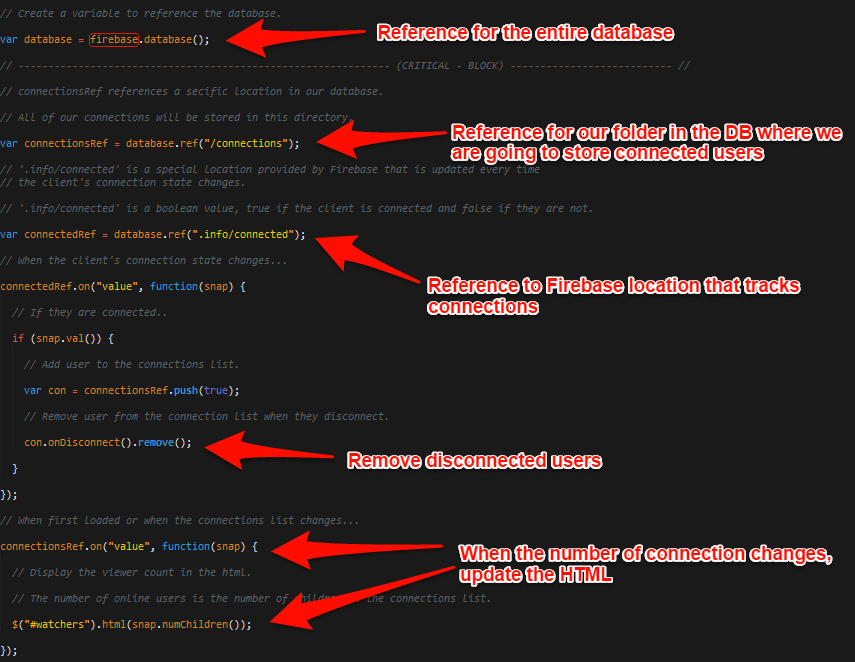

* Illustrate how we used `database.ref('/clicks')` and `database.ref('/connections')` to save data to different folders in our database.

* Try to walk through the code as much as you can but don't let them get too bogged down. This is fairly standard cut-and-paste code and is not critical for their homework.

### 22. Student Do: CoderBay with Presence Example (10 min)

* Slack out the following files and instructions:

* **Files**:

  * `codersbay-view.html` in `16-codersbay-viewtracker` (unsolved)
  * `logic.js` in `16-codersbay-viewtracker`

* **Instructions**:

  * Using `logic.js` as a starting point, incorporate view tracking using Firebase on the backend.

  * HINT: `.set()` overwrites everything in the specified directory, so we will need to use `.ref()` to store bidder data and connections in different folders.

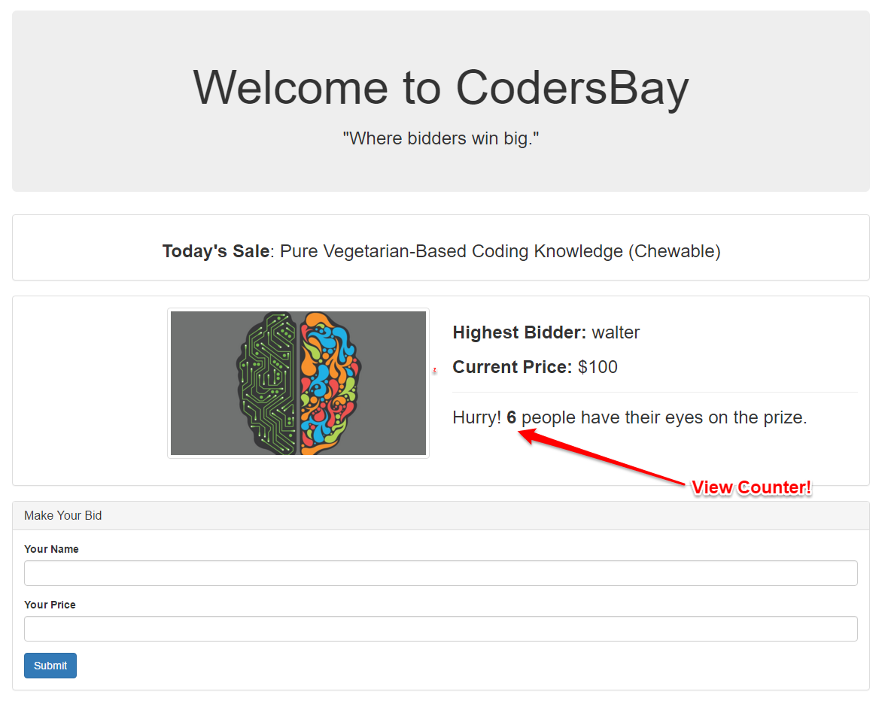

### 23. Student Do: Review CoderBay Presence Example (5 min)

* Review the last activity. If it seems as if there are a lot of students struggling, once again point out that it's okay if its fuzzy. The point of class today is just to show you the capability here.

### 24. Recap + Preview Next Topics (5 min)

* Recap today's class and then mention that next class will be covering arrays, and will give them more in-class time to practice with Firebase.

### 25. Everyone Do: Deploy Firebase (TIME PERMITTING)

* Click the 'Hosting' link on the left navbar on your Firebase page. Click 'GET STARTED' and walk students through deploying their apps to Firebase.

* NOTE: Windows Users will likely need to use Powershell to run a few of these commands (particularly `Firebase login`, `Firebase init`, and `Firebase deploy`) as git bash will not suffice.

### Lesson Plan Feedback

How did today's class go?

[Went Well](http://www.surveygizmo.com/s3/4325914/FS-Curriculum-Feedback?format=pt&sentiment=positive&lesson=07.02)

[Went Poorly](http://www.surveygizmo.com/s3/4325914/FS-Curriculum-Feedback?format=pt&sentiment=negative&lesson=07.02)
