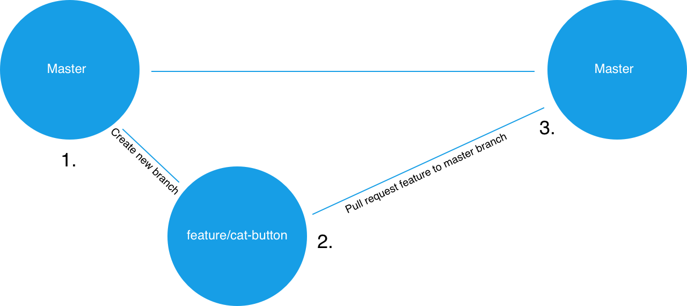

## 8.1 Lesson Plan - Github Collaboration & Project Week (6:30 PM) <!--links--> &nbsp; [⬅️](../../07-Week/03-Day/03-Day-LessonPlan.md) &nbsp; [➡️](../02-Day/02-Day-LessonPlan.md)

### Overview

* Todays class will be focused on introducing group project workflows with Git and GitHub. We will cover adding project members, protecting the master branch, and submitting and reviewing pull requests. This lesson aims to relieve some of the stress students may encounter their first time working collaboratively.

* Students will begin work on their first project

##### Instructor Priorities

* Students will be given requirements for Project 1.

* Students will brainstorm project ideas, research APIs, and begin initial planning of their projects.

Students will submit a project proposal (ideas, outlines, APIs) by end of class for feedback.

* Students will be able to create a repository on GitHub and add collaborators.

* Students will be able to protect their `master` branch.

* Students will have an understanding of feature branches.

* Students will be able to submit pull requests and perform code review.

- - -

##### Instructor Notes

* Todays class should feel less stressful compared to previous days. Congratulate students on making it this far.

* Students may have an urge to jump right into working on projects, but be sure to give them plenty of context around today's activities and stress that the content we'll cover today will help them have a better group project experience.

* Leverage the TAs to help any groups lagging behind during the lesson. We want to give students as much time to brainstorm project ideas as possible.

* If time permits and you would like to show students a free mockup tool before they begin their brainstorming session,[pencil project](http://pencil.evolus.vn/Default.html) is a free open-source desktop GUI prototyping tool. 

* Instructors / TAs, take a few moments before class to review the presentations posted on this link: <https://www.youtube.com/playlist?list=PLe80S_8KApqOTw-2-b-sgzTwwWImepoii>. Do not share these with students as they are Rutgers Specific -- however, use the insight you gain in watching these videos to understand what's possible. 

* The schedule for Project #1 is as follows:

  * Day 1 (Today): 

    * Students are introduced to Project Week, its goals, and requirements. 
    * Students are introduced to git workflows
    * Students work with Instructors / TAs to identify feasible projects.
    * Students submit a Project Proposal

  * Day 2:

    * Students learn how to use an agile workflow
    * Students are class time to work on Projects
    * Instructors + TAs work closely with groups to offer "code assistance"
	
  * Day 3:

    * Students give micro presentations on their MVPs
    * Students plan their path forward
    * Students work on projects

  * Day 4 (Next Week)

    * Students are given rest of class to work on Projects

  * Day 5:

    * Students are given rest of class to work on Projects
    * Students begin planning their final presentations
	
  * Day 6:
    * Students present their final project! 

- - -

##### Class Objectives

* Project groups will create a project repo and add members as collaborators.

* Students will understand the significance of pull requests and code review.

* Students will have an understanding of feature branches in Git.

* Students will submit a preliminary project idea by the end of class.

- - -

### 1. Instructor Do: Welcome Students (3 min)

* Welcome students and explain that we will be going over collaborative workflows with Git before diving into working on projects.

* Explain that in addition to just using Git and Github to push up our _own_ code, these powerful tools allow allows multiple developers to work on the same codebase independently of each other.

* Students should sit with their groups during today's activities and work to follow along with the examples.

### 2. Instructor Do: Present the Project Week Slideshow (10 mins)

* Open up the `API_Project_Week_1.pptx` file and present each of the slides. Use the `Teams` slide as a cue for breaking students up into teams.

* Slack out the `API_Project_Week_1.pptx` file and the `API_Resources.docx` file.

* Remind students that they will need to complete a half page proposal to instructors by end of day. Let them know that they can just slack you the file. (This doesn't need to be kept for official purposes. It is merely so you have a way to review their final plans for feasibility sake).

### 3. Groups Do: Create a Repository (10 mins)

* In this activity, each project group will create a project repo and invite all group member as collaborators.

* Refer to `08-project-1/01-Stu_Create-Repository`, which contains the following instructions:

* **Instructions**: 

```
* Once group member should create a new Github repository. Don't worry about the project name now, this can be changed later.

* From the repo's main page, click the "Settings" tab.

* Once in the repo's settings, select the "Collaborators" menu item on the left.

* From the "Collaborators" page invite your group members to be project collaborators by entering their Github usernames one at a time.

* Each invited group member should receive an email they must open to accept the invitation.

* **Hints**:

* Ask an instructor or TA if you get stuck!
```

### 4. Instructor Do: Pull Requests and Code Review (5 mins)

* Explain that when working with others on the same repo, it's important to make sure that all of the new code gets reviewed by at least one other team member before getting merged into the master branch.

* Assure the class that we'll go into further detail about how this is done, but ask the class: "Why would we want to get code reviewed before merging it into master?"

  * Reviewing new code decreases the chances that a breaking change will accidentally be introduced into the master branch.

  * Code review helps group members who didn't write the code understand how it works.

* Explain that the next step of setting up our project repos for group collaboration is to protect the master branch.

  * Protecting the master branch means we will configure the repo to prohibit any team members from pushing code up into master directly or merging it in without another team member's review.

### 5. Groups Do: Protect Master Branch (5 mins)

* In this activity groups will protect their master branches.

* Refer to `08-project-1/02-Stu_Protect-Master`, which contains the following instructions:

* **Instructions**: 

```
* Only one member per project group needs to complete this activity. 

* Navigate back to the repo's "Settings" page and then select "Branches" from the left sidebar.

* Under "Branch Protection Rules" select "master" from the dropdown.

* You should be presented with some options, check off the following:

  * "Protect this branch"

  * "Require pull request reviews before merging"

  * "Include administrators"

* If completed successfully, no one should be able to push directly to the master branch. Instead, all changes must be made in the form of pull requests that are to be reviewed by another group member.

* **Hints**:

* Ask an instructor or TA for assistance if you get stuck!
```

### 6. Instructor Do: Branching (10 mins)

* For now we just want to give students a high level conceptual understanding of branching.

* Explain that every Git repo starts off with a master branch. This is there to hold the production version of the repo's code. But when we want to work on the code, we start by creating a new feature branch off of master.

  * If we create a new branch from master, it essentially creates a self-contained copy of all of the master branch's code for us to work in.

* When we're satisfied with our work in the new feature branch, we submit a pull request from the feature branch to the master branch.

  * A pull request is a request to merge the diffs or changes from the source branch (the feature branch) to the target branch (master).

  * With the way our repos are set up now, another group member must look at and approve the pull request before its changes can be merged into master.

* Once a feature branch has been merged into master, we delete it and then check back out to the master branch. From there, we'd check back out to a new feature branch and repeat the process for each feature we add.

* Slack out the following image for students to have as a visual aid:

  

* Take a moment to answer any questions, but avoid going too in depth. Students will utilize branches in the next activity.

### 7. Everyone Do: Git Branching/Pushing (15 mins)

* In this activity students will create branches, submit pull requests, and perform code reviews before merging. 

* Instructional staff should be walking around the class making themselves available for assistance and making sure students understand the instructions.

* Refer to `08-project-1/03-Stu_Branching-Pushing`, which contains the following instructions:

* **Instructions**:

* **Part I**: Branching and Submitting a Pull Request

* In this section we will create a branch, add a feature, and submit a pull request. **Only one group member should complete this section, everyone else should observe.**

* Clone the project repo onto your computer and cd into it.

* Run the following command in your terminal to create and checkout to a new branch:

  `git checkout -b create-html-skeleton`

* You should now be on a new branch named "create-html-skeleton". In order to verify this worked, run the following command in your terminal:

  `git branch`

* You should see two branches listed: `master` and `create-html-skeleton`. The `create-html-skeleton` branch should have an asterisk to the left of it. This indicates that this is the branch you're currently on.

* At the root of the repo, create a new file named `index.html`. Inside this file, add code for a basic HTML skeleton and save.

* In your terminal, add and commit the changes. Then push up your code by running following in your terminal:

  `git push origin create-html-skeleton`

* This should push up your code to to GitHub on a branch with the same name (`create-html-skeleton`).

* Go to the main repo page at github.com and you should see an button that says "Compare & pull request" -- click this.

* On the next screen, add a description of the work that was done in the textarea and click the "Pull Request" button.

* If completed successfully, you should see the pull request listed under the repo's "Pull request" tab.

* **Part II**: Reviewing a Pull Request

* In this section we will review the pull request from Part I and merge it into master. **A different project member should complete this section while others observe**.

* Clone the repo to your computer if you haven't already done so and cd into it.

* First you will want to test the changes introduced by the `add-html-skeleton` branch locally.In order to examine the new branch on your local machine, run the following commands in your terminal:

  `git fetch`

  `git checkout -b add-html-skeleton origin/add-html-skeleton`

* This code should bring the copy of the `add-html-skeleton` branch that's on GitHub onto your computer. 

  * Make sure this worked by verifying that there's an `index.html` file in your local repo.

  * Normally you'd run the code here to make sure everything works properly.

* Check back out to your local `master` branch by running the following in your terminal:

  `git checkout master`

* Now go to your GitHub repo's main page and go to the "Pull request" section. Select the `add-html-skeleton` pull request from the list.

* At the next page select the option to see the "Files changed".

* You should be presented with all of the files that were changed in this PR along with line numbers for any code added/removed.

* If there are any changes you would like made, you can click the line number to leave a comment the PR author will see and should address before approval. Otherwise click "Review changes" and approve the PR. You should be taken to a screen with an option to "Merge pull request" -- click this button.

* Once complete you can delete the feature branch from your machine by running the following in your terminal:

  `git branch -D add-html-skeleton`

* **Hints**:

* Ask an instructor or TA if you get stuck or have any questions!

### 8. Students Brainstorm (30 mins)

* Students begin work with groups to identify ideas, research APIs, and create project designs. 

* At the our discretion, Instructor/TA should begin hosting "workshops" to help steer groups in the right direction.

- - -

### 9. Everyone Do: Break (15 mins)

- - -

### 10. Students Do: Brainstorm (62 mins)

* Students continue working with groups to identify ideas, research APIs, and create project designs. 

* Instructor / TAs should continue their workshop series.

### 11. Instructors Do: Answer Remaining Questions (15 mins)

* Review any overarching questions and offer closing thoughts. 

### Lesson Plan Feedback

How did today's class go?

[Went Well](http://www.surveygizmo.com/s3/4325914/FS-Curriculum-Feedback?format=pt&sentiment=positive&lesson=08.01)

[Went Poorly](http://www.surveygizmo.com/s3/4325914/FS-Curriculum-Feedback?format=pt&sentiment=negative&lesson=08.01)
