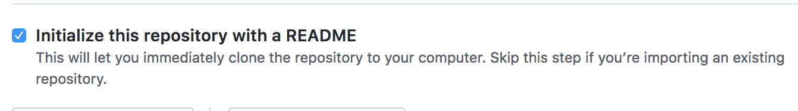
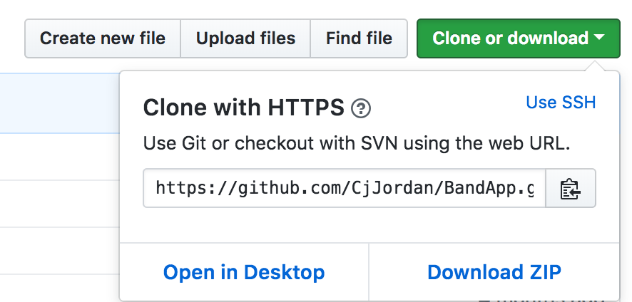
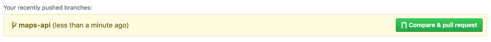
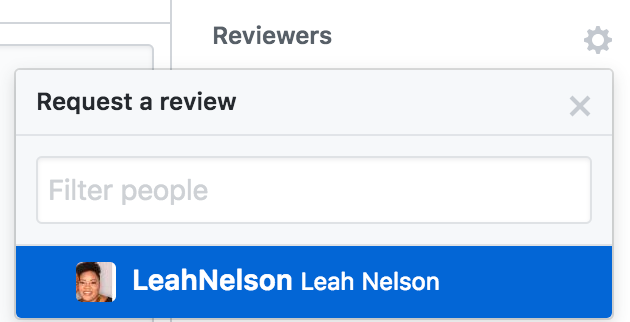
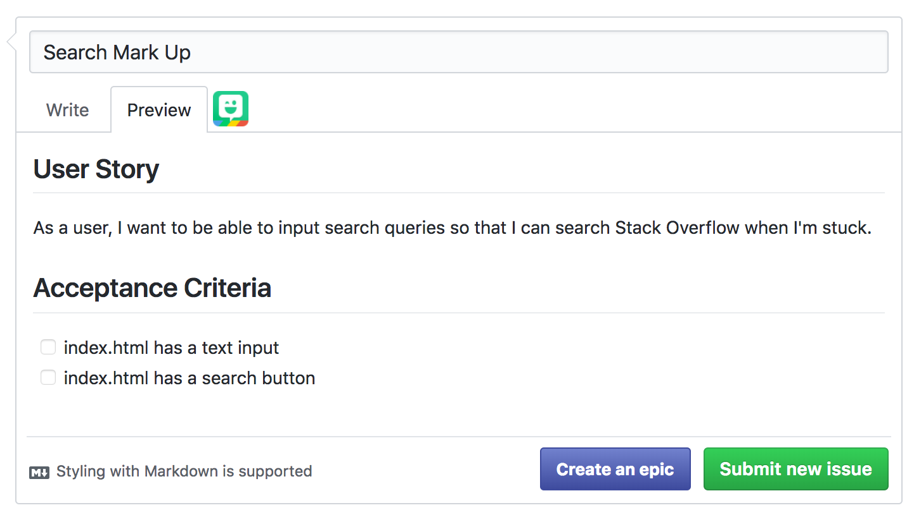
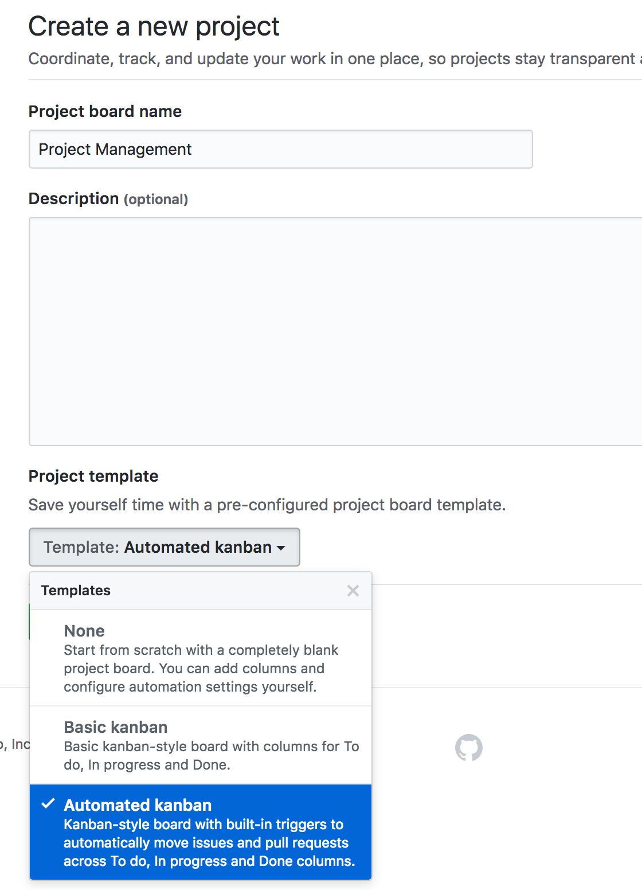
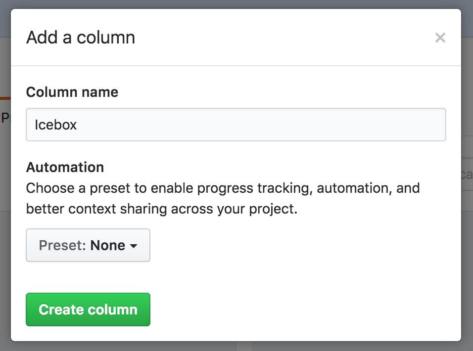
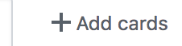
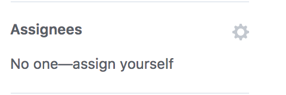

# 8.2 Project 1 - Project Management (6:30 PM)

#### Instructor Notes

* Try to keep the GitHub recap short since it was covered in detail last class. Project Management should be a greater focus.

#### Objectives

By the end of class:

* Students will gain additional practice with branching, making PRs, code review, and merging. 
* Students will be able to articulate the value of an MVP.
* Students will have an MVP designed for their project.
* Students will have issues opened for each task involved in developing their MVP.
* Students will be able to hold effective stand-ups.

---

### 1. Instructor Do: Welcome (2 min)

* Welcome students to class and explain that we will be reviewing the GitHub workflow and learning about some project management concepts before we jump back in to projects.

### 2. Instructor Do: Recap git/GitHub (5 min)

Briefly explain each of the following steps as you demonstrate them:

* Create a new repository in GitHub. Be sure to click "initialize this repository with a README". 



* Add a TA as a collaborator, as you did last class. They will *not* need to clone the repo.

* Clone the repo to your local machine, by clicking the "Clone or Download" button and copying the url to your clipboard.



```
git clone https://github.com/CjJordan/BandApp.git
```

* Create a new branch and remind students of best practices for adding new features:

  * "For each new feature that is built, a new branch should be created and checked out using a descriptive branch name."

  * "Suppose our boss wanted to add a map feature to our site, and our job is to build the interface with the Google Maps API."
```
git checkout -b maps-api
```
* Open the README in Visual Studio Code and make some changes. Save the changes then add and commit the changes.

```
git add -A
git commit -m "updates README"
```

* Push the changes to GitHub. Remind students to avoid pushing directly to master:

  * "We are pushing these changes to a branch on GitHub *not* to master. Ideally, your master branch should be protected to prevent anyone from pushing directly to it."

```
git push origin maps-api
```

* Go back to GitHub and you should see a prompt to create a pull request (you may need to refresh).



* Assign the TA to review your PR by clicking "Reviewers" on the right side of the screen.



* Have the TA approve and merge the pull request. 

* On your local machine, checkout master and demonstrate that it does not reflect the changes. Pull the changes to your local machine. Explain the reason to students:

  * "We merged the changes into the master branch on GitHub, but the local master branch is not automatically synced with GitHub"

```
git checkout master
git pull origin master
```

* Emphasize the following:

  * Checkout master and use `git pull origin master` to ensure master is up to date before creating a new branch. A new branch should be created for every new feature."

### 3. Partner Do: Recap git/GitHub  (10 min)

Slack the following instructions and accompanying PDF:
[04-Stu_Git-Recap](../../../../01-Class-Content/08-project-1/01-Activities/04-Stu_Git-Recap)

* Refer to the accompanying PDF for help if needed.

* One partner should create a new repository on GitHub. Name it anything you like. Don't forget to click "initialize this repository with a README".

* Add the other partner as a collaborator, by going to `Settings > Collaborators` and adding their email address.

* Under the `Branches` tab in settings, choose master from the drop down under `Branch protection rules` 

* Check all of the following: 

  * Protect this branch
  * Require pull request reviews before merging
  * Include administrators

* Clone the repository to your local machine using `git clone` followed by your repository url.

* Create and checkout a new branch using `git checkout -b` followed by a branch name. Remember that branch names should describe the feature that will be created on that branch.

* Open the project in your editor and make some changes. 

* Add and commit the changes using:

```
git add -A 
```
```
git commit -m "descriptive message here"
```

* Push these changes back up to GitHub using `git push origin` followed by your branch name.

* Navigate to your repository in GitHub and there will be a prompt to open a pull request (you may need to refresh).

* Click the green button to "create a pull request"

* Assign a collaborator to review your pull request and merge it.

* On your local machine, checkout the master branch using 'git checkout master' and then update the branch to show the latest changes using 'git pull'

* New branches should be made off of the updated master branch.

### 4. Instructor Do: MVP (5 min)

* Define MVP and explain its value.
  * "MVP stands for Minimum Viable Product. Defining an MVP for an application helps to get the application up and going quickly and avoid scope creep. It's a vital step in creating projects or prototypes rapidly."

* Explain the key points of creating an MVP
  1. Start with a general idea.
  2. Identify the target audience.
  3. Identify the problem that the product will address.
  4. Write down the primary goal of the product.
  5. Identify and prioritize essential user stories.

* Take some time to explain user stories:

  * "User stories are a tool that developers use to describe what the user wants and why. They help to keep focus on adding value to the user during the project build and ensure that each feature built is inline with the primary goal of the product."

  * "User stories are always formatted in the same way: 'As a _____ , I want _____ so that I can _____.'"

  * "I'll model this process so that you can see it in action, and then you'll have the opportunity to apply this practice to your projects"

* Model the practice of creating an MVP:
  
  * "First we need a general idea. I'll build an online code editor with Stack Overflow integration."
  
  * "Then we define the target audience to ensure our product focusses on the users' needs. My target audience is developers who need help from Stack Overflow."

  * "Next we identify the problem that our product addresses. Our problem is that developers need help from Stack Overflow but lose time switching between the editor and browser windows."

  * "Now we write down the primary goal to ensure the team has a common mission. Our goal is to provide a seamless way to search for helpful code snippets while coding."

  * "Then we prioritize the *essential* user stories needed to accomplish this goal." 

* Read the following user stories for your imaginary project.

  1. As a user, I want to be able to type code into an editor so that I can build small features in a sandbox environment.
  2. As a user, I want to be able to input search queries so that I can search Stack Overflow when I'm stuck.
  3. As a user, I want to be able to see relevant Stack Overflow results, so that I can incorporate them into my code. 

* Remind students that there are lots of nice features that users might like but that are not *essential*:
  * syntax highlighting
  * ability to save code
  * sign-up and login
  * saving frequent searches

  * "While these features would be nice to have, the product could still be demoed and pitched to investors without them. With this project, the MVP should be the *minimum* product that could be pitched to an investor to demo what the project could eventually become. Rather than a minimum *viable* product, we're actually building a minimum *demoable* product"
  
### 5. Group Do: MVP (10 min)

* Slack out the following instructions:
[05-Stu_MVP](../../../../01-Class-Content/08-project-1/01-Activities/05-Stu_MVP/README.md)

* With your group, answer each of the following questions:
  1. Who is your target audience?
  2. What is the problem that the product will address?
  3. What is the primary goal of the product?
  4. Identify and prioritize essential user stories (limit this to 3 or fewer)?

* Remember, your MVP should be the absolute *minimum* product that you need to pitch your idea to investors (or your classmates). Think bare essentials.

* As an example, the essential features of an instagram-like application might look like:

  1. As a user, I want to post pictures so that I can share my life.
  2. As a user, I want to be able to search for other users so that I can find their list of Images.
  3. As a user, I want to be able to view other people's Images so that I can keep up with what's happening in their lives. 

* Things like liking photos, sending photos to friends, making instagram stories, etc are cool, but they aren't essential. They should *not* be part of the MVP.


### 6. Instructor Do: Issues (5 min)

* Introduce students to GitHub issues.

  * "GitHub has a feature called 'issues' that helps to organize tasks and assign them to different teammates."

  * "Before we can open issues, we need to break our user stories into tasks. Each task should be clear, concise, and something that each teammate understands how to implement."

* Walk through breaking each user story into tasks using the following guide. Keeping the tasks *very* simple, will encourage students to do the same and help them deliver in their MVP.

1. As a user, I want to be able to type code into an editor so that I can build small features in a sandbox environment.
  
* Create a textbox in the html file large enough to act as an editor

2. As a user, I want to be able to input search queries so that I can search Stack Overflow when I'm stuck.
  
* Add a text box and search button to the html for search terms
* On search button click, save the search term as a variable in the JavaScript file 

3. As a user, I want to be able to see relevant Stack Overflow results, so that I can incorporate them into my code. 
  
* Make a call to the Stack Overflow API with the submitted search term and get a response.
* Display results on the page.

* In the same repo from the earlier exercise which has the TA as a collaborator, demonstrate how to open a GitHub issue for each task. Begin by opening an issue called "Search Feature Mark Up" or something similar.

* Use the following template for your issues:

```
## User Story
As a user, I want to be able to input search queries so that I can search Stack Overflow when I'm stuck.

## Acceptance Criteria
- [ ] index.html has a text input
- [ ] index.html has a search button
```

* Click the on "preview" tab to demonstrate to students how this markdown creates a checklist.



* Explain the following:

  * "The user story is added to help maintain focus and insure that each issue is linked to one of the MVP user stories."

  * "Acceptance criteria outlines what must be accomplished before the issue is closed. Acceptance criteria tells both the developer and the reviewer what is expected for this feature."

* Encourage students to use the above template for every issue.

### 7. Student Do: Issues (10 min)

Slack out the following instructions:
[06_Stu-Issues](../../../../01-Class-Content/08-project-1/01-Activities/06_Stu-Issues/README.md)

* Start by listing the tasks involved in completing each of your user stories.

* Once you have 1-5 tasks written up for each user story, open a GitHub issue for each task by clicking on `Issues` and the green `New Issue` button.

Use the template below, replacing the user stories and acceptance criteria with your own.

```
## User Story
As a user, I want to be able to input search queries so that I can search Stack Overflow when I'm stuck.

## Acceptance Criteria
- [ ] index.html has a text input
- [ ] index.html has a search button
```

* *This is a critical task.* Don't be afraid to ask instructional staff for help during this part. Make sure that each task is clear and everyone on the team understands how to implement each one. 

As an example:

In a dating website application...

*User Story*: As a user I want to see my closest match, so that I can meet someone with whom I share interests.

* *BAD TASK*: 
1. On new member form submit, find and display best match.

* *GOOD TASKS*: 
1. build a form that captures user scores (1-5) to ten questions. 
2. On submit, save the ten numerical answers to as an array.
3. Compare the user array to each existing user array and find the closest match.
4. Display the closest match to the user.

### 8. Instructor Do: Kanban (5 min)

* Explain the kanban concept

  * "It's important to have an organized project management system when you tackle any project.  A great tool for this is the kanban board."

  * "Kanban boards give us a birds eye view of the tasks we've completed, are working on, and need to do"
  
  * "A kanban board is a simple, visual, drag and drop scheduling system. GitHub has several built-in options for organizing projects. We will be using GitHub Projects."

* Under the "Project" tab in GitHub, click the "New Project" button to create a new board (use the automated kanban template).



* In addition to the existing columns, create a new column called Icebox (You will need to exit the "add card" pop-up to access the "add column" area on the right side).



* Demonstrate adding all issues to To Do (or Icebox if it's non-essential), by clicking "+ Add Cards" and dragging each issue into the correct column.



* Walk the students through board:

  * "There are 4 columns - To Do, In Progress, Done, and Icebox."

  * "Each week should have a set focus - this week that focus is completing the MVP."

  * "Every task that is vital to completing the week's goal should go in the 'To Do' column."

  * "Other tasks should go in 'Icebox' for review later. Icebox is a great place to put future enhancements that you would like to add"

  * "When someone begins work on a task, it should be moved to 'In Progress' and once it is complete,reviewed, and the changes are merged into master, the task should be moved to 'Done'.

* Encourage students to add any new issues to the Icebox column and then to decide as a team if the new issue is absolutely *necessary* to the MVP before moving into the To Do column.

### 9. Student Do: Kanban (10 min)

* Slack out the following instructions and accompanying PDF:
[07-Stu_kanban](../../../../01-Class-Content/08-project-1/01-Activities/07-Stu_kanban)

* Use the `Projects` tab in GitHub to create a new project (use the automated kanban template).

* Add a new column called Icebox (You will need to exit the "add card" pop-up to access the "add column" area on the right side).

* Click "+ Add Cards" and dragging each issue into the correct column, To Do or Icebox.

#### Bonus

* If you have extra time, let each team member add some additional features to the Icebox. This is a great place to hold future enhancement ideas. Remember that each feature may need to be broken down into smaller tasks in the future before you open issues and start building them.  

### 10. Instructor Do: Assigning Issues and Stand-up (5 min)

* Demo self-assigning an issue, by clicking "assign yourself" on the right-hand side. 

* Explain assigning issues:
  
  * "Issues can be assigned to a particular teammate or group of teammates. It helps the team to divide up responsibilities. Issues are generally self-assigned."



* Have the TA self-assign an issue or two as well. 

* Explain that most teams have a daily meeting called a stand-up.

  * "When you work with a team, it's important for the whole team to know what each teammate is working on. At most companies this is accomplished by a daily meeting called stand-up"

* Explain the stand-up format.

  * "Each teammate will take a turn saying what they did yesterday, what they are planning to do today, and anything blocking their progress"

  * "This meeting should be short and focussed. To help keep them short, everyone stands up, if able, for the duration of the meeting."

  * "We hold stand ups daily so teamates can hold eachother accountable, but also so they can help each other if they get stuck."

### 11. Student Do: Assigning Issues and Stand-up (10 min)

* Slack out the following instructions:
[08-Stu_Standup](../../../../01-Class-Content/08-project-1/01-Activities/08-Stu_Standup/README.md)

* Before your first stand-up, each member of the team should go through the To Do column of the Project Board and self-assign at least one issue. 

  * To do this, click on the issue and on the right choose "self-assign".

* Everyone should have a clear idea of what they intend to accomplish today. Now it's time for your first stand-up!

* Stand if you are able - yep, stand-ups take place standing; this helps to ensure that the meetings are short and to the point. 

* Each member of the team should say what they did yesterday, what they plan to do today, and what, if anything, is blocking their progress. 

* Stand-ups should be held *daily* from this point forward - yes even days that you don't have class (use Slack).

---

### 12. Break (15 min)

---

### 13. Student Do: Project Work (90 min)

* The remainder of class is reserved for students to continue work on their projects.
* Review any overarching questions and offer closing thoughts. 

### Lesson Plan Feedback

How did today's class go?

[Went Well](http://www.surveygizmo.com/s3/4325914/FS-Curriculum-Feedback?format=pt&sentiment=positive&lesson=08.02)

[Went Poorly](http://www.surveygizmo.com/s3/4325914/FS-Curriculum-Feedback?format=pt&sentiment=negative&lesson=08.02)
