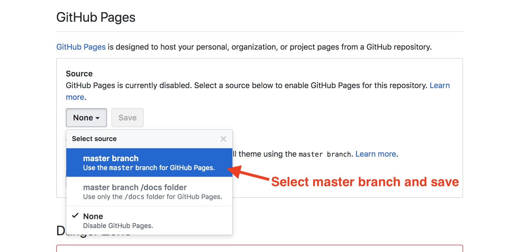

## 8.3 Lesson Plan - Project Week (10:00 AM) <!--links--> &nbsp; [⬅️](../02-Day/02-Day-LessonPlan.md)

### Overview

In this class, students will continue working on their API Projects. They will also spend the latter part of class giving micro-presentations.

##### Instructor Notes

* More project work! Instructors / TAs should rotate between groups helping in whatever ways they can.

* Feel free to cut any sections short. Much of this content may have been touched upon the previous two days. 

* Today's focus should be on giving students time to work on their projects and on students giving quick micro-presentations of their project ideas at the end of class.

- - -

### Class Objectives

* Students will work on projects

* Students will present their MVP with their group

* Students will deploy their projects

* Students will have a clearer understanding of how to complete their projects

- - -

### 1. Instructor Do: Presentations! (5 mins)

* Inform the class that at any given point they should be ready to give a micro-presentation of their apps in progress.

  * Practicing presentations will help students better understand how to describe their applications as well as get them in the habit of never having broken code in their master branches.

* By the end of class, students should present their project concepts, particularly their MVPs ([Minimum Viable Product](https://en.wikipedia.org/wiki/Minimum_viable_product)). Each presentation should cover:

  1. Their application's target audience

  2. The problem the application solves

  3. The absolute minimum functionality they're working towards.

* Inform students that they should finish their MVPs before working on less essential, nice to have features.

* Each presentation should be limited to three minutes. Instructional staff should signal to presenters when time is up.

- - -

### 2. Instructor Do: Deployment (5 min)

* In conjunction to always having at least part of their applications in a presentable state, students should have always have the latest working versions their apps deployed to Github Pages.

* It's common for project groups to spend time building and polishing their applications only to run into issues on presentation day when attempting to deploy for the first time or for the first time in a while. 

* By deploying early and often students ensure they:

  * Have something they can demo at all times.

  * Are in the mindset of only merging code that works and has been reviewed into the master branch.

* Make sure the class understands how to continuously deploy their master branches to Github pages.

  * From the repo's "Settings" page, navigate to "Options" from the left sidebar, scroll down to "Github Pages" and select "master branch" from the "source" dropdown.

  

  * With this setting enabled, any code merged into master is automatically deployed to Github Pages.

* Reiterate importance of protecting master. Explain that every time it's updated, deployed project will update as well (continuous deployment!)

* There are a few common issues students run into with their deployed applications they may not see locally. Slack out the following tips for students:

  * Use `https` instead of `http` for API calls. Locally either may work, but once deployed to Github Pages, `https` is required.

  * Make all file and folder names lower-cased from the start. Both Windows and Mac are case _insensitive_ when it comes to file/folder names. But the web and Linux machines are _case-sensitive_. 
  
    * e.g. `Sample.png` can be referenced as `sample.png` on Windows or Mac machines, but this will not work on GitHub pages.

  * Make sure you have an `index.html` in the root directory. Github Pages looks for this file to serve first when the website is loaded. The file _must_ be named `index.html` and _must_ be located in the root directory.

### 3. Students Do: Continuous Deployment (10 mins)

* In this activity students will work in their groups to verify their project master branches are protected and are set up to continuously deploy to Github Pages.

  * Feel free to cut this activity short if all of this has previously been verified.

* Refer to `08-project-1/09-Stu_Continuous-Deployment`, which contains the following instructions:

* **Instructions**:

```
* **Part I**: Protect Master

* Navigate to your repo's "Settings" page. Select "master" under the "Branch protection rules" dropdown. Then on the next screen, select the following options:

  1. "Protect this branch"

  2. "Require pull request reviews before merging"

  3. "Require review from Code Owners"

  4. "Include administrators"

* **Part II**: Set Up Continuous Deployment

* Go back to your repo's main "Settings" page and scroll down to the "Github Pages" section. Select "master branch" from the dropdown and save.

* You should be provided a URL for the deployed app if you scroll back down to this section. It may take a few minutes for the website to deploy. Ask an instructor or TA for assistance if you can't verify this worked.

* **Hints**:

* Ensure the there's an `index.html` file at the root of the repo. 
```

### 4. Instructor Do: Finish MVP (5 mins)

* Explain to the class that in order to ensure that they have something they can demo on presentation day, it's advised that they stop adding features two days beforehand.

* No longer adding features days before presentations may seem counter-productive, but explain that it's to help ensure that any features that they already have pushed up to master are working properly. 

  * Historically, it's common for project groups to break their applications on or shortly before presentation day trying to squeeze in last minute functionality.

* Inform the class that groups should test every bit of functionality that has been completed so far and polish up all existing functionality.

* Groups should also begin to prepare their project presentations.

  * Groups should have a Powerpoint (or similar) presentation prepared.

  * Every member of each group should be prepared to speak during the presentation.

  * Groups should not expect to demonstrate their actual code, instead they should be ready to tell a story about their applications. E.g. motivations for the project idea, issues they ran into, next steps, etc.

* Take a moment to answer any remaining questions.

### 5. Groups Do: Project Work! (95 mins)

* Students should continue working on projects.

- - -

### 6. Everyone Do: BREAK! (30 mins)

- - -

### 7. Groups Do: Continue Project Work! (45 mins)

* Students should continue working on projects.

### 8. Groups Do: Micro Presentations! (45 mins)

* Spend the last part of class having students give quick micro-presentations of their projects.

* Make sure each group can tell you the absolute minimum they hope to have done by presentation day. Manage expectations around any project ideas which feel overly ambitions.

* Once each group has presented their overall idea, give the rest of the class an opportunity to ask questions. If there are none, feel free to ask any of the following:

  * How do you plan to split up the work?

  * Who's group leader?

  * How are things going so far?

  * How did you come up with the idea? 

### 9. END (0 mins)

# Instructor Do: Private Self-Reflection (0 min)

Take some time on your own after class to think about the following questions. If there's anything that you're not sure how to answer, feel free to reach out to the curriculum team!

1. How did today's class go?
2. How did you teach it?
3. How well do you feel you did teaching it?
4. Why are you teaching it?
5. Why did you teach it that way?
6. What evidence can I collect to show my students are understanding?
7. How will my students know they are getting it?

### Lesson Plan Feedback

How did today's class go?

[Went Well](http://www.surveygizmo.com/s3/4325914/FS-Curriculum-Feedback?format=pt&sentiment=positive&lesson=08.03)

[Went Poorly](http://www.surveygizmo.com/s3/4325914/FS-Curriculum-Feedback?format=pt&sentiment=negative&lesson=08.03)
