## 10.1 Lesson Plan - New to Node <!--links--> &nbsp; [⬅️](../../09-Week/03-Day/03-Day-LessonPlan.md) &nbsp; [➡️](../02-Day/02-Day-LessonPlan.md)

### Overview

In this class, we will be introducing students to the basic concepts behind back-end servers and the use of Node as a scripting/server language. Ensure that students have downloaded and installed the LTS version of Node. The version number does not matter, just that it is the LTS version.

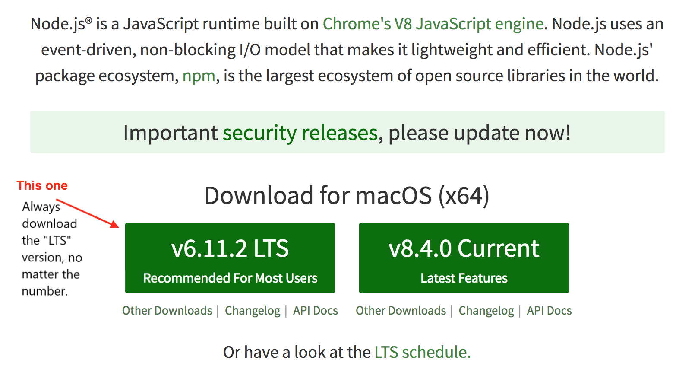

`Summary: Complete activities 1-9 in Unit 10`

##### Instructor Priorities

* Students should be able to articulate definitions of web servers, web clients, requests, and responses.
* Students should be able to articulate a preliminary definition of Node and its role in back-end web development.
* Students should be able to utilize `process.argv` to capture command line arguments using Node.

##### Instructor Notes

* Prior to class, update the slide show to reflect the feedback you have for students from their previous project demos.

* In today's class, focus on providing students with a solid understanding of what servers are and what they do. This is important background as we move into utilizing Node and Express for routing and request/response handling.

* **DO NOT GO TOO IN-DEPTH AND KEEP TO THE ALLOTED TIME!** Today's slides are intended to provide you with a foundation to build upon as you give a very surface-level introduction to Node. They are not meant to be your cue to drop the biblical truth of Node on your poor students. It will definitely fly over their heads if you do. Keeping things as simple as possible is particularly important when broaching the concept of asynchronous vs synchronous threading. TA's be vigilant in keeping your instructors on track here.

* Most of the exercises in today's class are fairly simple. But do not be surprised if students struggle with basic commands like `process.argv`. The concept of "backend" JavaScript will seem like a foreign concept to many of them.

* Have your TAs reference [01-Day-TimeTracker](01-TimeTracker.xlsx) to help keep track of time during class.

### Sample Class Video (Highly Recommended)
* To view an example class lecture visit (Note video may not reflect latest lesson plan): [Class Video](https://codingbootcamp.hosted.panopto.com/Panopto/Pages/Viewer.aspx?id=f1e342a7-50a5-4a66-a52a-f342b9c61a4b)

- - -

### Class Objectives

* To formally introduce the concept of servers, web-clients, requests and responses.
* To demonstrate the basic process for running Node applications.
* To introduce the syntax for capturing command line arguments and modularizing JavaScript in Node.

- - -

### 0. Instructor Do: Welcome Students + Open Slideshow (1 min)

* Open the Slide-Show [Intro_Node](Slide-Shows). Then welcome students to class.

### 1. Instructor Do: Project Week Feedback (Slides) (3 min)

* Using the slides as a guide, offer students EXTREME levels of encouragement with regard to the previous week's project demos.

* If you think it's appropriate, have students share a few of their reflections on project week out loud to the class.

* Then offer students guidance on how they can take their projects to the next level and close out project week. Use the bulleted list on the slide as a guide.

### 2. Instructor Do: The Mystery of Backend (Slides) (10 min)

* When cued by the slide, let students know that these next sets of slides are very important and that it is critical for developers to have a functional understanding of how the modern web works, particularly when it comes to servers.

* Ask your class the same question you asked on week 1: "How would you define full-stack development?" At this point students should be much more savvy than they were on Week 1, so expect solid answers.

* Reintroduce students to the full-stack diagram that you you showed in Week 1. Once more explain that "full-stack" refers to the constant back and forth communication between the visuals displayed to the user on the browser (front-end) and the data/logic that is stored on the server (back-end).

* Once more demonstrate how a website like YouTube works. Have your students point out the aspects of the site that they recognize as having to do with the front-end (UI/UX). Then have them try to articulate the aspects of the site having to do with the back-end (e.g, video recall, video attribute recall, etc).

* Move into the questions asked by the slides. For each question, have students turn to the person next to them and try to answer them to one another. Then have them answer the question back to you.

* Allow them to Google search answers to questions which they may not be able to solve just yet——namely, "What is a server?"

* If they offer vague answers, push them to try and explain themselves in more detail. Try to convey that we often use words like "server" on a daily basis without fully understanding them.

* Once you've tired them out, go through and explain the definition of each.

* In discussing the concept of servers, web-clients, requests and responses, the key takeaways for students should be:

  * **Server**: Physical hardware or software that takes requests from users and gives something back or completes a process. This might mean returning an HTMl page, a picture, an image manipulation, etc.

    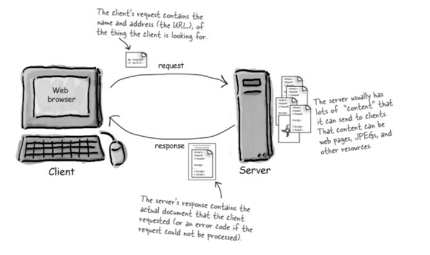

  * **Web Client**: The user or browser that makes requests to servers. This could be as simple as clicking a URL and "requesting" the page to load. Or it might be more complicated like loading some data and "requesting" the server to parse through it.

    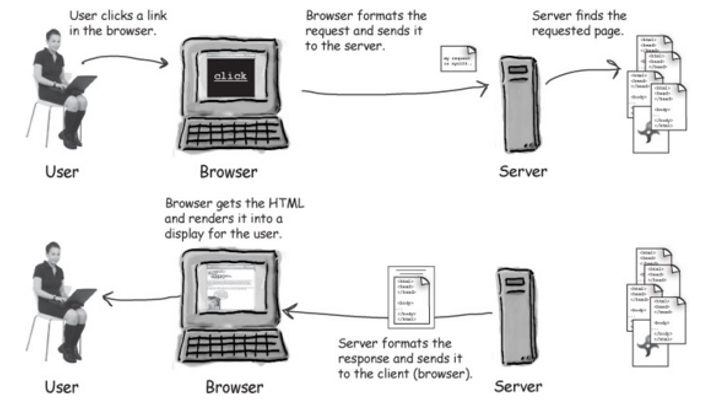

  * **Request**: Asking for something or some process to happen.

  * **Response**: The result of the request. What is returned after a request.


* Make sure students understand this! Encourage them to ask questions.

### 3. Instructor Do: Intro to Node.js (Slides) (10 min)

* Once you are comfortable with their level of understanding, move into the topic of NodeJS.

* Immediately offer them the definition of Node. Have a student read each paragraph of the definition.

  * Mention that if it was before 2009, the class would be learning a new language like PHP.

  * Ryan Dahl invented NodeJs so that JavaScript can be used on the server side.

* Convey the important point that what Node allows us to do is to run JavaScript _outside_ of the browser. It allows us to run JavaScript on a server instead.

* Have students research companies that use Node. The list is pretty endless. Just give them about 10 seconds to do this as it should not take long.

* Go through each of the important reasons why Node is so effective as a server. Emphasize the fact that it uses JavaScript, which means that a front-end JavaScript developer can also do back-end JavaScript without having to learn a new programming language.

* The next few slides on asynchronous vs synchronous threading are tough. Warn students about this.

* Proceed to explain the difference as following (**important**):

  * Let's assume that I (the instructor) am the server and that every single student in the front-row is a web-client asking a question.

  * In synchronous threading -- non-Node approach -- I would have to answer each question I receive in order and completely handle the question before moving on to the new student. I might be able to assign TAs to each help one student, but once I run out of TAs everyone else just has to wait. This would take quite a bit of time.

    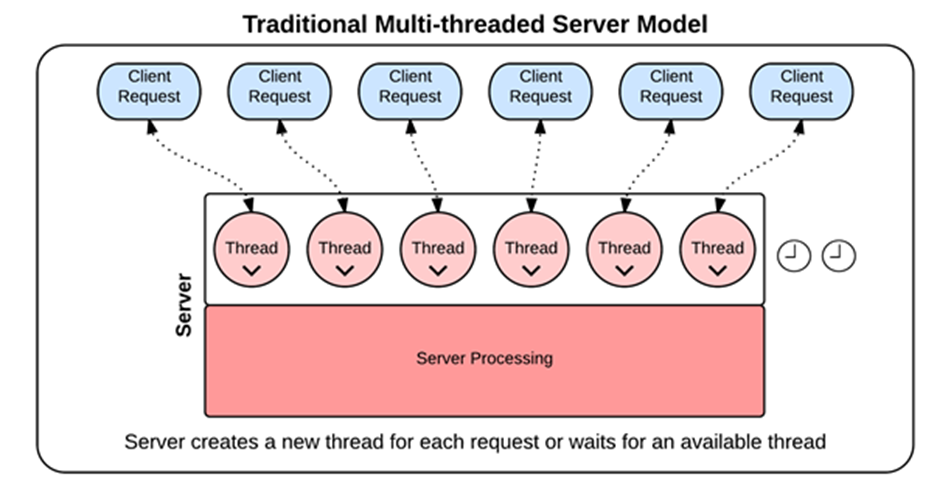

  * In asynchronous threading -- Node approach -- I would check on every single student immediately when they asked their question. Then I would think about each of their questions in the back of my mind, and whenever I came up with the answer to ANY of the questions I would immediately answer that question. I wouldn't wait to solve the first question first, and then hear the second question. I would hear the first and second questions immediately when asked, and then answer whichever of the two (or 20) questions I remembered the answer for first. I'd continue sending answers to the question askers as I come up with answers, until all questions have been answered. No student in this case is waiting for other questions to be answered before they can ask theirs, and they get answers immediately when the answer is available, so the time to answer overall is quicker for everyone.

    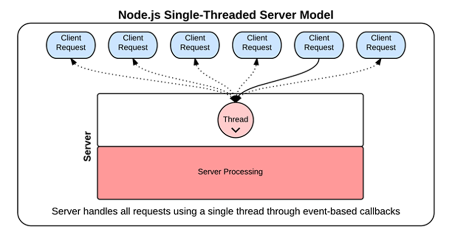

* This is effectively what an asynchronous server does. It takes every request, puts it in the background (via a callback), and comes back to it when its done as to allow for a near infinite number of requests which cannot be bottlenecked.

* Again, let students know that it's okay if they don't fully understand. Also let them know we will re-examine this concept of callbacks at a later time.

### 4. Everyone Do: Quick Node Check (10 min)

* Next have students open up their bash/terminal. To confirm that everyone has Node installed, they should simply type `node` and then hit `enter`.

* Immediately after they should type `1+1` and hit enter. The result should say 2. If it didn't, then they should raise their hand so a TA can assist them in installing Node.

* Next have every student type `ctrl+c` or `cmd+c` to exit Node. (Important as many students will not do this.)

  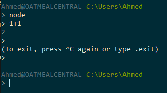

* Point out to students that they will know they have quit Node when the cursor changes to show them the file path once again.

### 5. Instructor Do: Hello.js Demo (5 min)

* Create a new file (or open the file `hello.js` inside the `01-HelloNode` folder). Then run the file via bash using the command `node hello.js`.

* Point out to students that this program printed the word `Hellooooo` in the command window.

  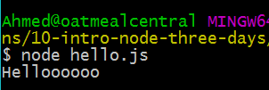

* Point out that this is a big deal because it means we just ran JavaScript OUTSIDE of our browser window. This is powerful stuff since servers aren't "browsers". Woo hoo!!

* Slack out the file to them at this point.

### 6. Students Do: Sriracha.js Activity (10 min)

* Then slack out the following instructions to students.

* **Instructions:**

  * Create a file called `sriracha.js` somewhere on your computer.

  * Inside the file use JavaScript to log the words: "Sriracha. Goes great on.... nothing." (or everything. You choose.)

  * Then run the program using Node in your terminal/bash window.

  * Confirm that it logged the text as you would expect.

* **Instructor:**

* Review this activity when complete.

  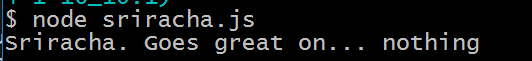

### 7. Instructor Do: Arguments.js Demo (5 min)

* Next create a new file called `arguments.js` (or open the file `arguments.js` inside `03-Argument`).

* Inside of this folder write the following code to take in arguments:

  

* Then run the following in Git Bash or terminal `node arguments.js`.

* Have students explain the output. What is being printed here?

* Explain to them that `process.argv` is just printing back the path to Node and the path to our argument.js file.

* Then proceed to rerun the program but this time run the following commands.

```bash
node arguments.js 'stuff'
node arguments.js 34
node arguments.js 'stuff' 34
node arguments.js 'stuff I like' 34
node arguments.js stuff I like 34
```

* Point out that in each case, `process.argv` is re-printing the "arguments" in the form of an array.

  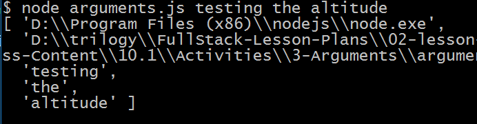

### 8. Instructor Do: Arguments.js Addition Demo (5 min)

* Create a new file called `argumentsadd.js` (or open the pre-made file in `04-ArgumentsAddition`).

* In this file create code that combines two arguments together. Initially do not use anything like `parseInt` or `parseFloat`.

* Run the program with two strings and demonstrate how it concatenates the strings. Point out to students that we used `process.argv[2]` and `process.argv[3]` to capture the "TRUE" arguments.

  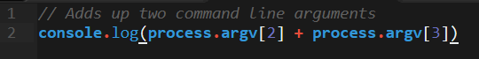

  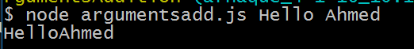

* Repeat the program run, but this time run it so the program takes in two numbers. Point out how the result is non-ideal because it concatenated the numbers. This is because `process.argv` always assumes that you are handing it strings.

  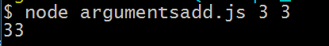

* Modify your previous `argumentadd.js` file such that you utilize `parseFloat`. Students may be familiar with the concept of `floats`. Use this moment to explain the difference between `floats` (decimal) and `integers`

  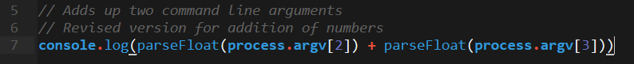

* Rerun the program and use two numbers. Point out that now the program adds the two numbers together properly.

  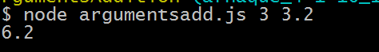

* Slack out the `argumentsadd.js` file when done. Let students know that this `process.argv` code will be important for class today.

### 9. Partners Do: Parameter Check Activity (10 min)

* Slack out the following instructions.

* **Instructions:**

  * Create a command line node application that takes in two parameters and outputs whether they are equal or not.

  * HINT: Start by simply logging the value of each argument to console. Then use your usual JavaScript approach (recall that Node is still just JavaScript).

### 10. Instructor Do: Review Parameter Check Activity (5 min)

* Open the file `parametercheck.js` inside of `05-ParameterCheck`.

* Review the activity with students using both approaches provided. Explain that the first approach may have been the one they first used, but that they could also refactor (simplify) the code to one line. Both would work.

  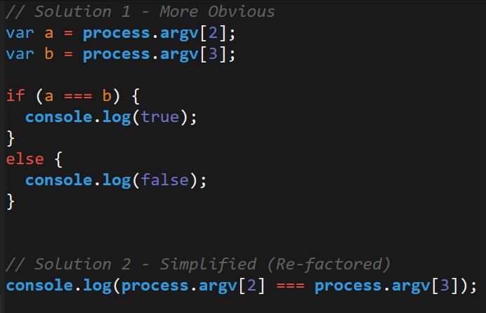

  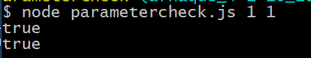

* See if there are any questions or looks of confusion.

### 11. Students Do: Calculator.js Activity (30 min)

* Then proceed to slack out the following instructions to students.

* **Instructions:**

  * Create a command-line node application that takes in parameters like this:

  * `node calculator.js add 1 2` ... and outputs 3
  * `node calculator.js subtract 5 2` ... and outputs 3
  * `node calculator.js multiply 3 2` ... and outputs 6
  * `node calculator.js divide 8 2` ... and outputs 4
  * `node calculator.js remainder 7 2`... and outputs 1

  * Bonus: Enable your calculator application to also handle the below cases:
    `node calculator.js exp 7 2` ... and output 49 (7 squared)
    `node calculator.js algebra 4x+2=10`... and output 2. (Hint: Assume the algebra will always be in this exact form and will always be addition)

* **Instructor** demo the application yourself by running the above commands with the node application `calculator.js` found inside `06-Calculator`

### 12. Instructor Do: Review Calculator.js (10 min)

* Spend a few moments reviewing the `calculator.js` file. In your discussion, point out that the program effectively has two parts:

  * A section in which we grab the command line arguments using `process.argv`

  * A series of `if`, `else if` statements that check which operand has been selected and based on the selection will perform different mathematical functions on the two numbers provided.

    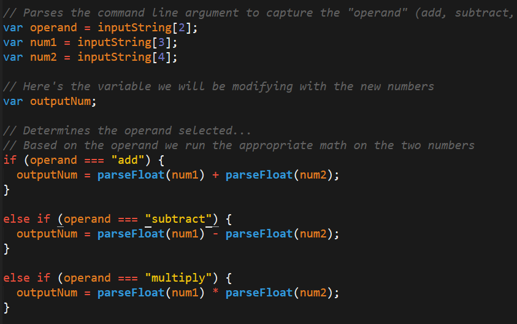

* Slack out the file and [video review](https://www.youtube.com/watch?v=JH28RCouqfw) at the end.

- - -

### 13. BREAK (15 min)

- - -

### 14. Partners Do: Multiples.js (10 min)

* If you are doing well on time, then proceed with this activity; if not, skip it in favor of the discussion on modularization.

* Slack out the following instructions to students:

* **Instructions:**

  * Write a command line node application that takes in a number from the command line and finds the sum of all the multiples of 6 that are smaller than it. (ex: input: 13... output: 6 + 12 = 18)

  * Bonus:

    * Make the program such that it takes in two parameters: The application now taking in the first number from the command and finds all the multiples of the second smaller than it.

    * Give it a set of default values in case the user doesn't provide parameters.

### 15. Instructor Do: Review Multiples.js (5 min)

* Walk students through the solution found in `multiple.js` and `multipleBonus.js` (`07-Multiples`). Be sure to point out the following in discussing the solution:

  * That we take in command line arguments to capture the input number and the multiples number in the bonus.

  * That we create a for loop that starts from the multipleNumber and iterates by that number all the way through to the input number (example: input is 15, multiple is 6 => 6 + 12 = 18)

  * Then we log the value at the end.

    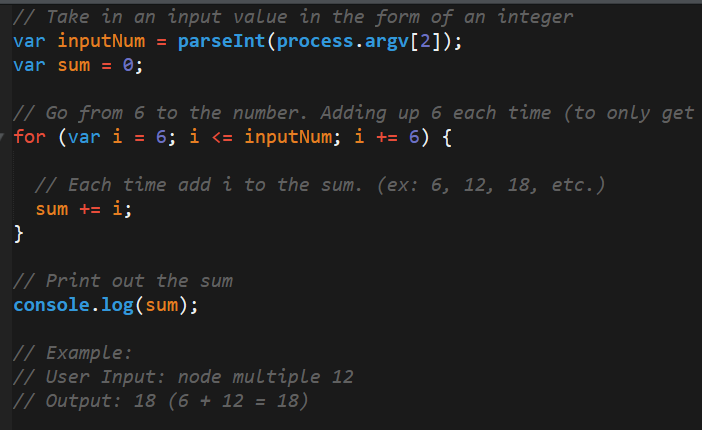

    

* Let students know that this may have been tricky, just because they were unfamiliar with multiples. But the key takeaway is getting more familiar using `process.argv` to capture inputs.

* Slack out the file at the end.

### 16. Instructor Do: Modularization Using Require/Exports (15 min)

* Finally, open up the `ess.js` file inside of `08-Modularization`. Point out to students how we are using the keyword `module.exports`. `module.exports` is a special object that is included in every js file in node by default. It allows us to export data from one file and import it into another using the keyword `require`. Point out how we are adding `essentials` and `niceToHaves` to `module.exports` but not `nonessentials`

* Then open the file `run.js`. If possible fold comments at this point and have students try to glean the key aspects of this file.

* Then run the program using `node run.js`. Point out that we were able to access the `essentials` and `nice-to-have's` but not the `nonessentials`.

* Go back to the `run.js` file and point out how:

  * We're using `require` which effectively takes `module.exports` from the other file and makes it accessible here.

    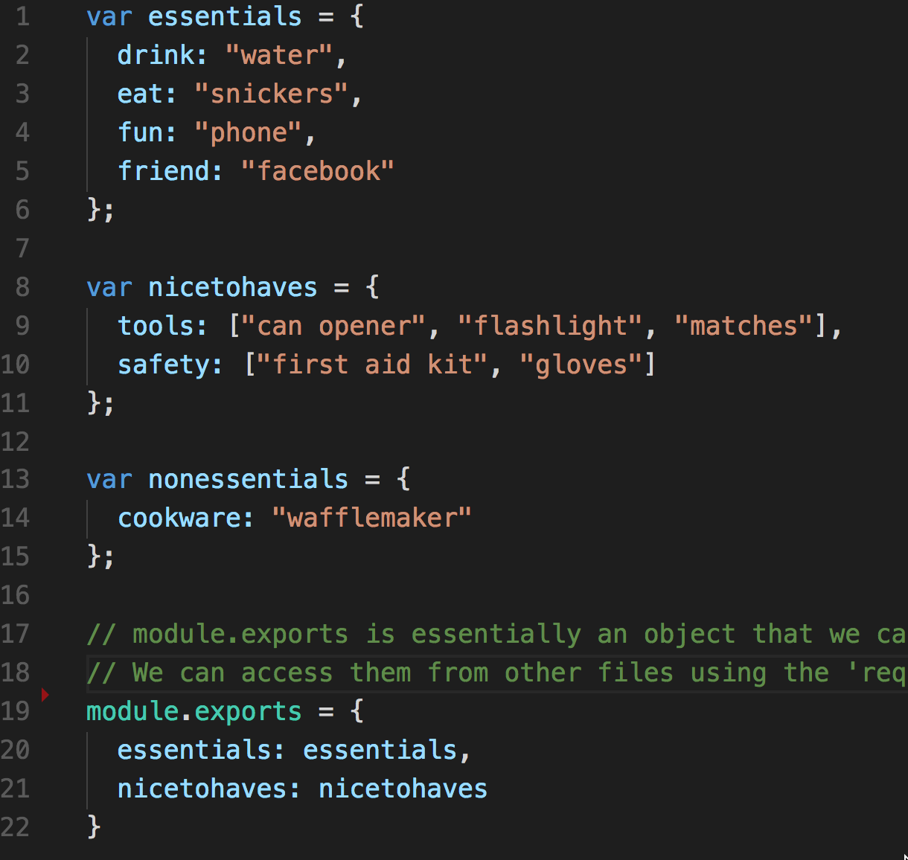

  * We're using references to sub-objects within the exported content.

    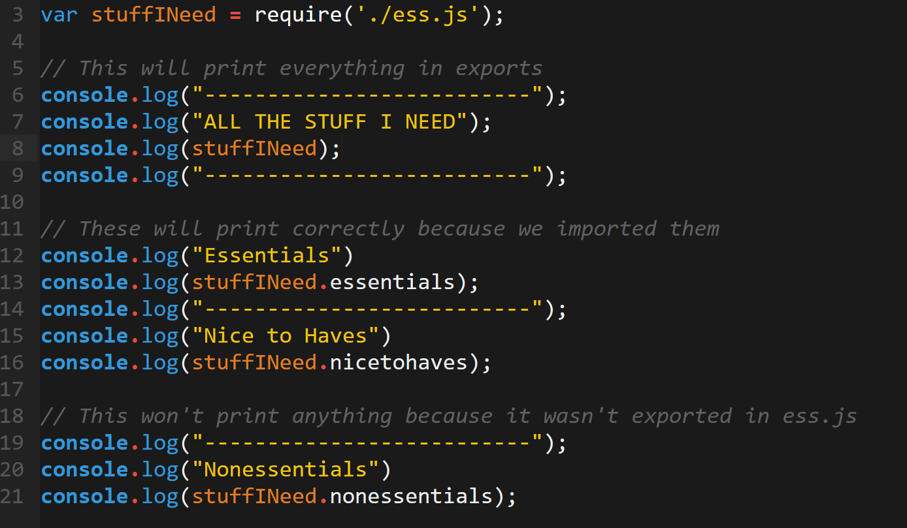

  * We cannot access the properties that were not exported in `ess.js` (e.g. nonessentials).

    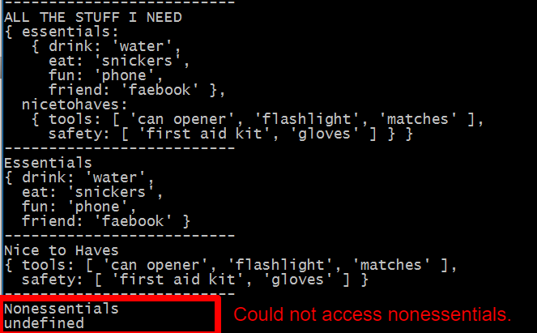

* Explain that this concept of `require` and `module.exports` will be used repeatedly in later chapters, so it is worth understanding at a high level now.

### 17. Partners Do: Bands.js Activity (15 min)

* Run the program inside `09-Bands` by using `node run.js` to demo the goal of the next student activity.

* Then slack out the following instructions.

* **Instructions:**

  * Make a JavaScript file called bands.js that exports an object of music genres and bands like this:

  ```javascript
  {
    punk: 'Green Day',
    rap: 'Run DMC',
    classic: 'Led Zeppelin'
  }
  ```

  * Require this JavaScript file in run.js, loop over the values, and console.log them.

  * Make sure the program runs properly when entered into the terminal like this:

  ```bash
  node run.js
  ```

  * And that the output looks something like the below:

  ```bash
  A punk band is Green Day
  A rap band is Run DMC
  A classic band is Led Zeppelin
  ```

  * Bonus:

    * Make it so that your program takes in a parameter like 'classic' and then outputs the associated band with it. In this case Led Zeppelin.

    * If no parameter is passed then loop over and output all of them like asked above.

### 18. Instructor Do: Review Bands.js (7 min)

* Walk students through the solution. In discussing the solution, point out:

  * How we exported the bands in an object called myBands.

  * We then imported this data using `require` and stored the data inside of a variable called `bands`.

  * We then looped through the `myBands` object using a `for in` loop and reprinted the band names.

* Check if there are any questions, then have a TA slack out the solution files.

### 19. TA/Instructor Do: Homework Demo (7 min)

* Explain to students that this week's homework is about creating a Siri-like app called "Liri". This app will take in text commands and then outputs various information like concert information, song information, or movie information.

* Then Navigate back to the folder `02-Homework/Solutions` in `Unit 10` using terminal or bash.

* Run the command `npm install`

* Then run the commands:

```
node liri concert-this "Childish Gambino"
node liri spotify-this-song "Hit Me Baby One More Time"
node liri movie-this "A Space Odyssey"
```

* Example of `Spotify` command
  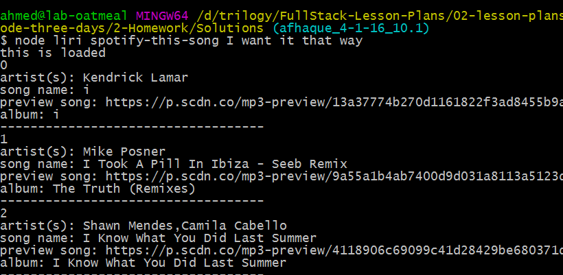


* Point out how, in this example, you are using a backend approach to grab information that students previously used AJAX calls for.

* Let them know that this will make a lot more sense by Saturday.

### Lesson Plan Feedback

How did today's class go?

[Went Well](http://www.surveygizmo.com/s3/4325914/FS-Curriculum-Feedback?format=pt&sentiment=positive&lesson=10.01)

[Went Poorly](http://www.surveygizmo.com/s3/4325914/FS-Curriculum-Feedback?format=pt&sentiment=negative&lesson=10.01)
