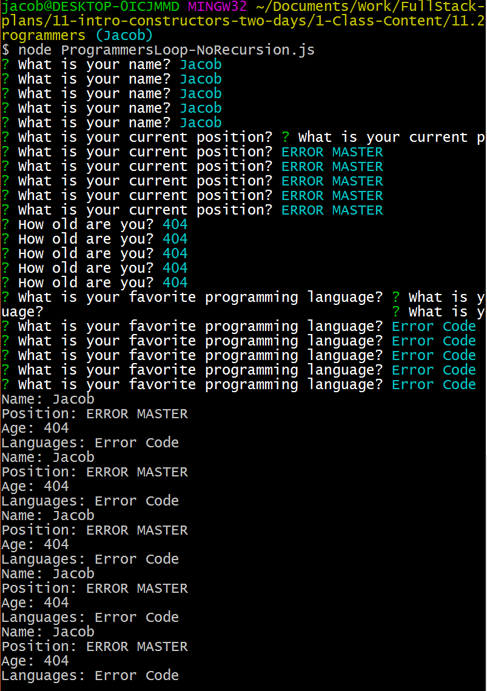
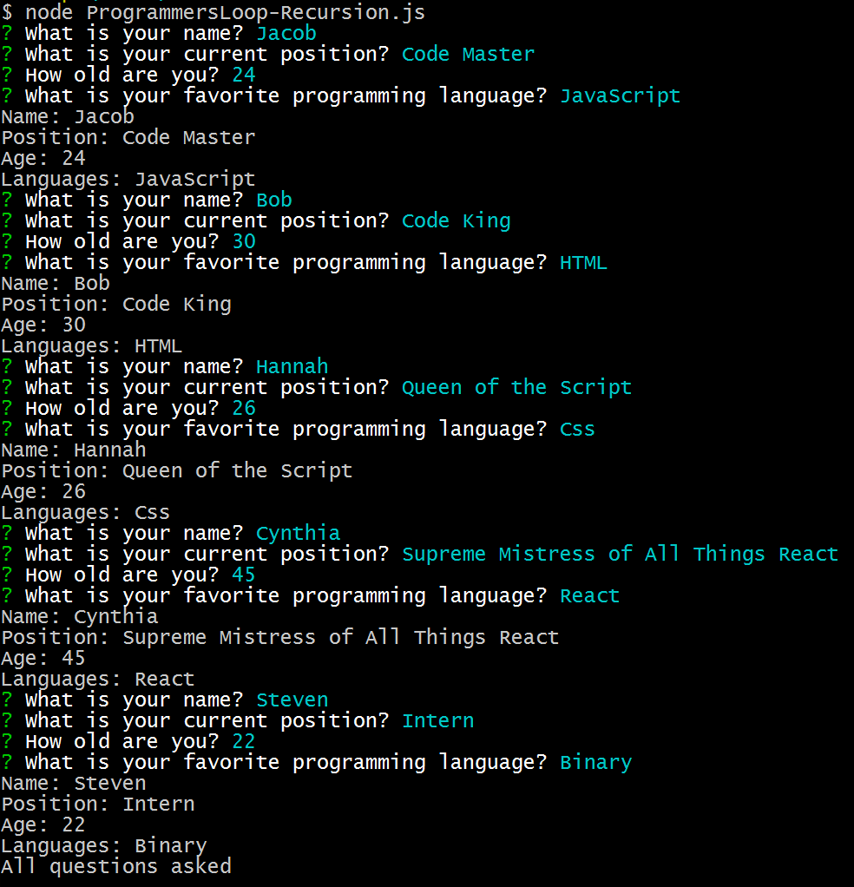

# 11.2 Lesson Plan - Construct it Yourself: Inputs and Constructors <!--links--> &nbsp; [⬅️](../01-Day/01-Day-LessonPlan.md) &nbsp; [➡️](../03-Day/03-Day-LessonPlan.md)

### Overview

Today we will be diving into constructors some more by introducing user input into the mix. We will also be going over how to use connector functions to link two objects together.

`Summary: Complete activities 5-10 in Unit 11`

##### Instructor Priorities

* Build upon students' knowledge of constructors by linking it to user input
* Introduce and help students overcome the complex relationship between loops, user input, and constructors
* Students should be able to use constructor functions to link two different objects together

##### Instructor's Notes

* As was the case with the first lesson of the week, today's class is not terribly complex and only contains one significant stumbling block. After completing all of the activities, however, your students should feel quite comfortable in their ability to use javascript constructors.

* The one stumbling block that your class may encounter today will likely come in the form of utilizing loops, user input, and constructors all together to create multiple objects. Be sure to go over some of the workarounds to these challenges before having your class tackle any of the later activities.

### Sample Class Video (Highly Recommended)
* To view an example class lecture visit (Note video may not reflect latest lesson plan): [Class Video](https://codingbootcamp.hosted.panopto.com/Panopto/Pages/Viewer.aspx?id=74747770-3d0b-4ee9-8007-14e4681b22f3)

- - -

### Class Objectives

* To feel 100% comfortable using javascript constructors
* To create simple applications that take in user input and utilize a constructor so as to create objects
* To understand the basics of recursion and to learn how this process can be used to loop through a series of prompts multiple times

- - -

### 1. Instructor Do: Welcome the Class (5 mins)

* Once everyone is settled in and looks ready to learn, welcome your students to class.

* Inform everyone that today's lessons and activities will be building upon our knowledge of both constructors and user input in order to create more responsive applications.

* Before diving into new material, however, let's start with a little bit of a warm-up exercise to help get ourselves into the construction mindset.

### 2. Students Do: Constructing Programmers (5 mins)

* Slack out the following instructions...

* **Instructions**

  * In this activity, we are going to create a constructor function called "Programmer" which can be used to create objects containing information on various programmers.

  * Your "Programmer" constructor should be able to take in the following information...

    * The programmer's name
    * Their position/job title
    * How old they are
    * Favorite programming language

  * Now create a method for the constructor that would print all of the information contained within an object to the console.

  * Finally, create a "Programmer" object and call the method to print its contents

### 3. Everyone Do: Constructing Programmers Summary (5 mins)

* Once everyone has completed the activity, open up `programmers.js` in `05-Programmers` inside of your editor and discuss it with the class whilst answering any questions which they might have.

* Point out how the process of creating new Programmer in this example could get rather tiresome since we are constantly having to modify our code each and every time. This is where user input comes in to save the day.

### 4. Instructor Do: Input + Constructors = Less Work Overall (5 mins)

* Open up `programmersWithPrompt.js` in `06-ProgrammersWithPrompt` within your editor and start to go over the code with your students.

* Be certain to run `npm install inquirer` within your terminal before executing the code

* Make sure to point out how the creation of our new Programmer object and the calling of its `printInfo()` are located within the `.then` statement.

  * This is done so as to ensure that the constructor can appropriately grab the answers while also making certain that the `printInfo()` method is only run when there is a populated object. Doing otherwise would return an error.

### 5. Everyone Do: Making Multiples With Recursion (15 mins)

* Slack out the above code to your students and let them play around with if for a little bit \[3-5 minutes or so] with the intention of creating multiple objects.

  * The majority of your students will attempt to use a loop of some kind in order to accomplish this task. That will not work. If you wish, you can tell them this beforehand or you could let them stumble across the error for themselves.

* After a short amount of time, call your class' attention back to the front and open up `programmersLoop-noRecursion.js` in `07-ProgrammersLoop` within your editor and go over the code written with your class. Ask them all what they think this code will print to the console.

  * After you have gotten a couple answers, open up terminal and execute the code.

  * Be certain to run `npm install inquirer` beforehand or else the code will not run at all.

* Something similar to the following should print to your terminal... Which seems odd...

  

* It appears that inquirer is asking the same question five times at once and is only accepting a single response. This creates five Programmer objects that are all exactly the same as each other which is not useful at all. What gives!?

  * Well, it turns out that our for loop is the culprit here. It is not waiting for the previous instance of inquirer to complete before moving onto the next one. As such, inquirer is being run multiple times at the same time.

* The way in which we solve this is by utilizing a coding technique called "recursion" to call upon inquirer only after the last instance has been completed. Seems complex, but it is actually quite a simple/helpful tool once you get the hang of it.

* Open up `programmersLoop-recursion.js` in `07-ProgrammersLoop` within your editor and go over the code with your class.

  * Once you have gone over the code, run it within your terminal to show how it works

  

* While this code works, it is still not 100% effective since our objects are still only obtainable within our function and we are not able to access them afterwards. In order to counteract this, we will want to push all of our objects into an array so that we can call upon them individually at a later time.

* Open up `programmersLoop-recursionArray.js` in `07-ProgrammersLoop`, run the code, and then go through the new additions.

  * Run the code in terminal and answer whatever questions your class may have before slacking out this final bit of code and moving onto the next activity.

### 6. Students Do: Team Manager (55 Mins)

* This is a 2 part assignment. Part 2 will begin after the break. 

* Slack out the following instructions for part 1...

* **Instructions**

  * Over the course of this assignment you are going to put together a function which uses constructors and user input to create and manage a team of players.

  * Start out by creating a constructor function called "Player" with the following properties and methods...

    * `name`: Property which contains the player's name
    * `position`: Property which holds the player's position
    * `offense`: Property which is a value between 1 and 10 to show how good this player is on offense
    * `defense`: Property which is a value between 1 and 10 to show how good this player is on defense
    * `goodGame`: Method which increases either the player's offense or defense property based upon a coinflip.
    * `badGame`: Method which decreases either the player's offense or defense property based upon a coinflip.
    * `printStats`: Method which prints all of the player's properties to the screen

  * Now create a program which allows the user to create 3 unique players; 2 starters and a sub. It should take as user input the name, position, offense, and defense of each player.

  * Once all of the players have been created, print their stats.

  * HINT: Remember to use recursion when looping with inquirer! Otherwise your program might not return the prompts as you expect.

- - -

### BREAK TIME (15 mins)

- - -

### 7. Everyone Do: Team Manager Summary: Part 1 (10 Mins)

* Open up `teamManager-basic.js` in `08-TeamManager` within your editor and start to go over the code with your students. This file contains only the first part of the assignment which prints players' stats to the screen, but should help them to understand how to better create and use constructor functions with inquirer.

* Once you have finished, have them return to their code in an attempt to complete the second part of the Team Manager activity

### 8. Students Do: Team Manager Cont. (20 Mins)

* Have your students work on the second part of the activity. If some students seem to be struggling, have them work alongside students who are moving along at a good pace or help them out yourself.

* Slack out the following instructions...

* **Instructions**

  * Once your code is functioning properly, move on to create a function called "playGame" which will be run after all of the players have been created and will do the following:

    * Run 5 times. Each time the function runs:
      * Two random numbers between 1 and 20 are rolled and compared against the starters' offensive and defensive stats
        * If the first number is lower than the sum of the team's offensive stat, add one point to the team's score.
        * If the second number is higher than the sum of the team's defensive stat, remove one point from the team's score.
      * After the score has been changed, prompt the user to allow them to substitute a player from within the starters array with the player from within the subs array.
    * After the game has finished (been run 5 times):
      * If the score is positive, run `goodGame` for all of the players currently within the starters array.
      * If the score is negative, run `badGame` for all of the players currently within the starters array.
      * If the score is equal to zero, do nothing with the starters.
      * Give the user a message about if they won, and the status of their starters.
      * After printing the results, ask the user if they would like to play again.
        * Run `playGame` from the start once more if they do.
        * End the program if they don't.
  
  * HINT: It has been a while since we have worked with random numbers explicitly. If you are having troubles, look up Math.random on Google and you should find some resources to help.

### 9. Everyone Do: Team Manager Summary: Part 2 (15 Mins)

* Open up `teamManager-advanced.js` in `08-TeamManager` within your editor and work through the code with your students. Let them know that they should not worry if they managed to complete the first part of the activity but then struggled to complete the second half. So long as they understand the first part of the activity and can follow along with the second part, they are in good shape.

### 10. Instructor Do: Constructors Within Constructors (10 Mins)

* So far we have held our constructed objects within arrays to great affect, but what if we wanted to call upon those constructed objects within another object? What would we do then?

* Well, as it turns out, we can actually nest a constructor within another constructor fairly easily. In fact, it operates very similarly to creating a method within a constructor.

* Open up the folder `09-MovieManager` within your editor and show your students how we are exporting a constructor function from one file - `castMember.js` for example - and calling upon it within another; in this case `movie.js`

* What's more, we are then able to add objects created from the `CastMember` constructor into the `cast` array inside of the object created by the `Movie` constructor.

  * Open up `main.js` walk the class through the code and show them the terminal output.

* Answer any questions about this demonstration before moving on to the next activity.

### 11. Students Do: Filling Up Classrooms (15 Mins)

* Answer any questions your students might have before slacking out the following instructions (10-Classrooms)...

* **Instructions**

  * In this activity we are going to make two constructors in two different files in which one constructor calls upon the other within it.

  * The first constructor function is called "Student" and has the following properties within it...

    * Name of the student
    * Favorite subject
    * Current GPA

  * The second constructor function is called "Classroom" and has and has the following properties within it...

    * An array of students within the class
    * Number of students in the class
    * Name of the professor
    * Room number
    * The Student constructor function from above which adds a new student to the class

  * BONUS: Make it so that that your application can take in user input to add new classes and new students to those classes.

### Lesson Plan Feedback

How did today's class go?

[Went Well](http://www.surveygizmo.com/s3/4325914/FS-Curriculum-Feedback?format=pt&sentiment=positive&lesson=11.02)

[Went Poorly](http://www.surveygizmo.com/s3/4325914/FS-Curriculum-Feedback?format=pt&sentiment=negative&lesson=11.02)
