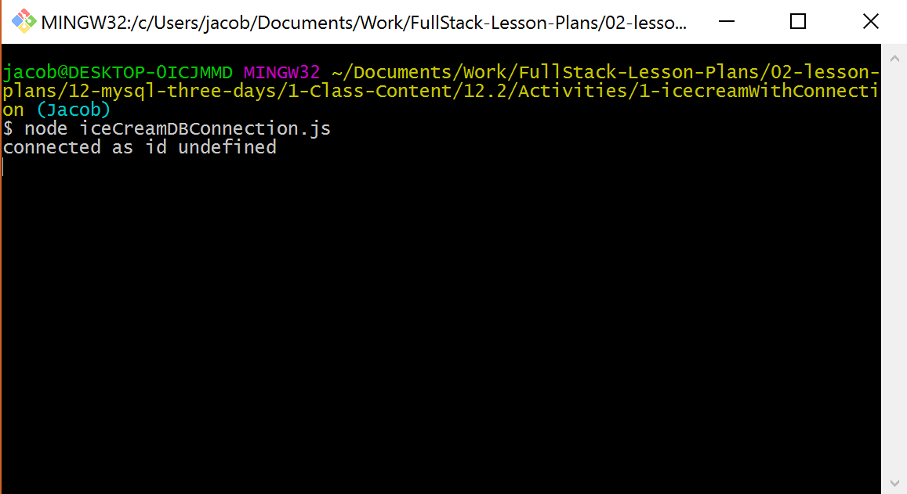
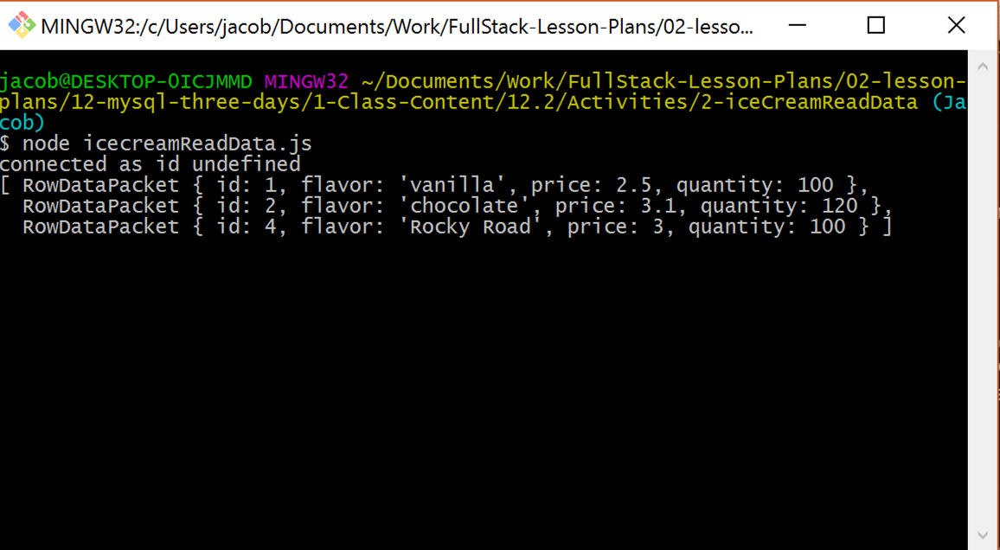
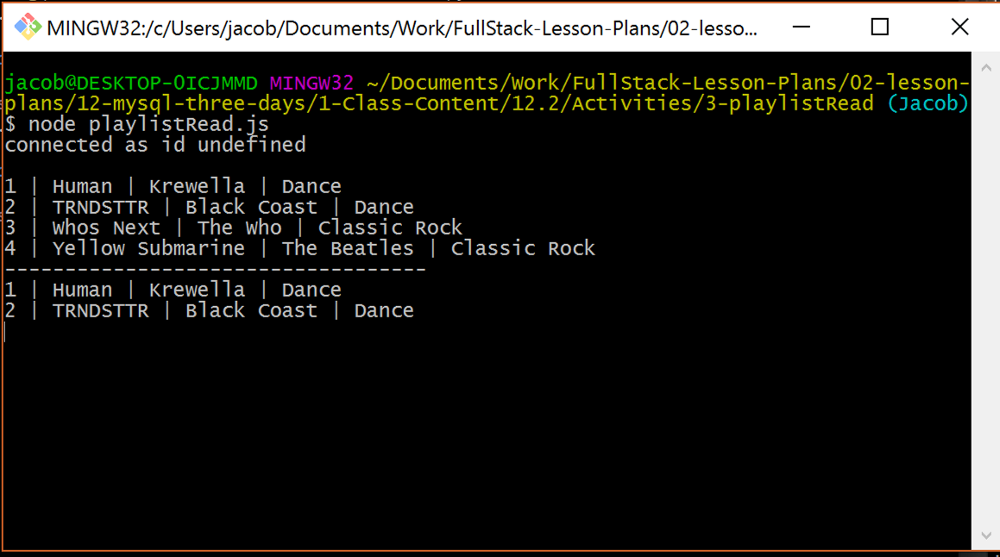

## 12.2 Lesson Plan - Node Gets a SQL <!--links--> &nbsp; [⬅️](../01-Day/01-Day-LessonPlan.md) &nbsp; [➡️](../03-Day/03-Day-LessonPlan.md)

### Overview

While the first class of the week took us away from JavaScript and Node for a tiny bit, today's class combines the old with the new in a way that shows just how powerful a MySQL server can be. With that being said, be on the lookout for small errors in syntax over the course of today's lesson. MySQL is VERY particular about the syntax that is used and this can lead to stress.

`Summary: Complete activities 6-10 in Unit 12`

##### Instructor Priorities

* Walk students through how to create a connection to MySQL databases using Node
* Students should be able to select data from a MySQL database using Node and use that data in simple JavaScript applications
* Students should be able to add, change, and remove data from MySQL databases using Node and simple JavaScript applications
* Groups should have a decent understanding of how to take a core concept for a small application and create a prototype based upon it

##### Instructor's Notes

* MySQL in Node is VERY particular about the syntax that it uses and will return an error if it finds something isn't right. Tell your students to be on the lookout for small issues with their syntax before thinking there is anything else wrong with their code.

* Those students who struggled with either MySQL or Node might find today's class difficult as well since it is built upon both of those concepts. If you can, try to help them catch up during the longer assignments if it looks as if they are having trouble.

### Sample Class Video (Highly Recommended)
* To view an example class lecture visit (Note video may not reflect latest lesson plan): [Class Video](https://codingbootcamp.hosted.panopto.com/Panopto/Pages/Viewer.aspx?id=1c1dbd62-df74-476a-81fb-8b9ba10f6dad)

- - -

# Class Objectives

* To create a connection to a MySQL database using Node
* To create, read, update, and delete data from a MySQL database using Node
* To work with a group in taking a basic concept for a server side application and creating a working prototype for that application within a given time frame

- - -

### 1. Instructor Do: Welcome Class (2 mis)

* Welcome your students to day 2 of MySQL!

* Tell them that today we will be returning to JavaScript with our newly acquired SQL skills and combining them to create back-end applications that utilize MySQL data. In this way, they will essentially be learning how to manipulate back-end data through applications.

### 2. Instructor Do: Creating a Database Connection Demo (5 mins)

* First thing is first, we cannot manipulate the data within a MySQL database without first creating a connection to that specific database. This is actually a lot easier than it sounds thanks to the "MySQL" package for Node.

* Open up your terminal and navigate to the folder containing `iceCreamDBConnection.js` in `06-iceCreamWithConnection` but do not yet open up the file containing your code.

* Within your terminal, type `npm install mysql` and then hit enter to download the package.

* With the MySQL package now installed, open up a new file in your editor and type in the following code while explaining what the code does.

```js
var mysql = require("mysql");
var connection = mysql.createConnection({
  host: "localhost",
  port: 3306,

  // Your username
  user: '',

  // Your password
  password: '',
  database: 'ice_creamDB'
});
```

* The first line tells the application that the "mysql" package must be installed in order to run. The following line creates a connection to the "ice_creamDB" database using a localhost connection.

* After explaining all of this, add in the following lines of code to have Node connect to the MySQL server and inform the user that they have connected properly.

```js
connection.connect(function(err){
  if(err) throw err;
  console.log("connected as id "+ connection.threadId);
});
```

* Run the code in your terminal and show the result to the class, asking for any questions regarding this process before slacking out the following assignment.

    

### 3. Students Do: Creating a Database Connection (10 mins)

* More time than necessary has been provided to this particular assignment to ensure that everyone creates a connection to MySQL through Node and is given ample time to create and populate a table.

* While they are working on this assignment, create a table called "products" within your database and populate it with the data located within `iceCreamSeeds.sql` in `07-iceCreamReadData`

* Students will be creating their own database of playlists. You will be working with a database that is different but with the same number of rows in each table to help mirror as students create  and work with their own data.

* **Instructions**

  * Throughout this class we are going to be working on creating an application that takes in music data to create personalized playlists

    * Make sure to get as far as you can over the course of these assignments as the coding you do here will be extremely useful to you when you begin working on the homework

  * For now we will simply be creating your database in MySQL and then creating a connection to said database using Node. **Remember, you must create a database before attempting to connect to it. Doing otherwise will return an error.**

  * BONUS: Using MySQL Workbench, create a table in your database with four columns...

    * Primary Key of "ID" which auto-increments
    * A column called "title"
    * A column called "artist"
    * A column called "genre"

  * BONUS: Using MySQL Workbench, populate your table with a few rows of dummy data

  * BONUS: Start looking into how you can use the MySQL package to read data from a MySQL database

### 4. Instructor Do: Reading Data From a Database (10 mins)

* After everyone has finished the previous assignment, open up `iceCreamDBConnection.js` in `06-iceCreamWithConnection` once more

* While we have created a connection to our MySQL databases, we have not yet grabbed any data from it. As you might imagine, this is kind of an important feature to be missing so we are going to solve that now

* Turns out that calling records from a MySQL database using Node is a whole lot easier than one might initially imagine so long as you understand SQL syntax. This is because the MySQL package uses pretty much the same syntax as SQL in its usage

* To emphasize this, update the following code to the end of `iceCreamDBConnection.js` in `06-iceCreamWithConnection` so that it matches the code found within `iceCreamReadData.js`in `07-iceCreamReadData` and then discuss it with the class before running it in your terminal

```js
connection.connect(function(err) {
  if (err) throw err;
  console.log("connected as id " + connection.threadId);

  connection.query("SELECT * FROM products", function(err, res) {
    if (err) throw err;
    console.log(res);
  });
});
```

* Through calling `connection.query(<STRING>,function(err, res) {})`, we are telling Node to send an SQL query to our database and return the data collected through the "res" variable

* The \<STRING> portion uses SQL syntax and should be contained within a pair of quotes. Because of this, you should tell your students to be very careful with their syntax since even small differences could lead to an error being returned.

  * The query contained within the \<STRING> can be switched out with any other kind of SQL query which will allow you to collect specific types of data as well.

  * Point out that we run the query inside of the body of the `connect` method's callback function. Since the `connection.connect` and `connection.query` methods both run asynchronously, there's no guarantee that the `connection.query` method will run after `connect` if it's run from outside. If we didn't want to put the entire query method inside of the callback, we could also wrap the query method inside of a function. Example:

  ```js
    connection.connect(function(err) {
    if (err) throw err;
    console.log("connected as id " + connection.threadId);
    selectAll();
  });

  function selectAll() {
    connection.query("SELECT * FROM products", function(err, res) {
      if (err) throw err;
      console.log(res);
    });
  }
  ```

  * Inform the class that what's most likely to trip them up while working with the mysql npm package is dealing with asynchrony. One way to deal with this is to kick off the next piece of code from within the callback function of the previous. This will become more clear as we work through the rest of the activities and the homework assignment.

* Run the code in your terminal and the data contained within your database should be returned to you as an array of objects.

    

  * Be sure to make note of the `RowDataPacket` that comes before each object. Students may think that this would impact the ways in which you would call specific data (eg. `res[0].RowDataPacket.id`), but this is not actually necessary. The data can be called normally.

* Also make sure to note how `res` is only available inside of the scope of the function. `res` would be undefined outside of the query callback function unless the data was stored within a global variable.

### 5. Students Do: Collecting Data From a Database (15 mins)

* Once again, more than enough time has been given for this assignment so as to provide students with the opportunity to tackle the bonuses since both of these would assist them greatly in tackling this week's homework.

* While this assignment is going on, take a few moments to take the code contained within `playlistSeeds.sql` in `08-playlistRead` and run it in MySQL Workbench so that you can go over the assignment with the class afterwards

* Check to see if there are any questions from the previous part of the lesson before slacking out the following instructions to the class...

* **Instructions**

  * Using the connection and song data you put together earlier into the class, we are going to print playlists to the Git Bash console based upon the genre or artist.

  * First create code that prints all songs within your database to the terminal.

  * Now create code that prints songs of a specific genre/artist to the terminal.

    * If you don't have many songs in your database at this point in time, take this moment to add some more to it. Try to give yourself a variety of songs to work with.

    * HINT: Remember that you can call specific data using SQL commands we went over last class. If you are having trouble, make sure to look into SQL commands once more.

  * BONUS: Use 'placeholder' values or string concatenation to build a MySQL query which allows you to change pieces of the query on the fly (e.g. using a variable to build the `WHERE` clause, instead of a static string).

    * There are a couple different ways to accomplish this task, but the most common one can be found within the [documentation for the MySQL package](https://github.com/mysqljs/mysql#performing-queries).

### 6. Everyone Do: Collecting Data From a Database (10 mins)

* Open up the file titled `playlistRead.js` in `08-playlistRead` in your editor to go over some of the finer points of the past assignment.

    

* While the first query is much like that which we went over earlier, the second one is the one that is most interesting because it contains a query that seems incomplete as there is a question mark at the end of it. What this syntax allows the user to do, however, is place an array after the query string whose contents will replace the question marks with those variables contained within the array.

  * Why is this useful? It allows for programmers to plug in multiple variables using the same bit of code. We will go over this kind of thing more in future classes, but anything that makes a piece of code more reusable is a bonus in the wild world of programming.

### 7. Instructor Do: Creating, Updating, and Deleting Data Using Node (15 mins)

* When creating programs that deal with databases, there is a rather fun acronym which a lot of programmers use in order to remind themselves which functions they have available to them. This acronym is CRUD :


```
C - CREATE - INSERT INTO pets (name, type, age) VALUES ("fido", "dog", 3);
R - READ   - SELECT * FROM pets;
U - UPDATE - UPDATE pets SET name="under dog" WHERE type = "dog";
D - DELETE - DELETE FROM pets WHERE type = "mouse";
```

* So far we have only really gone over one of the four letters of CRUD today, but now that we have a firm understanding on the basics we can more easily jump into the others without spending as much time on them independently. This is because they all use nearly identical calls to that of your typical READ query with many of the changes only being the SQL query being made.

* Go over each of the following examples one at a time, adding them into your ice-cream application from earlier in the class and running them in your terminal. You may use use `09-iceCreamCRUD` as a guide.

```js
function createProduct() {
  console.log("Inserting a new product...\n");
  var query = connection.query(
    "INSERT INTO products SET ?",
    {
      flavor: "Rocky Road",
      price: 3.0,
      quantity: 50
    },
    function(err, res) {
      console.log(res.affectedRows + " product inserted!\n");
      // Call updateProduct AFTER the INSERT completes
      updateProduct();
    }
  );

  // logs the actual query being run
  console.log(query.sql);
}
```

* Point out to students how similar this looks to the code which reads data, with the only major differences being the query made and the data entered.

  * When inserting data into a MySQL database using Node, the format is to use object notation with the keys being the columns that you would like to insert data into.

  * Make sure that the data you are entering into your columns matches the types the server is expecting. Doing otherwise might cause the server to crash since it will not know how to handle the data you are passing it.

* Point out how you can assign the query to a variable and use `query.sql` to determine what the query being run against the database is.

```js
function updateProduct() {
  console.log("Updating all Rocky Road quantities...\n");
  var query = connection.query(
    "UPDATE products SET ? WHERE ?",
    [
      {
        quantity: 100
      },
      {
        flavor: "Rocky Road"
      }
    ],
    function(err, res) {
      console.log(res.affectedRows + " products updated!\n");
      // Call deleteProduct AFTER the UPDATE completes
      deleteProduct();
    }
  );

  // logs the actual query being run
  console.log(query.sql);
}
```

* Updating data is VERY similar to creating data, the only significant difference being the addition of the WHERE statement which allows you to interact with specific rows of data

  * Your students will also notice that we are using two question marks within this statement, one for the SET and one for the WHERE. What's cool about this is that, by using an array, we are able to replace both question marks with the elements contained within said array.

  * First question mark is replaced with the first object in the array while the second question mark is replaced with the second object in the array.

```js
function deleteProduct() {
  console.log("Deleting all strawberry icecream...\n");
  connection.query(
    "DELETE FROM products WHERE ?",
    {
      flavor: "strawberry"
    },
    function(err, res) {
      console.log(res.affectedRows + " products deleted!\n");
      // Call readProducts AFTER the DELETE completes
      readProducts();
    }
  );
}
```

* Deleting MySQL data through Node is almost entirely identical to a READ query that includes a WHERE statement within it. Not much else to it other than that.

```js
function readProducts() {
  console.log("Selecting all products...\n");
  connection.query("SELECT * FROM products", function(err, res) {
    if (err) throw err;
    // Log all results of the SELECT statement
    console.log(res);
    connection.end();
  });
}
```

* Students should already be familiar with reading data at this point but ask your class if they have any questions and answer them as best you can before moving onto the next activity.

### 8. Students Do: CRUD Playlist (20 mins)

* Slack out the following instructions.

* **Instructions**

  * It's time to start making our playlist application a little more functional through including all four C.R.U.D elements within it.

  * Add in some pieces of code that CREATE, UPDATE, and DELETE specific pieces of data from your MySQL database. Make sure to include a READ statement at the end as well to ensure that the changes you are making are working properly.

  * BONUS: After successfully adding CRUD to your application, it's time to test your mettle and see if you can make it so this app is more dynamic. Add the ability for users to dynamically input their own data into the database using the Inquirer NPM package.

    * HINT: Recall that you can create MySQL queries which include variables using question marks. Proper usage of this will help you quite a bit.

    * HINT: Remember to take into account the scope of Inquirer package when putting your application together.

- - -

### 9. BREAK (15 mins)

- - -

### 10. Groups Do: Great-Bay (60 mins)

* When everyone is back from break, split them up into groups of three or four and then slack out the following instructions...

* **Instructions**

  * Within your groups you are going to be creating a Node application called "Great-Bay" which allows users to create and bid on assorted items, tasks, jobs, or projects.

  * The basic application is fairly simple: Upon loading up the program, the user is prompted on whether they would like to "POST AN ITEM" or "BID ON AN ITEM"

    * If the user selects "POST AN ITEM" they are prompted for an assortment of information regarding the item and then that information is added to the database so that others can bid on it

    * If the user selects "BID ON AN ITEM" they are shown a list of all available items and then are prompted to select what they would like to bid on. The console then asks them how much they would like to bid, and their bid is compared to the previous highest bid. If their bid is higher, inform the user of their success and replace the previous bid with the new one. If their bid is lower (or equal), inform the user of their failure and boot them back to the selection screen.

  * Once your group has put together the basic application, it's time to test your collective skills on some additional functionality, or "addons". Remember to take into consideration the amount of time you have been given when choosing what addons you would like to tackle.

    * Create a sign up and login system that prompts users for a username and password upon loading up the app. **Do not worry about setting up a truly secure database if you choose to tackle this addon. Just worry about building working sign up and login features.**

    * Create a system on the "POST AN ITEM" which allows users to look at the auctions they have created. On this screen they can add new auctions, modify previous auctions, or close bidding on an auction.

    * Create a system which allows users to view all of the auctions of which they are the leading bidder.

    * Create a third option on the main screen which allows administrators to modify the database as they see fit.

    * Create visually appealing tables. This means making dynamic console code and it is a lot harder than it might seem at first so do not think this one is so simple.

    * Create a search function that allows users to look through the database of available auctions to find those that share the specified keyword or username.

    * Get creative! There are a lot of addons to this app which you could create so feel free to work with your group to come up with something not listed above!

### 11. Everyone Do: Share Your Work (20 mins)

* With any luck, the class has been able to tackle not only the basic assignment, but has also managed to put together a few different addons for the application which they can share with everyone else.

* Start out this part of the class by asking a group who feels confident in their code for the basic application and is confident that it works to slack it out and then walk the rest of the class through it. Make yourself available to answer questions the rest of the class might have regarding the group's code if there are any individuals who seem very confused.

* Next, start running through the list of addons we suggested above and see if there are any groups out there who are willing to share their solutions with the class.

* Finally, ask the class if there were any groups who went above and beyond to create their own addons for the application and have them share this code with the class as well.

### Lesson Plan Feedback

How did today's class go?

[Went Well](http://www.surveygizmo.com/s3/4325914/FS-Curriculum-Feedback?format=pt&sentiment=positive&lesson=12.02)

[Went Poorly](http://www.surveygizmo.com/s3/4325914/FS-Curriculum-Feedback?format=pt&sentiment=negative&lesson=12.02)
