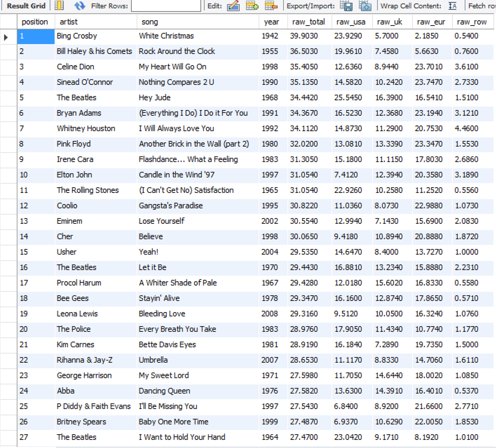

## 12.3 Lesson Plan - My-Massive-SQL <!--links--> &nbsp; [⬅️](../02-Day/02-Day-LessonPlan.md) &nbsp; [➡️](../../13-Week/01-Day/01-Day-LessonPlan.md)

### Overview

Today's class focuses on using those MySQL skills students have acquired earlier in the week to deal with big data. On top of this, students should also become proficient in creating/using "schema.sql" and "seeds.sql" files while also learning how to import data using .CSV files.

`Summary: Complete activities 11-14 in Unit 12`

##### Attention: If you’re teaching a part time section and this isn’t a Saturday, please use the “Weekday” tab inside of the "12.3-TimeTracker.xlsx" for activity lengths instead of those printed on this lesson plan

##### Instructor Priorities

* Students should feel confident in their abilities to create, read, update, and delete MySQL server data
* Students should know how to create and use "schema.sql" and "seeds.sql" files
* Students should have a firm understanding of how to import and export data using .CSV files

##### Instructor Notes

* Today's class is far gentler than the past two have been and should be looked at as a time to help everyone catch up with one-another. Throughout the assignment, you and your TA's should be moving about the room to help those who seem to be struggling.

* There are also times during which you will be calling the class back together to go over the previous part of the activity with them so that no one gets left behind.

* Despite all of this, today should hopefully be an easier day for your students as the assignment itself is not terribly challenging overall.

* **Extra Resources:** Send out the following link before or after class and encourage students to tackle the two MySQL questions in [Whiteboarding Overview and Questions](https://www.gitbook.com/read/book/the-coding-bootcamp/whiteboarding-algorithms-and-interview-questions?key=technicalInterview). This was given with the course pre-work but after this week, students should be able to accomplish those questions.

### Sample Class Video (Highly Recommended)
* To view an example class lecture visit (Note video may not reflect latest lesson plan): [Class Video](https://codingbootcamp.hosted.panopto.com/Panopto/Pages/Viewer.aspx?id=88468376-c990-409e-a498-136a52d3801e)

- - -

### Class Objectives

* To introduce students to the processes of creating and working within databases which deal with large data
* To help solidify the foundations of MySQL and SQL syntax
* To learn how to create MySQL schemas and import large amounts of external data into a database

- - -

### 0. Instructor Do: Welcome The Class (1 min)

* Spend a minute or so welcoming the class to today's lesson while everyone gets settled

### Optional - MySQL Quiz (10 minutes)

If your class is struggling with MySQL fundamentals (Connecting, creating schemas, etc.) spend 10 minutes doing this quick warm-up activity: `0-MySQL PopQuiz` in `11-popQuiz/README.md`.

### 1. Instructor Do: Introduction to Big Data (5 min)

* Up until this point we have been dealing with fairly small collections of data on our servers, but that is going to change today as we move into creating and working within MySQL databases containing massive amounts of data.

* The reason we are doing this is because one of the major advantages of MySQL over other server systems is that it can pretty easily handle large datasets. This makes it ideal for industries who require vast collections of data to be stored and called back at a moments notice.

* Working with big data can seem rather intimidating at first due to the size of the systems you are working with, but it is not terribly different than working on smaller servers. The only major difference here is the amount of information you are sifting through in order to create programs.

### 2. Partners Do: Examining The Dataset (10 mins)

* Slack out `TopSongs.csv` in `12-Top5000Schema` to the class and have them look through it for a few minutes after telling them that this is the dataset they will be working with today. It contains 5000 lines of music data within it.

* Explain the data that each column contains. Reading the first from left to right, we have:

  * Columns containing the **artist name**; **song name**; **year**; **raw popularity score** for the song from the entire world; and then one column for each of the **raw popularity scores** for the song from the USA; UK; Europe (i.e., non-English speaking countries in Europe); and the rest of the world, respectively.

  * Explain that "raw score" numbers reflect the "total value of music industry sales", where a higher raw score indicates a greater volume of sales.

* Now that they have looked through the dataset, prompt them to work in pairs to come up with how they might go about creating a database/table for this data.

* After a few minutes of discussion, call the class back together and start asking individuals around the room how they would go about creating a database and table to hold this data.

* Most individuals should manage to make it up until the creation of a table fairly easily, but then there may be some struggles when it comes to making the table itself.

  * The key feature to point out here is that we will have to create a table with nine columns.

* Once you are satisfied that everyone has a good idea as to what they would do, continue onto the next section.

### 3. Instructor Do: Setting Up Schemas and Planting Seeds (5 min)

* As many of your students have likely noticed by now, the actual code used to affect MySQL servers is not saved directly onto their servers. In fact, the only thing that IS saved when you run SQL queries are the changes you have made to the server.

* This can be rather troublesome when you want to create an identical database on a separate server as you would have to rewrite all of your code again in order to do so. What a hassle!

* Fortunately there are other ways in which MySQL developers save their code for just such a reason! They use "schema.sql" files to save their database/table creation codes and "seeds.sql" files to save those statements they use to insert data into their tables. All they have to do in order to create copies of their databases, therefore, is copy the code contained within these files, paste it into MySQL Workbench, and then run the code.

### 4. Students Do: Preparing the Database (20 mins)

* Once any and all questions have been answered, slack out the following activity...

* **Instructions**

  * It's time to test your skills in creating databases and tables as you create a database called `top_songsDB` which will eventually house all of the music data contained within `TopSongs.csv`

    * Within your database create a table called `Top5000` and create columns capable of holding all of the data contained within `TopSongs.csv` properly.

    * All of your code should be written and saved within a filed called `schema.sql` so that you can use this same code later should the need ever arise

    * HINT: Try to have your table's columns match those within the CSV file as closely as possible or else you may find the next step in this assignment more difficult than it would otherwise be

    * BONUS: Create a `seeds.sql` file that adds the data for the first three songs found within `TopSongs.csv` to your table

    * BONUS: Look into how MySQL Workbench can import and export data files. What file types does it accept? How does it convert the data?

### 5. Everyone Do: Going Over the Database (10 mins)

* When everyone has finished the assignment, ask for a member of the class to share their `schema.sql` file and walk the class through the logic of their creation.

  * You may want to choose a student whose code you are confident will work. Remember that the table being created should match the data-types contained within the CSV file with the default type being VARCHAR.

  * While they are discussing their code, you may want to have a TA check to make sure everything will run properly when the data is imported. If it is, great! You shouldn't have to work your way through the solution as much. If it does not work, however, make sure you are able to gently point out the reasons why it won't work and correct them.

* After the student has gone over their code and you have made sure everything works correctly, you may want to work your way through the code with the class one more time to make certain they all understand how everything works. Remember, this class is as much about catch-up and review as it is about working with big data.

### 6. Instructor Do: Importing Data Demo (10 mins)

* When everyone's questions have been answered to the best of your ability, open up MySQL Workbench and navigate into your `TopSongsDB` database. Keep yourself open to questions as you walk students through importing data.

* Once you are inside of this database, type in the following code to show your empty table.

```sql
SELECT * FROM Top5000;
```

* Now that your table is on display at the bottom of the page, navigate into the import/export wizard at the top of the table area near the center.

* Find the csv file you want to import within the file browser and then double-click.

  * Larger files take longer to import, so don't freak out if this takes a while to accomplish.

  * MySQL Workbench may say that it is "Not Responding" while importing... It is lying. When MySQL Workbench is importing a large file, it devotes all of its processes to that task and this makes it seem like the program has frozen when it is still working. Just be patient and give it time to import.

  * If you don't want to deal with the full 5000 rows of data and want to go with something a touch more manageable, we have also provided you with `Top1000Songs.csv` in `12-Top5000Schema` which holds significantly less data inside of it.

* When the file has been fully imported, select apply in the lower-right portion of the table-display screen to commit your additions to the database.

  * Once again, this may take some time so do not freak out if it looks like MySQL Workbench has frozen

    

* Now that all of the data has been imported, it's time to show the class the MASSIVE table that we have put together. While the importing process may have taken some time, it was certainly better than having to deal with inserting each row individually as that would have taken FOREVER!

### 7. Students Do: Importing and Working With Big Data (50 mins)

* Answer whatever questions your students may have before slacking out the following instructions...

* **Files**

  * `TopSongs.csv` in `12-Top5000Schema`

  * `Top1000Songs.csv` in `12-Top5000Schema`

* **Instructions**

  * Now that we have learned how to import big collections of data into a server, it is time to put this new knowledge to the test by importing all of the data contained within `TopSongs.csv` into our database.

    * HINT: Remember, bigger datasets require more time to import properly, so be patient

    * HINT: If you feel that the import process is taking far too long, feel free to use `Top1000Songs.csv` instead. We would highly recommend working with the bigger dataset if you can, however.

    * HINT: Take the downtime you have been given to start on the next part of the activity

  * With all of your data successfully imported into the database, begin working on a Node console application which will allow you to collect more specialized pieces of data. For example...

    * A query which returns all data for songs sung by a specific artist
    * A query which returns all artists who appear within the top 5000 more than once
    * A query which returns all data contained within a specific range
    * A query which searches for a specific song in the top 5000 and returns the data for it

  * HINT: There are some MySQL queries which could make some of these tasks even easier to accomplish. Feel free to look at MySQL's documentation to find some of them.

- - -

### 8. BREAK (40 mins)

- - -

### 9. Everyone Do: Going Over Working With Big Data (15 mins)

* Open up `TopSongsCode.js` in `13-Top5000Code` within your editor and go over it with the class, going over the steps we used to create the database and import our table-data into it once more as well so that your students are 100% clear on how this process works.

* We used some new SQL commands within our code which your students may not have found unless they decided to look online. These include the `GROUP BY` and `BETWEEN`statements.

  * `GROUP BY` groups elements with shared values together and then allows us to use the `HAVING count(*) >1` statement to determine if there are multiples within that group.

  * `BETWEEN ? AND ?` allows us to select information between a specific range.

* Briefly explain the notion of **indexes**.

  * Explain that evaluating certain queries, such as `WHERE` and `BETWEEN` queries, requires MySQL to examine a large number of rows.

  * Explain that this generally doesn't become a problem until our database grows very large in size, but it's something to think about when designing a table structure or when identifying that certain types of queries will be used more than others.

  * Explain that instructing MySQL to use certain columns as _indexes_ helps speed up the evaluation of such queries by limiting the number of records MySQL has to examine.

    * Rather than read a table row-by-row to execute a `WHERE` clause, an index takes data from a column in a table, and stores it alphabetically in a separate location called an index. Then when the data needs to be accessed, it's searched for it in this shorter list (the index) and then looks at the row(s) the data comes from when a match is found.

    * Explain that indexes also improve the performance of certain `JOIN` and `BETWEEN` clauses.

  * Explain that we can manually set arbitrary columns as indexes using the `ADD INDEX` statement.

    * Briefly demonstrate the syntax for this command on-screen: `ALTER TABLE`top5000`ADD INDEX` song `(`song`)`.

    * The following query would take advantage of the index:

    ```sql
    SELECT * from top5000 WHERE song = 'freebird'
    ```

  * Explain that MySQL automatically creates an index associated with a table's primary key, so there's no need to create an index for that.

  * Explain that one determines the appropriate indexes for a table on a case-by-case basis, and that we won't dive into the guidelines just now.

    * Emphasize again that indexes won't make a demonstrable difference for databases of the size we'll work with in class, but it's helpful to understand the concept as students are likely to encounter them in large databases they'll meet on the job.
  
  * If any time remains go over [this article explaining MySQL indexes](https://atech.blog/viaduct/mysql-indexes-primer) as a class or otherwise suggest students read over it when they have a chance later.


### 10. Students Do: Two Tables Are Better Than One (60 mins)

* Explain that, when dealing with big databases, it is very likely that you will have to work with two or more datasets that are related, but which have some degree of separation between them. In this case we have a table of the top 5000 songs and a table of the top 3000 albums.

* Emphasize the relationship between databases and tables: Tables live **in** databases—i.e., databases consist of tables.

  * Alternatively: A **table** stores information in rows and columns. A **database** is a collection of related tables.

* Take a moment to answer questions, and then slack out the following activity.

* **Files**

  * `TopAlbums.csv` in `14-TwoTables`

* **Instructions**

  * Your assignment is to take these two large sets of data and come up with a method to join them together in order to figure out if a given artist's song and album made it into the charts at the time of their release.

    * HINT: This can be done in a couple different ways using external data as well, but you do have all of the data you need within your database to find the correlations. Give your methods some though before having to rely upon external info.

    * HINT: Remember that MySQL has the ability to combine two or more tables together so long as they share equivalent data. What data is similar between the two lists?

  * Once you have managed to successfully bring the two datasets together, start making queries like those you made earlier to this new table as well.

### 11. Everyone Do: Going Over Two Tables (15 mins)

* Open up `TopSongsAndAlbumsCode.js` in `14-TwoTables` and go over the function which was added to the bottom. The query down there is far longer and far more confusing than the rest, so go over it step-by-step in great detail so that everyone in your class understands what it does.

* Once it seems everyone has an idea of how that code works, ask a few brave souls to come up to the front to share their additions to the code with the class. Let them describe their code and field the questions as well, only jumping in when you feel the need to.

# Instructor Do: Private Self-Reflection (0 min)

Take some time on your own after class to think about the following questions. If there's anything that you're not sure how to answer, feel free to reach out to the curriculum team!

1. How did today's class go?
2. How did you teach it?
3. How well do you feel you did teaching it?
4. Why are you teaching it?
5. Why did you teach it that way?
6. What evidence can I collect to show my students are understanding?
7. How will my students know they are getting it?

### Lesson Plan Feedback

How did today's class go?

[Went Well](http://www.surveygizmo.com/s3/4325914/FS-Curriculum-Feedback?format=pt&sentiment=positive&lesson=12.03)

[Went Poorly](http://www.surveygizmo.com/s3/4325914/FS-Curriculum-Feedback?format=pt&sentiment=negative&lesson=12.03)
