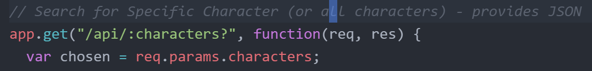
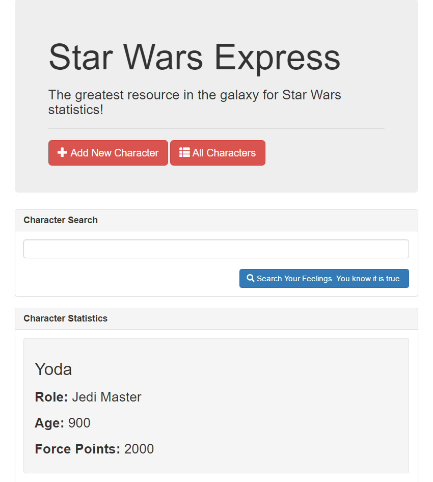
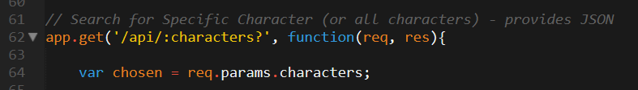
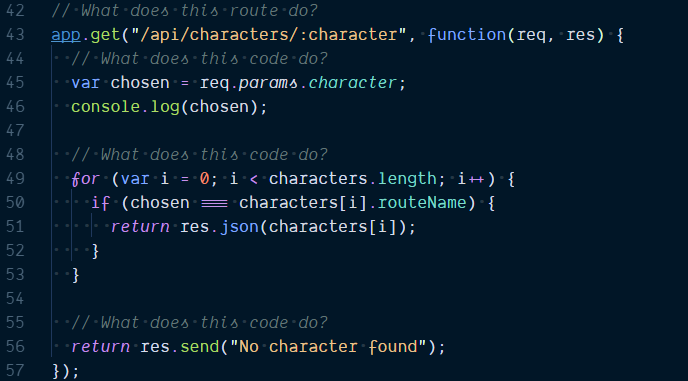
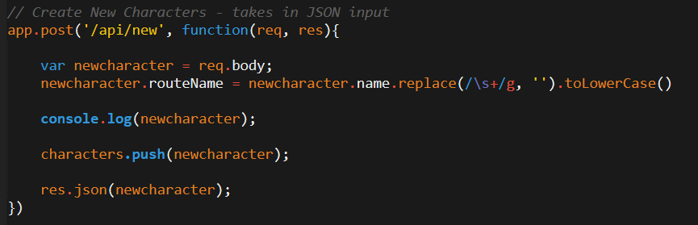
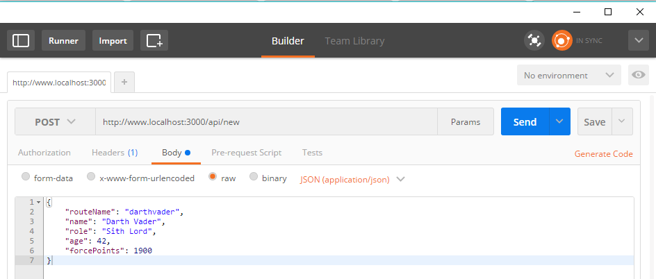
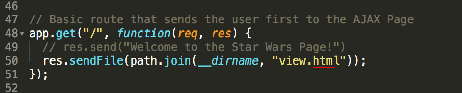

## 13.2 Lesson Plan - Express Yourself <!--links--> &nbsp; [⬅️](../01-Day/01-Day-LessonPlan.md) &nbsp; [➡️](../03-Day/03-Day-LessonPlan.md)

### Overview

Today's class is focused on creating an Express-based web server. Students will be introduced to the concepts of routing, request/response handling, and GET/POST requests.

`Summary: Complete activities 08-14 in Unit 13`

##### Instructor Priorities

* Students should understand the basic elements of an Express Server.
* Students should understand the concept of routing along with `app.get()` and `app.post()` syntax.
* Students should know how to target server endpoints using the browser and Postman.
* Students should be guided through the "Star Wars Express" application.

##### Instructor Notes

* Welcome back! Today's class along with the next one are some of the most important in the program. Over the course of these two classes you will be walking students through the creation of Node/Express-based APIs and their utilization by front-end interfaces. The general breakdown of classes goes as following

  * Today's Class: You will be leading them through a _heavily_ guided application build that uses an Express server to house and relay data about various Star Wars Characters [starwars-express-fsf.herokuapp.com/](https://starwars-express-fsf.herokuapp.com/). Students will then be left to study this example at home.

  * Next Class: You will be taking off the training wheels and letting them build their own Express application for handling reservation requests. [hot-restaurant.herokuapp.com](http://hot-restaurant.herokuapp.com). This will be extremely challenging to many students, but it's important you give them a chance to work independently here.

  * All of their work this week will build up to their homework assignment: [friend-finder.herokuapp.com](http://friend-finder.herokuapp.com). In this homework assignment, they will be creating a server-based "compatibility test" (basically a dating app for friends). The front-end will be composed of a basic survey. The back-end will take survey results, save them, then respond with the person whose results are the closest match. In total, students will have completed 3 different Node and Express applications by the end of the unit.

* Give students a heads-up that today's class is **critical** and that we will be re-using the concepts throughout the remainder of the course. In fact, use your discretion to utilize an additional day of review the following week if warranted. This material is critical for students to succeed as developers. If necessary, you can cut a day from the end of the program to account for the review.

* A fairly generous amount of time has been left at the tail-end of the course to allow you to spend more flexibility today. Do not feel pressured to "rush" through the material.

* Be sure to slack out the [video walkthrough](https://youtu.be/ygk-kNstqK0?list=PLgJ8UgkiorCmI_wKKVt5FlkTG63sQF6rr) at the end of the activity! This will help students tremendously in understanding how to approach Express based application builds.

* Have your TAs reference [02-Day-TimeTracker](02-Day-TimeTracker.xlsx) to help keep track of time during class.

### Sample Class Video (Highly Recommended)
* To view an example class lecture visit (Note video may not reflect latest lesson plan): [Class Video](https://codingbootcamp.hosted.panopto.com/Panopto/Pages/Viewer.aspx?id=3ad25f96-cc17-472c-94bd-33ab47b36757)

- - -

### Class Objectives

* To gain a preliminary understanding of the basic elements of an Express server.
* To gain an initial understanding of Express routing.
* To build a complete Express-based web application.

- - -

### 1	Instructor Do: Welcome		(0:01)

* Begin class by welcoming students. Then, open the [Express slideshow](Slide-Shows) and walk students through the slides. These are fairly light slides meant merely to offer a visualization of routing. Feel free to cut slides completely if you feel they detract from your teaching style.

### 2.	Instructor Do: Quick Recap "Server" Concepts (0:05)

* Use the slides to help you guide students through a recap of the concepts behind servers.

### 3.	Everyone Do: Introduce Express (0:04)

* Use the slides to introduce the concept of the Express framework and routing.

* At one point in the slideshow you will be pointed to the NYT Scraper App website. Remind students how the webpage works (namely that the site lets users retrieve articles from the New York Times and store them in a "saved" list). Then use the proceeding slides to discuss the concept of GET and POST routes. Give them a heads-up that we'll be able to use AJAX and jQuery to make both these types of communications.

### 4.	Instructor Do: Demo basic routing with server1.js (0:05)

* The next few activities will be spent incrementally building out the express StarWars app.

  * Note that, in some later activities, a question mark will appear in certain `get` routes. This `?` character indicates an _optional parameter_—these routes will load even if the parameter wrapped in `:?` is absent from the request.

  * _A question mark in an Express route indicates an optional parameter._

      

* Before you start working with the code go to the link: [starwars-express-fsf.herokuapp.com/](https://starwars-express-fsf.herokuapp.com/) and show students how the page works. Essentially, you can type in a Star Wars Character's name and search the "database" to see his/her properties. You can also add characters to the database using the simple form. Add a character and show how it gets displayed on both the page and the API. (Note: When searching do not enter spaces between character names).

  

* To show the API you can simply go to this link: <http://starwars-express-fsf.herokuapp.com/api>. The api also accepts an additional parameter at the end of the URL in the form of <http://starwars-express-fsf.herokuapp.com/api/charactername>. As an example: <http://starwars-express-fsf.herokuapp.com/api/yoda>.

* Now open the file `server1.js` (`08-StarWars-1`). Walk students through the general gist of the code. _For now the key focus is to give them an understanding of express(), routing, and the listener_.

* Run the `server1.js` file and show them how it works. (Don't forget to talk about `npm install`).

* Once you've discussed the key pieces proceed to the first activity.

### 5.	Students Do: Add Route to server1.js (0:07)

* Slack out the following file and instructions:

* **File:**

  * `server1.js` (`08-StarWars-1`)

* **Instructions:**

  * Work with those around you to confirm your `server1.js` file working. This means figuring out: what dependencies to install, how to run the file, and how to view the resulting website in your browser. This step requires you to make ZERO changes to the code file. At this point, you are just getting the file you are given to run.

  * Then, once you've gotten the original code to display in the browser, create a new `Obi Wan Kenobi route` to display Kenobi's information. Use the comments and the previous code in the file as a guide.

  * Help those around you when done.

### 6.	Instructor Do: Review Previous Activity (0:05)

* Review the previous activity by coding it out yourself. Your solution should look like something of the below:

```js
var obiwankenobi = {
  name: "Obi Wan Kenobi",
  role: "Jedi Knight",
  age: 42,
  forcePoints: 1350
}

app.get('/obiwankenobi', function(req, res){
  res.json(obiwankenobi);
})
```

### 7.	Partners Do: Dissect req.params (0:05)

* Next slack out the following file and instructions.

* **File:**

  * `server2.js` (`09-StarWars-2`)

* **Instructions:**

  * Examine the code sent to you. Once again, run the `server2.js` file and view the page in the browser. Troubleshoot any issues that arise. Again NO CODE CHANGES required.

  * Then once you have a working server instance, begin to examine the file. Try to explain to yourself and those around you what the significance of `/:character` and `req.params.character` is.

  * Create a test case to check your hypothesis.

### 8. Instructor Do: Review Previous Activity (0:03)

* Have students try to explain to you what they found.

* If no one offers the correct answer, explain that the `/:character` syntax is a way of saying we have a "variable" parameter in the URL route. Show them via the browser that this means they can search for a given character using the URL and it will display in the console.

  

### 9.	Partners Do: Dissect Parameter Match (0:05)

* Now slack out the next file:

* **File:**

  * `server3.js` (`10-StarWars-3`)

* **Instructions:**

  * Examine the code flagged in the comments. Explain to those around you what it does and how it works. Be sure to create test cases that confirm your hypothesis.

### 10.	Instructor Do: Review Previous Activity (0:05)

* Use the same process as before to ask students to explain the for-loop concept to you.

* If no one offers the correct answer, explain that this for-loop "checks" which character is being sought after in the URL -- then finds that character's information and re-displays it back to the user in the form of a JSON.

  

* Show them how this works by searching for the character `yoda`. Then try searching for a non-existent character like `hansolo`.

* Ask students of an example where this concept of routing where the URL is changing might be found. (suggested answer: Newspapers. Every newspaper has a url like `/2016/01/01/Great-story-of-the-day` )

### 11.	Instructor Do: Re-demonstrate Previous Solved Activity (0:10)

* If needed, open the file `server4.js` (`11-StarWars-4`). This file simply includes a line-by-line commenting of the previous example. Slack out this file to students so they can look over it during the next few exercises.

### 12.	Instructor Do: Show code for Post Route (0:07)

* Now open the file `server5.js` (`12-StarWars-5`). In this example, simply point students through the fact that we've created a new POST route. Explain that this route will take in JSON inputs then DO work with them. In this case it will save the JSON to the database and return a JSON of the new character.

  

### 13.	Students Do: req.body dissection (0:05)

* Now slack out the following file and instructions.

* **File:**

  * `server5.js` (`12-StarWars-5`)

* **Instructions:**

  * Spend a few moments researching what `express.json` is for and what `req.body` means in the context of Express.

  * Then research how you can POST data to the Express server.

### 14.	Instructor Do: Postman Demo (0:07)

* Have students articulate their answers before explaining to them that `express.json` and `express.urlEncoded` are modules built-in to express that allow Express to receive user posts (JSON, text, etc).

* Normally and data sent to the server isn't easily readable by humans, as it comes in as a low level stream.

* Explain that `express.json` and `express.urlEncoded` are examples of **middleware**.

  * Middleware is a function which we set to run between our server receiving a request and it being available inside of our routes.

  * Middleware can be defined using the `app.use` method.

  * Middleware can transform the request from the browser before we work with it. In the case of `express.json` and `express.urlEncoded`, it takes the unreadable request and turns it into a readable object and attaches it to `req.body`. By the time the request gets to our routes, our body parsing middleware has already formatted it for us.

* Then explain to them that in future applications we'll eventually be using jQuery's AJAX methods for sending such post requests to our server.

* Then have them install the program [Postman](https://www.getpostman.com/). We'll be using Postman so both windows users and mac users can be taught how to send POST requests using the same program. (Note: Students may ask questions like: "Do you always have to use postman to send post requests?" Use this as an opportunity to explain that Postman is simply a GUI for development, and that in future opportunities we'll be using jQuery or other front-end code approaches for sending the same post requests.)

* Walk students through the process of sending POST requests in Postman. If you are unfamiliar use the following points as a guide:

  1. Run your server instance.
  2. Open Postman.
  3. Select POST in the drop-down next to the link. Then enter the URL of your server's POST route.
  4. Click the button: "Body". Click the setting "Raw". Then hit the dropdown that says "Text" and click JSON.
  5. Enter in a complete JSON. You can use:
     ```json
     {
       "routeName": "darthvader",
       "name": "Darth Vader",
       "role": "Sith Lord",
       "age": 42,
       "forcePoints": 1900
     }
     ```
  6. Hit "Send"
  7. Now check back to your Star Wars API to confirm that Postman received the request body.
     

### 15.	Students Do: Postman Exercise (0:10)

* Now have students perform the same exercise with their own servers.

* You can slack out the following file and instructions:

* **File:**

  * `server5.js` (`12-StarWars-5`)

* **Instructions:**

  * Use Postman to send a POST request to the server you've been provided. Confirm that your character has been added to the database correctly.

- - -

### 16.	Break		0:15

- - -

### 17.	Instructor Do: Demo sendFile (server6.js + view.html)		(0:10)

* Open the file `server6.js` (`13-StarWars-6`). Look at the line under the `app.get('/')` route. Point out to students the use of the `res.sendFile` code. This code is used to send users a specific HTML file in response to their visiting a route.

  

* Be sure to point out how we make use of the built in `path` library to join relative and absolute file paths. In this case, we **could** just omit `path.join` pass `sendFile` relatives paths to the HTML files instead, but it's safer to provide absolute paths in case our Express app is ever started from a different directory. Normally this would be an issue, since absolute paths will almost always be different on different computers, as well as on Heroku. Thankfully we can make use of Node's built in `path` library. `path.join` is a function which accepts any number of String arguments, which are also expected to be file paths or partial file paths. `path.join` takes the passed in file paths, combines them into a new path, and returns it.

* The `__dirname` keyword is built into Node and available in every JavaScript file on the server. It's always equal to a the absolute path of the current directory. By passing `__dirname` as well as the relative path to the file we want to send into `path.join`, we'll get back an absolute path to the specified file.

### 18.	Students Do: Dissect .get view.html (0:07)

* **File:**

  * `server6.js` (`13-StarWars-6`)

* **Instructions:**

  * Look at the file sent to you then explain to the person next to you what the `res.sendFile` line does. Then try creating a new HTML file and routing to that one instead.

### 19.	Instructor Do: Review Activity (0:07)

* Review the previous exercise and answer any questions. Try to get students to think about the distinction between routing users to "data" and routing them to rendered "HTML" pages. Try to get them to think about when you would use `res.json` and when you would use `res.sendFile`.

### 20.	Instructor Do: Demo Complete Application (0:06)

* Open the completed application found in `14-FinalStarWarsApp`. Walk students through the overall folder structure and how there is a mix of the `server.js` file and the HTML files which will be relayed to users. Also point out how we have a new `add.html` file.

### 21.	Students Do: Dissect .post (add.html)		(0:07)

* Slack out a zipped copy of `14-FinalStarWarsApp`. Then task students with the following:

* **Instructions:**

  * Spend a few moments looking over the code sent to you. First, get the server running, then begin to dissect the JavaScript code found at the bottom of `add.html`.

  * Explain to one another what the code does, what its for, and why its relevant to the application so far. Be sure to explain to one another what the `$.post` code is doing.

### 22.	Instructor Do: Review Activity (add.html)	(0:07)

* Walk students through the meaning of the JavaScript in `add.html`. Go line by line and explain how jQuery is used to grab the values in the form -- then immediately POSTs these values to the API. The API then saves the records into the database.

* Answer any questions that remain. Then encourage students to look back at their class repository when completing the homework as there will be additional examples on folder structure relevant to their homework assignment.

* Finally, slack out a link to the [YouTube video walkthrough](https://youtu.be/ygk-kNstqK0?list=PLgJ8UgkiorCmI_wKKVt5FlkTG63sQF6rr) and encourage them to review at home. This will be a _huge_ help to students.

### 23. Instructor Do: Introduce Heroku (0:04)

* Local development is fun, but it's much more fun to deploy and share with others!

* Ask students what we've been using so far to deploy, and ask if anyone has any idea why that solution might not work now.
  * After students give suggestions, explain that GitHub Pages only hosts "static" pages, and doesn't support the server side of our application. 
  * Explain that GitHub Pages won't actually run any code for your app, it just hosts your HTML, CSS, JS, and other static files. It's similar to accessing your local files through your browser, only they're on a publicly accessible machine.

* That means we need something that will both host our files _and_ run our server-side code.

* Ask them if they can guess what we're going to use to host our full-stack application.
  * There are a ton of options, but specifically we're going to be using Heroku!

* Explain that Heroku is a platform as a service (PaaS). It allows deployment of a back-end and will start up and host your web server and server-side code for you!
  * Explain that the value here is similar to that of GitHub Pages, but for your whole app.
  * Heroku will manage your application and give it a public URL that anyone can access.

### 24. Students Do: Deploy to Heroku (0:30)

* Tell students that to wrap up today we're going to host that Star Wars app, so that even those in a galaxy far, far away can access it.

* Then have students login to their Heroku accounts online. Many of them will have forgotten their passwords, and may spend a significant portion of this activity getting set up.

* **File:**
  * `01-Activities/14-FinalStarWarsApp` (solution, zipped)
  * `03-Supplemental/HerokuGuide` (slacked out or link to class repo posted)

* **Instructions:**
  * Push the finished Star Wars app to heroku following the steps from the guide.

  * **BONUS:** Begin making the below additional page for your Star Wars app. Push those changes up as you build the new feature. Specifically, this will require:
    * Create a new page on your Star Wars website that displays a table of ALL characters in the database. This will involve at minimum:
      * Creating a route in the server.js file for displaying data
      * Creating a route in the server.js file for sending users a new HTML file
      * Creating an HTML file that grabs data from the server.

* Be sure to walk around and help students as they hit snags or have problems pushing to heroku, consulting the troubleshooting tips below as needed.

- - -

### Troubleshooting Guide

* **Forgetting to git "add -A, git commit -m":** Often students will completely skip the step where they save and commit their changes prior to pushing to GitHub. This will mean their web page is essentially blank. As a starting point, ensure their code is present in GitHub before tinkering with Heroku issues. If they have no code in GitHub, they certainly have no code in Heroku

* **Images and/or CSS not appearing:** All filenames and paths are case sensitive. Ensure that all links in HTML are using case-sensitive paths that match the folder directories casing.

* **Not using relative paths:** Students using absolute paths to reference their CSS, JS, or image files. Help them to convert these to relative paths. 

* **Not knowing where their site deployed:** Show students that they need to login to the site and they will see the new app deployed on their menu. Then help them go to Settings and scroll until you see the "Heroku Domain".

* **Heroku Login not working on Windows:** For first time Windows Users, you need to use `cmd.exe` to login to Heroku. If you do not do this, bash will likely prevent you from logging in  and you will be unable to proceed with Heroku Steps.

* **More than five Heroku apps:** As students progress in the course, they will have many more Heroku apps. Once you get to five apps, Heroku requires users to authenticate their identity with a credit card. This credit card won't be charged, but its a requirement to have more than five active apps.

* **Not using environment variable for port:** Help students update their app so that they are getting the port the app is listening on from `process.env.PORT`.

* **Not having start script in `package.json`:** Help students update their app so that they have a start script in the `scripts` block of their `package.json` file, and ensure that they can run `npm start` to start up their server.

* **Not having production dependencies in `package.json`:** Ensure that any required packages are listed in the `dependencies` block in the `package.json` file.

#### Resources

* [Getting Started on Heroku with Node.js](https://devcenter.heroku.com/articles/getting-started-with-nodejs#introduction)
* [Deploying Node.js Apps on Heroku](https://devcenter.heroku.com/articles/deploying-nodejs)
* [Scotch.io Heroku Node Tutorial](https://scotch.io/tutorials/how-to-deploy-a-node-js-app-to-heroku)

### Lesson Plan Feedback

How did today's class go?

[Went Well](http://www.surveygizmo.com/s3/4325914/FS-Curriculum-Feedback?format=pt&sentiment=positive&lesson=13.02)

[Went Poorly](http://www.surveygizmo.com/s3/4325914/FS-Curriculum-Feedback?format=pt&sentiment=negative&lesson=13.02)
