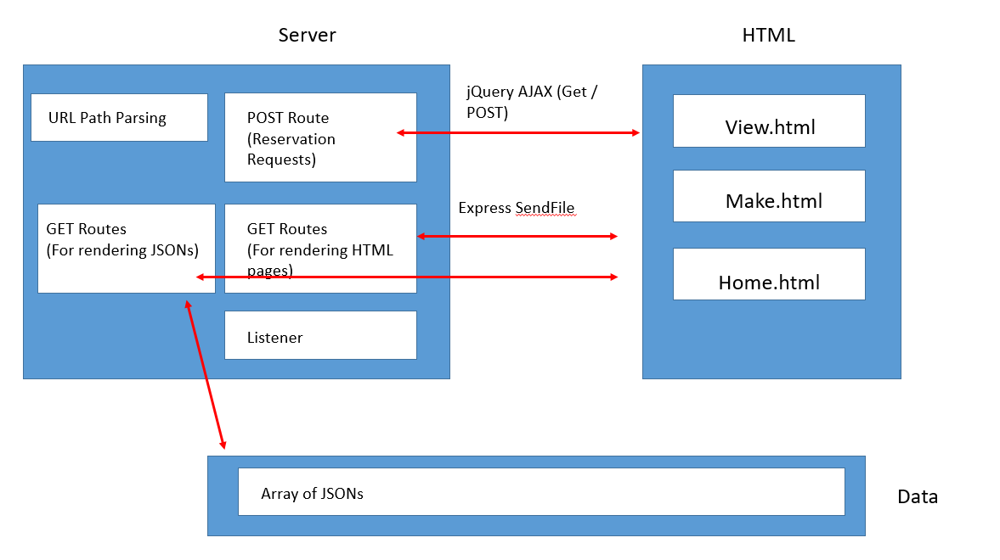
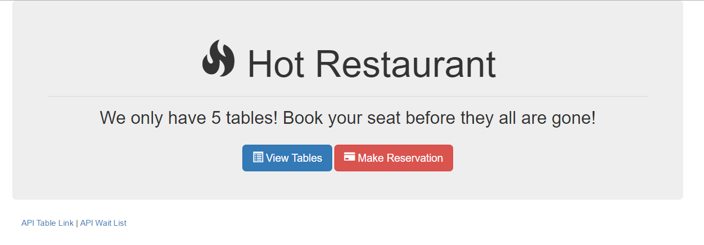
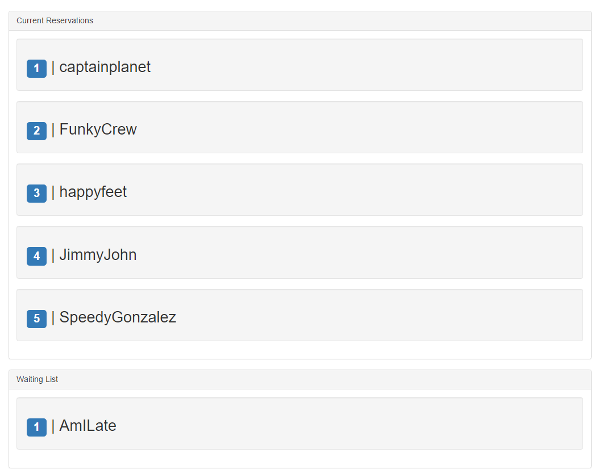
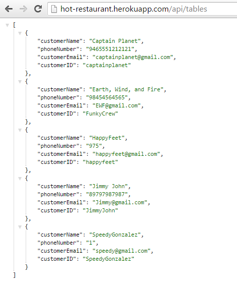
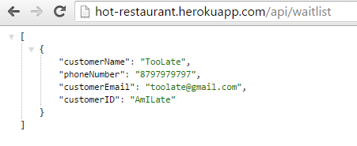

## 13.3 Lesson Plan - Hot Restaurant Activity (10:00 AM) <!--links--> &nbsp; [⬅️](../02-Day/02-Day-LessonPlan.md) &nbsp; [➡️](../../14-Week/01-Day/01-Day-LessonPlan.md)

### Overview

Today, we'll be asking students to create an Express based web application for handling reservation requests. In the process of building today's assignment, students will reinforce their understanding of Express Servers, Routing, and the utility AJAX for front-end interaction. 

`Summary: Complete activity 16 in Unit 13`

##### Attention: If you’re teaching a part time section and this isn’t a Saturday, please use the “Weekday” tab inside of the "03-Day-TimeTracker.xlsx" for activity lengths instead of those printed on this lesson plan

##### Instructor Priorities

* Students should be given the entire class to create today's activity. 
* Instructor/TAs should focus on providing students assistance in small-group format. 
* Students should complete the MySQL Checkpoint.

##### Instructor Notes

* Welcome back! Today's class will be one of the more challenging ones for students, as we will be pushing them to use their rudimentary skills with Node/Express to create a real-world application. The focus for the day is to immerse them in a build-it-first approach to learning. 

* Stronger students will find today's class refreshing because of the challenge, but weaker students may walk out fairly confused. 

* The emphasis for today's class is to let students drive and to assist them in _small groups_. Don't try to overly "walk" the entire class through the app via lecture today. Take the podium when necessary, share code when appropriate, but try to spend more of your time working with individual groups. What you will quickly find is that groups are in dramatically different places and often working through very specific issues. 

* Towards the end of class, let all students know that there is a thorough video outlining the solution to this activity that you will Slack out. (See Recap + Closing Thoughts) 

* Throughout today's class, constantly encourage students to look back at the previous activity from class on the Star Wars Express application. 

* Additionally, you may want to slack students a copy of the diagram below as a reference at some point during their coding. It may help them visualize the overall application they are building.

  

* Have your TAs reference [03-Day-TimeTracker](03-Day-TimeTracker.xlsx) to help keep track of time during class. 

### Sample Class Video (Highly Recommended)
* To view an example class lecture visit (Note video may not reflect latest lesson plan): [Class Video](https://codingbootcamp.hosted.panopto.com/Panopto/Pages/Viewer.aspx?id=9c15ad2a-bc31-4c06-9a73-e7827d4d2b07)

- - -

### Class Objectives

* To create a real-world application for handling reservations using Node/Express
* To complete the MySQL Checkpoint

- - -

### 1. Instructor Do: Welcome (5 mins)

* Welcome students to class. 

* Then when everyone gets settled give students a few moments to ask high-level questions regarding the previous class. 

* Let students know that the concepts covered this week regarding Node and Express servers are some of the most important concepts in the class. Let them know that it really gets to the heart of what full-stack web development is -- and for this reason, it's important they push themselves to learn it now.

* Slack out the below resources:

  * <https://scotch.io/tutorials/use-expressjs-to-get-url-and-post-parameters>

  * <https://scotch.io/tutorials/build-a-restful-api-using-node-and-express-4>

### 2. Instructor Do: Demo End Application (15 mins)

* Then begin to remind students that the best way to learn to code -- especially challenging concepts -- is sometimes just to force yourself to code. For this reason, today's class will be a 4-hour session in which you'll be building a real-world application that makes use of the concepts we're covering so far. 

* Slack out the following link: [hot-restaurant.herokuapp.com](http://hot-restaurant.herokuapp.com). 

  

* Then ask all students to make a Reservation request on the website. 

* Once they are done, visit the page: <http://hot-restaurant.herokuapp.com/tables>. Point out how their reservation requests have been captured and listed on the site. Depending on whether or not they were one of the first five requests, they were added to the reservation list -- otherwise they were put on the waitlist. 

  

* Then take a few moments to flip through the screens. Point out how there is a page for creating reservations, a page for viewing reservations, and two pages for viewing JSONs of the current reservations and waitlisted parties. 

  

  

* Let students know that they will be building this application from scratch over the course of the next few hours.
* Feel free to open up the `phases.md` file found in `16-HotRestaurant` folder and keep it on the screen during the development. Scroll down to the next phase when the time is up.

### 3. Instructor Do: Group Formation + Initial Instructions (10 mins)

* Have students divide themselves into groups of 4 (with 2 members from each section). 

* Then slack out the following instructions:

* **Instructions:**

  * Today you will be building a Node / Express based web applications for handling reservation requests. 

  * Your application will be made up of two parts: 1) A front-end set of HTML/CSS/JS pages for entering and viewing data and 2) A back-end composed of Node/Express and basic JS for storing, updating, and relaying reservation data.

  * Spend the time necessary to map this application out. Consider the concepts we've covered in class so far: 

    * Servers
    * Routing
    * APIs
    * AJAX (GET and POST Requests)

  * You should be referencing the code from the previous Star Wars application.

  * Feel encouraged to use the following application as a reference: <http://hot-restaurant.herokuapp.com/>

  * Note: We know this is a hard activity. We know you aren't yet comfortable with Node or Express. But push yourself. The best way to learn is to push through the discomfort and BUILD! Ask for help when you need it. We're here to help you through the process.

  * **Bonus:**

    * If by some miracle you finish early, feel encouraged to work on any one of these additional tasks to take your application to the next level.

      * Add code to your server so that it "counts" every time a person visits any of the pages. Display a running count on the website. 

      * Add buttons for "checking off" individuals from the reservation list. Once this happens, the next person on the waitlist should be addd to the main reservation list.

      * Add a button for sending emails to individuals on the wait-list letting them know they have a table ready. You will need to use node-mailer or a similar npm package to make this work. (A hard task, but very cool).

      * Add a button for sending text messages to individuals on the wait-list letting them know they have a table ready. You will need to use the Twilio library to make this work. (A hard task, but very cool). 

* Let them know that you will be providing them with guidance on how to proceed every 20 minutes or so. 

### 4. Partners Do: Phase I - Pseudocode (15 mins)

* For this first phase, slack out the following instructions:

* **Instructions:**

  * Phase I: For this first phase, aim to write out the pieces that will need to be programmed to create the functionality of your application. Try to break it into 6-7 pieces.

* **Instructors/TAs:** Once time is up have students share their breakdowns. As a suggestion, here is a list that you can slack them. 

  * Create the front-end (visuals) for home page, reservation form, and reservation views.

  * Create a basic server using Express.JS

  * Create a few array variables that will hold the data

  * Create a set of routes for getting and posting table data

  * Create a set of routes for displaying the HTML pages

  * Use jQuery to run AJAX calls to GET and POST data from users to the Express server

### 5. Partners Do: Phase II - Frontend + Server Creation (20 mins) (Critical)

* Proceed with the next phase. Slack out the following instructions to help guide them:

* **Instructions:**

  * Phase II: For this second phase, aim to complete the following:

    * Backend Team: 

      * Create a basic Express server. 

      * Your server at this point should do the BARE MINIMUM. (Effectively, it should just say: "Listening at PORT 3000" when the command `node server.js` is run.)

    * Frontend Team:

      * Create three HTML files one called `home.html`, another called `tables.html`, and another called `reserve.html`. Use dummy data and create pages similar to the one shown to you on the sample Hot Reservation webpage.

    * All: If you finish early, begin thinking about how the Data, API, and Routes should look.

* **Instructors/TAs:**

  * Have students who accomplished this task share their code with you (via GitHub) and display it on screen. Then have them come up and talk about what they did. 

### 6. Partners Do: Phase III - API Routing + Frontend Delivery (40 mins) (Critical)

* Proceed with the next phase. Slack out the following instructions to help guide them:

  * Phase III: For this third phase, aim to complete the following:

    * Backend Team: 

      * Create a set of variables (hint: arrays of objects) for holding the reservation and waitlist data 

      * Create a set of routes that then display this data as JSONs. Users should be given these JSONs if they visit the appropriate page (i.e. if a user visits `localhost:3000/api/tables` they should see a JSON of table data).

    * Frontend Team:

      * Temporarily join the backend team. Your task will be to create Express routes that display your HTML pages when a user visits the appropriate page. (i.e. if a user visits `localhost:3000/tables`... they should be shown the `table.html` page.) 

      * If you finish early begin creating the code necessary to convert your form data into JSON objects. 

- - -

### 7. Break (35 mins)

- - -

### 8. Partners Do: Phase IV - Backend Logic + AJAX (60 mins) (High)

* Proceed with the next phase. Slack out the following instructions to help guide them:

  * Phase IV: For this fourth phase, aim to complete the following:

    * Backend Team: 

      * Create the logic that handles reservation requests. Your code should work such that POST requests take in JSON objects, checks if there is any space left, then adds the JSON object to either the reservation array or the waitlist array. Your POST route should also respond to requests with a confirmation (true or false) of whether or not the requestor has a reservation (or is on the waiting list).

      * You should be using Postman to do all your testing at this point.

    * Frontend Team:

      * Begin to do serious research on AJAX. Specifically, focus your attention on how AJAX can be used to do both GET and POST requests. 

      * Then create the necessary code on your `tables.html` page such that it can retrieve data from the Backend Team's API. In essence you will be creating an AJAX GET request to retrieve the data.

      * Then create the necessary code on your `reserve.html` page such that it can send data to the Backend Team's API. In essence you will be creating an AJAX POST request to send the data. 

    * All: This is the most challenging part of today's activity. Be persistent! You can do this!

### 9. Partners Do: Phase V - De-bugging + Bonus (20 mins)

* Proceed with the final phase. Slack out the following instructions to help guide them:

  * Phase V: For the fifth and final phase, aim to complete the following:

    * All: 

      * Complete any remaining functionality from the previous phase if you need more time. 

      * Then, thoroughly test your application for bugs. Check if there are any obvious ways to crash the application. 

      * Then, if you have more time -- begin to tackle any bonus of your choice. 

### 10. Instructor Do: Recap (5 mins)

* Take the stage again. Let students know that this was a hard activity but an incredibly realistic one. 

* Encourage them by informing them that they've reached a highly significant point in their coding careers. Being able to build front-end and back-end applications like this one will allow them to build any number of applications. 

* Slack out the [video solution](https://youtu.be/G7RvQMW2DOg?list=PLgJ8UgkiorCmI_wKKVt5FlkTG63sQF6rr) and HIGHLY HIGHLY encourage them to review it on their own. Let them know that the accompanying code has been thoroughly commented and that they should consider working in groups to dissect it. 

### 11. Instructor Do: Introduce Checkpoint - MySQL (5 mins) (Critical) 

* Let your class know that they will now be taking a short multiple choice assessment to check their understanding of MySQL

* DO NOT SKIP THIS INTRODUCTION. DO NOT JUST SEND OUT THE LINK WITHOUT CONTEXT

* Reassure the students that they need not be nervous about the Checkpoint:

  * "This will not affect your grade or graduation requirements."

  * "This is not like the tests and quizzes you might be used to from school or college. The purpose of these tests is not to motivate you to study or punish you for struggling."

  * "This is as much a test of me as an instructor and of the course content as it is of you. We are here to ensure your success, and this is one of the tools we use to make sure we are doing that effectively. This class moves _fast_, so if some or all of you misunderstand something important we as an instructional team need to find out as fast as possible so we can help."

  * "Long story short, this quiz can not hurt you. Only help you."

* Let students know that they should read carefully and focus on thinking about the right answer rather than using any test-taking skills they may have learned:

  * "There are no silly answers or obvious throwaway responses on this quiz, because those kinds of answers reduce the likelihood that we'll be able to figure out whether we've taught something effectively."

  * "Test taking strategies you may have learned for standardized tests _will not work_, so instead of focusing on eliminating wrong answers or looking for sneaky context cues, read the question and each of the possible choices carefully."

* Reassure students once again that the purpose of this is to help them, and remind them that the outcome does not impact their grade or graduation requirements. You should do this _every single time_ you give an Checkpoint.

* You or your TAs should now get the link specific to your class:

  * Navigate in your browser to: `https://www.switchboard.tech`

  * Select your class code (if it doesn't show up on its own)
  
    * For parallel cohorts (two classes combined on a Saturday) and doing a Checkpoint: You will **need** to select the classes in your cohort. You can multi select the cards by clicking the class that you need.

    * The class roster will be in the **one** link.

  * Select the Checkpoint and copy the resulting link

### 12. Students do: Take Checkpoint - MySQL (10 mins) (Critical)

* Slack out the link to the Checkpoint

* Let your students know that once they select their name, it will take them to the quiz

* Checkpoints must be completed in class, **not at home**, to ensure you will be able to effectively find and help struggling students 

* TAs should walk around the class to ensure students aren't looking up answers

* Keep in mind we do not use grades from assessments toward graduation requirements. However, students will be tempted to avoid feeling like they don't understand something.

* It's important for instructional teams to create an environment where it is safe to fail, but also where such failure is visible. You should not be worried about "cheating" on checkpoints, only making sure that students who need help aren't remaining invisible.

* Your SSM will have the results of the Checkpoint within an hour of its completion

### 13. End (0 mins)

### 14. TAs Do: Structured Office Hours - Review MySQL (30 min)

* Navigate in your browser to: `https://github.com/coding-boot-camp/checkpoint-bank/blob/master/checkpoints/multiple-choice/08-SQL-MC/08-SQL-MC.md`

* There you will find the questions and answers to the Checkpoint given.

* Please take the entire office hours time to review the questions with the students.

* Suggestion Format:

  * TAs ask a question at a time to the class.

  * Let the students try to answer it.

    * If you see that a majority of the class has a misunderstanding with a question:

      * Take your time on this question!

    * If you see that a small number of students has a misunderstanding with a question:

      * Do your best to reinforce the misunderstanding but be cautious of your time.

      * Make note of the students that are still struggling with the question and schedule a 1:1 with the students.

  * If applicable, demo the answer.

* Take your time on these questions!

* This is a great time to reinforce concepts and misunderstandings!

# Instructor Do: Private Self-Reflection (0 min)

Take some time on your own after class to think about the following questions. If there's anything that you're not sure how to answer, feel free to reach out to the curriculum team!

1. How did today's class go?
2. How did you teach it?
3. How well do you feel you did teaching it?
4. Why are you teaching it?
5. Why did you teach it that way?
6. What evidence can I collect to show my students are understanding?
7. How will my students know they are getting it?

### Lesson Plan Feedback

How did today's class go?

[Went Well](http://www.surveygizmo.com/s3/4325914/FS-Curriculum-Feedback?format=pt&sentiment=positive&lesson=13.03)

[Went Poorly](http://www.surveygizmo.com/s3/4325914/FS-Curriculum-Feedback?format=pt&sentiment=negative&lesson=13.03)
