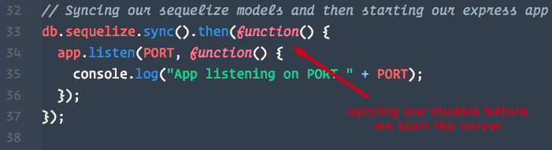
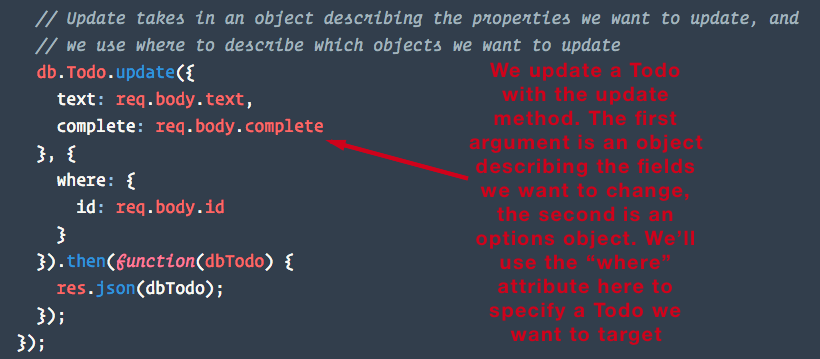
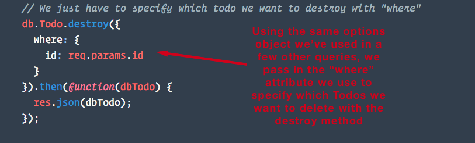
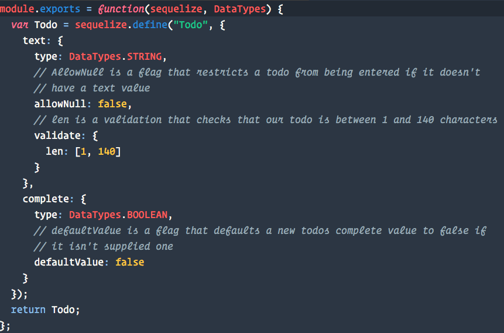

## 15.2 Lesson Plan - Getting In The CRUD with Sequelize <!--links--> &nbsp; [⬅️](../01-Day/01-Day-LessonPlan.md) &nbsp; [➡️](../03-Day/03-Day-LessonPlan.md)

### Overview

In today's class, we'll introduce new Sequelize methods for updating and deleting records with as well as introduce some useful validations.

`Summary: Complete activities 7-10 in Unit 15`

* When using any of the `Supplemental PDFs`, please download and open. Do NOT preview on GitHub as they may not display properly in the browser.

##### Instructor Priorities

* Students should know how to perform each CRUD action using Sequelize.

* Students should become familiar with the "where" query attribute to filter items from our database.

* Students should become more comfortable converting a project using a different ORM to use Sequelize, as well as understand what's needed to set Sequelize up from scratch.

* Student's should also understand how through the use of validations on their models, they can restrict what type of data can be saved into their databases.

##### Instructor Notes

* Once again, **THIS IS TOUGH STUFF!** This week, tell your class to not feel discouraged if there are concepts that they can't nail down completely. Tell them to try their best, but to speak with you or a TA if they're unsure of anything.

* Be sure to look at the solutions to each activity before the lecture begins, and to run the server files in each folder to see how they should run.

* Make sure you have a MySQL database named "todolist" created on your machine before class starts. Try and familiarize yourself with how the todolist app is supposed to work.

* Again, **BE VERY CAREFUL TO NOT GO TOO IN DEPTH.** There are a ton of working parts in these directories, but focus on what we mention in the lesson plan.

* **Important**: For this class, well be working with the same application, converting it over to use Sequelize and adding some additional functionality. As we're going along doing this, the app will break. It won't be fully functioning till towards the end, but the instructions for each activity will how to verify that it was done correctly, i.e. "sequelize should have created a table with these values". 

* **If your class finishes early, feel free to have them get a head start on the homework.** They should know everything they need to know to complete the basic solution by the end of this class.

### Sample Class Video (Highly Recommended)
* To view an example class lecture visit (Note video may not reflect latest lesson plan): [Class Video](https://codingbootcamp.hosted.panopto.com/Panopto/Pages/Viewer.aspx?id=a53d2308-9c00-4be1-b8d0-664721bb4a03)

- - -

### Class Objectives

* To provide students a refresher on setting up a project to work with Sequelize.

* To review the creation of models using Sequelize.

* To review Sequelize CRUD methods introduced in the last class and to introduce methods for updating and deleting database entries.

* To introduce the concept of validations and how they can be used to further restrict what kind of data can be stored in the database.

* Students will create a blog app with a content management system that can be used to update its data.

- - -

### 0. Instructor Do: Welcome Students (1 min)

* Say your hellos and welcome your class.

- - -

### 1. Instructor Do: Pulse Check and Sequelize Review (10 min)

* Ask students how the week is going so far, and what they think of Sequelize.

  * Answer any questions students might have about using the package

* Give them a quick back and forth on some of the basics of Sequelize.
  * What is Sequelize?
    * An ORM designed for Node that lets users handle complex SQL database queries with JavaScript methods, rather than typing out SQL code.

  * What is a Sequelize model?

    * A representation of a table as a JavaScript object that Sequelize uses to help expedite the coding of data queries.

  * What Sequelize CRUD methods did we already go over?
    * findOne
    * findAll
    * create

- - -

### 2. Instructor Do: TodoList Demo (10 mins)

* Praise your students for picking up the concepts you just discussed, but just to be sure you're on the same plane, you have an exercise for them to do.

* Inform students that today they are going to play the role of a backend developer. We have a todo list app that previously was using a simple ORM to communicate with a database, but now we're coming in to perform a few upgrades.

* Open the `10-Sequelize-Validations/Solved`  folder. In terminal run `npm install` and then `node server`. Navigate to `localhost:8080` and explain to your students that by the end of class they will have fully converted this todo list app to use sequelize instead of the ORM its currently using.

* Let students know that this application makes use of each CRUD action. It allows the user to CREATE new todo items, it READS todos from the database, it allows the user to UPDATE current todo items, and allows a user to DELETE todos.

* Be sure to demonstrate each piece of functionality to the class. You can toggle a todo's edit mode by clicking it. Inform them that they will be converting one piece of functionality at a time per activity, and **things will inevitably break temporarily while we're doing that**. This is important to keep in mind as we'll be working with the same application throughout this lesson.

* Inform students they won't need to (and shouldn't) touch any front end JavaScript or HTML.

* Answer any questions before the exercise begins.

- - -

### 3. Warm Up: Connect to Sequelize and Create a Todo Model (30 mins)

Slack out the following folder and instructions:

* Folder: `07-ORM-To-Sequelize/Unsolved`

* INSTRUCTIONS:

  1) Create a new local MYSQL database called 'todolist', but don't create any tables.

  2) Delete any references to the orm.js file inside the `api-routes.js` file.

  3) Delete the config folder.

  4) While inside the activity folder, run npm install in terminal.

  5) In terminal, type in the following command: "sequelize init:models & sequelize init:config". If this produces an error, then you may not have the sequelize and the sequelize-cli installed globally. Fix this by running `npm install -g sequelize sequelize-cli` in your terminal and trying again.

  6) Step 5 should have created a config and a models folder for us. Navigate to the config folder, open `config.json`, and modify the development object's "database","username" and "password" values to match your MYSQL database on your machine.

  7) Navigate to the models folder and create a new file called `todo.js`. Create a Todo model with columns for "text" (DataTypes.STRING), and "complete" (DataTypes.BOOLEAN).

  8) Navigate to the server.js file and require all of our models by requiring the models folder. Save this to a variable and name it "db".

  9) Sync the models by running db.sequelize.sync() before we start the express server.

  10) In your terminal, run "node server". Check MYSQL Workbench to see if a Todos table was created. If so, you were successful. If not, check your terminal for any errors.

**Refer to the Sequelize Quick Start Guide in the Supplemental folder if you experience any issues**

- - -

### 4. Instructor Do: Review the ORM-To-Sequelize Activity (10 mins)

* When time's up, load up the `07-ORM-To-Sequelize/Solved` solution on your machine. Be sure to show students your `config.json` file as well as your Todo model.
  

* Then highlight the fact that we sync() our models in the `server.js` file before we start our server. This is what ensures our tables are created and ready when we try and start up our express server.
  

* Show them where our models are required inside of the `api-routes.js` file where will use it in the next exercise.

* Show students how the Todos table its made for us when we run `node server` and our database syncs.

* Inform the class that they will be implementing functionality to retrieve Todos from the database using the Sequelize "findAll" and "create" methods.

- - -

### 5. Partners Do: findAll and create (15 mins)

Slack out the following folder and instructions:

* Folder: `08-Sequelize-Create-Read/Unsolved`

* INSTRUCTIONS:

  1) Open the folder and run `npm install`.

  2) Update the `config.json` file's development object with your own local MYSQL database settings.

  3) Navigate to the `api-routes.js` folder.

  4) Add a Sequelize findAll method inside the GET route which finds all of the todos and returns them to the user as JSON.

  5) Add a Sequelize create method to the POST route to save a new todo to the database using the data sent to the server in req.body.

  6) To test if this worked, open your terminal and run `node server` and navigate to localhost:8080. If you are able to save new todos, you were successful.

  7) Hint: We can access the Todo model here with "db.Todo"

  If you get stuck or finish early, check out the Sequelize Star Wars solution from last class, or try and see if you and your partner can make sense of Sequelize's docs for the findAll and create methods

  <http://docs.sequelizejs.com/class/lib/model.js~Model.html#static-method-findAll>

  <http://docs.sequelizejs.com/class/lib/model.js~Model.html#static-method-create>

- - -

### 6. Everyone Do: Review findAll and create (10 mins)

* Go through the `08-Sequelize-Create-Read/Solved` as a class.

* Point out how in the `api-routes.js` file, the db.Todo.create method takes in an object with the values we want our new Todo to have as an argument.
  

* Run the app, create a new todo and open your terminal. There will be a console log of the data being passed to the db.Todo.create method, as well as the MySQL code this executes.

* **Note**: If we were to `console.log` the `dbTodo` object returned from a sequelize query, we'd see that it is a large object with many nested keys and methods. It contains a `dataValues` property that contains the record data we're looking for.

  * When we send the large `dbTodo` object back to the client using `res.json`, only the `dataValues` property is sent back.

  * This is worth knowing since it may come up when debugging students code.

* Answer any remaining questions about this exercise.

- - -

### 7. Instructor Demo: Update and Delete (5 mins)

* Inform students that now they will be working on functionality to delete todos and to update todos.

* Open the solved file `09-Sequelize-Update-Delete/Solved` and run the program. Show students how they can delete todo items by clicking the `x` button on the todo. Refresh the page to prove that todo is gone.

* Demonstrate how when clicking a todo item, you can update the todos text. After editing, hit "Enter" to finish editing, or click anywhere else on the page to cancel editing. Also demonstrate how clicking the check mark toggles a todo's complete property. Refresh the page again to prove this works.

- - -

### 8. Partners Do: Update and Delete (20 mins)

* Slack out the following folder and instructions.

  * Folder: `09-Sequelize-Update-Delete/Unsolved`.

* INSTRUCTIONS:

   1) Open the folder slacked out to you

   2) Run `npm install`

   3) Update the `config.json` file's development object with your own local MYSQL database settings.

   4) Inside the `api-routes.js` file, look for the DELETE route and add a Sequelize method to delete the todo with the id available to us in `req.params.id`.

   5) Inside of the same file, look for the PUT route and add a Sequelize method to update a todo with the new todo data available to us inside req.body.

   6) Again, you won't need to touch the front end HTML or JavaScript to make any of this work.

   7) **HINT**: you will need to pass in an options object with a "where" attribute into both methods in order to filter these queries to target the Todos we want to update or delete.
   <http://docs.sequelizejs.com/en/latest/docs/querying/#where>

   8) Navigate to localhost:8080. If you can update and delete todos without errors, you were successful.

   9) If you get stuck or finish early, discuss the documentation for the `update` and `destroy` methods with your partner here:

   <http://docs.sequelizejs.com/class/lib/model.js~Model.html#static-method-update>

   <http://docs.sequelizejs.com/class/lib/model.js~Model.html#static-method-destroy>

**Instructors and TA's should be walking around offering support during this exercise**

### Everyone Do: Break! (15 mins)

- - -

### 9. Everyone Do: Review Update and Delete (15 mins)

* Slack out the `09-Sequelize-Update-Delete/Solved` folder and have students explain to you how the "where" query attribute works when it comes to filtering the records you want to query.
  
  

* Inform students that now that they have a good grasp on CRUD actions with Sequelize, as well as how to filter queries with "where", they already know how to do what they'll be doing 80% of the time with an ORM.

* Answer any remaining questions about this exercise.

* Explain to students that at first the Sequelize documentation can be a little difficult to navigate, but after understanding the basics they're much more useful.

* Thank students for working to find answers to the past few exercises. Reading documentation is it's own skill they'll become better at with practice. In the meantime, we've created a Sequelize CRUD actions cheat sheet for them that should make basic usage much easier.

* Slack out the Sequelize CRUD actions cheat sheet `Supplemental/SequelizeCRUDActionsCheatSheet.pdf` 

- - -

### 10. Instructor Do: Validations (5 mins)

* Explain to the class that as some of them may have already noticed, there's a small flaw with our todolist application. And that is that while our Todos table's text column won't save any data type other than a Sequelize.STRING, it is possible to save a todo with empty text or even one with a null text value.

* While it is possible to restrict this functionality client side (and we definitely should at some point), if someone knew how to use Chrome Developer Tools, they could circumvent any restrictions we put in our front-end JavaScript.

* Knowing that any code we write on the client is potentially available for the user to tamper with. Ask the class what steps we might be able to take on the back end to validate what we're receiving to put into our database.

- - -

### 11. Everyone Do: Discuss With Partners (10 mins)

* Have the class discuss with their partners for a few minutes about what options we may have to further restrict what kinds of data can be saved into our Todos table.

* After a few minutes have any volunteers suggest their solutions. Most likely suggestions will be to have a conditional that checks the value before trying to insert it. Some may suggest that Sequelize may have something built in for this.

* Inform students that Sequelize does indeed have built in validations and flags we can include with our models.

* An example of a validation might include making sure that text is a URL or email, or that a credit card number is formatted correctly.

* A flag might include making sure a value is not null before entering it into the database or having a default value for a field if one is not supplied.

* The difference is that flags are ways for us to implement MYSQL constraints we're already familiar with such as "NOT NULL" or "DEFAULT" and validations are additional built in or custom methods we can run before Sequelize inserts a record.

- - -

### 12. Partners Do: Sequelize Validations (15 mins)

* Slack out the following folder in `Activities/10-Sequelize-Validations`

  * Folder: `10-Sequelize-Validations/Unsolved`

* INSTRUCTIONS:

  1) Open the folder slacked out to you.

  2) Run `npm install`.

  3) Update the `config.json` file's development object with your own local MYSQL database settings.

  4) Modify the `todo.js` file so that the Todo model has a flag to prevent the text field from being null. Also add a validation to make sure the text field is at least one character, but no more than 140 characters.

  5) Modify the complete field in our Todo model so that it supplies a default value of false if one is not supplied during Todo creation.

  6) Once a Sequelize model has been created and synced for the first time, any changes we make to our Todo model won't be picked up by our database. The easiest way to get around this during the development process is to pass "{ force: true }" as an argument into our sync method inside `server.js` file. This will make it so that every time we run our app, our Todos table will be dropped and recreated with the new configuration. More info here under: <http://docs.sequelizejs.com/class/lib/sequelize.js~Sequelize.html#instance-method-sync>

  7) Navigate to localhost:8080 to test that this worked. Try to save a Todo without any text in it, and then try and save a Todo with over 140 characters. If these didn't save and you see errors in your console that have to do with validation, you were successful.

  8) **Big Hint**: Sequelize documentation on validations with examples can be found here: <http://docs.sequelizejs.com/en/latest/docs/models-definition/#validations>

- - -

### 13. Instructor: Review Validations and Dismiss Class (10 mins)

* Slack out `10-Sequelize-Validations/Solved` and show students how we added validations and flags to the Todo model. Go through each new item and have students try and explain to you what they believe each piece of new code does.
  

* Assure students there's no need to memorize these. Validations are some of the easier things to look up in the Sequelize documentation. Or even easier, refer back to this project.

* Inform the class that we've just covered a lot of ground today. We've learned everything and more needed to complete this week's homework assignment. If they feel they haven't caught onto everything, encourage them to continue practicing, check out the solution files, and browse through the Sequelize documentation. Of course, they can also talk to you or a TA between classes for one-on-one advice.

### Lesson Plan Feedback

How did today's class go?

[Went Well](http://www.surveygizmo.com/s3/4325914/FS-Curriculum-Feedback?format=pt&sentiment=positive&lesson=15.02)

[Went Poorly](http://www.surveygizmo.com/s3/4325914/FS-Curriculum-Feedback?format=pt&sentiment=negative&lesson=15.02)
