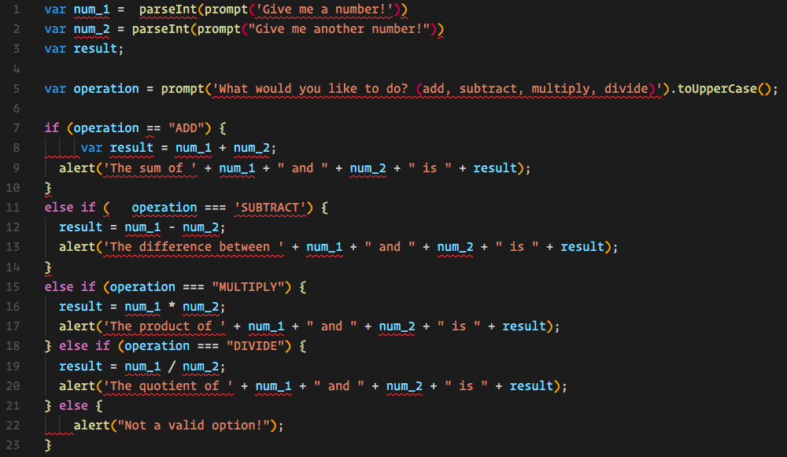

## 16.1 Lesson Plan - Linting & Projects (6:30 PM) <!--links--> &nbsp; [⬅️](../../15-Week/03-Day/03-Day-LessonPlan.md) &nbsp; [➡️](../02-Day/02-Day-LessonPlan.md)

### Overview

* Today's class will be focused on introducing students to project 2 requirements, introducing them to the concept of JavaScript linting and continuous integration with Travis.

* Students will begin work on their second project

##### Instructor Priorities

* Students will be given requirements for Project 2.

* Students will be able to create a repository on GitHub and add collaborators.

* Students will be introduced to the concept of linting.

* Students will set up Travis CI to enforce project linting rules.

* Students will brainstorm project ideas, research APIs, and begin initial planning of their projects.

* Students will submit a project proposal (ideas, outlines, APIs) by end of class for feedback.

---

##### Instructor Notes

* Praise students for making it to their second group projects.

* Leverage the TAs to help any groups lagging behind during the lesson. We want to give students as much time to brainstorm project ideas as possible.

* Instructors / TAs, take a few moments before class to review the presentations posted on this link: <https://www.youtube.com/playlist?list=PLe80S_8KApqOTw-2-b-sgzTwwWImepoii>. Do not share these with students as they are Rutgers Specific &mdash; however, use the insight you gain in watching these videos to understand what's possible.

* This week students will have a little less in class time to work on projects. In order to offset this we've provided them with some starter code they can use for their second projects. Take some time to familiarize yourself with the [Project 2 Starter activity](../../../../01-Class-Content/16-project-2/01-Activities/04-Stu_Project-Starter) and be prepared to frame this as a huge time saver for them.

---

##### Class Objectives

* Project groups will create a project repo and add members as collaborators.

* Students will have a project set up with linting and using Travis CI.

* Students will submit a project proposal (ideas, outlines, APIs) by end of class for feedback.

---

### 1. Instructor Do: Welcome Students (3 min)

* Welcome students and explain that as we enter project # 2, we're going to start thinking a little more about _code quality_. Today we'll cover using a JavaScript linter and Travis CI checks to achieve this.

* Explain that later this week we'll also cover the basics of agile development and testing web applications. 

* Unlike project 1, we'll be providing students with some boilerplate code they can use to jump start their applications. Stress that despite the other material we have to cover this week, this will save them time and ensure they can dive in building features for their apps.

* Assure the class that they'll have plenty of time to brainstorm project ideas before submitting their proposals for review by the end of class.

* Students should sit with their groups during today's activities and work to follow along with the examples.

### 2. Instructor Do: Project 2 Slides (10 min)

* Go through the [Slides](../Project-Resources/Slide-Shows/DataProject.pptx) as a class.

* Slack out the [requirements for project 2](../Project-Resources/README.md).

* Answer any questions about project requirements.

### 3. Groups Do: Create a Repository (10 mins)

* Have students sit with their project groups as they create project repos and invite each other as collaborators.

* Refer to `16-project-2/01-Activities/01-Stu_Create-Repository`, which contains the following instructions:

* **Instructions**:

```
* One group member should create a new Github repo for the project.

* Protect the repo's master branch as we did during project 1.

  * Once at the repo's page, click the "Settings" tab.

  * Select "Branches" from the left sidebar.

  * Under "Branch protection rules", choose "master" from the dropdown.

  * Check off the following options:

    * "Protect this branch"

    * "Require pull request reviews before merging"

    * "Include administrators"

    * "Require status checks to pass before merging"

    * "Require branches to be up to date before merging"
  
  * Click "Save changes"

* Once complete, invite the other group members as collaborators.
```

### 4. Instructor Do: Linting Overview (5 mins)

* Explain that now we'll discuss linting code with JavaScript.

  * Ask the class: "Can anyone tell me what a JavaScript linter is? Or why we would use one?"

    * A linter is a tool that we can use to analyze our code for potential errors as we're writing it. Linters can also be used to enforce particular styles of coding based on rules we can turn on or off.

    * Linters are useful because they can help teams write more consistent and readable code according to what they consider to be best practices. They're also helpful for identifying potential errors before the code is even run, thus improving overall code quality.

* Exposing students to linting will help during group projects and beyond as most software development teams use some kind of linter to maintain readable and consistent code quality.

* Explain that there are a few different libraries available for linting JavaScript code, but the one we'll be working with is the most popular: [eslint](https://eslint.org/).

* Take a moment to answer any high-level questions about linting, but avoid getting too off track as students will see how eslint works for themselves in the next activity.

### 5. Partners Do: No Lint Example (5 mins)

* In this activity students will examine a JavaScript file without eslint and attempt to identify issues with the code.

* Refer to `16-project-2/01-Activities/02-Stu_No-Lint-Example`, which contains the following instructions:

* **Instructions**:

```
* Before looking at any code, open Unsolved/index.html in your web browser and study the rendered application.

  * This simple example prompts the user for 2 numbers, and then what sort of mathematical operation they would like to perform. The result is then alerted back to the user.

* Now open Unsolved/example.js in your editor.

  * For what this application is supposed to do, the code works perfectly.

* Discuss with your partner: Even though the code works, what's wrong with it?
```

### 6. Instructor Do: Review No Lint Example (5 mins)

* As a class, go over the previous activity's [solution](../../../../01-Class-Content/16-project-2/01-Activities/02-Stu_No-Lint-Example/Solved/README.md) comparing each point to parts of the code being referred to.

* Explain that while none of these are actual JavaScript errors, consistency is important because it makes code easier to understand, especially if working on a team with others. Additionally having a linter helps ensure code reviews aren't just nitpicks over stylistic opinions.

* Take a moment to answer any questions but inform the class that in the next activity we'll fix the project using eslint.

### 7. Partners Do: Eslint Example (5 mins)

* In this activity students will use eslint to fix issues with the calculator app from the previous activity.

* Refer to `16-project-2/01-Activities/03-Stu_Eslint-Example`, which contains the following instructions:

* **Instructions**:

```
* Install the [VS Code Eslint Extension](https://marketplace.visualstudio.com/items?itemName=dbaeumer.vscode-eslint).

* Open the Unsolved folder and run `npm install` from your terminal to install dependencies.

* Now open Unsolved/example.js in your code editor. If you were able to complete the previous steps correctly, you should see red annotations under different parts of the code. Hovering over each displays a popover with an eslint rule being broken.

* Work to fix each part of the annotated code.

* **Bonus**:

* Try changing the quote style to enforce single-quotes instead of double-quotes.

* **Hints**:

* If you're unsure about what an eslint rule is asking for, type it into Google for examples.
```

### 8. Instructor Do: Review Eslint Example (5 mins)

* Demonstrate how hovering over the annotations in the `example.js` file brings up the eslint rule being broken in the file.

  

* Explain that eslint is an npm package that must be installed. The VS Code extension gives us the annotations over our files so we know what to fix in the moment, but only works if we have the eslint npm package installed.

* Additionally eslint provides a cli tool we can use. Run the following command in your terminal to demonstrate this:

  ```
  npm run lint
  ```

* If you haven't already gone ahead and fixed all the lint errors in the `example.js` file, you should receive errors in the console. Scroll up to see the specific eslint errors and their line numbers.

* Ask the class: "Where do you think the the eslint rules are being set?

  * The `.eslintrc.json` file.

* Demonstrate the `.eslintrc.json` file for the class. Explain that this file contains the rules we want eslint to enforce for us. A list of eslint rules and how to use them can be found at [eslint.org](https://eslint.org/docs/rules/).

  * Eslint also includes the ability to share configs. Companies like Google and AirBnB create and publicly share their own configurations based on style guides used at their companies.

  * Students can look into how to use these if they wish, but they may find them to be much more restrictive than the simple one we're using now.

* Stress that changing conventions used in a project is now as easy as changing an eslint config. If the team decide they would prefer to indent 4 spaces instead of 4 or would prefer single quotes over double quotes, all we need to do is change a rule in the eslint config.

  * Being able to do this so easily helps us stay productive and minimize distractions. Without a linter, getting the entire team on board with and using a new convention could be a much more tedious and stressful process.

* Suggest that students use at least the basic eslint config provided for them in their projects. Take a moment to answer any additional questions.

### 9. Instructor Do: Introduce Project 2 Starter (8 mins)

* In the last project, students should have started with an MVP and then layered on changes. This time, we're giving them a starter project to work with, so instead of doing the initial setup themselves, they're going to write user stories and open issues to layer changes to it.

* Assure the class that it's very common to begin a new project using some kind of pre-built boilerplate as it saves time.

* Open [04-Stu_Project-Starter/Unsolved](../../../../01-Class-Content/16-project-2/01-Activities/04-Stu_Project-Starter/Unsolved) in your editor, run `npm install`, followed by `node server`. Take a moment to demonstrate the rendered application and some of is code.

* Be sure to point out the following:

  * The project starter already has express, handlebars, and sequelize set up.

  * The project starter has a basic linter set up.

  * The project starter has a `.travis.yml` file. This will be be largely ignored, but it will be used to make sure that only code that passes the linter can be merged into the Github master branch.

  * Students will need to change a few things for their own apps, but this will be much quicker to get started than beginning from scratch.

* Change the indentation of a few lines of JavaScript code and demonstrate how running `npm run lint` logs these as errors to the console.

  * Lint errors can be fixed manually, or by running `npm run fix` in the terminal. This will fix any errors automatically fixable by eslint across all files. This doesn't fix _all_ lint errors, but it will quickly take care of most.

* Take a moment to answer any high-level questions. In the next activity groups will add this setup to their empty project repos.

### 10. Groups Do: Project 2 Starter (10 mins)

* In this activity students will add the provided Project 2 Starter code to their group project repos.

* Instructional staff should be walking around making sure each group is successful.

* Stress that once groups have this initial boilerplate added to their project repos, all they need to do now is submit smaller pull-requests to layer on each new change.

* Refer to `16-project-2/01-Activities/04-Stu_Project-Starter`, which contains the following instructions:

* **Instructions**:

```
* Only one member of each group should complete this activity while the others watch.

* Copy the entire Unsolved folder to another location on your computers &mdash; wherever you would like your local copy of the group project to be.

* Rename the copied "Unsolved" folder to the name of your project.

* Open the copied project folder's `package.json` file and change its `name` property to the name of your project, e.g. `bathroom-finder-v2`. If you're unsure now, leave this field as is &mdash; it can be changed later.

* CD to the root of the copied project folder with your terminal and run the following commands:

  git init
  git add .
  git commit -m "Initial commit"

* Then copy the GitHub repo's remote SSH URL (the same URL you'd use to clone the repo).

* Run the following commands in your terminal, replacing <remote-url> with your GitHub repo's remote SSH URL.

  git remote add origin <remote-url>
  git push origin master

* If completed successfully you should see all of the files uploaded to GitHub.

* All other group members should now clone the repo.

* Discuss as a group:

  * How would you now add changes to this project?
```

### 11. Instructor Do: Introduce Travis CI (5 mins)

* Explain to the class that linters aren't very helpful if some group members choose to ignore their rules.

* Explain that in the next activity we're going to set up Travis CI (Continuous Integration).

  * Travis will prevent any code from being merged into master that doesn't pass the linter.

  * Travis will run a check on any new branches PR'd against master. This check may take a minute, but you will only be allowed to merge the code if the lint passes. Otherwise whoever made the PR will have to fix their code and try again.

* Take a moment to answer any questions. Students will follow step-by-step instructions to add Travis to their repos in the next activity.

### 12. Students Do: Travis Setup (10 mins)

* In this activity students will add Travis CI to their projects.

* Instructional staff should be walking around answering questions and making sure groups can complete the activity.

* Refer to `16-project-2/01-Activities/05-Travis-Setup`, which contains the following instructions:

* **Instructions**:

```
* Only the owner of the project repo should complete this activity, other group members should watch.

* **Part 1**: Protecting Master

* Before we can set up Travis, we must configure the project repo to protect the master branch.

* Navigate to the repo's page, then click the "Settings" tab.

* Select "Branches" from the left sidebar.

* Under "Branch protection rules", choose "master" from the drop-down.

* Check off the following options:

  * "Protect this branch"

  * "Require pull request reviews before merging"

  * "Include administrators"

  * "Require status checks to pass before merging"

  * "Require branches to be up to date before merging"

* Click "Save changes"

* **Part 2**: Add Travis

* Navigate to <https://github.com/marketplace/travis-ci>.

* Select the option to "Set up a new plan" and choose the $0 "Open Source" plan when prompted.

* Click "Install it for free" and then on the next page click "Complete order and begin installation".

* On the next page select the radio button that reads "Only select repositories".

* From the "Select repositories" drop-down, choose your project repo.

* Click the "Install" button to complete the process.
```

---

### 13. Everyone Do: BREAK (15 mins)

---

### 14. Groups Do: Project Brainstorming (69 mins)

* Students begin work with groups to identify ideas, research APIs, and create project designs.

* Students should expect to submit initial project idea proposals by the end of class today.

### 15. Instructors Do: Answer Remaining Questions (15 mins)

* Review any overarching questions and offer closing thoughts.

### Lesson Plan Feedback

How did today's class go?

[Went Well](http://www.surveygizmo.com/s3/4325914/FS-Curriculum-Feedback?format=pt&sentiment=positive&lesson=16.01)

[Went Poorly](http://www.surveygizmo.com/s3/4325914/FS-Curriculum-Feedback?format=pt&sentiment=negative&lesson=16.01)
