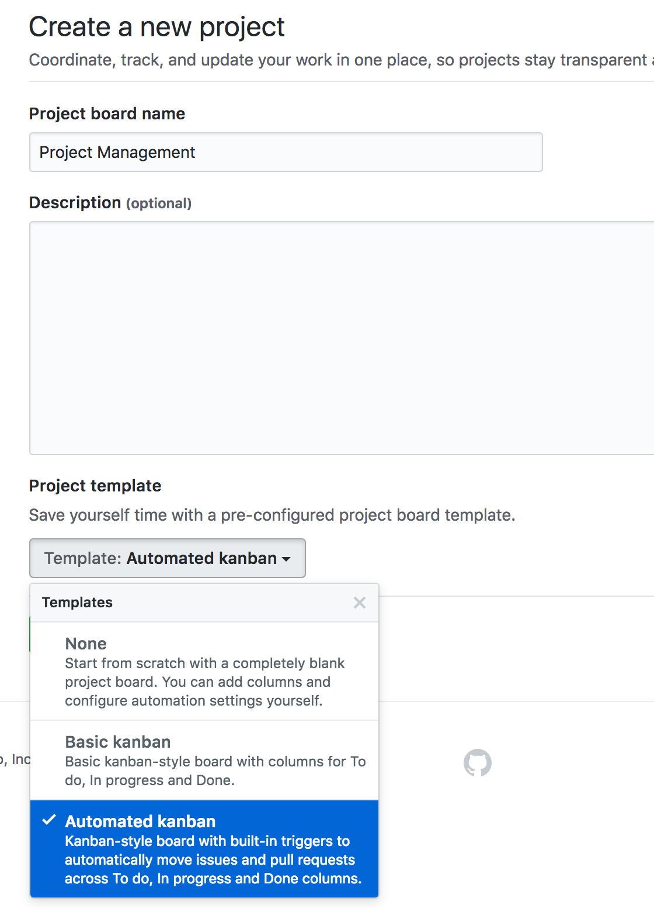
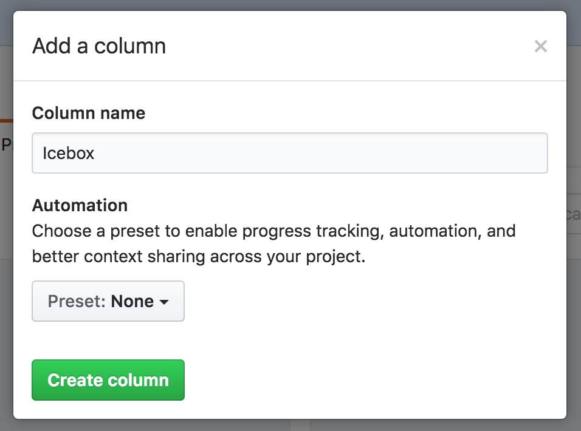
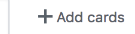
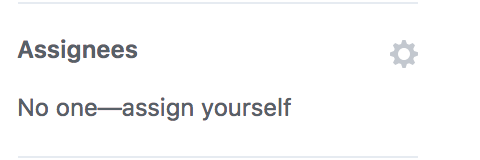

# 16.2 Lesson Plan - Agile & Projects (6:30 PM) <!--links--> &nbsp; [⬅️](../02-Day/02-Day-LessonPlan.md) &nbsp; [➡️](../../17-Week/01-Day/01-Day-LessonPlan.md)

## Class Objectives

* Students will know how to use a standup to stay in-sync with their groups and identify blockers early on so they can be removed.

* Students will be able to use a Kanban board in their group projects.

* Students will understand the value of a demo-driven playback in keeping stories focused on deliverable features.

* Students will understand the importance of retrospective meetings to make sure they identify where things may have gone wrong in a sprint and how to be more productive during their next sprint.

* Students will have enough understanding of the value of agile methodologies to practice using them within their project groups.

### 1. Instructor Do: Kanban (5 min)

* Explain the Kanban concept

  * It's important to have an organized project management system when you tackle any project.  A great tool for this is the Kanban board.

  * Kanban boards give us a birds eye view of the tasks we've completed, are working on, and need to do.
  
  * A Kanban board is a simple, visual, drag and drop scheduling system. GitHub has several built-in options for organizing projects. We will be using GitHub Projects.

* Under the Project" tab in GitHub, click the "New Project" button to create a new board (use the automated Kanban template).

  

* In addition to the existing columns, create a new column called Icebox (You will need to exit the "add card" pop-up to access the "add column" area on the right side).

  

* Demonstrate adding all issues to To Do (or Icebox if it's non-essential), by clicking "+ Add Cards" and dragging each issue into the correct column.

  

* Walk the students through board: 

  * There are 4 columns

    1. **To Do**:  What needs to get done next/hasn't been started.

    2. **In Progress**: What's being worked on now/isn't completed/merged.

    3. **Done**: What has been completed, reviewed, and merged into master.

    4. **Icebox**: What may need to be done later, less immediate version of "To Do".

  * Each week should have a set focus - this week that focus is completing the MVP.

  * Every task that is vital to completing the week's goal should go in the 'To Do' column.

  * Other tasks should go in 'Icebox' for review later. Icebox is a great place to put future enhancements that you would like to add

  * When someone begins work on a task, it should be moved to 'In Progress' and once it is complete,reviewed, and the changes are merged into master, the task should be moved to 'Done'.

  * Encourage students to add any new issues to the Icebox column and then to decide as a team if the new issue is absolutely *necessary* to the MVP before moving into the To Do column.

### 2. Student Do: Kanban (10 min)

* Slack out the following instructions and accompanying PDF:
[06-Stu_Kanban](../../../../01-Class-Content/16-project-2/01-Activities/06-Stu_Kanban)

* Use the `Projects` tab in GitHub to create a new project (use the automated kanban template).

* Add a new column called Icebox (You will need to exit the "add card" pop-up to access the "add column" area on the right side).

* Click "+ Add Cards" and dragging each issue into the correct column, To Do or Icebox.

* **Bonus**:

* If you have extra time, let each team member add some additional features to the Icebox. This is a great place to hold future enhancement ideas. Remember that each feature may need to be broken down into smaller tasks in the future before you open issues and start building them. 

### 3. Instructor Do: Assigning Issues and Stand-up (5 min)

* Demo self-assigning an issue, by clicking "assign yourself" on the right-hand side. 

* Explain assigning issues:
  
  * Issues can be assigned to a particular teammate or group of teammates. It helps the team to divide up responsibilities. Issues are generally self-assigned.

  * Not only does it allows to know WHAT is being worked on but WHO is working on it. With this information members will be able to know who to contact if they have questions about a particular feature. 

  

* Have the TA self-assign an issue or two as well. 

* Explain that most teams have a daily meeting called a stand-up.

  * When you work with a team, it's important for the whole team to know what each teammate is working on. At most companies this is accomplished by a daily meeting called stand-up.

* Explain the stand-up format.

  * Each teammate will take a turn saying what they did yesterday, what they are planning to do today, and anything blocking their progress.

  * They were originally called standups because everyone would, if able, literally stand up for the duration of the meeting. Now a standup just implies that it's no more than 15 minutes.

  * We hold stand ups daily so team mates can hold each other accountable, but also so they can help each other if they get stuck. This time allows a group to remove blockers, identify redundant work, and be made aware of anything that might need more planning before members work on something that won't be of use.

### 4. Student Do: Assigning Issues and Stand-up (10 min)

* Slack out the following instructions:
[07-Stu_Standup](../../../../01-Class-Content/16-project-2/01-Activities/07-Stu_Standup/README.md)

* Before your first stand-up, each member of the team should go through the To Do column of the Project Board and self-assign at least one issue. 

  * To do this, click on the issue and on the right choose "self-assign".

* Everyone should have a clear idea of what they intend to accomplish today. Now it's time for your first stand-up!

* Stand if you are able - yep, stand-ups take place standing; this helps to ensure that the meetings are short and to the point. 

* Each member of the team should say what they did yesterday, what they plan to do today, and what, if anything, is blocking their progress. 

* Stand-ups should be held *daily* from this point forward - yes even days that you don't have class (use Slack).

### 5. Instructor Do: Explain Playbacks (10 min)

* Explain that teams sometimes have a weekly meeting called a "playback". This meeting allows team members to explain and demo completed features and the work they did during this past sprint. (normally a work week). Playbacks are important to keep project managers up to date, as well other team members to what has been accomplished during a sprint. 

* Explain the playback format:
  
  * Tell your team what you worked on and how it went.
  
  * Show the progress you have made on your work.
  
  * Demo any finished work/features. 

* Encourage students to set up time for playbacks at the end of each sprint.

### 6. Instructor Do: Retrospectives (10 min)

* Explain that a retrospective allows a group to look back on their past week of work and identify where things went well, where they went poorly, and how they might be able to improve their work output next week.

(Put reminders in lesson plan to have instructors remind students to schedule retrospectives!)

* Explain the retrospective format explaining that students should brainstorm for 3-5 minutes on the following topics, writing down the following
  
  * What went well?
  
  * What went poorly?
  
  * What could we do better? (Action items)

  * After the brainstorming session, speak to your group members about what you have written, giving a bit more context to the team.

* Be sure to stress that this is not a planning meeting. Retrospectives are about bringing up problems, not about immediately finding solutions to those problems.

* Encourage students to set up time for retrospectives at the end of each sprint.

### 8. Students Do: Project Work (40 min)

* Continue working on project 2!

- - -

### 9. Everyone Do: BREAK (15 min)

- - -

### 10. Students Do: Project Work (75 min)

* Continue working on project 2!

### Lesson Plan Feedback

How did today's class go?

How did today's class go?
[Went Well](http://www.surveygizmo.com/s3/4325914/FS-Curriculum-Feedback?format=pt&sentiment=positive&lesson=16.02)

[Went Poorly](http://www.surveygizmo.com/s3/4325914/FS-Curriculum-Feedback?format=pt&sentiment=negative&lesson=16.02)
