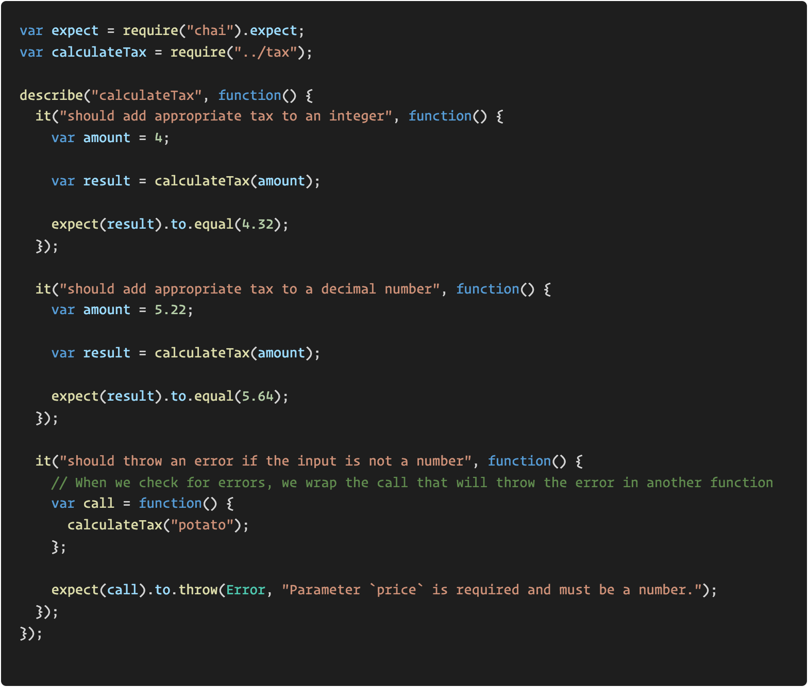
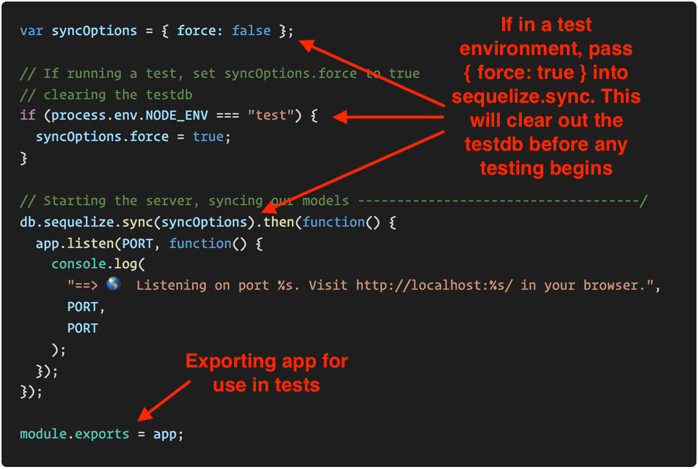
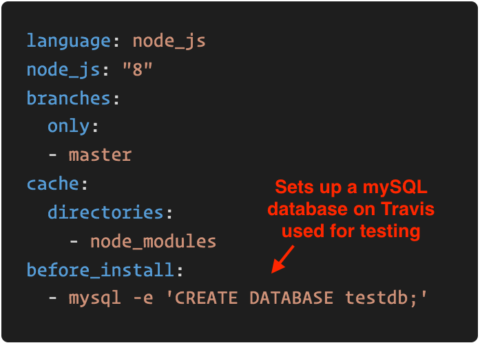
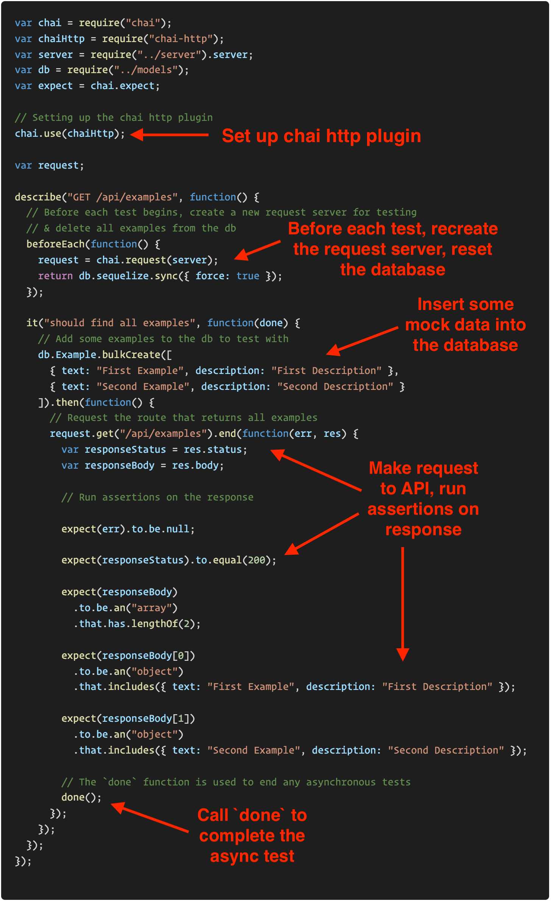
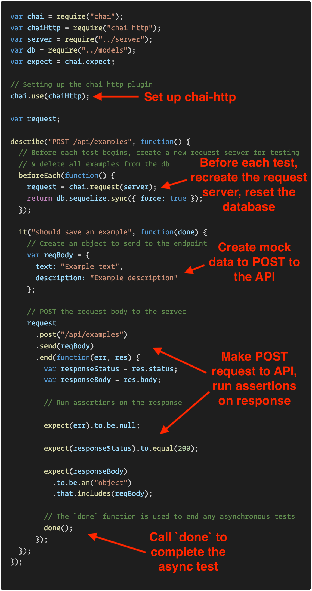
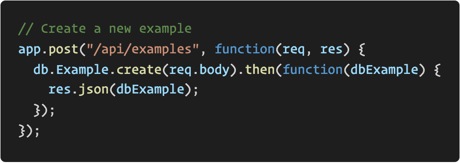

## 17.1 Lesson Plan - Endpoint Testing & Projects (6:30 PM) <!--links--> &nbsp; [⬅️](../../16-Week/03-Day/03-Day-LessonPlan.md) &nbsp; [➡️](../02-Day/02-Day-LessonPlan.md)

### Overview

In this class, we will be introducing students to testing endpoints with Mocha and Chai.

`Summary: Complete activities 1 - 3 in Unit 17`

#### Instructor Notes

* Prior to class ensure you have the [Project-2-Starter](../../16-Week/Project-Resources/Project-2-Starter) set up on your machine with dependencies installed, and the databases created (see the schema.sql file in the models folder). You will use this for today's demonstrations. 

* Today will focus on testing API endpoints. This can serve as an opportunity to identify struggling project groups. **All groups** should have a working API at this point. The activities today will help identify groups that don't. Instructional staff should circulate heavily during activities as to identify groups that don't have working API endpoints. 

- - -

### Class Objectives

* Project groups will be able to prevent merging a PR that breaks an API endpoint.

* Students will write an API test in terms of what the front-end expects.

* Students will be able to test API endpoints.

* Students will be able to articulate the value of API tests for a team working in parallel.

- - -

### 1. Instructor Do: Welcome (1 min)

* Welcome students to class and inform them that today we'll cover testing API endpoints with Mocha and Chai. 

* Assure the class that although a portion of today will be spent expanding upon the previous lesson's testing material, there will be plenty of time for project work afterward.

* Ask students to sit with their project groups and then introduce the warm-up activity. 

### 2. Student Do: Warm-up (10 min)

Slack out the following instructions found in [01-Stu_Warmup](../../../../01-Class-Content/17-project-2/01-Activities/01-Stu_Warmup):

```
* Complete the `calculateTax` function inside of `tax.js`.

* The function should take 1 parameter that represents the price of the object.

* The function should return the total price with 8% tax (`price * 1.08`).

* The total price should be formatted as a dollar amount (ex: 4.20).

* In a separate file, use mocha and chai to test the function. It should return the proper total for a given price if the price is a number or throw an error if `price` is not a number. 

* **Hints**:

* Reference the code from last class if needed.
```

### 3. Instructor Do: Review (5 min)

* Go over the solution, attempt to spend as little time on the function's implementation as possible, and focus primarily on the tests.

  

* Emphasize that testing, like linting, is only useful if everyone on the team does it.

  * If one teammate tests their code locally and it passes, then a second teammate alters the code and merges their changes into master, we don't know if the project still works or not.

  * Testing is only useful if we run our tests *every time* the code is changed. And just like linting Travis can do this automatically for us.

### 4. Instructor Do: EndPoint Testing (10 min)

* Explain to students the importance of testing endpoints:

  * Most web applications need to communicate with a database. A REST API provides an interface for the client to communicate to the server and then in turn to the database.

  * Development teams often use continuous integration tools alongside testing libraries to prevent merging in code that will break existing functionality.

  * In our case we will use Mocha and Chai to test our API routes and utilize Travis CI to ensure that our routes continue to work with each new commit.

* Open up the [Project-2-Starter](../../16-Week/Project-Resources/Project-2-Starter/server.js) and open the `server.js` file in your editor.

  * Walk the class through the new code at the bottom of the `server.js` file:

    

  * If we're running our app in a test environment, pass `{ force: true }` to `db.sequelize.sync`. This will reset the test database, once before any testing begins. This will ensure we can begin tests with a fresh database each time.

  * Even though we aren't exporting `app` for another part of our application to use, we need to make the express app available for testing. By exporting the app and the database, we can then later require it in our test files.

* Now open the [travis.yml](../../16-Week/Project-Resources/Project-2-Starter/.travis.yml) file found in the same folder and point out the `before_install` field:

  

  * When new code is pushed up to GitHub, Travis runs all of our application's tests. In order to test an API or any code that interacts with a database, Travis needs to know which database to use. This code creates a temporary `testdb` for this purpose.

* Open [02-Stu_GET-Test](../../../../01-Class-Content/17-project-2/01-Activities/02-Stu_GET-Test/Unsolved) and copy the [example.test.js](../../../../01-Class-Content/17-project-2/01-Activities/02-Stu_GET-Test/Unsolved/example.test.js) file over to the `test` folder in your copy of [Project-2-Starter](../../16-Week/Project-Resources/Project-2-Starter/test/).

* Take a moment to demonstrate the code in your editor.

  

* Explain that this test verifies that we can retrieve all `example` records from the database using the `/api/examples` endpoint. 

* Run the test locally using `npm run test` and show that it passes. **Note: Be sure to run the schema.sql file in the `models` folder and install dependencies first if you haven't already.**

* Inform the class that while this may look like a lot of code, much of it is be boilerplate we will use for all endpoint tests. Go through each piece one at a time:

  * After requiring dependencies, we set up the `chai-http` plugin. This allows us to start a test server and make HTTP requests to it.

  * The `beforeEach` block tells mocha, that before each test (`it` block), it should run the code inside.
  
    * In this case, we're creating a test server and creating a `request` object we can use to make requests to the server. 

    * We're also clearing the test database before each test so we can know *exactly* what should be in it before running tests.
  
  * Then inside of the `it` block, we're first inserting some mock data into the test data using `bulkCreate`. This method works like the regular sequelize `create` method, but allows for inserting multiple entries at once.

  * We then make a GET request to the `/api/examples` endpoint. Once the request finishes, we run assertions on the response. In particular, we make sure that:

    * The request completes successfully, i.e. there is no error.

    * The response status is `200`.

    * The response body is an array with 2 elements.

    * The elements in the response body match the elements we saved to the database with the `bulkCreate` method.

* Finally we call the `done` function. This is optionally available as an argument passed into every test. Since this test runs asynchronously, we need to call `done` so that mocha knows when the test is complete.

### 5. Student Do: GET Route (15 min)

* Instructional staff should circulate *heavily* during this activity. All groups need to have a working GET route. If you find a group that does not, TAs should work closely with them during project time today and ensure that they leave with working GET and POST routes. 

Slack out the following instructions found in [02-Stu_GET-Test](../../../../01-Class-Content/17-project-2/01-Activities/02-Stu_GET-Test):

  ```
  * Copy `example.test.js` over to the `test` folder in your local project repo. Rename this file to be to match the name of the api you're testing, e.g. `todo.test.js` or `recipes.test.js`.

  * Update the test endpoint to be one in your own project. The endpoint should return all instances of a model from the database.

  * Update the `bulkCreate` method to use your own model name instead of `Example`. Update the data being passed into the `bulkCreate` method to match what is expected by your model's schema.

  * Update the assertions to expect objects matching the ones passed into the bulk create method.

  * Run the tests by running `npm run test` and make sure everything passes.

  * **Hints**:

  * The Project 2 Starter repo included all the necessary dependencies and scripts in the `package.json` for this activity. If you get an error about missing dependencies, double check it wasn't removed beforehand.

  * Ask an Instructor or TA for help if you get stuck!

  * **Bonus**:

  * If you have a route for getting a single record of the same type by id, add a test for it!
  ```

### 6. Instructor Do: POST Route (10 min)

* Explain that we want to test *all* of our routes, not just GET routes.

* Open up [03-Stu_POST-Test](../../../../01-Class-Content/17-project-2/01-Activities/03-Stu_POST-Test/Unsolved) and, like the previous demonstration, copy and paste the [example.post.test.js](../../../../01-Class-Content/17-project-2/01-Activities/03-Stu_POST-Test/Unsolved) file over to the `test` folder in your copy of [Project-2-Starter](../../16-Week/Project-Resources/Project-2-Starter/test/).

* Demonstrate the code in your editor:

  

* Explain that this test verifies that we can successfully save an example to the database by using the `POST /api/examples` endpoint.

* Walk through the code as a class. Check for students' understanding of what should now be familiar code. Be sure to highlight the following:

  * Like before, we need to set up `chai-http` in order to start a server and make requests.

  * Before each test, we recreate the request server and reset the test database.

  * We create the `reqBody` object which will be sent to the endpoint to create a new `example` record in the database.

  * After the request has been made, we run assertions on the response. In this case, we're checking that:

    * The request completes successfully, i.e. there is no error.

    * The response status is `200`.

    * The response body is an object that matches the `reqBody` object. This indicates that the record was created successfully.

* Open `apiRoutes.js` and demonstrate this line `res.json(dbExample);` in the POST route is the one that determined the response that we get back. 

  

* This is how we know that we should be testing for an object.

* Emphasize that students should design tests based on the response that they are expecting from their endpoint. Often this means faking or mocking data. What we're testing is that our API works as expected with known data we can verify.

### 7. Student Do: POST Route (15 min)

* Instructional staff should circulate *heavily* during this activity. All groups need to have a working POST route. If you find a group that does not, TAs should work closely with them until they do or make a note to assist after the lesson. 

Slack out the following instructions found in [03-Stu_POST-Test](../../../../01-Class-Content/17-project-2/01-Activities/03-Stu_POST-Test):

```
* Copy `example.post.test.js` over to the `test` folder in your local project repo. Rename this file to be to match the name of the api you're testing, e.g. `todo.post.test.js` or `recipes.post.test.js`.

* Update the test endpoint to be one in your own project. The endpoint should use data submitted on `req.body` to create a new instance of a model.

* Update `reqBody` to match what is expected by your model's schema.

* Update the final assertion to expect an object matching the one sent to the endpoint.

* Run the tests by running `npm run test` and make sure everything passes.

* **Hints**:

* The Project 2 Starter repo included all the necessary dependencies and scripts in the `package.json` for this activity. If you get an error about missing dependencies, double check it wasn't removed beforehand.

* Ask an Instructor or TA for help if you get stuck!
```

### 8. BREAK (15 min)

### 9. Students Do: Project Work (99 min)

* Groups should work on projects while instructional staff make themselves available for assistance.

### 10. END (0 min)

# Instructor Do: Private Self-Reflection

Take some time on your own after class to think about the following questions. If there's anything that you're not sure how to answer, feel free to reach out to the curriculum team!

1. How did today's class go?
2. How did you teach it?
3. How well do you feel you did teaching it?
4. Why are you teaching it?
5. Why did you teach it that way?
6. What evidence can I collect to show my students are understanding?
7. How will my students know they are getting it?

### Lesson Plan Feedback

How did today's class go?

[Went Well](http://www.surveygizmo.com/s3/4325914/FS-Curriculum-Feedback?format=pt&sentiment=positive&lesson=17.01)

[Went Poorly](http://www.surveygizmo.com/s3/4325914/FS-Curriculum-Feedback?format=pt&sentiment=negative&lesson=17.01)
