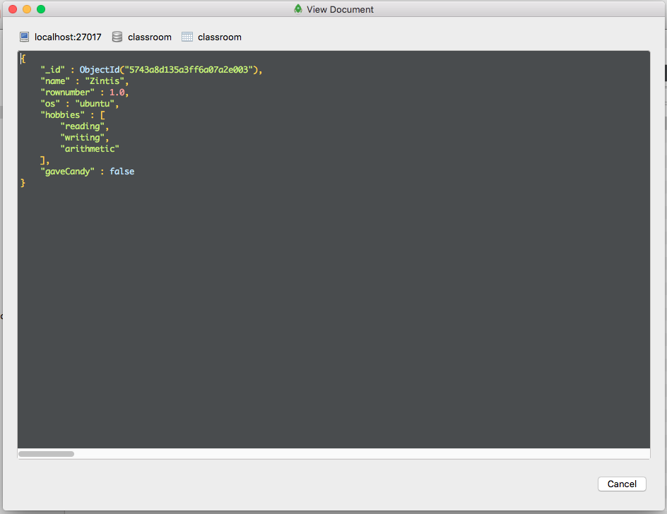

## 18.1 Lesson Plan - Masters of MongoDB <!--links--> &nbsp; [⬅️](../../17-Week/03-Day/03-Day-LessonPlan.md) &nbsp; [➡️](../02-Day/02-Day-LessonPlan.md)

### Overview

In this class, you will introduce the concept of the NoSQL database with MongoDB, go over its pros and cons compared with MySQL, and ultimately detail all of the required steps to employ MongoDB in future projects.

`Summary: Complete activities 1-4 in Unit 18`

##### Instructor Priorities

* Students should be able to install MongoDB on their machines within the first hour of class. If anyone has trouble getting it running, you or a TA should offer that student assistance.
* Students should understand how to make queries with MongoDB. Meeting this goal will build the necessary foundation for the next lecture, which will incorporate such queries with Node.js files.
* Students should install Robo 3T by the end of class. This UI will make everyone's life easier.

##### Instructor Notes

* The latest project week will have proved exhausting for most students. Make sure they feel reinvigorated by doling out some helpful feedback and, most importantly, some extreme encouragement--they've earned it.

* Before class, take a look at the slide show and edit these sections to make sure they fit with your class.

  * _Advice for Next Time_ and _Next Steps_: these should reflect your students' experiences in project week.
  * _The Road Ahead_: 

    * The current slide lines out a path from now to the end of the course, marked with the libraries that we originally planned to teach our students.
      * If your future topics or the order of your next lectures differ from the slide, you should edit it to reflect your future coursework.

  * _Your Goals_: Edit these slides so they include the best goals that students set out in the beginning of the course.

* Before class, make sure you install MongoDB and Robo 3T on your machine--you'll need both.

* If you haven't used MongoDB much in the past, take a look at this week's queries and solutions. This should prime you for the lecture.

### Sample Class Video (Highly Recommended)
* To view an example class lecture visit (Note video may not reflect latest lesson plan): [Class Video](https://codingbootcamp.hosted.panopto.com/Panopto/Pages/Viewer.aspx?id=e5f3ad48-d099-4856-b540-a9fd0f44a5c4)

- - -

### Class Objectives

* Introduce the concepts of _non-relational databases_ like MongoDB.
* Demonstrate how to create databases in MongoDB and store data with the program, from basic fields to more advanced queries.
* Start preparing your students for this week's homework assignment, which relies on storing data in MongoDB.

- - -

### 0. Instructor Do: Welcome Students + Open Slideshow (1 min)

* Open the slideshow file in your assignment directory. Then welcome students to class. 

### 1. Instructor Do: Feedback for Second Project (Slides) (5 min)

* Offer students EXTREME levels of encouragement with their projects.

* If you think it's appropriate, have students share a few of their reflections on project week out loud.

* Then offer students guidance on how they can improve on their teamwork and presentation skills for their final projects. Use the bulleted list on the slide as a guide. (And just to be sure, you should edit the PowerPoint to suit your own class's experiences.)

### 2. Instructor Do: The Road Ahead (Slides) (5 min)

* The next few slides will offer advice on how to make the most of the final weeks of this class.

* With everything they've learned so far, most students will already be hirable. Encourage them to start looking for employment and internships if they want to find work now. 

* Open the slide with the path from now to victory. Tell them that these next few skills are not necessary to find work but will open up more job opportunities and make them more hirable for the positions they apply for.

* Show them the castle slides. With the real one, tell students if they feel that they're at that level, they're at the right place. Load the sand castle, and tell them that if this is how they feel now, it's time to double-down.

* Load the next slide. Tell your students they should absolutely talk with you or a TA since they still have two more months to get this assistance. Add in that they should look through the code repos of any topics that they haven't been able to wrap their heads around. Encourage them to do this now, and load the next slide. Tell them that this is a habit you shouldn't delay--"Let's be honest, if you aren't going to start now, you probably aren't going to after graduation."

* Load the next slide with the student goals, and read off their goals. Then load the final slide of the section and offer encouragement.

### 3. Instructor Do: What is MongoDB (Slides) (15 min)

* Load the "What's MongoDB" slide. Tell them that it's a popular NoSQL database.

* What's a NoSQL database? Simply put, a database that doesn't use SQL's table-based relationship model. Instead, MongoDB uses a document-oriented model.

* Tell the class that if they parsed JSON objects before ("which you have"), you'll feel somewhat close to home here. The data in these databases gets stored as BSON, or "Binary JSON." 

  * IMPORTANT: Don't focus too much on the semantics here. We could go on about binary code, but we don't want to lose focus.

* "MongoDB has tons of drivers and packages for connecting to Node, C++, Java, etc." This means that students can use this for their projects in this class and beyond.

* Go to the next slide and detail how the MySQL tables in the slide become joined with an explicit command, relying on joins to bring relevant data together.

  

* Go to the next slide, which shows a BSON version of the same data. Explain how BSON data doesn't always need to be joined for certain complex data structures, since BSON supports Objects Within Objects. Add in that once we get this data to the site, it will be a cinch to traverse; it's the same routine as picking out JSON data. 

  

* Open the MongoDB storage slide and explain to them that MongoDB databases store collections with documents of data. Keep the screen up and ask the class how this compares with MySQL.

  

* After a student or two gives you their answers, load the next slide and tell them to take note of these differences and similarities.

  

* But also tell them to take note (and this is _important_) that MongoDB is still an inherently different style of data storage than MySQL. A BSON document is basically a more flexible JSON, and individual documents can include strings, ints, booleans and even other objects.

### 4. Students Do: Quick Activity (Slides) (10 min)

* Load up the next slide with the quick activity. Tell them to work with a partner to answer the following questions:
  * What are the advantages of using a NoSQL database like MongoDB according to the MongoDB Website?
  * What are the advantages of using a NoSQL database like MongoDB according to the web (places like Quora)?
  * What are the disadvantages of using a NoSQL database like MongoDB according to the web (places like Quora)?

### 5. Instructor Do: Answer the Questions from the Quick Activity (Slides) (5 min)

* Go over the answers to these questions, with the Quick Activity slide still loaded on your machine. Listen and comment on their answers. Here are some answers from different web sites.

  * What are the advantages of using a noSQL database like MongoDB according to the MongoDB Website? 

    * "Relational databases require that schemas be defined before you can add data. For example, you might want to store data about your customers such as phone numbers, first and last name, address, city and state – a SQL database needs to know what you are storing in advance."
    * "Object-oriented programming that is easy to use and flexible."

  * What are the advantages of using a noSQL database like MongoDB according to the web (places like Quora)? (<http://stackoverflow.com/questions/2117372/what-are-the-advantages-of-using-a-schema-free-database-like-mongodb-compared-to>)

    * Deep query-ability. MongoDB supports dynamic queries on documents using a document-based query language that's nearly as powerful as SQL.
    * No schema migrations. Since MongoDB is schema-free, your code defines your schema.

  * What are the disadvantages of using a NoSQL database like MongoDB according to the web (places like Quora)? (<http://stackoverflow.com/questions/2117372/what-are-the-advantages-of-using-a-schema-free-database-like-mongodb-compared-to>)
    * Sometimes, using joins and having strict schemas is actually preferable to MongoDB.
    * "If your database has a lot of relations and normalization, it might make little sense to use something like MongoDB. It's all about finding the right tool for the job."

### 6. Students Do: Installing MongoDB (20 min)

* Tell students to consult the installation guide `Supplemental/Installing-MongoDB.md`, and to spend about 15 to 20 minutes to install and configure MongoDB on their machines.

* Tell them to ask you or one of the TAs for help if they have any questions while installing or configuring MongoDB.

* At the 15-minute mark, ask if there are any people who haven't been able to install and configure MongoDB yet. Assist anyone who needs help.

* Ask the class if they can start up MongoDB by typing <code>mongod</code> into their terminal/bash windows. Their terminal/bash screens should look like this:

    

* If there are any remaining students who do not have it installed and configured, ask them to talk with a TA to figure out the issue.

### 7. Instructor and Students Do: Initial MongoDB Queries (15 min)

* Instruct your students to open <code>mongod</code> if they don't already have it open. Tell them they must keep the window open so that MongoDB can continue to run.

* While they have mongod running, tell them to open another terminal/bash window and run <code>mongo</code> to start up the mongo shell.

* Slack out the `01-Create-Insert-and-Find` to the class and follow along with the comments. Tell them that you'll be going over how to create a database, insert data into a collection and find stored data.

### 8. Students Do: MongoDB Basics (15 min)

* Send students the skeleton of `02-Starting-With-Mongo`. Here are the instructions for your reference.


```
A. Use the command line to create a classroom database. Insert entries for yourself and the people in your row in a students collection. Each document should have:

1. A field of name with the person's name.
2. A field of rownumber which will contain the row number that they are in.
3. A field of os which will contain the Operating System of the computer they are using: 'Mac', 'Win', etc
4. A field of hobbies with an array of the hobbies the person likes to do.

B. Use find commands to get:

1. A list of everyone in your row.
2. An entry for a single person.
3. The entries for all the Mac users in your row. 

BONUS:
If you finish early, check out the MongoDB documentation and figure out how to find users by an entry in an array.
```

### 9. Instructor Do: Go Over Last Exercise (5 min)

* Ask students if they were able to finish the assignment. Call on one of the people who say yes to answer the first question, using the solution file as a reference.

* Go down the list of questions and ask students to answer them, entering them into the bash/terminal window you're using to demonstrate.

  * When directed, ask the class for additional names, hobbies, etc., so you may fill out the classroom collection.

* Ask the class if all of this makes sense. Tell them that if it's not for anyone, to talk with either you or the TA during the break, which will happen right now.

- - -

### 10. BREAK (15 mins)

- - -

### 11. Instructor Do: Removing, Updating and Dropping in MongoDB (15 mins)

* Open up the `03-Update-Delete-and-Drop` and demonstrate the included queries on your screen. Make sure students are following along, entering them into the bash/terminal window you're using to demonstrate.

* When you're finished, slack out the file to your students.

### 12. Students Do: Taking Candy from Basket Weavers (20 min)

* Send Students the skeleton of `04-Student-Update-Delete-and-Drop`. Here are the instructions for your reference.


```
Go back to your classroom database.

You've decided to take on a new hobby. Add Extreme Basket Weaving to your array of hobbies.

While practicing for your Extreme Basket Weaving Competition, you broke the computer of the person next to you. They're using a new Operating System now. Change their os field.

Another student in your row saw you break that computer and wisely decided to move. Remove them from your database.

You are worried everyone else will leave and you'll have to sit all alone. You decide to bribe everyone who didn’t leave with candy. Add a field of gavecandy with a value of false to everyone in the array so you can keep track.

All this work made you hungry, so you bought yourself some candy. Change the value of gavecandy to true in your entry.
```

### 13. Instructor Do: Go Over the Answers (5 min)

* Ask students if they were able to finish the assignment. Call on one of the folks who say yes to answer the first question, using the solution file as a reference.

* Go down the list of questions and ask students to answer them. Enter their answers into the bash/terminal window you're using to demonstrate the solutions.

### 14. Students Do: Install Robo 3T (5 min)

* Tell students that while it's entirely possible to keep track of MongoDB data in the `mongo` shell, entering queries to merely view data can become tedious.

* Enter Robo 3T. 

  * Tell students that this program is similar to MySQL Workbench, providing a simple user interface to view document collections.
  * Instruct your students to press the green install button for the free edition of the program. <https://robomongo.org/download>

* After 3 minutes, ask the class if they were able to install the program. If any students ran into an issue, assist them or direct them to a TA.

### 15. Instructor Do: Demonstrate Robo 3T (10 min)

* Instruct your students to open the application. They should see a window like this:

  

* They should hit the connect button. Do the same to show students what comes next.

* Have your students follow along as you select the classroom DB, then the Collections folder, and then as you double click the classroom collection. You should see the documents you entered into the collection earlier in the lecture. 

* Now, tell the class that when they right click in the section where the documents are listed (and you should do the same), they will see an Insert Documents option. Click it, and you'll see a window where you can type in a BSON document. As long as what you enter is valid JSON, your data will show up in the collection when you hit save.

  * Enter a document similar to the image below:

    

### 16. Students Do: Final Assignment (10 mins)

* Instruct students to drop their classroom collection and create a new one.

* Then, slack out these instructions:


```
ONLY USE ROBO 3T FOR THIS ASSIGNMENT

In a new classroom collection, reenter your name, os, and hobby info array. This should be entered using the right-click -> Insert Object method. 

Next, slack out your name, os and hobbies into the classroom chat.

As student info comes in, add it into the database.

As students enter their BSON info into slack, insert it into your database.

By the end of the exercise, you should have every student's information in your classroom collection.
```

### 17. Wrap Up (4 min)

* Tell students that they've covered a lot of ground today, and that next class they'll apply what they've learned to create full-stack apps that scrape data from other websites. 

* Tell them that if they would like extra practice after class, they should read the documentation for the MongoJS npm package. They will be using that package in the next class to combine MongoDB with Node.

* Ask if there's anything you might be able to clear up about today's lecture. If all is well, dismiss the class.

### Lesson Plan Feedback

How did today's class go?

[Went Well](http://www.surveygizmo.com/s3/4325914/FS-Curriculum-Feedback?format=pt&sentiment=positive&lesson=18.01)

[Went Poorly](http://www.surveygizmo.com/s3/4325914/FS-Curriculum-Feedback?format=pt&sentiment=negative&lesson=18.01)
