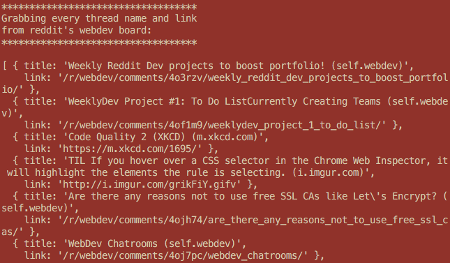
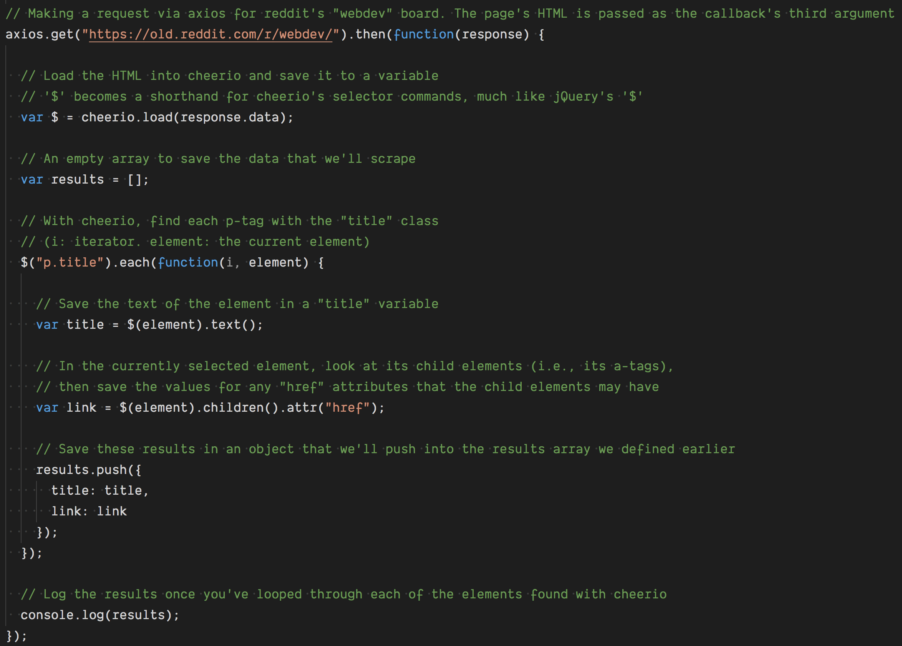
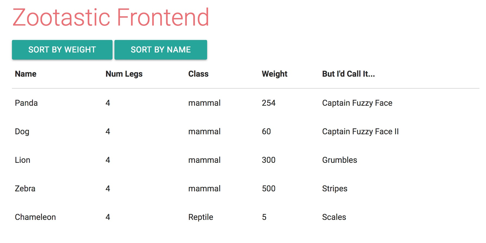
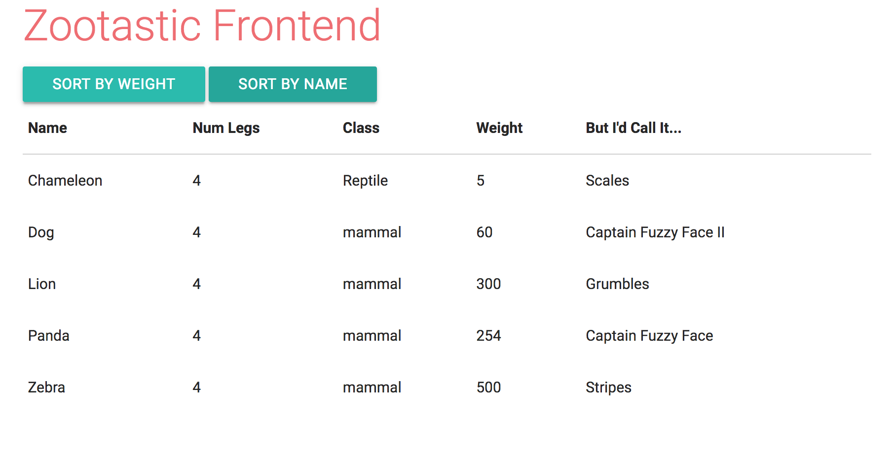
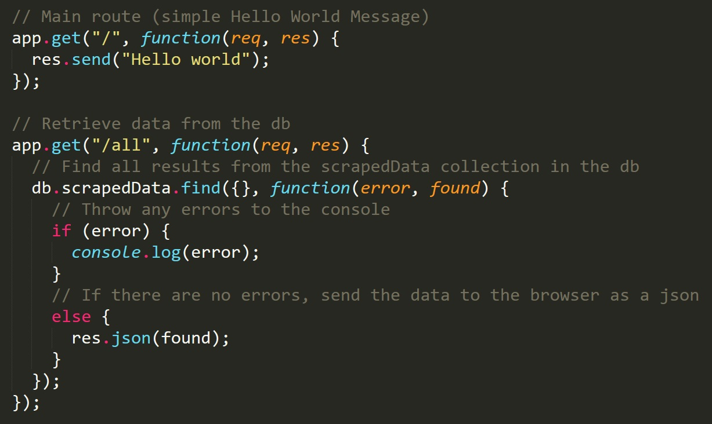
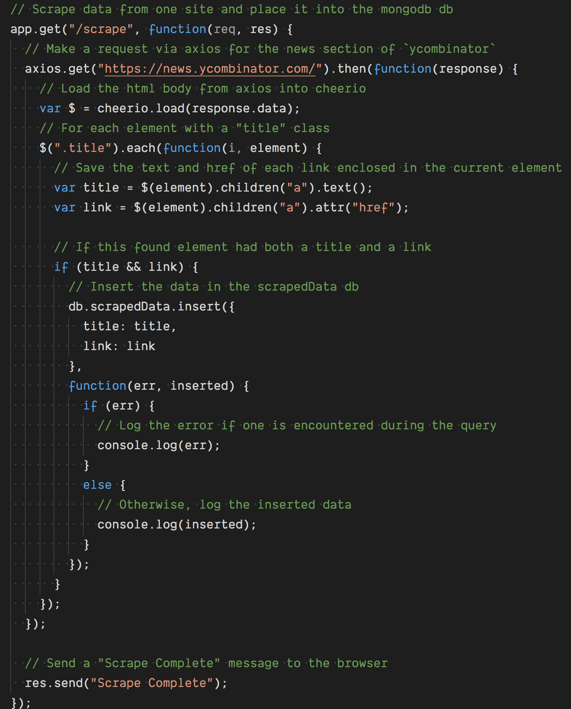

## 18.2 Lesson Plan - Web Scraping and Server-Side Mongo <!--links--> &nbsp; [⬅️](../01-Day/01-Day-LessonPlan.md) &nbsp; [➡️](../03-Day/03-Day-LessonPlan.md)

### Overview

In this class, you will introduce students to the concept of web scraping, and then how to store data into a MongoDB database using Node and `MongoJS`. By the end of class, you'll combine these two skills with an exercise: scraping sites into MongoDB.

`Summary: Complete activities 5-12 in Unit 18`

##### Instructor Priorities

* Students should know how to use cheerio to select parts of a website and scrape those parts into a server.
* Students should understand how to install `MongoJS` to perform MongoDB queries through Node.
* Students should grasp how to pull data from MongoDB and display it on the front end.

##### Instructor Notes

* It's very important that students understand how to work with `Cheerio`--it's basically half of their homework. If any students seem stumped by web scraping, encourage them to speak with you or a TA during break time or after class.

* You should read through the solutions of each exercise to make sure you understand how each file works, especially if you haven't used `Cheerio` or `MongoJS` before.

* If you're using a different machine then you were in the last class, make sure you have MongoDB and Robo 3T set up. Consult the installation guide in 18.1 if you need instructions.

### Sample Class Video (Highly Recommended)
* To view an example class lecture visit (Note video may not reflect latest lesson plan): [Class Video](https://codingbootcamp.hosted.panopto.com/Panopto/Pages/Viewer.aspx?id=c94aca05-52f4-4e7b-ac08-8a17c316f89d)

- - -

### Class Objectives

* Introduce the concept of web scraping and show students how `Cheerio` makes it possible to perform this method of data retrieval.
* Teach students how to use `MongoJS`, so they can employ MongoDB in their web projects.
* Show your class how web scraping can combine with `MongoJS` to create sites that change depending on the content of other sites.

- - -

### 0. Instructor Do: Welcome Students (1min)

* Say hellos and answer any questions students might have before class.

### 1. Instructor Do: Introduce Web Scraping and Cheerio (10mins)

* Ask the class if they can give you a definition for what web scraping is. This is a common topic in web development, so they might already know about the topic.

  * If not, tell them web scraping is essentially a programmatic means of taking data from any web site. Programmers mark sections of a site for their apps to scrape (certain divs, certain element tags, etc.), which lets them store site data elsewhere.
  * Ask your students, "What are some reasons we might want to scrape data? And do you think there might be legal ramifications for scraping certain websites?" Truth be told, it's a bit of a gray area, but you should pick their brains a little here. This will plant the idea that web scraping might not be a lawful solution for every project.

* Tell the class that we're going to do this using a powerful node package called `cheerio`.
  * Show them the `Cheerio` documentation and ask them to spend a few minutes to look it over. Have them check for similarities between another technology we used much earlier in the class (hint: the answer is jQuery).
  * Cheerio Documentation: <https://github.com/cheeriojs/cheerio>

### 2. Instructor Do: Web Scrape (10mins)

* Tell the students that you're going to demonstrate how to use Cheerio, and that they should follow along with you. Zip up activity `05-Scraping` and slack it out to the class.

* Remind students that they will have to do an `npm install` to download all of the required packages to run our `server.js` files.

* Open <https://www.reddit.com/r/webdev> on your machine and explain that the first `server.js` file is going to take information from the site. Load `server.js` with Node and have your students do so as well. Tell them to observe the console, where they'll see the reddit data saved as a JavaScript object.

  

* Run through the various parts of the `server.js` file that make the web scrape possible, as the comments in the code describe.

  

* Take note especially of:
  * The use of the "axios" package to take in the HTML body. This part is _super important_; without it, `server.js` has no way of knowing what the Reddit board looks like.
  * How Cheerio loads the HTML data and uses the $ as a var. Ask students why they think we would use that symbol (the answer is to give it the same syntax as jQuery for selecting HTML elements).
  * How we push the information into an empty array, defining anonymous objects for each of our selected elements.
  * How Cheerio's .children method can be used to select child elements within a selected element.


* Have your students run `server2.js` and tell them to note how the .parents method in Cheerio can be used to select elements outside of another element.

* Have your students run `server3.js` and tell them to note how the .find Cheerio method will grab the first child within a parent element.

  * Ask your students why they think the .find method was chosen. What do they think would happen if .children() was used instead. (hint: they could visit the site that `server3.js` is scraping, or even replace .find with .children.)

* Ask students if all of this makes sense.

### 3. Student Do: First Web Scrape Assignment (15mins)

* Slack Out the skeleton of `06-Scrape-Starter` to your class. Here are the instructions from the file, for reference's sake.

```
Students: Using this template, the cheerio documentation, and what you've learned in class so far, scrape a website of your choice, save information from the page in a result array, and log it to the console.
```

* The file will include sections marked off where they should add their code.

* Explain that this isn't so much a skeleton as a template - they should figure out where they need to replace code to get it working with their own site.

* Ask students to send their solved `server.js` files over slack, as well as the http link of the site they scraped. Choose one or two of these to go over in class.
  * Drag the solutions from your students into the directory you used for `05-Scraping`, as this will have the node packages that their `server.js` scripts need in order to function.

### 4. Instructor Do: Go over solution (5mins)

* Ask students what sites they chose, why they chose them, and how they went about selecting the elements they wanted to scrape. Run the server file to see if it works (it will, hopefully, they should have only slacked it if they got the file to a functional state).

* Ask the class how the activity went. If anyone had issues, offer encouragement: this is a new concept and that they can talk with you or a TA during break to go over the solution if they'd like.

* Someone likely ran into the issue of not being able to get the data from their website of choice via scraping.
  * Explain that not all data is available just from requesting the HTML. Some HTML is generated client-side after the initial page load.
  * Tell them to think about the activity where they used JavaScript to build out a table. If they disabled JavaScript in the browser, they wouldn't have been able to see the data in the table.
  * With scraping this way, you can only get the **initial** HTML sent from the server. Any HTML added with JavaScript won't be accessible via scraping.
  * Explain to them or show them with a website of choice that they can check to see if the data will be available by disabling JavaScript in the browser and reloading the page (be sure to re-enable afterwards!).

    

* Tell the class something along these lines: "You may be wondering how this all figures into what we learned yesterday. Well, it will all make sense by the end of class. For now, we're going to swing back to MongoDB, and this time, get it to interact with Node."

### 5. Student Do: Switch back to Mongo (5mins)

* "Sure being a coder is fun and all, but you know what’s better? Being a coder at a zoo. Using MongoDB, you're going to make a zoo database."
* Slack out these instructions:


```
Startup mongod and the mongo shell and switch to a new db named zoo.

Insert into a collection named animals:
One entry for each of your five favorite animals.

Each entry should have
1. A field of numLegs with an integer of the number of legs that animal has.
2. A field of class with that animal's class (mammal, reptile, etc).
3. A field of weight with an integer of the weight of the animal in pounds (any reasonable weight, really).
4. A field of name, with the animal's name.
5. A field of whatIWouldReallyCallIt with the name of what you would call the animal if you got to name it.

Example:

{
  "name": "Panda",
  "numLegs": 4,
  "class": "mammal",
  "weight": 254,
  "whatIWouldReallyCallIt": "Desiigner"
}
```

### 6. Instructor Do: Insert Some Animals (5mins)

* Ask the class how the last assignment went. Tell them that if they ran into any issues, they can follow along with your example.

* Load up `mongod` and the `mongo` shell on your computer, and enter in five animals with the same details listed out in the last activity. If you'd like, you can also follow the queries in `07-Insert-Animals`.

* Remind students that MongoDB lets you store not just strings, numbers, booleans, objects and arrays, but also dates, making it a tad more flexible than a JSON object. "Remember, we're working with BSON now."

### 7. Instructor Do: Introduce Sorting with MongoDB (5mins)

* Tell students that there's one more important MongoDB feature you'd like to go over before connecting the database with Node.

  * "You'll remember that MySQL had a way to sort our results, so that we could organize our data before displaying it in our website. MongoDB has the same feature."

* Go through `08-Sorting` line by line with the students. Ask them to try the commands you're explaining with their own collections.
  * Make sure they understand that:
    * Using `.sort({[FIELD]:1})` will give them their results sorted in ascending order by the field of their choice.
    * Using `.sort({[FIELD]:-1})` will give them their results sorted in descending order by the field of their choice.

### 8. Students Do: Practice Sorting (3 mins)

* Have your students practice sorting in the `mongo` shell for a few minutes. "We won't spend too much time going over this, but get your feet a little wet with the sort method."

* Make sure you keep the query file displayed on the screen. Slack it out if a student asks.

### 9. Everyone Do: Introduce MongoJS (5mins)

* "Now that we've all become MongoDB masters, it's time to use our craft with Node. Look up `MongoJS` on the npm website."

  * Here's the link for your convenience: <https://www.npmjs.com/package/mongojs>.
  * It's just a good routine to have your students find these packages on their own, as they'll no doubt have to do throughout their careers.

* Tell them not to worry too much about connecting to the database just yet. The main focus is how to call the MongoDB methods they've already used.

  * Call on students and ask them how they would use these Mongo methods in `MongoJS`: `find`, `insert`, `remove` and `sort`.

* The main takeaway should be that using these methods is nearly identical to running them in the `mongo` shell, just with a callback function to handle the results in your server. From there, it's really just using express to send the data to the browser, same as we did with MySQL.

### 10. Student Do: MongoJS Assignment (20mins)

* Load the solution of `09-MongoDB-and-Sorting` on your machine, and run `server.js` with Node. Visit the different routes in your web browser to show students the results:

  * `/` will display a simple hello world message.
  * `/all` will display JSON with every animal in your zoo collection.
  * `/name` will display JSON with every animal, sorted by name.
  * `/weight` will display JSON with every animal, sorted by weight.

* Slack Out the skeleton of `09-MongoDB-and-Sorting` to your class. Here are the instructions from the file, for reference's sake.


```
TODO: Make four routes that display results from your zoo collection

0: Root: Displays a simple "Hello World" message (no mongo required).
1: All: Send JSON response with all animals
2: Name: Send JSON response sorted by name in ascending order
3: Weight: Send JSON response sorted by weight in descending order
```

* Tell your students to ask you or a TA for help if they have any questions while working on the assignment.

### 11. Instructor Do: Go over solution (5mins)

* Ask students how the activity went, and encourage anyone who had trouble using it. Remember, even if it is similar to using the `mongo` shell, this is still the first time they've used this node package.

* Open the skeleton file on your machine and ask the class for the answers to each route, one by one. After each route, start the `server.js` file and use your web browser to check the route. If it works, great! If not, ask the student who gave the answer if you had mistyped something (since they gave the answer they'll probably be able to point out the error better than anyone).

* "With that done, how about a break? When you come back, we'll finally be connecting MongoDB the front end and, soon, with `Cheerio`."

- - -

### 12. Break (15mins)

- - -

### 13. Student Do: MongoJS and the Front-End (25 mins)

* Tell your students something along these lines. "Now that we have our back end working without MongoDB, we have one last component to add to make this a fullstack app." Ask them which component that is?

  * The front end.

* Open the solution to `10-MongoJS-and-the-Front-End` on your machine and run the `server.js` file. Note how it pulls in the information you typed in earlier for your zoo collection, and places it in an html table.

  

* Press the buttons to show students how the information in the table gets sorted out.

  

* With the finished activity demonstrated, slack out the skeleton of `10-MongoJS-and-the-Front-End`, and ask them to open up the `public/app.js`. This is where they'll find these instructions:

  ```
  1. Make a reusable function for creating a table body in index.html with the results from your MongoDB query
  Each row should have info for one animal.

  2. Make two AJAX functions that fire when users click the two buttons on index.html.
      a. When the user clicks the Weight button, the table should display the animal data sorted by weight.
      b. When the user clicks the Name button, the table should display the animal data sorted by name.

  Good luck!

  *Hint*: We don't want to keep adding to the table with each button click. We only want to show the new results.
  What can we do to the table to accomplish this?
  ```

### 14. Instructor Do: Checkup (5 mins)

* Ask your students how they think they did on the activity. If anyone has any questions, take them and answer them. If someone is simply stuck and has no particular questions, ask one of the TAs to help them out.

* Open the solution's `public/app.js` file and show how the JavaScript file
  * Uses jQuery AJAX to grab data from the API routes defined in `server.js`.
  * Takes the JSON object that the server sends and appends it to the table using our DRY function.
  * Also note how the table is emptied each time, so that the data is displayed without duplicates.

### 15. Student Do: Scraping a site into DB (40 mins)

* Whew, we've gone over a lot of topics today. Scraping, `MongoJS`, using MongoDB in the full-stack. Now, we're going to bring it all together.

* On your machine, open up the solution of `11-Scraping-into-a-db` and demonstrate the working file, which will not only scrape a website, but also place the website data in a MongoDB database.

  * To that end, open up Robo 3T and find the data in the collection that `server.js` just made (which should be under the "scraper" database as "scrapedData").

* Slack out the skeleton of `11-Scraping-into-a-db`. Here are the instructions students will see:

  ```
  Students: Using the tools and techniques you learned so far,
  you will scrape a website of your choice, then place the data
  in a MongoDB database. Be sure to make the database and collection
  before running this exercise.

  Consult the assignment files from earlier in the class
  if you need a refresher on Cheerio.
  ```

* They will also have the two routes they need to make spec'd out in the right spot of `server.js`:

  ```
  ## Route 1
  This route will retrieve all of the data
  from the scrapedData collection as json (this will be populated
  by the data you scrape using the next route)

  ## Route 2
  When you visit this route, the server will
  scrape data from the site of your choice, and save it to
  MongoDB.
  TIP: Think back to how you pushed website data
  into an empty array in the last class. How do you
  push it into a MongoDB collection instead?
  ```

  #### Bonus If any student finishes, send out the skeleton of Note Taker

* Slack out the skeleton of `12-Note-Taker`, and tell students that if they finish activity, they should attempt to complete this Note-Taker app.

* Tell students that even if they don't get to finish the app, or even if they don't finish assignment, they should still try to finish this before Saturday. "It's not mandatory, but it will be good practice before your homework assignment."

* (If you're feeling really generous, you can slack out the solution after class on Saturday. This will help students know how to approach the homework.)

### 16. Instructor Do: Wrap up Activity 5 (5 mins)

* First, ask if any students were able to finish the assignment. (If not, this was a pretty hard one, so don't fret. _Do_ offer encouragement).

* If anyone says yes, ask them to slack out the solution, and ask the student to describe how the app works.

* If not, open up the solution on your machine, then demonstrate how it works.

* Basically, each route starts with the usual Express method (app.get, app.post, etc.).
* The route that retrieves the data is simply a `MongoJS` call wrapped in a get.

  

* The scrape route consists of a cheerio call to scrape the site enclosing a `MongoJS` method that saves the site data to the server.

  

* Ask your students if they have any questions about how this works. If anyone is stumped, tell them they could talk with you or a TA sometime after class if they would like.

* Dismiss the class.

### Lesson Plan Feedback

How did today's class go?

[Went Well](http://www.surveygizmo.com/s3/4325914/FS-Curriculum-Feedback?format=pt&sentiment=positive&lesson=18.02)

[Went Poorly](http://www.surveygizmo.com/s3/4325914/FS-Curriculum-Feedback?format=pt&sentiment=negative&lesson=18.02)
