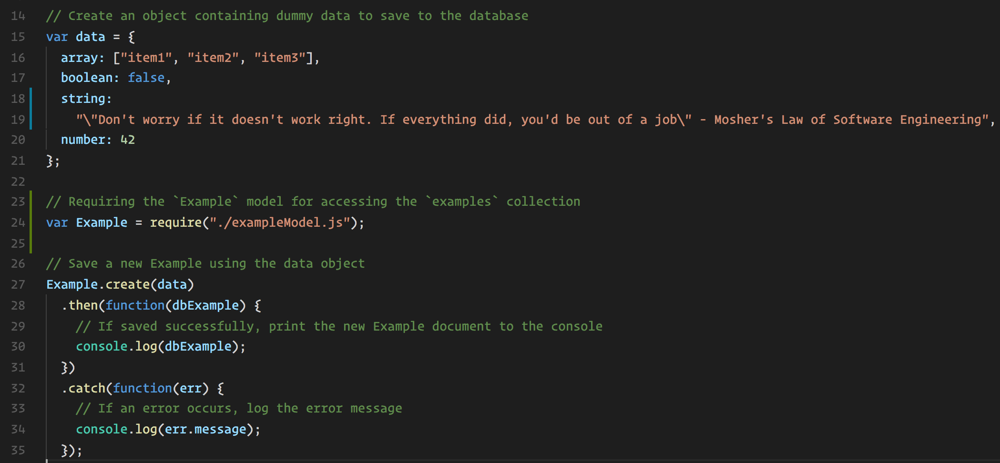
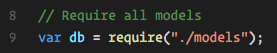

## 18.3 Lesson Plan - Riding with Mongoose <!--links--> &nbsp; [⬅️](../02-Day/02-Day-LessonPlan.md) &nbsp; [➡️](../../19-Week/01-Day/01-Day-LessonPlan.md)

### Overview

In the class, you will introduce students to `Mongoose`, a node package that lends some more power to MongoDB queries. With schemas, custom methods and the ability to create relations in a non-relational database, `Mongoose` will help make MongoDB even more flexible.

`Summary: Complete activities 13-20 in Unit 18`

##### Attention: If you’re teaching a part time section and this isn’t a Saturday, please use the “Weekday” tab inside of the "03-Day-TimeTracker.xlsx" for activity lengths instead of those printed on this lesson plan

##### Instructor Priorities

* Students should understand how to write up a `Mongoose` schema to dictate rules for their MongoDB data.
* Students should know how to create custom methods in `Mongoose` to set and update data purely on the back end.
* Students should be able to utilize `Mongoose`'s populate method to create relationships between the collections in their database.
  * They should also understand that populate doesn't offer the support for more advanced types of relationships, so MySQL may still be more suitable for more complex projects.

##### Instructor Notes

* _Absolutely_ go over the exercises before class, so that you know how each file functions and what parts of `Mongoose` we'll be teaching the class.
* _Especially_ go over the comments in the model files, as well as the populate method in the sixth and seventh activities. These are super important concepts that the class should understand to finish their homework.
* There will be some extra time available for you: these are tough but essential concepts for the homework, so be sure to spend a few more minutes on a topic if students seemed stumped by any of these activities or practices.
* * **DO NOT HAVE STUDENTS CONNECT TO A REMOTE DATABASE WHEN DEVELOPING LOCALLY.** If your students do not properly use environment variables, they may not be able to work on activities or homework on your classroom's internet connection (also, using a remote database for local development is considered bad practice). Use local database connections when working locally, and only connect to your Heroku database when applications are deployed.

### Sample Class Video (Highly Recommended)
* To view an example class lecture visit (Note video may not reflect latest lesson plan): [Class Video](https://codingbootcamp.hosted.panopto.com/Panopto/Pages/Viewer.aspx?id=baba13c8-eb9d-4596-b261-df9063aaa9a8)

- - -

### Class Objectives

* Show the various properties `Mongoose` offers for organizing and validating data.
* Demonstrate how `Mongoose` connects its models with `server.js`.
* Spur your students to start thinking about when they would want to use Mongoose instead of other types of database system (i.e MySQL with Sequelize)

- - -

### 0. Instructor Do: Welcome Students (1min)

* Say hellos and answer any questions students might have before class.

### 1. Students Do: Warm up (15mins)

* Tell the class that they've gone over a lot of new technologies this week, and we just want to make sure everything's fresh in their minds. "So, we're going to start with a warmup."

* Open up the solution to `13-Warm-Up` on your machine, run `server.js`, then load the site in your browser. Show how the site lets them add books, and mark books as read or unread.

* Note the fact that an explicit route for the root, `http://localhost:3000` does not exist.  However, the page still loads `index.html` from the `/public` folder.  Explain to the students that this is a convention from the static middleware that we are using.  Point to this line:  `app.use(express.static("public"));`  

* "Your goal is to complete the routes in the server file so the site can display and edit the book data. Don't worry about the front end, just use MongoJS to finish the routes"

* Slack out the skeleton of `13-Warm-Up`. Their assignment and the particular routes are written out in the `server.js` file.

### 2. Instructor Do: Go over warm up (5mins)

* Ask your students how the activity went. Then open up the solution's `server.js` file. Scroll down to the file's routes.

* For each route, ask students how each route works?
  * Basically, each one is taking the body of the front end's request, and using that information in the relevant MongoJS queries, as the comments in the file describe.

### 3. Instructor Do: Introduce Mongoose (10mins)

* Mongo is very flexible, and makes it a cinch to save data, retrieve data.

* But sometimes we need to be stricter. We don't want to save 'true' or an actual array as a book, or save a book without a title, or save a book with the same name and author. But the flexibility of MongoDB makes that possible.

* Sometimes, we want to combine two collections for information. What if we have our authors and their books stored separately. How would we display a list of all author data along with all of the books they wrote?

  * MySQL makes that possible with joins, but how do we do that with MongoDB

* Enter `Mongoose`.
  * `Mongoose` lets us define models for our Mongo data. No surprise data types for particular fields.
  * We can set required fields, too.
  * We can create custom functions to handle our data in ways that aren't already baked in `Mongoose`.
  * What's more, we can combine collections with "populate," a method that offers very similar functionality to a MySQL join.

### 4. Partners Do: When is Mongoose Good for You (5 mins)

* Tell students to partner with the classmates sitting next to them to discuss when they might want to use `Mongoose` versus, say, a vanilla MongoJS set-up, or MySQL with Sequelize. This will help edify the importance of the package.

* At the three-minute mark, call on some students and ask them for their answers. But mainly, you use `Mongoose` when you want the simplicity of parsing BSON data in a website, along with the same kinds of benefits that MySQL schemas offer.

### 5. Instructor Do: Go over Models (20 mins)

* Open up the `14-SchemaExample`, two files in particular: `server.js` and `exampleModel.js`. Read up on the comments left here to understand how it works, but the main concepts you want to show the class are

  * That the `server.js` file loads mongoose and uses the url path of the MongoDB database to connect with MongoDB.

    

* That the `server.js` file loads in the `exampleModel.js` file with require, and that this model is where much of the beauty of `Mongoose` lies.

  * Mongoose models are similar to those in sequelize. We define a schema for the model and then use the model to query our database.

  

* Similar to sequelize, we create a new entry into our database using the model's `create` method, which accepts an object describing the new document to be inserted.

  * Since we've configured mongoose to use promises, we can specify what happens after the query by passing a callback function into the `.then` method.

  * If an error occurs, we can handle it in the `.catch` error handler.

  

* And that in `exampleModel.js`, we first set up a schema class, then define a schema, and use the schema to create a model.

* Be sure to go over the various properties that the schema defines. These are all laid out with the comments, as you can see in the above image.

### 6. Partners Do: Make a Model Schema (20 mins)

* After you demonstrate the key aspects of `Mongoose` schemas (as outlined in Activity 2), open up the solution to `15-User-Schema` on your machine. Open it with Node and demonstrate how the site works.

* Try entering another user with the same email address, and note how it won't work.

* Slack out the skeleton of `15-User-Schema` to the class, and ask them to group up with their earlier partners. The instructions are outlined in the assignment, but their work consists of coding out a schema already outlined for them.

* Encourage students to speak with you or a TA if they have any questions while trying to write out the schema.

### 7. Instructor Do: Schema Solution (10 mins)

* Ask how the activity went, and answer any lingering questions students might have. If they were stumped by this, offer encouragement: this is the first time they've made a schema with `Mongoose`, and figuring out the right syntax will come with practice.

* Open up the skeleton version of the route, and call on students to fill in each part of the schema, field by field, based on the commented notes.

### 8. Instructor Do: Custom Methods with Schema (10 mins)

* But what about when we want more functionality then what these schema properties offer?

* What if we want to create new entries with the information that the user sends automatically?

  * Maybe a full-name field that gets created on the fly by concatenating the first and last name of a user. That's where custom methods come in.
  * Maybe we simply want to update a field with a simple function call in our server file.

* Open up the files in `16-Custom-Methods`, particularly `server.js`, `usermodel.js` and `public/index.html`.

  * Fill out the form in index.html and submit it, and read the username. Something looks different, huh. And look, they have an isCool field, and it's set to true (See? You **are** cool)!

    

  * Open up the `userModel.js` and scroll down to the custom methods being added to the schema.

    

  * Then show the students the `server.js` page where these functions are called.

    * Note how before running `User.create` to insert a new user into the collection, we first create a new `user` object using `User` as a constructor function, passing in `req.body`.

    * This essentially creates a user object that isn't inserted into the database _yet_, but we can use custom methods on to ready it's values before insertion.

    * By running the `coolifier` and `makeCool` methods on this `user` object, it knows to update the user to be created in the database to have the values updated by these methods.

    * Note how we run `User.create(user)`, rather than `User.create(req.body)`. This is because we want to tell mongoose that our newly inserted user should be _coolifed_ and _madeCool_ when it's inserted.

    

* Ask students if they have any questions.

### 9. Students Do: Custom Method Exercise (10 mins)

* Slack out the skeleton for `17-Custom-Method-Exercise`. Their work lies in `server.js` and `userModel.js`. Here are their instructions for your reference:

* **INSTRUCTIONS**

  1. Go to userModel.js, and create custom methods
   based on the details offered in the file.

  2. Once you've made those custom methods, use them
   in this file's POST request

  3. Good luck!

* Make sure you go over the solution in the interim, if you haven't already done so before class.

### 10. Instructor Do: Go over (10 mins)

* Ask your students how the activity went, and open up the skeleton files on your machine: `server.js` and `userModel.js`

* First, start with the `userModel.js` file, and ask two students to give you their answers for the custom methods.

* From there, open the `server.js` and ask a student how to call these new methods in that file.

* Finally, start the server and load up the site in your browser. Enter the form and test if it works.
  * Should anything go wrong for some reason, ask the students if they know what's happening, or to guide you through the debug process. Could be a good opportunity to practice debugging in class like this.

- - -

### 11. Break (40 mins)

- - -

### 12. Instructor Do: Introduce Population with Mongoose (15 mins)

* Welcome the students back to class.

* This next part is part is _very important_, and is where much of `Mongoose'`s power lies.

* Populate lets users relate one collection to another. Be sure to tell students that if they need really advanced relations, MySQL may still be the better choice. But, this does give some similar functionality to sites powered with `Mongoose`.

* Open up `18-Intro-Populate` on your machine. Start the server with node, then open up the site and save a book. In fact, save a few books.

* Then, visit `/books` to see your books listed.
      _(and yes, The Great Gatsby **is** my favorite author)_.

* Then visit `/library` to see your library data listed in JSON, including a list of ObjectIds in the book property. These are the ObjectIds associated with each book we've made.

* Ask students, what if we want to see the data for all of the books stored in our library. We could go back to books, but what if we want to include all of the information about our library and our books, and query that data with just one call.

  * Answer: This is where `Mongoose`'s populate method comes in. Open the `/populated` route in your browser, and go to the books property. All of the books will be there.

    

* How does this happen?

  * Show them the `Library.js` model, and how it has a reference to the `Book.js` model inside it's schema.

    

  * Then show them the `index.js` file inside of the `models` folder.

    

    * Explain that when working with multiple models, it's often useful to be able to require all of them at once, rather than individually. By exporting an object containing all of our models from the `index.js` file in the models folder, we can then require this object and access all of our models inside of `server.js`.

      

  * Then show them the populate method being used in `server.js`.

  * All that's required here is to run `populate("books")` after finding books and before handling the result of the query in `.then`.

    

### 13. Partners Do: Finish User Model (10 mins)

* Tell the students to partner up one last time. Slack out the skeleton of `19-Populate-Exercise`.

* Tell them their work is located in `server.js`, but to check out the `Note.js` and `User.js` models to see how the schemas there make the populate method possible.

* In the interim, open up the solution on your machine if you need a refresher on how the populate method works.

### 14. Instructor Do: Go Over Solution (10 mins)

* Ask the students how the activity went. If they seem stumped, answer any questions give them five or so more minutes: this is an essential part of their homework.

* Open up the skeleton `server.js` on your machine, and call on students to give you each line of the code you need to solve the problem. Writing the whole function out will serve as a nice review of how to use `Mongoose` to save data, as well as using the populate method.

### 15. Students Do: Scraping with `Mongoose` (30mins, or until only 10 mins are left in class)

* "Now, we're going to bring this right back to the last class." Tell your students that you'll be working with `cheerio` for this last assignment, `20-Scraping-With-Mongoose`.

* Open the solution up on your machine and run `server.js`, then open the site in your browser.

  * _IMPORTANT_: You MUST visit `/scrape` before the articles appear in the index of your site. Otherwise you will be staring at a blank screen

* When the articles do show up, click on the article headlines, Leave a few notes, delete a few notes, and encourage students: "If you can do this assignment, you should be all set for homework tonight!"

    

* In the interim, answer any questions students might have and study the solution, so you know how it should look for the next part of the assignment.

### 16. Instructor Do: Go Over Solution (10 mins)

* Once again, ask students how the assignment went.

* Open up the skeleton `server.js` on your machine and ask students to tell you the code for the three routes they created.
  * If they just give you the code, grill them a little on how their solution works, to make sure they understand what's going on.

### 17. Wrap Up

* Encourage the class. This was a tough lecture! And if everything isn't clear just yet, the homework should provide enough practice to help edify how `Mongoose` and scraping work.

* Let students know that if they need assistance with the homework, they are free to reach out to you and the TAs for assistance.

* Class dismissed.

# Instructor Do: Private Self-Reflection (0 min)

Take some time on your own after class to think about the following questions. If there's anything that you're not sure how to answer, feel free to reach out to the curriculum team!

1. How did today's class go?
2. How did you teach it?
3. How well do you feel you did teaching it?
4. Why are you teaching it?
5. Why did you teach it that way?
6. What evidence can I collect to show my students are understanding?
7. How will my students know they are getting it?

### Lesson Plan Feedback

How did today's class go?

[Went Well](http://www.surveygizmo.com/s3/4325914/FS-Curriculum-Feedback?format=pt&sentiment=positive&lesson=18.03)

[Went Poorly](http://www.surveygizmo.com/s3/4325914/FS-Curriculum-Feedback?format=pt&sentiment=negative&lesson=18.03)
