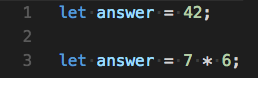

## 19.1 Lesson Plan - An ES6travaganza (6:30 PM) <!--links--> &nbsp; [⬅️](../../18-Week/03-Day/03-Day-LessonPlan.md) &nbsp; [➡️](../02-Day/02-Day-LessonPlan.md)

### Overview

This week, we introduce students to React. For them to be able to understand it, however, they need a basic primer in ES6.

Thus, in this class we introduce students to a few ES6 concepts prevalent in React (and general modern JS) development.

Today's class is fast-paced. This class is not meant to be an extensive introduction to all concepts ES6, but instead a basic introduction to some of the more commonly-used concepts. Students are expected to continue their study of these and other ES6 concepts outside of class.

Regarding timing: You can expand/reduce activity times according to student interest and familiarity.

`Summary: Complete activities 101-115 in Unit 19`

### Before class

* We recommend you run the following command to globally install the `babel-cli` package. It'll allow you to run scripts with Babel more easily throughout the class. 

  ```bash
  npm install -g babel-cli
  ```

* If you have time, we always recommend personalizing the activities with names/relevant examples for your class! For example, switch up the names in the activities to be students in your class.

- - -

### Class Objectives

* Students should understand the benefits of, and gain exposure to, ES6 concepts.

* Familiarity with Babel and transpiling.

* Familiarity with `import` syntax.

* Familiarity with arrow functions.

* Familiarity with `class`es, constructors, and class methods.

* Familiarity with `let`, `const`, and block scope.

* Familiarity with template literals.

* Familiarity with additional string and array methods.

- - -

### 1. Instructor Do: Welcome & Intro to ES6 (2 mins)

* Welcome students to the React week! It's the moment they've all been waiting for! Right?

* Unfortunately, they'll have to wait one more day. Why? ES6!

* Ask the class what they think ES6 is. Field a few answers.

* Explain that ES6 (often called ES2015) stands for 'ECMAScript 6'. It's the sixth major release of the ECMAScript language specification.

* The specification is what defines the features you can use in your code.

* Many of the newly introduced features help make your code easier to read, write, and understand.

* Today we'll cover new syntax and features of JavaScript commonly used in React and modern JavaScript. This will ease our transition into the world of React, and give us more powerful tools to use when coding.

* Today we're only covering a _subset_ of the new ES6 features. There are a ton of changes, too many to cover, so students will have to do some self-study. We will cover and get practice with the most relevant and commonly used concepts.

* Go through the objectives with the students - explain that the primary goal of today is to become familiar with the following: block scope, `const` and `let`, `import` and `export`, arrow functions. `class`es, template literals, Promises, additional string and array methods, and Babel and transpiling. Sounds like a lot (it is)! So without further ado...

* Let's start by testing out some of that new native functionality. So how about an ES5 warmup activity?

### 2. Partners Do: ES5 Warmup (5 mins)

* Slack out `101-Stu_ES5Warmup/Unsolved`

* To start, we'll do an activity to review functional scope.

* Tell students to discuss with a partner what they expect the value to be at each line (no cheating and running the file!).

* They should update the comments as they go through the file.

* Mention you've replaced `console.log` with a method called `log` which logs the line of code for each log. Explain that the implementation isn't really important for now, but they can look into it if they have extra time.

* TAs and instructors should walk around and correct any misconceptions if they hear them.

* **Instructions:** [README](../../../../01-Class-Content/19-react/01-Activities/101-Stu_ES5Warmup/README.md)

### 3. Instructor Do: Review ES5 Warmup - Identify Problem (5 mins)

* Open up `101-Stu_ES5Warmup/Unsolved` and go through it with the class. Ask them what each line logs, and add comments live using the below as a guide.

  

  * Be sure to ask them to explain why, and add to or fix the explanation when relevant. Call on specific students.

  * If the called on student can't explain it, don't let them off the hook! Ask another to help them, and then ask the original student to re-explain it.

  * Re-iterate and reword the explanation at each step as to why the line logs what it does.

* When finished adding comments, recap the concept of functional scoping: **variables are hoisted to the top of and available only in the scope of the containing function** (or globally, if no containing function).

* Answer any questions, and then ask the students if this exercise was tough. It should have been! "Functional scoping can be confusing, and knowing what the value of a variable is at any point can require a significant amount of thought."

* Point out two of the bigger problems with functionally scoped variables:

  1. You can use variables before their definition, which can lead to unexpected or confusing behavior.

  2. `for` loop iterator variables are functionally scoped, which means they can't be specific to a single loop iteration, making it harder for things like nested asynchronous functions to use the iterator variable (since that variable will be the value of the last iteration of that loop)

* Note that there are pros to functionally scoped variables, but in you can't define and assign variables only in the "block" in which they're being used.

### 4. Instructor Do: Introduce Const/Let (7 mins)

* Explain that instead of using `var`, we can use new keywords so that our variables are "block" scoped instead of functional scoped, meaning they are specific to the containing block statement (loops, conditionals, functions, etc.).

* ES6 provides two new identifiers for declaring block-scoped variables: `const` and `let`

* Walk through the `let-const-intro` example, explaining where appropriate.


* Walk through the code, explaining `const` and `let`. When you get to the end, ask them if they have any questions. Then, ask why this approach might be useful. Explain the below.

  * `const` means that the identifier can’t be re-assigned. This makes it clear to the person reading and writing the code that they cannot and should not reassign that value. You should default to `const` unless you know the value is going to change.

    * Any time you see this variable later, you know it's the same value.

    * Note - you can still modify objects or arrays, just not reassign.

  * In contrast, `let` signals clearly to the reader that the variable is likely to be reassigned (especially if you follow default to using `const` if it won't change). This lets the reader know immediately that this value is going to change.

    * Take care when replacing instances of `var` with `let` - they behave differently and blindly replacing can break or change the behavior of your existing code.

* Once questions have been answered, open `let-const-scope`. Explain that one of the biggest differences is that instead of being functionally scoped (hoisted to the top of the function block), `let` and `const` are block scoped.

  

* Walk through the example, explaining the difference between functional and block scope. When you get to the end, ask what the benefits of this approach might be.

  * Variable will only be used in the block in which it's defined. Reader/developer doesn't have to worry about conflicting values, overriding other variables, or looking for other uses of the variable outside of the block.

  * Demonstrate that it keeps you from accidentally redeclaring the same variable name.

    

    

  * Demonstrate that it throws an error automatically for references before assignment.

    

    

  * It's easy to declare variables closer to where they are used in the code, improving readability. Stylistically, you're saying "don't use the variable anywhere but right here."

* This approach is helpful because it makes the code easier to read and write (allowing you to explicitly define expectations).

* Answer any questions before moving on to the next activity.

### 5. Students Do: Convert Warmup ES5 -> ES6 Const/Let (5 mins)

* Slack out `103-Stu_RedoWarmup/Unsolved`

* Have the students open [function-scoped.js](../../../../01-Class-Content/19-react/01-Activities/103-Stu_RedoWarmup/Unsolved/function-scoped.js). This is a simplified version of the warmup. They should go through it and convert all of the variables to be appropriately block-scoped. Walk around and help students as necessary.

* **Instructions:** [README](../../../../01-Class-Content/19-react/01-Activities/103-Stu_RedoWarmup/README.md)

* Ask them: does the code still work the same way it did before your refactor?

* Once time is up, send out the solution.

### 6. Instructor Do: Review Warmup ES6 (5 mins)

* Bring up the solution `103-Stu_RedoWarmup/Solved`.

  

* Ask them what the biggest difference in behavior was.

  * The biggest difference should be that setTimeout's callback function actually prints 'i' as expected.

* Also point out that the iterator variable (which was accessible outside of the loop before) now throws reference errors if you try to use it outside of the for loop.

* Walk through the solution quickly. If there are no questions, move on.

### 7. Partners Do: Debugging ES5 (5 mins)

* Slack out `104-Stu_ES5Debug/Unsolved`

* In this example students will work with a partner to identify and resolve an issue in an example using ES5 code. They will use their newfound knowledge of `const` and `let` to resolve the issue.

* **Instructions:** [README](../../../../01-Class-Content/19-react/01-Activities/104-Stu_ES5Debug/README.md)

### 8. Instructor Do: Squash that Bug! (5 mins)

* Ask the students what the bug was.

  * They should have identified it: everyone was eating the same number of tacos!

  * This was because we were using the loop iterator variable to count the number of tacos each person ate.

* Go through the process of fixing the Unsolved version (live-coding). This should only involve changing the `var`s to block-scoped variables.

  

  * Demonstrate the working code! That's a lot of tacos, Tammer 😉.

### 9. Instructor Do: Introduce Template Literals (5 mins)

* Great! So we have block scope down. But syntactically, there's still something annoying in this tacos solution. Ask the students if they can pick it out. (If no one answers up, give a hint: there are a lot of pluses...)

* String concatenation has gone haywire! There's a ton of escaping and pluses throughout our code that makes typing out these strings difficult.

* Explain that fortunately ES6 has a better solution: template literals.

* Then, live-code changing the strings to template literals.

  

  * Explain that the biggest change is you use backticks (`) instead of quotation marks for the string (and don't have to escape quotation marks).

  * Time permitting, you can show them that they can put any expression inside of the curly brackets - demonstrate this by moving the `i * 2` directly into the template literal.

  * Point out that you can instead of using `\n` just start a newline. This is especially useful for very long strings.

* Comment that in addition to template literals, strings got a boost in the form of new methods as well - `startsWith`, `endsWith`, and `includes`.

### 10. Partners Do: Template Literals and String methods (7 mins)

* Slack out `105-Stu_GameOfStrings/Unsolved`

* In this activity students will convert an application to use string template literals and string methods.

* **Instructions:** [README](../../../../01-Class-Content/19-react/01-Activities/105-Stu_GameOfStrings/README.md)

### 11. Instructor Do: Review Template Literals and String methods (5 mins)

* Open the solution `105-Stu_GameOfStrings/Solved` and walk through the necessary changes. Note that pretty much everything uses `const`, and the various uses of template literals and string methods. For example:


* Answer any questions as you go through the code.

### 12. BREAK (15 mins)

* Tell students to take a  15 minute break.

### 13. Partners Do: Use New Array methods (9 mins)

* Explain to the class that strings aren't the only thing that got additional functionality in ES6.

* In this activity, students will research new array methods and try to use them to accomplish tasks.

* Slack out `106-Stu_Arrays/Unsolved`

* **Instructions:** [README](../../../../01-Class-Content/19-react/01-Activities/106-Stu_Arrays/README.md)

### 14. Instructor Do: Review Array methods (8 mins)

* Open the solution `106-Stu_Arrays/Solved`. Go over each of the array methods. Discuss the pros mentioned in the solution file.

* Each of these could be done with a for loop, but with a lot more work.

### 15. Instructor Do: Function keywords bloat in this context (chain functions) (5 mins)

* Open `107-Ins_ArrowExample/Solved`

* Point out that you're typing the `function` keyword a lot in this context. ES6 introduced a new way: arrow functions. Time to introduce arrow functions!

* Arrow functions have a shorter syntax `function() {}` vs `() => {}`

* Open the file [arrows-intro.js](../../../../01-Class-Content/19-react/01-Activities/107-Ins_ArrowExample/arrows-intro.js) and walk through the code examples. Answer any questions before moving on.

* Next, open the file [arrows-lexical-this.js](../../../../01-Class-Content/19-react/01-Activities/107-Ins_ArrowExample/arrows-lexical-this.js). Show the top example, and then compare the next example.

* Explain that arrow functions lexically bind the `this` value.

  * In other words, instead of creating its own `this` value, it uses the `this` of its enclosing context.

* Where else might arrow functions be useful? (where else have we often had short callback functions?) Promises! But I promise we'll get to that later.

### 16. Students Do: Convert previous example to arrow functions (5 mins)

* Slack out the following file `108-Stu_ArrowArrays/Unsolved`

* Instruct students to go back through the previous example and convert everything to arrow functions.

* They should run the code to make sure it behaves the same way as before.

* Explain that often moving forward they will be defaulting to arrow functions.

* **Instructions:** [README](../../../../01-Class-Content/19-react/01-Activities/108-Stu_ArrowArrays/README.md)

### 17. Instructor Do: Review Previous Example Arrow Functions (4 mins)

* Go through the solution, [arrays-arrows.js](../../../../01-Class-Content/19-react/01-Activities/108-Stu_ArrowArrays/Solved/arrays-arrows.js), with the class. Answer any questions.

### 18. Instructor Do: Introduce Destructuring and new Object Notation (8 mins)

* Open `108-Ins_ObjectExample`

* Mention that in addition to array and function changes, there were also changes to objects.

* In particular, one of the newer changes is destructuring, with which we can pull properties off of objects into new variables with less code.

* Open up [destructure-intro.js](../../../../01-Class-Content/19-react/01-Activities/108-Ins_ObjectExample/destructure-intro.js) and walk through the code and go over each part of the code.

  

### 19. Students Do: Object Destructuring and Functions Example (10 mins)

* Slack out `109-Stu_ObjDestruct/Unsolved`

* In this activity we will update a JavaScript file to utilize object destructuring.

* **Instructions:** [README](../../../../01-Class-Content/19-react/01-Activities/109-Stu_ObjDestruct/README.md)

* Slack out the solution before going on break.

### 20. Instructor Do: Code Organization Improvements - Intro Import (5 mins)

* In addition to the new syntax and functionality we've looked at, ES6 introduces new ways to organize and think about the architecture of your code.

* Students should be familiar with CommonJS modules available in Node (using `module.exports` & `require()` to share code between files).

* ES6 introduces a new more powerful syntax for importing and exporting data between modules called ES2015 modules.

* Open `111-Ins_ES2015Modules`

* Look at [ES2015 Modules](../../../../01-Class-Content/19-react/01-Activities/111-Ins_ES2015Modules/index.js)

  

* Go through and run the code using `babel-node` (see the [Babel Setup Instructions](../../../../01-Class-Content/19-react/01-Activities/110-Stu_BabelSetup/README.md) to set this up if you haven't already).

* Point out the `import` syntax and how it differs depending on whether the export is a default export or a named export.

* Explain that `default` exports behave similarly to the `module.exports` syntax we're familiar with, but with more strict rules where there can only be one `default` export per module.

* Point out the named exports inside of the `utils` folder. Explain that named exports can be used when we want to export multiple values from a module to be required with the `import { module1, module2 } from "./module.js` syntax.

* This allows us to more clearly import and export data we mean to from our JavaScript files.

* ES2015 modules also allow for the possibility of [tree shaking](https://webpack.js.org/guides/tree-shaking/).

  * Tree shaking is a term commonly used in the JavaScript context for dead code elimination.

  * When working with CommonJS modules, whenever we require _anything_ from another JavaScript file, the entire file is essentially loaded, even if parts of the code aren't actually being used.

  * On the server, this isn't normally a problem. But as we begin working with React we'll be using modules in our front-end code and bundle size will definitely matter.

  * When working with ES2015 modules, we can configure our project to take advantage of tree shaking and effectively not import any more code than we mean to into our final project.

* Finally, explain that while ES2015 modules are awesome, they are new to JavaScript and not currently supported inside of Node out of the box. In order to take advantage of them, we'll need a JavaScript transpiler!

### 21. Everyone Do: Necessary Digression: Transpilers (5 mins)

* Explain to students that not every environment supports all of these new features. While much of what we've covered so far has decent support on relatively modern browsers, many of the features we'll use moving forward won't have as widespread usage or support.

* Send them the link to <http://kangax.github.io/compat-table/es6/>. Explain that these pages show what environments support different ES6 features.

* For our code to work in every environment, we'll use a tool called `Babel` to convert our spottily-supported ES6 code to good old fashioned ES5 code.

* This process of transforming and compiling ES6 to ES5 is called "transpiling". We are translating our new ES6 code (that not every environment can parse) into something that they can still understand.

* Show them the [Babel REPL - babeljs.io/repl](https://babeljs.io/repl/#?babili=false&browsers=&build=&builtIns=false&code_lz=MYewdgzgLgBAEgUQDJIPIwLwwERwKYA2BIMA6iAE4EAmAhNgNxA&debug=false&circleciRepo=&evaluate=true&lineWrap=true&presets=es2015%2Creact%2Cstage-2&prettier=false&targets=&version=6.26.0). Explain that this tool allows you to see the conversion in real time. Type in `const HELLO = 'Hello World!';`. Point out that it spits out something most environments will recognize: `var HELLO = 'Hello World!';`.

  

* For those students using VS Code, you can direct them to a built in [babel-repl extension](https://marketplace.visualstudio.com/items?itemName=t-sauer.vscode-babel-repl). If you have time, you can demo this as well.

* Explain that Babel has a ton of additional presets and extensions that allow you to take advantage of even newer ECMAScript features - ES2015 and beyond. We'll touch on this again when we use React.

* Emphasize that the biggest takeaway is that this allows us to use the newer (even not yet officially approved) JavaScript features everywhere today.

* Answer any high-level questions before moving on.

### 22. Students Do: Babel Setup (5 mins)

* Ask the the class "So we can transpile on this website, but how can we transpile our Node code to make it run"?

* In this activity students will install the Babel Node, a CLI tool which can be used to run next generation JavaScript inside of Node. They will test their installation by running a simple JavaScript file using Babel Node.

* **Instructions:** [README](../../../../01-Class-Content/19-react/01-Activities/110-Stu_BabelSetup/README.md).

* This activity has them run the following command:

```bash
npm install -g babel-cli
```

* Explain that they have a breakdown explanation of what this does in their repo, but for now they just need to know it allows us to use `babel-node script.js` to run the compiled file in the project folder.

* Explain to students that they can test out the installation by creating a simple JavaScript file and running `babel-node <filename>`. If successful, the code should run. For now, we aren't worried about which features are or aren't already supported in the version of Node they're running.

* Walk around and ensure every student gets this setup correctly before moving on. Have students help each other!

### 23. Students Do: Discuss ES2015 Modules (5 mins)

* Slack out `112-Stu_ES2015Modules/Unsolved`

* In this activity, students will correctly utilize ES2015 module syntax in order to pass data around a small JavaScript application.

* **Instructions:** [README](../../../../01-Class-Content/19-react/01-Activities/112-Stu_ES2015Modules/README.md)

### 24. Instructor Do: Review ES2015 Modules (5 mins)

* Go over the [solved version](../../../../01-Class-Content/19-react/01-Activities/112-Stu_ES2015Modules/Solved) of the previous activity as a class.

* Most important make sure that students understand the difference between named exports and default exports:

  * A file can have multiple named exports and multiple values can be exported from a single file.

  * A file may _only_ have one default export. This is the default value imported if no named import is specified.

* **Instructions:** [README](../../../../01-Class-Content/19-react/01-Activities/112-Stu_ES2015Modules/README.md)

### 25. Instructor Do: Classes Example (5 mins)

* Ask the class, "Does anyone remember constructor functions?".

  * Have a volunteer explain to you what a constructor function is in JavaScript.

  * We're looking for something along the lines of, "Constructor functions are special JavaScript functions that can be used as a blueprint to create multiple instances of the same type of object."

* Now ask the class, "How many of you have used constructor functions in your last homework assignment or group project?"

  * The number will probably be low.

* Explain that object inheritance works differently in JavaScript than it does for other object oriented languages. Other programming languages have the concept of `classes` which are written more or less the same way across languages. Classes don't really exist in JavaScript, what we use instead are constructor functions.

  * Compared to classes in other programming languages, the syntax for writing constructor functions, prototypes and reusing code across constructors can be confusing. This is a common source of frustration for both for brand new developers and seasoned veterans.

* Explain that with ES6 we finally have support for classes in JavaScript.

* Open `113-Ins_Classes` and run the code inside of [Vehicle.js](../../../../01-Class-Content/19-react/01-Activities/113-Ins_Classes/Vehicle.js).

  

* Go through and explain the code inside of the Vehicle class.

  * Point out how the contents of the class are contained within curly braces, but it isn't an object or a function.

  * Demonstrate how the `constructor` method inside of the class accepts some arguments and assigns them to `this` inside of the constructor method. Point out how we still create object from a class using the `new` keyword, and the values we pass in are equivalent to how values are passed to and used in regular JavaScript constructor functions.

  * Point out how we define methods defined on this class (`accelerate`, `brake`). Point out how the syntax looks halfway between a function call and function definition, and there aren't any commas or colons separating them.

* Uncomment the code below and demonstrate the ES5 constructor equivalent.

  * Point out how we have to define methods on the prototype separate from our actual constructor function.

  * Needing to explicitly assign methods to the prototype can be confusing &mdash; the concept of the object prototype itself can be confusing. Our code which should be self-contained is in 3 different places.

  * Classes allow us to describe the objects that should be produced in one neat easier to understand package that abstracts some of the nitty-gritty details of inheritance works in JavaScript.

* If students have a relatively good grasp on this example, go over [Animal.js](../../../../01-Class-Content/19-react/01-Activities/113-Ins_Classes/Animal.js) as well to demonstrate how we can create a child class that extends or inherits from a parent class. Definitely feel free to skip this example if running short on time or the basic concept of classes is not yet clear.

### 26. Students Do: From Constructors to Classes (5 mins)

* Slack out `114-Stu_ConstructorsToClasses/Unsolved`

* Explain that in this example, students will be converting what was previously a constructor into new, ES6 class syntax.

* **Instructions:** [README](../../../../01-Class-Content/19-react/01-Activities/114-Stu_ConstructorsToClasses/README.md)

### 27. Instructor Do: Review Constructors to Classes (5 mins)

* Open up the [solved](../../../../01-Class-Content/19-react/01-Activities/114-Stu_ConstructorsToClasses/README.md) version of the previous activity and go through the code as a class.

* Point out the following:

  * When we initialize a `DigitalPal`, the values we pass into it are mapped to the parameters we set on the `constructor` method.

  * We define all of our classes' initial value inside of the `constructor` method.

  * Any methods which are attached to the constructor function's prototype get defined inside of the class but outside of the `constructor` method.

### 28. Students Do: SpaceX Example (20 mins)

* Slack out `115-Stu_SpaceX/Unsolved`

* Introduce students to the final activity of the day.

* For the next 20 minutes, they'll be SpaceX developers. They'll be using a SpaceX API to report on launch failures.

* Send out the instructions for the activity (or share the link or activity number, if they already have access).

* **Instructions:** [README](../../../../01-Class-Content/19-react/01-Activities/115-Stu_SpaceX/README.md)

### 29. Everyone Do: Review SpaceX Example (5 mins)

* Open `115-Stu_SpaceX/Solved`

* Navigate to [Basic Solution](../../../../01-Class-Content/19-react/01-Activities/115-Stu_SpaceX/Solved/Basic) run the example in your terminal.

* Go through each part of the code, line by line and answer any questions.

  

* In a nutshell, we:

  * Make a request to the SpaceX API, which gives us back way too much data.

  * We pass the response we've received from the SpaceX API to the `getFailureData` function.

  * The `getFailureData` function filters the results array to only contain data about the `falcon9` rocket.

  * We then map over the filtered array and create a new array containing `Launch` objects.

  * We then filter this array of `Launch` objects to create a new array of `Launch` objects for failed launches.

  * For every failed `Launch` object, log info about the launch.

* If time permitting and the majority of the class was able to complete this activity, go over the [Bonus Solution](../../../../01-Class-Content/19-react/01-Activities/115-Stu_SpaceX/Solved/Bonus) as well.

### 30. Instructor Do: Recap Objectives and Dismiss Class! (2 mins)

* Mention that there are a few ES6 features we didn't go into today: Spread operator/rest parameters, generators, the `fetch` API, and more.

* Explain that it'd take too much time to go through them all in class, but encourage everyone to spend some time outside of class investigating

### Lesson Plan Feedback

How did today's class go?

[Went Well](http://www.surveygizmo.com/s3/4325914/FS-Curriculum-Feedback?format=pt&sentiment=positive&lesson=19.01)

[Went Poorly](http://www.surveygizmo.com/s3/4325914/FS-Curriculum-Feedback?format=pt&sentiment=negative&lesson=19.01)
