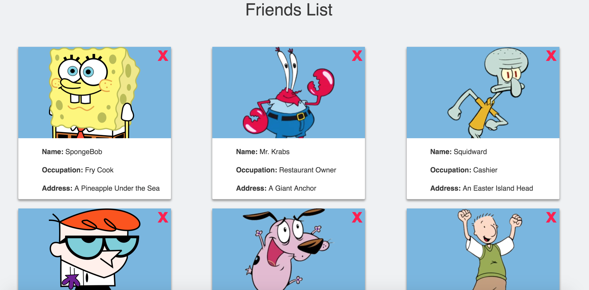

## 19.3 Lesson Plan - Props, Lists, and Stateful Components (10:00 AM) <!--links--> &nbsp; [⬅️](../02-Day/02-Day-LessonPlan.md) &nbsp; [➡️](../../20-Week/01-Day/01-Day-LessonPlan.md)

### Overview

In this class, we will be deepening students understanding of ReactJS. They further expand upon their understanding of props, learn how to programmatically render components from a list of data, and introduce the concept of class components and component state.

`Summary: Complete activities 10-18 in Unit 19`

##### Instructor Priorities

* Students should firmly understand how to pass data between parent and child components &mdash; and vice versa.

* Students should understand the difference between states and props and the use cases for each.

* Students should be able to use the Array.prototype.map method in order to programmatically render components from a list of data.

* * Students should complete the Mongo Checkpoint.

#### Instructor Notes

* Today's class will be more challenging than the last class for many students. Syntax errors will abound as students confusedly mix states and props, and forget to pass attributes to their child components. Explain that memorizing syntax will come with time and practice, it's far more important to understand the concepts covered as exact syntax can always be looked up.

* All of the Solved/Unsolved activities contain only the application's `src` folder. At the start of class scaffold out a React application using Create React App, and swap out the `src` folder for each activity to avoid repetitive npm/yarn installs. It's recommended that you completely restart the dev server between activities.

* Have your TAs reference [03-Day-TimeTracker](03-Day-TimeTracker.xlsx) to help keep track of time during class.

---

### Class Objectives

* To deepen understanding of passing props between React components.

* To gain a firm understanding of the concept of child-parent relationships in React

* To be able to programmatically render components from an array of data.

* To introduce the concept of class components and component state.

* To complete the Mongo Checkpoint.

---

### 1. Instructor Do: Go through Slides (10 mins) (High)

* This unit uses a web-based slideshow found here: [ReactJS Recap slides](https://react-reacap.netlify.com/#/). Be sure to give students enough time to answer each question and discuss before going over the answers.

  * Use the left and right arrow keys to cycle through the slides. It is advisable to view the slideshow in fullscreen Chrome.

### 2. Instructor Do: Props Demo (15 mins) (High)

* Inform the class that we can conceptualize React components as JavaScript functions.

* It's a component's job to describe and _return_ some part of our application's UI.

* Ask the class: If a component is a function that _returns_ some data, what else might a component be able to do?

  * Since it's a function, a component can also receive arguments.

* This allows us write components that behave differently based on the arguments that they receive.

* We call the arguments we pass into React components `props`.

* If you haven't already done so, scaffold out a React application by running the following command in your terminal: `create-react-app demoapp`.

* This example uses Bootstrap. Add the following link tag to your React app's `public/index.html` file:

  ```html
   <link rel="stylesheet" href="https://cdnjs.cloudflare.com/ajax/libs/twitter-bootstrap/4.0.0/css/bootstrap.min.css"/>
  ```

* Replace your React app's `src` folder with [10-Ins_PropsDemo/src](../../../../01-Class-Content/19-react/01-Activities/10-Ins_PropsDemo/src). Stop the dev server if it is already running. Start the app in dev mode by running `yarn start`.

* Demonstrate the rendered page in your web browser:

  

* This example is rendering a simple Bootstrap alert element. Open `src/components/Alert.js` and demonstrate the code:

  

* Explain that every component has access to a `props` argument. Props is always an object containing all of the values passed the component.

* We're using `props.type` to determine what the evaluated `className` of the `div` element is.

* This component renders `props.children` between it's `div` tags.

* Compare this to the value of `props` as it is logged to the console:

  

* Point out that since `props.type` is equal to "danger", then the computed `className` of the `div` in the `Alert` component is "alert alert-danger". This Bootstrap class is providing our component its styles.

* The `Alert` component is also receiving a `children` prop with a value set to "Invalid id or password" &mdash; the same message being displayed inside of the rendered Bootstrap alert element.

* Open `src/App.js` in your editor and explain to the class how these props are being passed into the `Alert` component.

  

* We have 2 ways of passing props into a component:

* First, we can set an attribute to the rendered component's tag.

  * We're passing a `type` prop equal to `danger`.

* Second, we can give a component a sibling tag and pass an expression between the tags.

  * We don't name this prop, it is automatically set a `children` key.

  * We're passing a `children` prop equal to "Invalid user id or password".

* Demonstrate how you can change what is rendered by the `Alert` component by passing it a different `type` and `children` prop.

  * For example, setting `type` to "success" and `children` to "Welcome Back!" would render the following in the browser:

    

* Explain that having this familiar syntax for passing props to our components is another way for JSX to be similar to HTML. We don't need to explicitly call any functions or modify any object properties ourselves.

* Explain that props allow us to customize our components so that we can reuse them in different situations.

  * For example, we might use this `Alert` component on a sign-in page and render a different alert depending on whether or not a user has successfully logged into their account.

* Inform the class that we can pass any type of data as a prop, including strings, numbers, arrays, functions, even entire components.

* Props are the primary means by which we pass data around our React apps. React utilizes a unidirectional data flow, meaning data only flows one direction: from the top down, parent to child.

  * This unidirectional data flow makes changes in React apps more predictable and easier to debug.

* Ask the class: If a prop inside of our component isn't what we expect it to be, where could we look to find out why?

  * We could look at the component's parent.

  * In this example, `App` and `Alert` have a parent/child relationship. `Alert` is being rendered inside of `App` and `App` is passing props to `Alert`.

* Take a moment to answer any questions before the first activity.

### 3. Partners Do: Calculator Props (10 mins)

* In this activity students will work with a partner to write a component that accepts props, performs arithmetic and renders the result.

* Slack out `11-Stu_PropsCalculator/Unsolved`

* **Instructions:** [README](../../../../01-Class-Content/19-react/01-Activities/11-Stu_PropsCalculator/README.md)

### 4. Instructor Do: Review Calculator Props (10 mins) (High)

* Slack out the [solution](../../../../01-Class-Content/19-react/01-Activities/11-Stu_PropsCalculator/Solved) to the previous activity. Go through the code as a class.

* Demonstrate how the completed example renders the result of each problem in the browser:

  

* Demonstrate the code inside of the `Calculator` component:

  

* Point out how we're passing each `Math` component 3 props:

  * `num1`

  * `operator`

  * `num2`

* Point out how the numbers are wrapped in JSX curly braces, but the operator is in quotes.

  * Ask the class: Why do you think this is?

    * The operator is a string literal, and we can express that shorthand just using quotes without curly braces. The following are equivalent:

      ```jsx
      <Math num1={19} operator={"+"} num2={341} />
      ```

      ```jsx
      <Math num1={19} operator="+" num2={341} />
      ```

    * This shorthand only works for string literals. All other values we pass as props need to be in JSX curly braces.

* Open the `Math` component and go through the code:

  

* Point out that the `props` argument should be an object containing all of the values passed to the rendered `Math` component in the `Calculator.js` file.

* We're running a switch case over `props.operator`. Depending on the operator, a different operator is performed with `props.num1` and `props.num2`. The result is stored in the `value` variable.

* Point out how at the bottom of the function, we're returning `<span>{value}</span>`.

* Explain that a function component only renders what is returned from it. With arrow functions, we have to explicitly write the `return` keyword when the function contains more than one statement.

* Explain that we must either return JSX from a component, or nothing at all. This is why we had to wrap the `value` inside of the span tags.

* Take another few minutes to answer any remaining questions.

### 5. Partners Do: Props Review (15 mins) (Critical)

* Slack out `12-Stu_PropsReview/Unsolved`

* In this activity students will work with partners to make an existing React application more DRY through the use of reusable components and props.

* **Instructions:** [README.md](../../../../01-Class-Content/19-react/01-Activities/12-Stu_PropsReview/README.md)

* Instructional staff should be walking around the room available to assist students during this activity.

### 6. Instructor Do: Review Props Review (10 mins)

* Slack out the [solution](../../../../01-Class-Content/19-react/01-Activities/12-Stu_PropsReview/Solved) to the previous activity. Go through the code as a class.

  

* Point out how the application being rendered to the browser doesn't look any different to the unsolved version, but now we've made our code more DRY by creating a reusable component, `FriendCard`, to render each friend with the appropriate prop inside of the `App` component.

  

* Open the `src/components/FriendCard/FriendCard.js` file and go through the code.

  

* Point out that we use the `props` argument to access all of the values passed into the `FriendCard` component.

  * Since props is an expression we want to embed inside of our JSX, we use JSX curly braces to do so.

* Ask the class: In a real application, where might all of the friend JSON data come from?

  * Normally we might receive the friend JSON from an AJAX request, and probably won't know ahead of time which friends will need to be rendered.

* In your editor's sidebar, point out how each component is contained inside of its own folder containing the component, a CSS file, and an `index.js` file.

  

* Open up `src/components/FriendCard/index.js`, ask the class: Can anyone guess what this code is doing?

  

  * Explain that the `index.js` file inside of each component's folder allows us to export the component from the `index.js`, in addition to its own file (`FriendCard.js`).

  * Whenever we require/import a folder instead of a file, the folder's `index.js` file is required/imported by default (if it exists).

  * This allows us to keep our paths for importing these components short. e.g. we can do:

  ```js
  import FriendCard from "./components/FriendCard";
  ```

  * instead of:

  ```js
  import FriendCard from "./components/FriendCard/FriendCard";
  ```

  * Giving all of our components their own folder is another option for organizing our React apps. Each folder could contain any CSS or other dependencies the component will need.

* Spend another moment making sure the class understands the overall concept of passing and receiving props. Go back and forth between the `friends.json` file, the `FriendCard` component, and your web browser to visually demonstrate how the data is being used.

* Point out that while is code is more DRY than it was, we're still manually rendering a `FriendCard` for each piece of data &mdash; we'll come back and solve this problem in a later activity!

### 7. Students Do: Component Map (10 mins) (Critical)

* Slack out `13-Stu_ComponentMap/Unsolved`

* In this activity, students will utilize the map method in order to render JSX from an array of objects.

* **Instructions:** [README.md](../../../../01-Class-Content/19-react/01-Activities/13-Stu_ComponentMap)

* Instructional staff should be walking around the room making themselves available for assistance.

### 8. Instructor Do: Review Component Map (10 mins)

* Slack out the [solutions](../../../../01-Class-Content/19-react/01-Activities/13-Stu_ComponentMap/Solved) to the previous activity and go over the code as a class.

* For the basic solution:

  

  * Point out how the array of grocery objects is passed into the `List` component from inside of `App`, making it available inside of the `List` component as `props.groceries`.

  * Inside of the `List` component, we insert JSX curly braces inside of the `ul` element. We map over `props.groceries` and return one `li` tag for every element in `props.groceries`.

  * Ask the class: What type of value is returned by the map method here?

    * Explain that the map method will always return an array &mdash; in this example it's returning an array of JSX elements.

    * React is smart enough to know what whenever we're rendering an array containing JSX, it should deconstruct the array and render each element inside of their parent.

  * Point out the `key` property attached to the `li` tag inside of the map. Ask the class: Was anyone able to read about what this is for?

    * The application will still run if we were to remove the `key` prop, but we'd get a very specific warning telling us we should include it.

    * Whenever an array of JSX is being rendered, React expects each rendered parent JSX tag to have a unique `key` prop. This is a special type of prop that helps React efficiently re-render the list of JSX if it should ever need to change.

      * The `key` prop should be unique and specific to the data being rendered. Often this comes in the form of an `id` from a database. But it can be anything we can guarantee to be unique.

      * Using the index of the element in the array is not a good idea, since an element's index could change if the data we modified. This could potentially cause strange bugs.

  * Assure the class they don't need to stress out too much about the `key` prop since they'll get a very specific warning about it should they forget to include it and their code will still work.

  * The most important takeaway from this activity is that we can use the map method to loop over an array and return a new array of elements inside of JSX curly braces. React will then render each element in the resulting array.

  * Take a moment to answer any additional questions.

* For the bonus solution:

  

  * Demonstrate how we can create a `notPurchased` array by filtering `props.groceries` for groceries which have a `purchased` property set to false.

  * Remind everyone that while the map method returns a new array the same length as the original, the filter method returns a new array containing only the elements whose callback functions return truthy values.

  * Explain that we still need to use the map method to actually render the `li` elements. But we first filter for groceries which haven't been purchased, and then map over the new array, rather than `props.groceries`.

* Answer any questions before the break.

### 9. Instructor Do: Introduce Stateful Components (20 mins)

* Explain to the class that what we've been working with so far are known as stateless, functional components. Sometimes called "dumb components".

* These components can render JSX, receive props, and embed JavaScript expressions inside of themselves.

* In a React application, **most** components should be stateless components. These are easy to test, debug, and they tend to be more reusable &mdash; even across applications &mdash; because they usually don't depend on how the rest of the application works.

* So far we've been using stateless components to create static, unchanging UIs. In a real application, we'd want to give some of our components more complex dynamic behaviors.

* Now we're going to introduce stateful components. These special components aren't created using plain JavaScript functions, but with ES6 classes (which, if we want to get technical, are still JavaScript constructor functions once compiled).

* Explain that `state` is a special type of property attached to a class component that can contain data we want to associate with that component.

* Explain that values stored on a component's state are different from regular variables because unlike regular variables, when a component updates its `state` the React application will update itself in the browser to reflect the change wherever necessary.

  * Explain that a component can set and update its own state, whereas its props are always received from up above and considered immutable (can't/shouldn't be changed).

* Replace your Create React App's `src` folder with [14-Ins_BasicState](../../../../01-Class-Content/19-react/01-Activities/14-Ins_BasicState/src). Stop the dev server if it is already running. Start the app in dev mode by running `yarn start`.

* Open your browser to [localhost:3000](http://localhost:3000) and demonstrate the rendered app.

  

* Whenever we click the "Increment" button, the click counter goes up by 1. Point out that this is the first time we've built in any kind of dynamic behavior such as event listeners and UI updates into our React apps.

* Open `src/components/Counter.js` in your editor, walk the class through the code:

  

  * We create a new class named `Counter` which _extends_ the `React.Component` class.

    * Explain that `React.Component` is a class built-in to React which has special features we don't get with stateless functional components. By extending the `React.Component` class, `Counter` now inherits this extra functionality.

  * Then we set a `state` property on the component. We set its value to an object with a `count` property set to `0`. This is the initial counter value displayed when the component first loads.

    * Our component's `state` property must always be set to an object.

    * Because this component contains its own state, we call this a **stateful component**.

    * Create React App allows us to use [ES7 property initializer](https://babeljs.io/docs/plugins/transform-class-properties/) syntax. This allows us to attach properties to the class instance without writing out a constructor method.

  * Scroll down to the `render` method. Explain to the class that this method is built-in to React, and as the name implies, its job is to return the JSX that the component should render. Every class component needs to have this method defined.

  * Scroll down further to the "Increment" button and point out how the button has an `onClick` prop set to `this.handleIncrement`.

    * Explain that this is how a click event listener is defined in React. When the button is clicked, this component's `handleIncrement` method is called.

    * Explain that event names in React are similar to vanilla JavaScript or jQuery, e.g. `onClick`, `onSubmit`, `onChange`, etc.

  * Scroll back up to the `handleIncrement` method definition. Point out that unlike `render`, this method is using arrow function syntax.

    * Due to the nature of how props are passed to React elements, `this` inside of any method passed as a prop will be `undefined`, rather than the intended component. This is a common source of frustration and bugs for developers new to React. But thanks to the new class property initializer syntax, we can simply write all of our custom methods using arrow functions and never have to worry about this issue.

  * Point out how inside of `handleIncrement` we're calling `this.setState` and passing in an object as an argument.

  * Explain that `setState` is built-in to all class components. We use this method to update our component's `state` by passing it an object containing parts of the component's state we want to update and their new values.

    * Explain that whenever we want to update our component's state, we **ALWAYS** use `this.setState` to do so. Updating our state with this method tells our component that it should re-render itself and all of its children to account for the new state.

    * Explain that if we just updated `this.state.count` directly without using `setState`, we'd never see the click count go up in the view since there'd be no re-render.

      * Example:

      ```js
      // This wouldn't work as expected
      this.state.count = this.state.count + 1;
      ```

* Take a moment to answer any high-level questions the class may have. Most importantly make sure they understand the following:

  * We can use `state` to associate data with our components and keep track of any values we want to update the UI when changed.

  * We can define methods on a class component and pass them as props.

  * The `onClick` prop can be used to set a click event listener to an element.

### 10. Partners Do: Decrement Counter (10 mins)

* Slack out `15-Stu_DecrementCounter/Unsolved`

* In this activity students will add a "Decrement" button and event handler to the previous Click Counter example.

* **Instructions:** [README.md](../../../../01-Class-Content/19-react/01-Activities/15-Stu_DecrementCounter/README.md)

### 11. Instructor Do: Review Decrement Counter (10 mins) (High)

* Slack out the [solved](../../../../01-Class-Content/19-react/01-Activities/15-Stu_DecrementCounter/Solved) versions of the previous activity and go over both solutions.

  

* First go over the code in the basic solution:

  

  * Point out how we've defined a `handleDecrement` method which decreases the counter by 1.

  * Explain that like all event handlers, `onClick` expects a callback, which is why we write `onClick={this.handleDecrement}` instead of `onClick={this.handleDecrement()}`.

* Then go over the bonus solution:

  * 

  * Point out that we've replaced the `.card-body` div with a `CardBody` component which renders its contents.

  * We pass the click count and the event listeners to the `CardBody` component.

* Demonstrate the code inside of the `CardBody` component:

  * 

  * This component renders the same JSX that was removed from the `Counter` component. The only difference is that we're accessing the click counter and event handlers on the props argument.

  * Explain that even though the buttons are inside of a child component, the `Counter` component's `count` state is still updated when the buttons are clicked.

  * When the `count` state is updated, The `Counter` component and any of its child components re-render themselves. This is what allows the view to be updated in the browser when the buttons are clicked.

  * Explain that even though data still technically only flows one way (from the top-down) in React, we can allow child components to update their parent's state by passing them a method created in the parent.

* Assure the class that they'll get more practice with working with class components.

* Take a moment to answer any additional questions.

---

### 12. Break (35 mins)

---

### 13. Students Do: Friend Refactor (20 mins) (Critical)

* Slack out `16-Stu_FriendRefactor/Unsolved`

* In this activity students will further refactor the Friends List application from earlier to use class components, events, and programmatically render the `FriendCard` components.

* **Instructions:** [README.md](../../../../01-Class-Content/19-react/01-Activities/16-Stu_FriendRefactor/README.md)

### 14. Instructor Do: Review Friend Refactor (15 mins)

* Go over the [solution](../../../../01-Class-Content/19-react/01-Activities/16-Stu_FriendRefactor/Solved) to the previous activity.

* Demonstrate the completed application in the browser. Point out how we can remove friends by clicking the red x icon.

  

* Briefly go over the syntax for writing a class component. Be sure to point out the constructor method, how we set the application's initial state. Explain that when defining object properties with ES6, if the object's key and value have the same name, we can omit the colon &mdash; this is just an optional shorthand syntax.

* Point out how we bind the `removeFriend` method inside of the constructor. Ask the class: how does this method remove a friend?

* Point out how inside of the `removeFriend` method we use the filter method to create a new `friends` array from `this.state.friends`. We include only friends with an `id` property **not** equal to the `id` being received into this method. Then we use the `setState` method in order to set `this.state.friends` equal to the new filtered friends array.

  

* Explain that when we update our component's state by removing one of the friend objects, our component re-renders itself. On the new render, `FriendCard` components are created for each object in `this.state.friends`, which no longer includes the deleted friend. This then triggers our component to re-render, now minus one friend.

  * Remind students that in React, we never modify state directly, but we create new state instead. If the state we're modifying is an array, we'll often use the filter or map method.

* Scroll down to the code where we map over `this.state.friends` and render a `FriendCard` component for each element.

  * Point out the props being passed, in particular, the `id` and the `key` prop. Remind the class that whenever we map over a list of data and return JSX, React wants us to give each element a unique `key` prop. React uses this value internally to help it efficiently render and re-render components from arrays of data.

    * Explain that the `key` prop is unusual because it's used by React but isn't actually available for us to use inside of the component we pass it to. We pass the friend `id` in as a separate prop because we'll need it inside of the `FriendCard` component.

* Open up the `FriendCard` component.

  

* Point out how we've attached the `onClick` handler to the "remove" span. When clicked, it calls the `removeFriend` method and passes in `props.id`.

* Ask the class: Why do we have the `removeFriend` handler wrapped inside of another function?

  * Explain that since our event handlers need to be callbacks, we normally can't pass in arguments without invoking them right away. But by wrapping the `removeFriend` method in an another function, we can pass the `id` prop into the inner `removeFriend` method. When the span is clicked, it calls the anonymous callback function, which then calls the `removeFriend` method with the friend's `id` as an argument.

* Take a moment to answer any lingering questions.

### 15. Instructor Do: Demonstrate Forms (15 mins) (High)

In this example we will demonstrate how to handle simple forms with React.

* Swap out your application's `src` folder with [src](../../../../01-Class-Content/19-react/01-Activities/17-Ins_FormsDemo/src). Stop the dev server if it is already running. Start the app in dev mode by running `yarn start`.

* Open [localhost:3000](http://localhost:3000) in your web browser and demonstrate the rendered application.

  * 

  * Whenever we type into the input fields we see the input appended to the "Hello" statement.

  * When we click the "Submit" button, we get an alert with the provided first and last name.

    

* Now open `src/Form.js` and demonstrate the underlying code. It may be easier to begin with this component's `render` method.

  

  * Point out the following props attached to the `input` elements:

    * `value`: set to `this.state.firstName` or `this.state.lastName`

    * `name`: set to `firstName` or `lastName`

    * `onChange`: both set to `this.handleInputChange`

* Then go up to the component's `constructor` method. Point out how `this.state.firstName` and `this.state.lastName` are both initially set to an empty string.

  * To make sure everyone is following along so far, ask the class: Where is this state object coming from? Why do we use it?

    * A component's "state" is a property defined on a class component instance used for storing values that we want to associate with it. This property is recognized by React and can be used to embed data inside a component's UI which we want to update over time. Whenever a component's state is updated, its `render` method is fired along with the `render` methods of all of its children. This updates the application's UI to display the new data without having to refresh the browser.

* Then scroll back down to the `render` method and point out how each input has a `value` prop set to the value of one of these state properties.

  

* Ask the class: What would happen if I pre-set the first and last name states to values other than empty strings?

  * The text inside of each input field is determined by their `value` prop. By changing this component's initial state, we're also changing the initial values of the input fields. Demonstrate this live for the class.

* Then scroll down to the `handleInputChange` method. Ask the class: What do you think this method's job is?

  * This method is responsible for updating our state as the user types into the input fields.

* Then ask: What do you think would happen if I removed the `onChange` props from the input fields?

  * Proceed to remove the `onChange` props from both input elements. You should now be unable to type any new characters into the input fields after doing to.

  * Explain that `onChange`, like `onClick` or `onSubmit`, is a built-in event we can listen for by attaching a prop to a primitive JSX tag (a JSX tag that represents a basic HTML element).

  * Explain that by removing the `onChange` prop, we are no longer responding to the input's "change" event and thus are no longer updating our `Form` component's state. The `value` prop on each input field continues to point to the same unchanging state value.

  * Explain that if we were to also remove the `value` prop from an input field altogether, then we could update it, but it wouldn't update our state and we wouldn't have access to its value if we needed it. Explain that we use the `value` and `onChange` props on the input element to sync its value with our components state.

* Go back to the `handleInputChange` method and walk through its logic.

  * `handleInputChange`, like all event handlers, is passed an `event` object that describes the event that took place. We pull off the `name` and `value` properties from the `event.target` object. These correspond to the `name` and `value` properties attached to the element the event was triggered from.

    * Since each input field has a `name` prop set to the name of the state property holding its value, we can run the following code to update the appropriate state:

      ```js
      this.setState({
        [name]: value
      });
      ```

    * Starting with ECMAScript 2015, the object initializer syntax also supports computed property names. That allows you to put an expression in brackets [], that will be computed and used as the property name. Refer to the [MDN documentation](https://developer.mozilla.org/en-US/docs/Web/JavaScript/Reference/Operators/Object_initializer#Computed_property_names).

    * If students have questions regarding this syntax, demonstrate the same approach in ES5:

      ```js
      const newState = {};
      newState[name] = value;
      this.setState(newState);
      ```

* Scroll down to the `handleFormSubmit` method. Ask the class: Why are we running `event.preventDefault()`?

  * The default behavior of an HTML form submission, is to refresh the entire web page. We want to prevent the form's default behavior in lieu of our own. Remind the class that we also had to deal with this back when working with jQuery.

* Be sure to point out the code where we throw an alert with the user's first and last name before resetting our `firstName` and `lastName` state to empty strings to clear our input fields. Take a moment to make sure everyone understands how the string template literal syntax is working.

  * String template literals can be used to write multi-line strings and embed expressions without breaking the string. Instead we'd use the ${<expression>} token to embed expressions inside of our string.

* Take another few minutes to make sure everyone understands the code at least well enough to be able to refer back to this example as a starting point as they're building their own React forms.

### 16. Students Do: Fun With Forms (15 mins)

* Slack out `18-Stu_FunWithForms/Unsolved`

* In this activity students will add some new functionality to the previous form example.

* **Instructions:** [README](../../../../01-Class-Content/19-react/01-Activities/18-Stu_FunWithForms/README.md)

### 17. TAs DO: Slack out information (0 mins)

* Slack out the [solved](../../../../01-Class-Content/19-react/01-Activities/18-Stu_FunWithForms/Solved) version of the previous activity. If any time remains go through the code as a class.

* Inform the class that we'll continue to go through forms in the next lesson.

* Recommend students do their best to go through the following sections of the React documentation before the next class:

  * [Forms](https://facebook.github.io/react/docs/forms.html)

  * [Lifting State Up](https://facebook.github.io/react/docs/lifting-state-up.html)

  * [State and Lifecycle](https://facebook.github.io/react/docs/state-and-lifecycle.html)

### 18. Instructor Do: Introduce Checkpoint - Mongo (5 mins) (Critical)

* Let your class know that they will now be taking a short multiple choice assessment to check their understanding of Mongo

* DO NOT SKIP THIS INTRODUCTION. DO NOT JUST SEND OUT THE LINK WITHOUT CONTEXT

* Reassure the students that they need not be nervous about the checkpoint:

  * "This will not affect your grade or graduation requirements."

  * "This is not like the tests and quizzes you might be used to from school or college. The purpose of these tests is not to motivate you to study or punish you for struggling."

  * "This is as much a test of me as an instructor and of the course content as it is of you. We are here to ensure your success, and this is one of the tools we use to make sure we are doing that effectively. This class moves _fast_, so if some or all of you misunderstand something important we as an instructional team need to find out as fast as possible so we can help."

  * "Long story short, this quiz can not hurt you. Only help you."

* Let students know that they should read carefully and focus on thinking about the right answer rather than using any test-taking skills they may have learned:

  * "There are no silly answers or obvious throwaway responses on this quiz, because those kinds of answers reduce the likelihood that we'll be able to figure out whether we've taught something effectively."

  * "Test taking strategies you may have learned for standardized tests _will not work_, so instead of focusing on eliminating wrong answers or looking for sneaky context cues, read the question and each of the possible choices carefully."

* Reassure students once again that the purpose of this is to help them, and remind them that the outcome does not impact their grade or graduation requirements. You should do this _every single time_ you give an Checkpoint.

* You or your TAs should now get the link specific to your class:

  * Navigate in your browser to: `https://www.switchboard.tech`

  * Select your class code (if it doesn't show up on its own)

    * For parallel cohorts (two classes combined on a Saturday) and doing a Checkpoint: You will **need** to select the classes in your cohort. You can multi select the cards by clicking the class that you need.

    * The class roster will be in the **one** link.

  * Select the Checkpoint and copy the resulting link

### 19. Students Do: Take Checkpoint - Mongo (10 mins) (Critical)

* Slack out the link to the Checkpoint

* Let your students know that once they select their name, it will take them to the Checkpoint

* Checkpoints must be completed in class, **not at home**, to ensure you will be able to effectively find and help struggling students

* TAs should walk around the class to ensure students aren't looking up answers

* Keep in mind we do not use grades from assessments toward graduation requirements. However, students will be tempted to avoid feeling like they don't understand something.

* It's important for instructional teams to create an environment where it is safe to fail, but also where such failure is visible. You should not be worried about "cheating" on checkpoints, only making sure that students who need help aren't remaining invisible.

* Your SSM will have the results of the Checkpoint within an hour of its completion

### 20. End (0 mins)

### 21. TAs Do: Structured Office Hours - Review Mongo (30 min)

* Navigate in your browser to: `https://github.com/coding-boot-camp/checkpoint-bank/blob/master/checkpoints/multiple-choice/09-Mongo-MC/09-Mongo-MC.md`

* There you will find the questions and answers to the Checkpoint given.

* Please take the entire office hours time to review the questions with the students.

* Suggestion Format:

  * TAs ask a question at a time to the class.

  * Let the students try to answer it.

    * If you see that a majority of the class has a misunderstanding with a question:

      * Take your time on this question!

    * If you see that a small number of students has a misunderstanding with a question:

      * Do your best to reinforce the misunderstanding but be cautious of your time.

      * Make note of the students that are still struggling with the question and schedule a 1:1 with the students.

  * If applicable, demo the answer.

* Take your time on these questions!

* This is a great time to reinforce concepts and misunderstandings!

---

# Instructor Do: Private Self-Reflection (0 min)

Take some time on your own after class to think about the following questions. If there's anything that you're not sure how to answer, feel free to reach out to the curriculum team!

1. How did today's class go?
2. How did you teach it?
3. How well do you feel you did teaching it?
4. Why are you teaching it?
5. Why did you teach it that way?
6. What evidence can I collect to show my students are understanding?
7. How will my students know they are getting it?

### Lesson Plan Feedback

How did today's class go?

[Went Well](http://www.surveygizmo.com/s3/4325914/FS-Curriculum-Feedback?format=pt&sentiment=positive&lesson=19.03)

[Went Poorly](http://www.surveygizmo.com/s3/4325914/FS-Curriculum-Feedback?format=pt&sentiment=negative&lesson=19.03)
