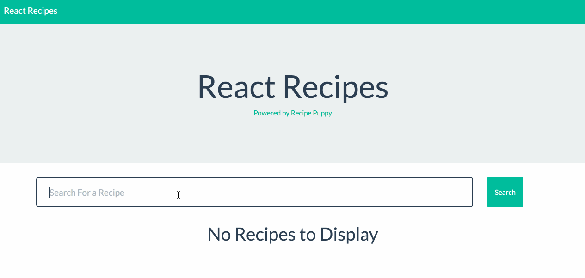

## 20.2 Lesson Plan - Mern <!--links--> &nbsp; [⬅️](../01-Day/01-Day-LessonPlan.md) &nbsp; [➡️](../03-Day/03-Day-LessonPlan.md)

`Summary: Complete activities 7-12 in Unit 20`

### Overview

In this class, we will be deepening students understanding of ReactJS through reviewing all of the concepts covered over the previous few classes to build applications. We will also cover connecting Create React App to an Express backend as well as deploying to Heroku.

##### Instructor Priorities

* Students should have a basic understanding of connecting Create React App to an Express backend.

* Students should feel comfortable with passing data back and forth between the React app and Express server.

* Students should have an increased understanding of using React Router in their React applications.

#### Instructor Notes

* Today's activities will contain significantly more boilerplate than the previous React lessons. Be sure to direct the class's attention to the important aspects of each exercise.

* Today's class will introduce little new material but will provide plenty of opportunity to review concepts covered over the past few classes.

* Have your TAs reference [02-Day-TimeTracker](02-Day-TimeTracker.xlsx) to help keep track of time during class.

- - -

### Class Objectives

* To obtain a basic understanding of connecting a Create React App to an Express backend.

* To become comfortable communicating with an Express server from a React app.

* To increase understanding and comfort using React Router.

- - -

### 1. Instructor Do: Welcome Class (5 mins)

* Welcome your students back to week 2 of React!

* Take a moment to congratulate them on making it this far. This is historically by far one of the most challenging topics covered in the entire course.

* Check the pulse of the class so far. Ask them what their thoughts are so far when it comes to working with the library. Ask which concepts they'd like to spend more time on. Make a mental note to focus a bit more on those concepts as they come up during class today.

* If students feel as though they haven't totally mastered React yet, assure them that even seasoned developers sometimes struggle to wrap their heads around many of the ideas introduced by the library.

* We've covered a ton of material over the past week, and even more so over the entirety of the course. Try to put into perspective how amazing their progress has been.

### 2. Instructor Do: Slides (15 mins)

* This unit uses a web-based slideshow found here: [ReactJS Review slides](https://react-review.netlify.com/). Be sure to give students enough time to answer each question and discuss before going over the answers.

  * Use the left and right arrow keys to cycle through the slides. It is advisable to view the slideshow in fullscreen Chrome.

### 3. Instructor Do: Mern Demo (15 mins)

* In this example you will demonstrate Create React App with an Express backend.

* Explain to the class that since beginning to learn React we've only been working with front-end code. We haven't set up a database, or an express server, we've just been working on the front-end with React.

* Point out that we _have been_ using a development server with Create React App. This development server's only purpose is to provide us with the live reloading functionality. When it comes time to deploy our app for production, Create React App can generate a static, standalone, HTML and JavaScript file containing the app.

* Explain that in most real applications, we'll often need a production quality server such as Express for connecting to a database or setting up API routes.

* Inform students that we'll be providing them with a Create React App Express boilerplate which they can use for the homework assignment or projects. There's no need to completely understand every aspect of the code in order to be productive, but we're going to walk through an example to give them at least a working high level understanding. This set up is _loosely_ based off of [Fullstack React's Food Lookup Demo](https://github.com/fullstackreact/food-lookup-demo).

* Open [07-Ins_Mern](../../../../01-Class-Content/20-react/01-Activities/07-Ins_Mern) in your editor and cd into it.

* In your editor, point out your sidebar with the `client` folder expanded, ask the class: What's something unusual we see here?

  

  * We have 2 `package.json` files, with different sets of dependencies.

* Explain that Create React App handles what would have otherwise been a complicated build process and also gives our app live reloading in development. In order to still hang on to all of these benefits, our boilerplate consists of 2 node applications working together.

  * One app is Create React App.

  * The other is the Node/Express backend.

* Explain that since we have two node apps, we have to install dependencies for both. While at the root of the project directory, run the following commands:

  ```
  yarn install
  ```

  * You should now have 2 `node_modules` folders: one at the root of the project and one inside of the `client` folder.

* Explain that during development (while we're working on the app and running it locally) the live reloading development server still runs on port 3000.

* Open the `package.json` file inside of the `client` folder:

  

  * Explain that the `proxy` setting is part of Create React App and can be read about in its documentation. It automatically forwards all HTTP requests from our React application to another specified base url.

  * Ask the class: If our live reloading server is on port 3000 by default, why might we be forwarding our React app's requests to port 3001?

    * We don't want to send HTTP requests to the dev server, instead we want to send them to our Express app which we have running on port 3001 — though we could use any port as long as we specify it.

      

    * In a nutshell, we'd make HTTP requests to the endpoints defined in our Express server, but wouldn't have to specify that it's running on a different port in every request, e.g. we'd write `axios.get('/api/books');` instead of `axios.get('http://localhost:3001/api/books');`.

* Now point out the `package.json` at the root of the application directory:

  

  * Bring the class's attention to the `scripts` section of the `package.json` file. Explain that we can define shortcuts for commands which we need to use in order to work with our node apps. So far we haven't had too much use for these, but with our current setup we need to run multiple, sometimes complex commands for various actions such as starting both the live-reloading server and the Express application.

  * While the number of scripts may seem initially overwhelming, we only need to care about two, _maybe_ three of these.

    * Point out the `start` command. Explain that if we are running our application on Heroku, it simply starts the Node server. If we're running it locally, it starts the Node server and live reloading Create React App server at the same time. The React app should appear to start as expected on port 3000, however in the background the Express server is running on PORT 3001.

    * Now, stop both servers and point out the `build` command. Explain that this builds a static version of our React app which can be deployed. With the `client` folder expanded, go ahead and run `yarn build` in your terminal.

      * Point out how we now have a `client/build` folder. This contains static versions of our HTML page, CSS, minified JavaScript, and other assets. Explain that we won't actually use these locally on our machines, but our Express app will serve these on Heroku. The `heroku-post-build` script tells heroku to run this command automatically for us when we deploy so we don't have to keep doing this ourselves.

    * Inform the class that for now, if the only thing they remember is `yarn start` runs the API server and the React app, then they're fine for now.

* Let students know that a `yarn.lock` file is required for deployment to Heroku. Without this file, Heroku will not know to run yarn.

  * It's also important to mention that you cannot have both a `package-lock.json` and a `yarn.lock` as they will conflict. Stay consistent with `yarn add`.

* Slack out [Fullstack React's Food Lookup Demo](https://github.com/fullstackreact/food-lookup-demo) for them to look at on their own time.

* Take another few minutes to answer any high level questions. Assure everyone that they're about to get some hands-on experience in the next activity.

### 4. Students Do: React Recipes (15 mins)

* Slack out `08-Stu_Recipes/Unsolved`

* In this example students will complete a recipe finder application by adding code to render a list of recipes retrieved from an AJAX request.

* **Instructions:** [README.md](../../../../01-Class-Content/20-react/01-Activities/08-Stu_Recipes/README.md)

### 5. Instructor Do: Review React Recipes (10 mins)

* Open the [08-Stu_Recipes/Solved](../../../../01-Class-Content/20-react/01-Activities/08-Stu_Recipes/Solved) to the previous activity.

* Run `yarn install` to install dependencies at the project root, then cd into the `client` folder and run `yarn install` inside of this folder.

* Once complete, cd back up to the project root and run `yarn start` to start the application. Open [localhost:3000](http://localhost:3000) in your browser to demonstrate the solution.

  

* Whenever we search for a recipe in the search field, a list of recipes is rendered using the data from the AJAX request.

  * Avoid letting students get too hung up on the server side code. The main focus of today's lesson is still React, and they can dig into the code in its entirety on their own time.

* Open the `client/src/App.js` file and go over the new code:

  

* Make sure everyone understands where the props we're passing the `RecipeListItem` components are coming from.

  * The recipe objects received from the AJAX request have these properties. We're passing them to the `RecipeListItem` to be used.  

* Now open the `client/src/components/RecipeList/index.js` file and point out how each passed prop is used in the `RecipeListItem` component.

  

  * `props.thumbnail` (an image URL for the recipe) is passed to the `Thumbnail` component which renders the image

  * `props.title` (the name of the recipe) is rendered inside of the heading

  * `props.ingredients` (a comma-delimited list of ingredients) is rendered inside of the paragraph tag

  * `props.href` (the URL to the original recipe) is rendered inside of the anchor tag

* Take a few minutes to answer any questions about this activity.

* Explain that while this activity was interesting, it didn't have any kind of persistent storage. The next few activities will utilize a Mongo database and should help prepare them for their homework assignment and final projects.

### 6. Students Do: AJAX Books (10 mins)

* Slack out `09-Stu_AJAXBooks/Unsolved`

* In this activity students will work to add functionality to a full stack React Reading List application.

* **Instructions:** [README](../../../../01-Class-Content/20-react/01-Activities/09-Stu_AJAXBooks/README.md)

* Instructional staff should be walking around the room during this activity, available for assistance.

### 7. Instructor Do: Review AJAX List (10 mins)

* Open and run the [09-Stu_AJAXBooks/Solved](../../../../01-Class-Content/20-react/01-Activities/09-Stu_AJAXBooks/Solved) to the previous activity and demonstrate the result in your browser:

  * 

* The goal of this activity was just to render the initial list of books. We'll work on actually making the form functional in the next activity.

* Open the `Books` component (`client/src/pages/Books.js`) and go over the new code:

  

  * Have a volunteer explain the code to you.

    * We import the `API` module into our component.

    * When the component is created the `componentDidMount` lifecycle method is called. Inside we call `this.loadBooks()` which we've defined below.

    * `this.loadBooks()` uses the pre-written `API` module to retrieve all of the books from the database and then sets them to `this.state.books`.

      * Point out how even though we don't know much about how our backend is configured, we were still able to make an AJAX request to it to retrieve all of the books. This is because we're using the `API` helper module which contains methods for making requests to various endpoints.

  * Further down below, a list is being rendered from `this.state.books`. When the list is empty, a message is displayed explaining this. Otherwise the list of books is rendered.

    

  * Take a few moments to make sure everyone understands these pieces of code.

### 8. Students Do: AJAX Form Delete (15 mins)

* Slack out `10-Stu_AJAXFormDelete/Unsolved`

* In this activity students will add functionality to the React Reading List app to save and delete books.

* **Instructions:** [README.md](../../../../01-Class-Content/20-react/01-Activities/10-Stu_AJAXFormDelete/README.md)

### 9. Instructor Do: Review AJAX Form Delete (10 mins)

* Open up the [10-Stu_AJAXFormDelete/Solved](../../../../01-Class-Content/20-react/01-Activities/10-Stu_AJAXFormDelete/Solved) to the previous activity and go over the new code as a class. The only changes that needed to be made are in the `client/src/pages/Books.js` file.

  

* It may be easier to explain starting by going through the code in the `render` method involving the form elements.

* In order to capture the values from the form, we add `value` and `onChange` props to the `Input` components.

* Ask the class: How roles do the `value`, `name`, and `onChange` props have in updating our component state with the form data?

  * When the user attempts to type into one of the input fields, the input field doesn't update right away, instead the `onChange` event handler is fired.

    

  * Like event handlers in jQuery and vanilla JavaScript, `handleInputChange` receives an `event` object containing information about the event which occurred as a parameter.

  * From this event object we can grab the `name` attribute and `value` of the input field. The `value` is what the input would change to if it weren't being controlled by React, and the `name` is the name of the input's corresponding state value.

  * Then we update `this.state[name]` to be the new `value`.

  * `onChange` updates the component's `state` which then updates the text displayed in the input field.

* Go over the `handleFormSubmit` method:

  

  * We first prevent the default behavior of the form submission (which would have been to refresh the page).

  * Next we check that the `title` and `author` (the "required" fields) are not null before continuing.

  * If we have a `title` and `author`, submit the book data using the `API.saveBook` method.

  * Once the request completes successfully, run `this.loadBooks()` in order to update the books displayed.

* Finally, go over the `delete` book method:

  

  * It expects to receive an `id` argument to pass to the `API.deleteBook` method.

  * Once complete, `this.loadBooks()` is run to retrieve and display the updated list of books.

* Point out how we wrap the `onClick` handler in an anonymous function so that we can pass in the `_id` of the book as an argument.

  

  * Wrapping a click handler in an anonymous function is another way of passing arguments into it.

* Take a few moments to answer any remaining questions.

- - -

### 10. Everyone Do: BREAK (15 mins)

- - -

### 11. Students Do: React Router (20 mins)

* Slack out `11-Stu_ReactRouter/Unsolved`

* In this activity students will add React Router to the React Reading List in order to add a books `Detail` page and a `NoMatch` 404 page. Students will need to look up how to use route params with React Router.

* **Instructions:** [README.md](../../../../01-Class-Content/20-react/01-Activities/11-Stu_ReactRouter/README.md)

* Instructional staff should be walking around the classroom during this activity, available for assistance and making sure students understand all of the activity requirements.

### 12. Instructor Do: Review React Router (15 mins)

* Once time's up, go over the [11-Stu_ReactRouter/Solved](../../../../01-Class-Content/20-react/01-Activities/11-Stu_ReactRouter/Solved) version of the last activity.

* Open the `client/src/App.js` file and go over the new code:

  

  * Point out how both the `/` and `/books` `Route` components both render the `Books` component.

  * The `/books/:id` `Route` component renders the `Detail` component.

    * This component is for rendering details about a particular book.

      

    * Similar to routes in Express, we can utilize route parameters. The values of any route parameters are available to us inside of the rendered component on the `this.props.match.params` object. Inside of the `client/src/pages/Detail.js` file, we access the `id` parameter:

      

  * Go back to the `App.js` file and point out the `Route` component rendering the `NoMatch` component . Explain that this component _should_ be rendered on every route since we haven't provided it a `path` prop.

  * The reason the `NoMatch` route works as expected is because of the `Switch` component wrapping our `Route`s. The `Switch` component ensures that once one of the routes are rendered, none of the routes that come after it are even checked. So as long as one of the routes match, the `NoMatch` component is not rendered. But if _none_ of the routes match, then `NoMatch` is rendered. It is like the "default" case in a switch-case statement.

    

* Take another few minutes answering any remaining questions.

### 13. Students Do: Deploy (15 mins)

* In this final activity, students are tasked with deploying the React Reading List app to Heroku. They can use the [11-Stu_ReactRouter/Solved](../../../../01-Class-Content/20-react/01-Activities/11-Stu_ReactRouter/Solved) version of the previous activity.

* **Instructions:** [12-Stu_Deployment/README.md](../../../../01-Class-Content/20-react/01-Activities/12-Stu_Deployment/README.md)

### 14. Instructor Do: Review Deploy (5 mins)

* Take a poll to see how many students were able to successfully deploy the React Reading List to Heroku.

* Explain that when it comes to their homework assignments and final projects, they should make sure they have deployment figured out sooner rather than later.

* There are now more reasons why a Heroku deployment could fail than there ever have been before, so urge them to not try and push to Heroku for the first time right before an assignment is due.

* They can refer back to the instructions provided with the activity for deploying a full stack react app to Heroku, and as always, yourself and the TAs are available to help during office hours.

### 15. Instructor Do: Final Projects (5 mins)

* Spend a few minutes introducing the [requirements for final projects](../Project-Resources/Slide-Shows/FinalProject.pptx).


- - -

### 16. END (0 mins)

### Lesson Plan Feedback

How did today's class go?

[Went Well](http://www.surveygizmo.com/s3/4325914/FS-Curriculum-Feedback?format=pt&sentiment=positive&lesson=20.02)

[Went Poorly](http://www.surveygizmo.com/s3/4325914/FS-Curriculum-Feedback?format=pt&sentiment=negative&lesson=20.02)
