# 21.1 Lesson Plan - Introduction to C sharp

### Overview

Today's lesson plan will introduce students to the basics of C#. They should have installed the proper development environments before class; you should have uploaded the [`Supplements/C#Installation.md`](./Supplements/C%23Installation.md) at the conclusion of last Saturday's class.

`Summary: Complete activities 1-4 in Unit 21`

#### Instructor Priorities

* Objectives specific to today's lesson are listed below.

  * Students can declare variables of the basic types

  * Students can print output to the console

  * Students can read user input from the console

  * Students can safely convert data to and from different data types

  * Students can take advantage of C#'s type inference to declare variables with `var`

  * Students can declare and call methods

  * Students can simulate multiple return values using `out`

  * Students can use namespaces and `using` statements to organize code

  * Students can use classes to implement object-oriented architectures

#### Instructor Notes

* Three hours is not enough time to provide more than cursory coverage of the language, and entails numerous omissions of essential concepts. These omissions are known and intentional. The point is that students should get enough to continue to experiment with the language. This will _not_ be "most of the language".

* It may be easier to keep the example files open in one window, and demonstrate their examples in **Everyone Do** style in an interpreter on the project

* Make sure students install C# and Visual Studio _before_ coming to class. The [`Supplements/C#Installation.md`](./Supplements/C%23Installation.md) files should be uploaded/available in their course repo.

* Have your TAs refer to the [Time Tracker](01-Day-TimeTracker.xlsx) to stay on track.

### Sample Class Video (Highly Recommended)
* To view an example class lecture visit (Note video may not reflect latest lesson plan): [Class Video](https://codingbootcamp.hosted.panopto.com/Panopto/Pages/Viewer.aspx?id=363e6705-de5e-480e-9318-a96001473761)

- - -

### Class Objectives

At the end of class, students will be able to use C# to:

* Read from and write to the console;

* Throw, catch, and handle Exceptions; and

* Create class hierarchies to implement object-oriented architectures.

- - -

### 1. Everyone Do: Verify C# Installation (0:05)

* Take a moment to verify everyone's development environments.

* Slack out `00-Check-Installation/Examples/HelloWorld.cs`.

* Instruct everyone to open the Visual Studio IDE.

  * Create a new project with `Ctrl/Cmd + Shift + N`.

  * Create a new **Visual C# Console Application**. The easiest way to do this is search for _console application_, and select the C# project type.

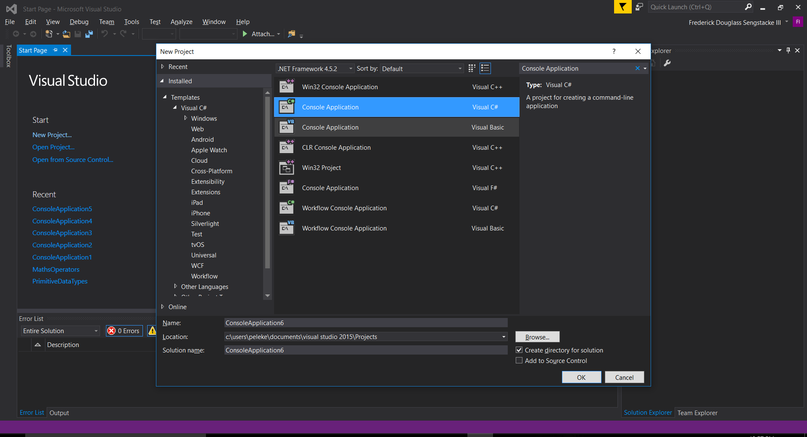

* Copy/Paste the contents of `HelloWorld.cs` into the default `Program.cs` file.

* Compile and run the file with `Ctrl + F5` (`fn` + `F5` on MacOS). Students should see output that says `Hello C# World`.

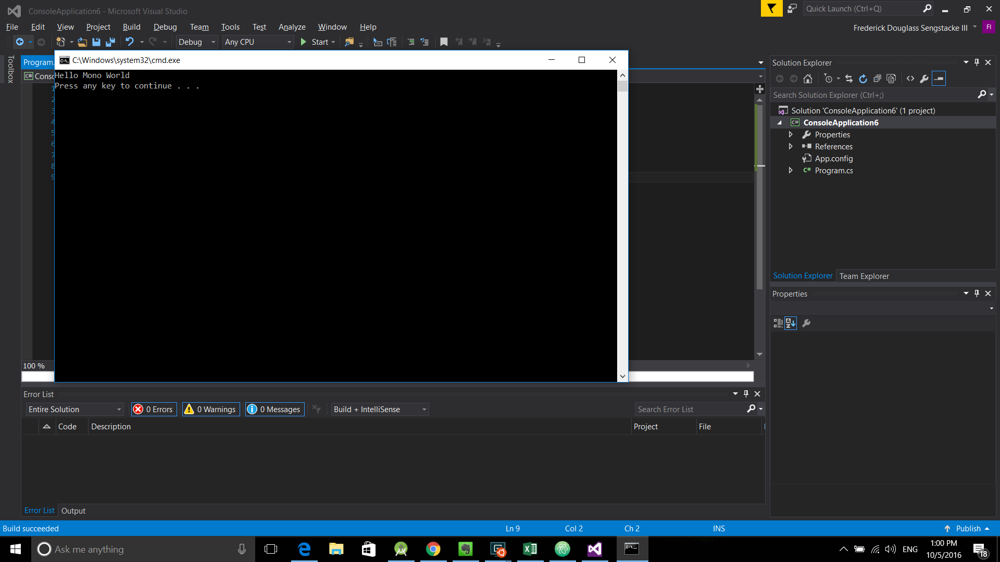

* Have your TAs on-hand for troubleshooting.

### 2. Instructor Do: Basic Data Types & Console Methods (0:10)

- - -

**Objectives Met**

* Declare variables of the basic types

* Print output to the console

* Read user input from the console

* Take advantage of C#'s type inference to declare variables with `var`

- - -

* Explain that students will learn C# by building a command-line application that allows users to enter students' names and contact information.

  * Think of it as a prototype for a tool that a university's registrar's office might use to keep track of matriculating students.

* Explain that the first things students will learn are how to set up a C# file; declare variables; and read/write output from/to the console.

* Instruct students to delete the contents of their `Program.cs` file.

* Explain that, like JavaScript, C# is an object-oriented language.

* Explain that, unlike JavaScript, C# organizes _all_ of its code using classes.

  * Point out that C#'s classes are very different from JavaScript's. We'll come back to this later.

* Add an empty class, called `Program`, with an empty `Main` method to `Program.cs`. Instruct students to code along with you.

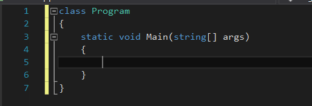

_An empty class and entry point for Program.cs._

* Explain that the `class` is a way for us to organize our code.

  * Explain that the `Main` method is what's called an **entry point**.

    * Point out that most non-trivial programs consist of hundreds to thousands of lines of code, broken across multiple files.

    * Point out that it isn't obvious which of those files contains the logic that _starts_ the program.

    * Explain that C# requires your start-up class to contain a `Main` method, where you boot the application and its required resources.

    * Explain that we'll discuss the meaning of `static`, `void`, and `string[]` in detail later.

* Explain that, unlike JavaScript, C# keeps a close eye on the type of data you store in your variables.

  * Open a browser console, and demonstrate that we can set `var a = "Word"`, and then `a = 42` immediately after, with no complaints from JavaScript.

  * Point out that `"Word"` is a _string_ value, whereas `42` is a _numerical_ value.

    * Emphasize that these are two different _data types_.

  * Explain that JavaScript is a **dynamically typed** language. In other words, the language deals with the details of data types "on-demand".

* Explain that C# isn't as flexible.

  * Explain that, when we declare a variable in C#, we have to specify the type of data we plan to store.

  * Explain that C# is a **statically typed** language.

    * Explain that, when we want to use a C# program, we have to **compile** it&mdash;that is, we have translate it to machine code&mdash;and _then_ run it, in two steps. This is by contrast to JavaScript, in which both processes occur simultaneously from our perspective as programmers.

    * Explain that, when you compile your code, C# checks to make sure everything looks like it should&mdash;that you use the right types in the right places, that you don't call nonexistent methods, etc.

    * Explain that, if we don't specify types, C# can't perform these powerful **static checks**, nor can IDEs provide the powerful auto-completion they're famous for.

* Store a string value in `Program.cs`.

  * Add: `string name = "Charles";`.

    * First, point out that all statements must end in a semicolon in C#, just as in JavaScript.

    * Next, point out that you not only named your variable `name`, but also had to specify a **type** right before it. In this case, you stored the value `"Charles"`, which is a `string`.

    * Explain that, if we leave off the `string` type annotation, the C# compiler will complain and refuse to compile the program.

  * Next, ask students what they think they'd use to store the number `42`.

    * After receiving a few answers, explain that C# requires us not only to specify that `42` is a number, but also to specify what _kind_ of number it is.

      * Explain that C# has an [impressive variety of numerical types](https://msdn.microsoft.com/en-us/library/bfft1t3c.aspx).

      * Reassure students that only two are important right now: `int` and `double`.

        * Explain that you use `int` to store values that don't have decimal points, like `42` or `-112`.

        * Explain that you use `double` to store decimal values, such as `3.14` or `2.718`.

* Add: `int meaningOfLife = 42;`.

  * Optionally explain that we can always declare an integer like `42` as a `double`, because `42 == 42.0`.

  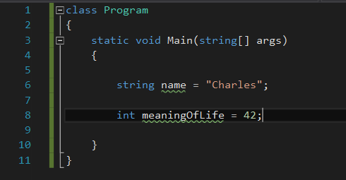

* Compile and run your program. (`Ctrl + F5` or just `F5`)

* Point out that this compiles, but that we have yet to include console output.

* Explain that C# has a built-in `System` package, which contains methods that allow you to interact with the Console.

  * `System` is technically a namespace. Hold off on this detail for a few minutes.

* In `Program.cs`, add a line that prints to the console.

  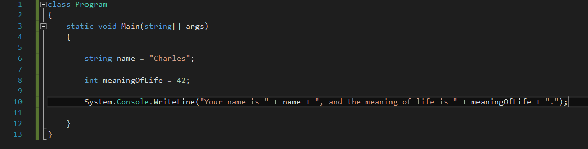

* Explain that `Console` is a class, like `Program`, and that `WriteLine` is just a function defined in that class.

  * Functions defined on classes are called **methods**. Feel free to hold off on this detail until the section on Classes & Objects.

* Explain that `WriteLine` is a method that prints the string we pass, _and_ inserts a newline after.

  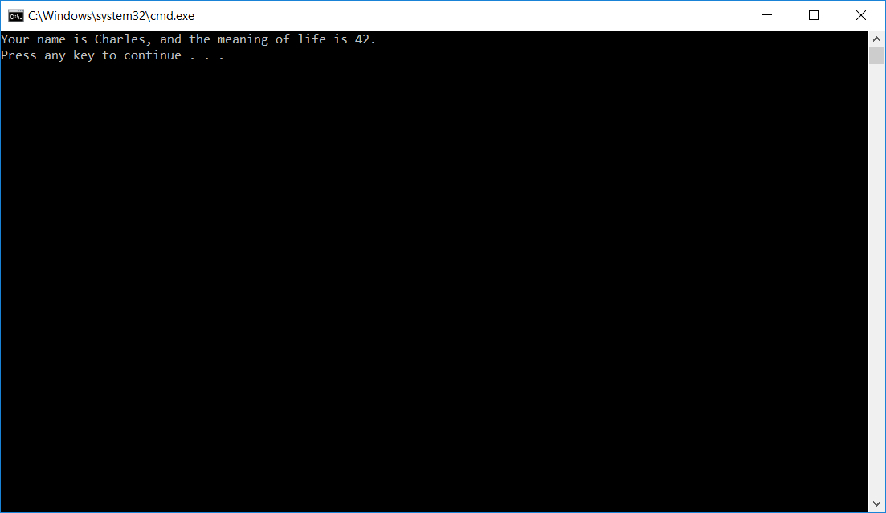

* Explain that the `Console` class has another method, called `Write`, which does _not_ insert a line break.

  * Change the call to `WriteLine` to a call to `Write`, and demonstrate the difference.

    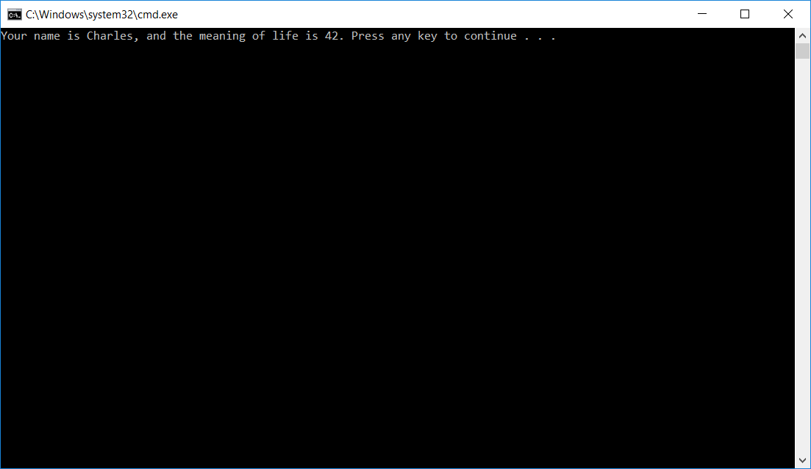

* Explain that this is useful when you want to collect user input, but don't want their entries to appear on a different line than the prompt.

* Point out that the `Console` class not only has methods for writing to the console, but also for reading from it.

  * Explain that we can read user input as a `string` value by using the function `ReadLine`.

  * Update `Program.cs` to prompt the user to enter their name, set the value of `name` to their input, and then print their name.

  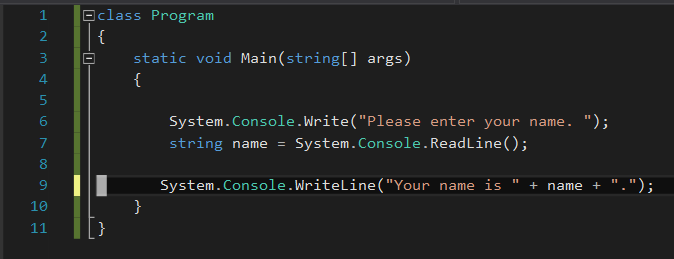

* Finally, explain that `System` is what's called a **namespace**.

  * Explain that namespaces allow us to use several classes called `Console`, but avoid name clashes.

    * For example, we can have the `System.Console` class we've been using, but also our `App.Console` class, if we WERE TO WRITE ONE.

  * Point out that there's no chance for collisions in our application, as we only have one `Console` class.

  * Explain that, in these cases, we can use a `using` statement to reduce the amount of typing we have to do.

* Add `using System;` to the top of `Program.cs`, and remove references to `System` throughout the code.

  * Compile and run to demonstrate that everything works just as before.

  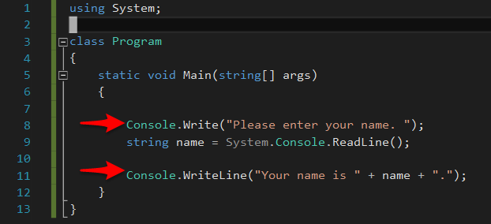

### 3. Students Do: Collecting User Input  (0:15)

* Slack out the unsolved `01-Console-IO/Unsolved/Program.cs`.

* Instructions are included in the file, so there is no need to slack them out separately.

### 4. Instructor Do: Review Activity  (0:10)

* Open up the solved `01-Console-IO/Solved/Program.cs`.

* Ask a student to explain how they prompted users for student information at the console.

  * Explain that the proper approach is to use `Console.Write`.

    * `Console.WriteLine` is acceptable.

* Ask a student to explain how they stored the users responses.

  * Explain that the proper approach is to use `Console.ReadLine`.

    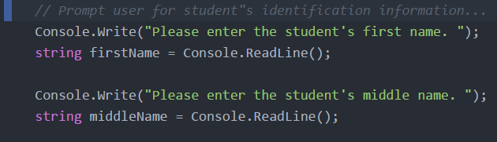

* Point out that we stored the user's phone number as a string, not an `int`.

  * Main reason: users might enter phone numbers in a variety of formats&mdash;e.g., 770-389-5555; 770.389.5555; 7703895555; etc.

  * Storing the number as a string allows us to bypass having to implement complex input validation.

* Ask a student to explain how they reported the input back to the user.

  * This is a series of `Console.WriteLine` statements.

    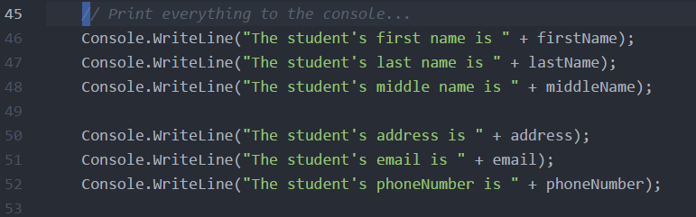

* Explain that the C# compiler is often "smart" enough to infer types without your having to annotate them.

  * Explain that, to use this feature, you simply declare variables with the `var` keyword, rather than a type annotation.

  * Find/replace `string` with `var` in `Program.cs`.

  * Compile and run to demonstrate that this works just as before.

* Explain that the use of `var` is a contentious topic in C# land - a lot of whether you should use it or not comes down to preference. This isn't super critical right now, just note that they will likely see code both ways.

  * Types still aren't dynamic in C# - `var` is just syntactic sugar, and the compiler infers the type and defines it from the right-hand side.

* Take a moment to address any student questions before sending out the `01-Console-IO/Solved/Program.cs`.

### 5. Instructor Do: Array, ArrayLists, Dictionaries, & Conditionals (0:15)

- - -

**Objectives Met**

* Store collections of data in Arrays and ArrayLists

* Store associative data in Dictionaries

- - -

* Explain that C# offers a variety of data types similar to JavaScript's arrays and objects.

* Explain that C# allows you to create arrays, which can contain an arbitrary number of elements belonging to a single data type.

  * Emphasize that, unlike in JavaScript, arrays in C# can _only_ contain data belonging to a single data type.

  * Explain that, unlike in JavaScript, C# requires you to specify how many elements each array will be able to contain.

  * Point out that this is rather limiting in practice—we often don't know how many elements an array will need to contain ahead of time.

  * Explain that C# provides a more flexible solution than raw arrays, but that you'll demonstrate how to initialize "classic" arrays for completeness's sake.

    * C#'s `List` is backed by arrays. Students need some knowledge of raw arrays to appreciate the conveniences the class provides.

* Open up your example `02-Lists-Dicts-Conditionals/Examples/Arrays.cs`.

* Explain the syntax for declaring and instantiating a new array: `$type[] $name = new $type[$capacity]`. E.g. `string[] names = new string[10]`.

  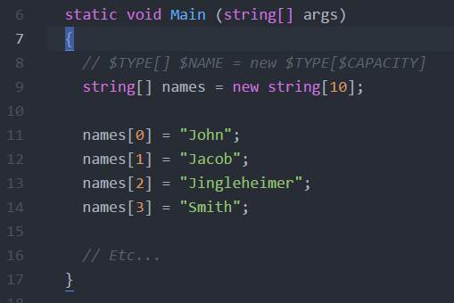

* Explain that this creates an array that can hold up to 10 strings.

  * Explain that C# initializes the value of each index to `null`.

  * Explain that trying to index outside of the array's capacity—with something like `names[11]`, for instance—will cause an error called an `ArrayIndexOutOfBoundsException`.

* Explain that there are two ways to iterate. Using the `for` loop, or using C#'s `foreach` loop.

  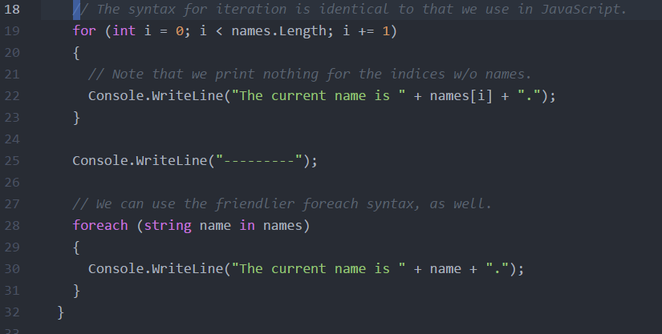

* Point out that there is no easy way to change the capacity of `names` once we've declared it.

  * If we need to resize the array, we have to initialize a new one of the proper size; transfer data from one to the other; and proceed with the new array.

  * Explain that there _is_ a [Resize method](https://msdn.microsoft.com/en-us/library/bb348051(v=vs.110).aspx), but point out that it would be optimal if we didn't have to handle such details manually.

* Point out that both loops print the uninitialized indices, unless we deal with these cases explicitly.

  * Point out that this isn't particularly difficult, but it is cumbersome, and introduces additional sources of potential errors.

* Explain that C#'s conditional statements are identical to JavaScript's.

  * Add an `if` check for `null` entries in the array, and only print non-null values.

  * Explain that C#'s `else` and `else if` statements, while not demonstrated here, are syntactically and functionally identical to JavaScript's.

  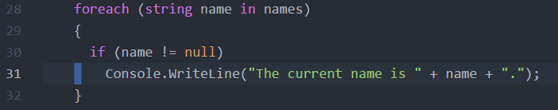

* Explain that C# provides a more flexible data structure, called the `List`, which handles the details of resizing automatically.

* Open up your example `02-Lists-Dicts-Conditionals/Examples/Lists.cs`.

* Point out the `using` statement at the top.

  * Explain that this allows us to refer to the `List` class directly, as `List`.

  * Ask a student to explain what we would have to type if we didn't have a `using` statement.

    * Without the `using` statement, we would have to type `System.Collections.Generic.List` everywhere we refer to the `List` class.

    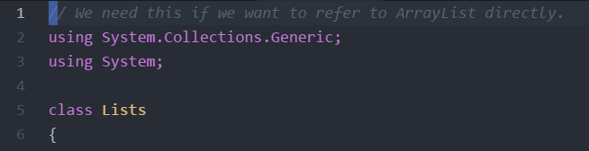

* Explain that, like a raw array, a `List` can only contain data of a certain type.

* Explain that, unlike a raw array, a `List` automatically resizes to accommodate an arbitrary number of items.

* Explain the syntax for instantiating a `List`: `List<$type> $name = new List<$type>();`

  * Explain that the `<>` syntax means that List is a generic class, meaning it expects a special parameter for the type that it will be working with. Generics provide both type safety and flexibility. Modern C# IDEs make writing code with generics easier by assisting with automatic code completion, and catching possible errors before trying to compile the program.

    * As far as we're concerned now, certain generic classes such as Lists or Dictionaries require type parameters to be specified in this way.

* Explain that, rather than indexing into the `List`, we add elements by calling the `Add` method.

  * Point out that we can call the `Add` method an arbitrary number of times, without having to worry about index bounds.

  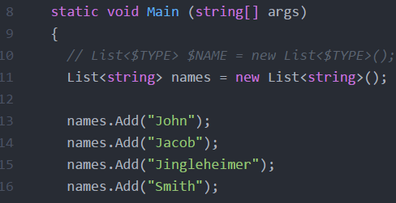

* Point out that we can iterate over a `List` with the same `foreach` structure that we use to iterate over raw arrays.

  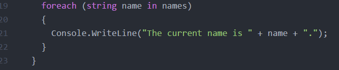

* Finally, we turn our attention to C#'s `Dictionary` class.

  * Explain that C#'s `Dictionary` class lives in the `System.Collections.Generic` namespace, just like `List`.

* Explain that a C# `Dictionary` is similar to a JavaScript object—it allows you to associate a _key_ with a _value_.

  * Explain that, just as we have to specify which data type we want to store in a `List`, we must specify which data types we will use for our Dictionary's keys and values.

* Explain the syntax for initializing a `Dictionary`: `Dictionary<$key_type, $value_type> $name = new Dictionary<$key_type, $value_type>();`

  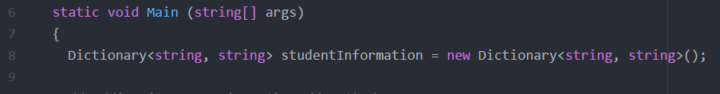

* Explain that, to add key/value pairs, we use the `Add` method.

  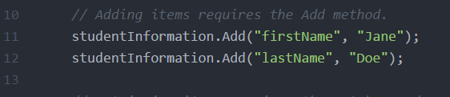

* Explain that, to retrieve a value, we use the `TryGetValue` method.

  * Explain that this returns `true` if it finds a value for the key we pass to it, and `false` if it doesn't.

    * Point out that C#'s boolean values are the same as JavaScript's.

  * Point out that C# has an `out` keyword.

    * Explain that methods can only return _one_ value.

    * Explain that, with a method like `TryGetValue`, we're interested in more than one value: The boolean indicating whether the key exists, and the value associated with that key, if it does.

    * Explain that the `out` keyword provides a way around the single-return-value restriction.

    * Explain that `TryGetValue` will _return_ `true` or `false`, but that it will set the value of the variable we pass with the `out` keyword to the value associated with the key as a side effect.

      * In other words, if the key exists, the method returns `true`, but _also_ sets the variable we pass with `out` equal to its associated value.

    * Explain that there are other uses of the `out` keyword, but that students don't have to worry about them here.

    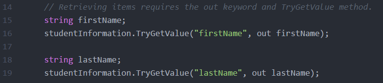

* Finally, explain that, like JavaScript, C# has a `while` loop. Point out that we can create an infinite loop by writing: `while (true) { /* do things... */ }`.

  * Explain that this is useful when we want to perform an action an indefinite number of times.

  * Explain that, to exit an infinite loop, you use the `break` keyword.

  * Tell students they'll need this construct to complete the next exercise.

### 6. Students Do: Improving the CLI  (0:15)

* Slack out the unsolved `02-Lists-Dicts-Conditionals/Unsolved/Program.cs`.

* Instructions are included in the file, so there is no need to slack them out separately.

### 7. Instructor Do: Review Activity  (0:10)

* Open up your solved `02-Lists-Dicts-Conditionals/Solved/Program.cs`.

* Ask a student to explain how they created a Dictionary for student information.

  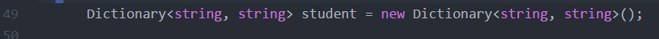

* Ask a student to explain how they created the infinite loop.

* Ask a student to explain how they set values in the student dictionary.

* Ask a student to explain how they printed information from the Dictionary to the console.

* Finally, ask a student to explain how they broke the loop if the user confirmed that the student's data is correct.

* Explain that we can also access dictionary values with bracket notation, as we do in JavaScript.

  * For example: `studentDictionary["FirstName"]`.

  * Point out that this is less secure than using `TryGetValue`, as C# will throw an error if the key doesn't exist.

* Send out the `2-Lists-Dicts-Conditionals/Solved/Program.cs` before dismissing class for break.

- - -

### 8. BREAK (0:15)

- - -

### 9. Instructor Do: Basic Methods (0:15)

- - -

**Objectives Met**

* Declare and call methods

* Simulate multiple return values using `out`

- - -

* Point out that students have been using functions throughout the lesson.

  * Remind them that `Main` and `WriteLine` are functions.

  * Explain that a "method" is a _function associated with a class_. In C#, all functions are methods. Students are free to use the terms interchangeably.

* Explain that the purpose of this section will be to learn to define them.

* Remind students that variables in C# are always associated with a type.

  * Explain that, like variables, functions are also always associated with a type.

* Point out that many functions return a value.

  * Explain that, whenever a function in C# returns a value, we have to tell C# what the _type_ of that value will be.

* Open up your example `03-Functions/Examples/Program.cs`.

* Call attention to the `Multiply` function.

* Point out that we define it as `static double Multiply`.

  * Explain that the function's name is `Multiply`. This is the name we use to call it.

  * Explain that, before every function's name, we have to write its **return type**—that is, the type of the value we get back when we call it.

  * Explain that, in this case, `Multiply` returns a `double`, after evaluating the operation `x * y`.

  * Point out that we also have to tell C# the type of each of the function's parameters.

  * Finally, explain that the `static` keyword indicates that this method lives on the `Program` _class_, as opposed to on an instance of an object.

    * Reassure students that it's okay if this doesn't make sense at this point. We'll revisit the idea of `static` methods in the next section.

    * For now, just let them know we need this keyword for C# to find the method properly.

    * Emphasize that students will need to mark their methods static in the next activity for everything to work properly.

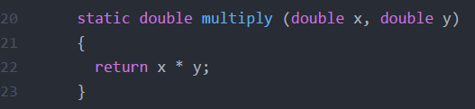

_The Multiply function, which accepts two double arguments and returns a double result._

* Explain the logic in the `Main` method.

  * Ask a student what you expect to see when you run the program.

  * Compile and run the program.


* Ask a student to explain the purpose of the `Main` method.

  * The `Main` method is the entry point to our program—it's the method the system runs to start our program.

* Point out that `Main` doesn't return a value. It's just responsible for booting our program.

  * Explain that, when a method doesn't return a value, we give it the return type `void`.

* Explain that there is one additional feature to be aware of when defining methods in C#: The `out` keyword.

* Remind students that they used the `out` keyword with the `TryGetValue` method.

* Explain that the `out` keyword lets us set the value of a variable in the _calling scope_ from inside of a function.

* Call attention to the method `ActionAtADistance`.

  * Point out that we define a single `string`, parameter, `name`, and precede it with the `out` keyword

    * Explain that this tells C# that we want any changes to the value of `name` _within_ the function to be reflected in the calling scope, as well.

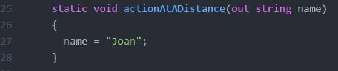

_Defining a method with an out parameter._

* Point out that, in `Main`, we use the `out` keyword when calling `ActionAtADistance`.

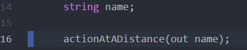

_Calling a method with an out parameter._

* Ask a student what they expect the `Main` function to output after the call to `ActionAtADistance`.

* Finally, point out that the methods we're using from the `Console` class are defined somewhere else.

  * Point out that this is similar to using an NPM package, whose functions are defined elsewhere but accessible anywhere they're imported.

* Explain that one of C#'s equivalents to a package is the **namespace**.

  * Explain that namespaces effectively group related classes together.

  * Add a namespace declaration to `Program.cs`.

  * Explain that classes in the same namespace can refer to each other's methods with `$Class_Name.$Method_Name`.

* Explain that, for this to work, we must tell the compiler that both programs rely on one another.

  * Students using Mono will need to run: `mcs Helpers.cs Program.cs`.

  * Explain that this tells Mono that these two programs rely on one another.

  * Students using Visual Studio don't have to do anything special—the IDE takes care of this for them.

### 10.  Students Do: Creating a Helper Library for the CLI  (0:15)

* Slack out the unsolved `03-Functions/Unsolved/Program.cs`.

* Instructions are included in the file, so there is no need to slack them out separately.

### 11.  Instructor Do: Review Activity  (0:10)

* Ask different students how they implemented each of the methods in the instructions. These were:

  * A method that accepts the name of an attribute (e.g., "first name"); prompts the user for it; and stores their response in a dictionary.

  * A method that prints each key/value pair in a dictionary.

  * A method that prompts a user for a confirmation, and returns `true` if they enter `"Y"` or `"y"`, and `false` otherwise.

* Ask if any students tried to extract their methods into a `Helpers.cs` file.

  * Reviewing this section is optional. If students seem confident with the material, proceed. If not, spend the rest of the review working through questions students might have about methods.

  * Reassure them that it's fine if they didn't.

  * If someone did, ask them to explain the error they got when they initially moved their methods into the `Helpers.cs` class.

  * Explain that this error is due to the fact that, by default, C# prevents different files from using the code in other files.

  * Explain that this is because you don't always want people who are using your program to know how you wrote it.

  * Explain that, if you want to share code between files, you have to tell C# explicitly.

* Open up your solved `03-Functions/Solved/Helpers.cs`.

  * Point out that your methods look just as they would if you'd kept them in `Program.cs`, but with the `public` modifier in front of `static`.

  * Explain that this just tells C# that you want to be able to use this method anywhere. It's _publicly_ available.

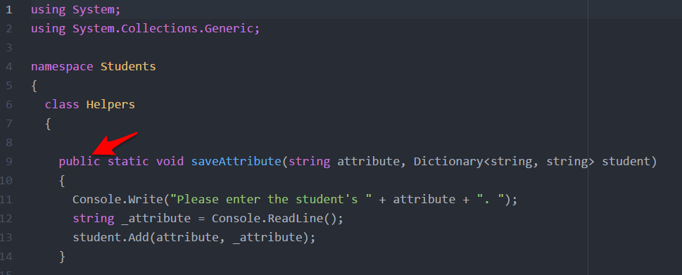

_Adding a public modifier to our Helper methods._

### 12.  Instructor Do: Classes & Objects  (0:15)

- - -

**Objectives Met**

* Use classes to implement object-oriented architectures (1)

- - -

* Point out that `Program.cs` uses the `class` keyword.

* Explain that C# organizes code using classes.

  * Explain that we can use a class for two things:

    * We can use a class to organize logic, like with `Program.cs`, which houses our main program logic, and `Helpers.cs`, which houses functions we use in our main program; or

    * We can use classes as _blueprints_ for creating objects.

* Point out that most web applications allow users to have profiles.

  * Point out that each user usually has, at least, a first name; last name; and email address.

  * Point out that we know all users have a first name, last name, and email address. The only difference between each user is the _specific_ names and email address each user has.

  * Explain that C# lets us use classes so we can easily create many user _objects_, each with the same _set_ of attributes (i.e., first name, last name, email), but with different _values_ on each instance.

* Open up `04-Classes-Objects/Examples/User.cs`.

  * Explain that `public class User` creates a new class, and that the `public` modifier allows us to use `User.cs` in _any_ C# file in our project.

  * Explain that `string firstName`, `string lastName`, and `string email` define the attributes each user object will have.

  * Explain that `public` means that _anyone_ with access to a user object can both read _and_ write each of these attributes.

    * Explain that this means that, if you create a user object somewhere, anyone with access to that user object can change the user's names or email.

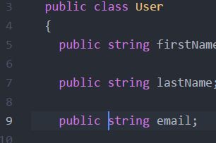

_Defining fields on our User class._

* Explain the `User` constructor.

  * Explain that a constructor is a method that creates and initialized a new object.

  * Explain that `public`, just like before, means that _anyone_ that knows about the `User` class can use it to create a user.

  * Explain that the parameter list indicates that, to create a user, you have to specify a first name; last name; and email address.

  * Point out that constructors don't need to specify a return type in the function declaration.

  * Explain that `this` in C# means, _the object this constructor is going to return_.

    * Explain that this is _always_ what the `this` keyword means in C#. It's not as complicated as it is in JavaScript.

  * Explain that calling the constructor returns a new `User` object whose `firstName`, `lastName`, and `email` are equal to the values the user passes the constructor.

* Remind students that these attributes are `public`.

  * Explain that we can read or write them by doing:


```cs
User jim = new User("Jim", "Doe", "jim@doe.com");
Console.WriteLine(jim.email); // "jim@doe.com"

jim.email = "not an email"
Console.WriteLine(jim.email); // "not an email"
```

* Point out that allowing _anyone_ with access to a user to reset the user's attributes isn't very safe.

* Explain that it's usually better to let people _read_ a user's attributes, but _not_ change them.

  * Explain that we can implement this by replacing the `public` keyword with `private`.

  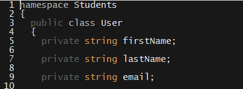

* Explain that, this way, people can _only_ see attributes that we choose to expose.

  * Explain that this keeps your data safer than making attributes `public`.

  * Explain that, to let people read a `private` field, we have to write a `get` method for it. Such methods are called "getters".

    * Add getters for the user's names and emails.

  * Point out that users can now read the user's information, but can't change it once it's set.

* Explain that the `User` class itself can hold data, as well.

  * Add a `static int created` property to the `User` class. Increment this property in the constructor.

  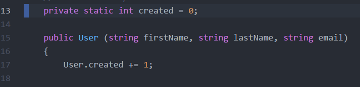

* Explain that a `static` property is one that belongs to the `User` _class_, **not** to any particular user _object_.

  * Explain it in terms of a car factory.

    * It makes sense for the people in charge of the factory to keep track of how many cars the factory has produced: They need to know to keep things running smoothly.

    * It does _not_ make sense for each car to keep track of how many other cars have been produced. When you think about it, they actually _can't_—once the car is created, it has nothing to do with the factory, so It _can't_ know about any cars created after it leaves the assembly line.

    * This is essentially the difference between `static` and instance properties.

      * `static` properties are for information the factory needs to keep track of.

      * Instance properties are for things the car needs to function properly.

* Reassure students that it's okay if this isn't completely clear at this stage. Let them know that it takes a bit of practice to grok the notion of `static` properties.

* Slack out the example `04-Classes-and-Objects/Examples/User.cs`, so students can refer to it during the next activity.

### 13.  Students Do: Student & Roster Classes (0:20)

* Send out `04-Classes-and-Objects/Unsolved`, and have students unzip it.

* Explain that the next activity requires them to fill out the `Student.cs` class, and use it in `Program.cs`.

  * Tell students to use `User.cs` for reference.

* The unsolved `Student.cs` and `Program.cs` files contain instructions, so there is no need to send these out separately.

### 14.  Instructor Do: Review Activity  (0:10)

* Ask a student to explain how they implemented the `Student` constructor.
  * For this assignment, our constructor need only increment the class's static property.

    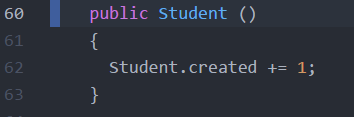

* Ask a student to explain how they implemented the `PrintAttributes` method.

  * This is a straightforward series of calls to `Console.WriteLine`.

  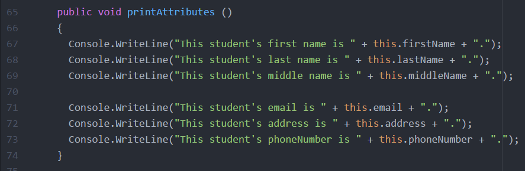

* Ask a student to explain how they used the `Student` class in `Program.cs`.

  * They should have replaced calls to `Helper.SaveAttribute` with calls to `Helpers.PromptForAttribute`, and used the return value to set the Student object's attributes.

  * Creating students entails a no-args constructor call.

    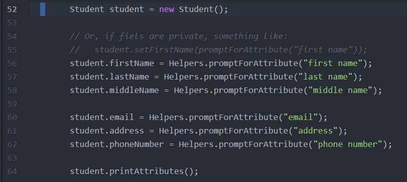

* Ask a student to explain the advantage of using `Student` objects over Dictionaries.

  * Modularity, extensibility, and readability are all good answers.

* Return to the `Student` class. Point out that adding getters is verbose, especially given that we're likely to do so for most private fields.

  * Explain that C# offers a shorthand, called **property notation**, whereby we can add getters and setters via shorthand.

  * Update the `Student` class to use properties.

  * Explain that this creates public getters and setters for each field we've defined, and that we can continue to refer to each field via dot notation.

  * Point out that the static property looks different from the others.

    * Explain that the `private set;` notation creates a setter that we can only access _inside_ of the Student class.

      * Explain that this means users of the Student class **cannot** set the value of `created`.

      * Explain that, since the property is declared public and our `get` declaration is unmodified , they _can_ read the property via dot notation.

        * Clarify that this means users can read the value of created by writing: `Student.Created`, rather than having to call `Student.GetCreated()`.

        * Remove the now-extraneous `GetCreated` method.

  * Using properties provides a flexible way to define and interact with fields.

    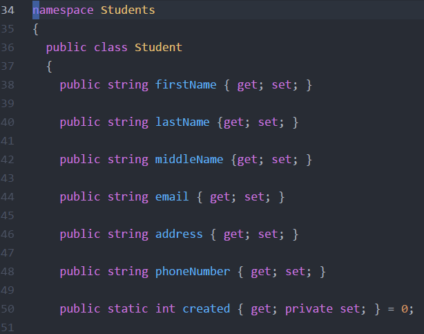

* Address any outstanding student questions before slacking out `04-Classes-and-Objects/Solved` and dismissing class.

### Lesson Plan Feedback

How did today's class go?

[Went Well](http://www.surveygizmo.com/s3/4325914/FS-Curriculum-Feedback?format=pt&sentiment=positive&lesson=21.01)

[Went Poorly](http://www.surveygizmo.com/s3/4325914/FS-Curriculum-Feedback?format=pt&sentiment=negative&lesson=21.01)
