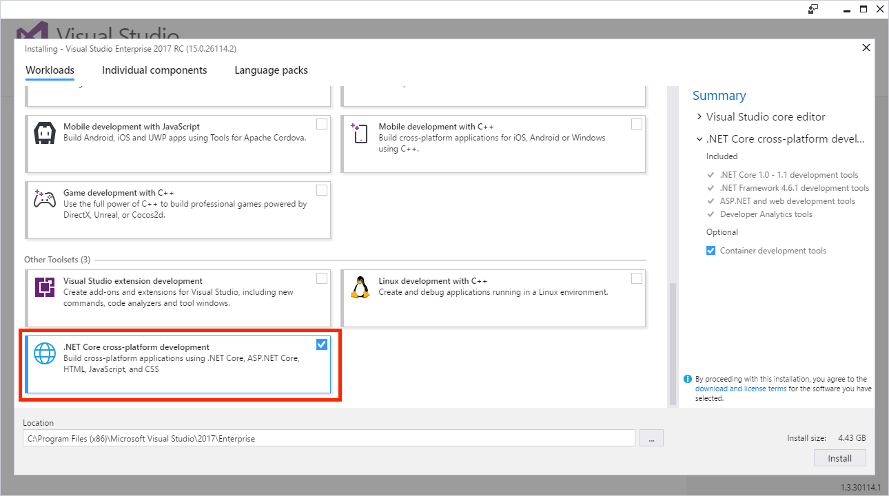
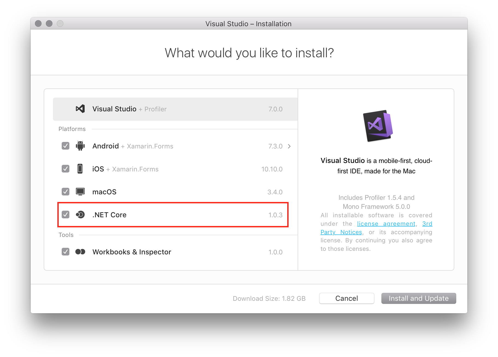
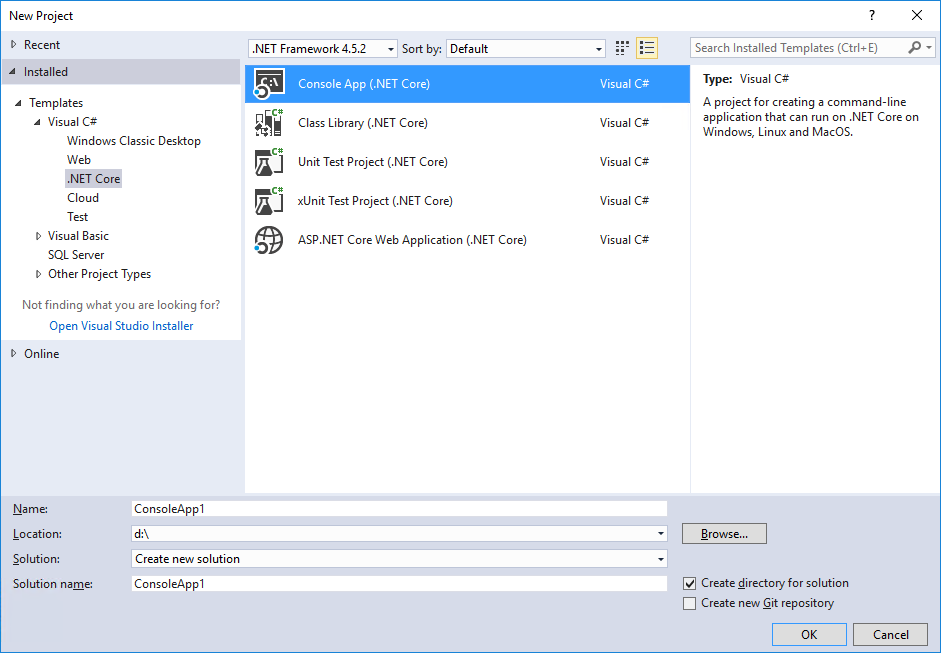
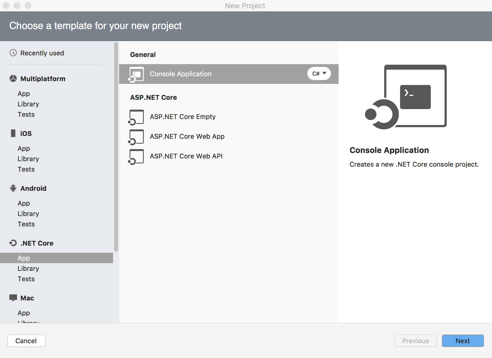

# Installing C\#

Visit the website for [Visual Studio](https://www.visualstudio.com/vs/). Click the "Download Visual Studio" button and choose the "Community" Edition.

**Important:**
During this installation, also install the `.NET Core`:

Windows:


MacOS:


## Testing the Installation

Once the installation is finished, launch Visual Studio. To test that `.NET core` was successfully installed:

1. Create a new `.NET` Core project:

   ### Windows
   Click on `File > New > Project` and select the project template `Visual C# > .NET Core > Console App (.NET Core)`. Give the project the name `HelloWorld` and click `OK`.

   

   ### MacOS
   Click on `File > New Solution > Project` and select the project template `.NET Core > App > Console Application`. Then, click "Next", enter `HelloWorld` in the `Project Name` field, and then click `Create`.

   

2. Find the `Program.cs` file, and replace its contents with the following:

```cs
// A Hello World! program in C#.
using System;

namespace HelloWorld
{
  class Hello 
  {
    static void Main() 
    {
      Console.WriteLine("Hello World!");

      // Keep the console window open in debug mode.
      Console.WriteLine("Press any key to exit.");
      Console.ReadKey();
    }
  }
}
```

3. Hit the `F5` (`fn` + `F5` for Mac) key to run the project (or click on the `Run / Debug / Start Debugging` menu options). You should see a window that prints Hello World!

### THE END

If you ran into any issues here, reach out to your instructional team for assistance!
