# 21.2 Lesson Plan - Introduction to ASP.NET MVC

### Overview

Today's lesson will introduce students to the fundamentals of building web applications with ASP.NET MVC (MVC).

`Summary: Complete activities 5-7 in Unit 21`

#### Instructor Priorities

After today's class, students should be able to use ASP.NET MVC to:

* Diagram the relationship between the MVC layers of an application.

* Create controllers that map responses to URL routes;

* Use query parameters within routes;

* Create views that correspond to routes; and

* Scaffold resource models.

#### Instructor Notes

* Developing ASP.NET MVC applications on Mac isn't any more _difficult_ than doing so on Windows, but it is different. Be sure to mind the differences as you walk through today's lesson. Exercises are kept fairly simple, both to allow students to focus on the fundamentals and to minimize the amount of platform-specific troubleshooting required for today's lesson.

  * Alternatively, you are free to have _all_ students develop in Visual Studio Code, to allow you to distribute only a single set of instructions.

  * Ensure your TAs are available to troubleshoot environment issues throughout today's lesson.

* Have your TAs refer to the [Time Tracker](02-Day-TimeTracker.xlsx) to stay on track.

### Sample Class Video (Highly Recommended)
* To view an example class lecture visit (Note video may not reflect latest lesson plan): [Class Video](https://codingbootcamp.hosted.panopto.com/Panopto/Pages/Viewer.aspx?id=5b58a7df-0d6f-4387-82e0-a9600147c85d)

- - -

### Class Objectives

At the end of class, students should be able to use ASP.NET MVC to:

* Create controllers;

* Scaffold resource models;

* Create views attached to controllers; and

* Diagram the relationship between the MVC layers of an application.

- - -

### 1. Instructor Do: MVC Review & Intro to ASP.NET MVC  (0:10)

**Objectives Met**

* Diagram the relationship between the MVC layers of an application

- - -

* Explain that, before building anything with ASP.NET MVC, we'll first review what "MVC" means.

* Point out that all the apps students have built have allowed them to store data, and look at that data on a web page.

  * Use an Express app as an example. Explain that we can, for example create `book` objects; and, when the user hits a route like `books/1`, view a web page displaying the `user`'s data.

    * Explain that the `book`—our data— is called a **model**, because it is a _model_ of a "real book."

    * Explain that the web page that displays a book's data is called a **view**.

    * Explain that the functions that determine what a visitor sees when they hit a route like `book/1` is called a **controller**. It _controls_ the response that the server sends for a given request.

* Explain that, when building software, best practice is to ensure each piece of software is as focused as possible.

  * Explain that it would be a bad idea to define our app's `book` model _and_ `books` controller in the same file, as it would be both poorly organized and difficult to maintain.

* Pull up and discuss this [MVC Diagram](https://upload.wikimedia.org/wikipedia/commons/a/a0/MVC-Process.svg).

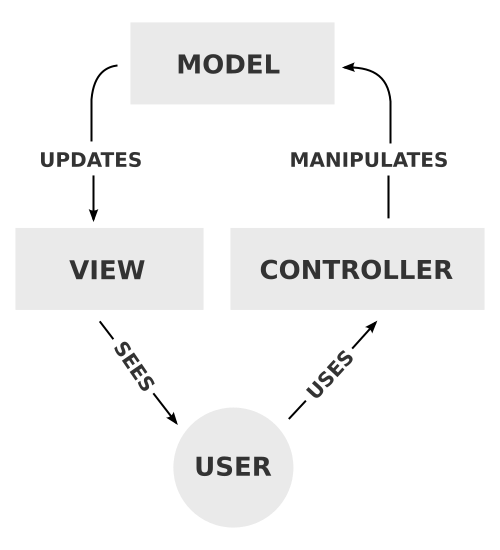

_The MVC Process, in diagram form._

* Explain that, in practice, enforcing this **separation of concerns** manually can be difficult.

  * Many frameworks, such as ASP.NET MVC, _force_ you to separate concerns this way, and provide tools for doing so.

  * Rather than being a hindrance, this constraint guarantees that our code is organized coherently.

* Take a few minutes to discuss any questions that may arise.

### 2. Everyone Do: Create & Explore New Project (0:10)

* Explain that the process of creating and managing a new project differs between Mac and PC.

  * This is because of the difference in tooling: Windows developers use Visual Studio IDE, whereas Mac developers use Visual Studio For Mac.

  * Let students know that you'll often provide different sets of instructions for today's lesson. Make sure they're aware that they will only have to follow _one_, depending on the platform they run.

- - -

* For Windows students running Visual Studio IDE:

  * Open up Visual Studio, and create a new project.

    * Either **File** -> **New** -> **Project**; or

    * `Ctrl + Shift + N`.

* In the **New Project** dialog, select **ASP.NET Core Web Application (.NET Core)**.

  * Change the **Name** from `WebApplication1` to `App`.

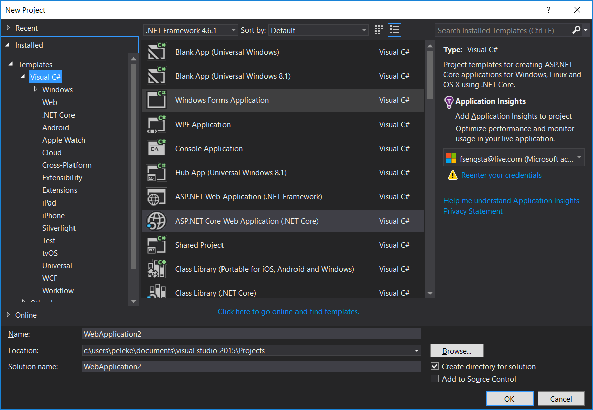

_Creating a new ASP.NET Core Web Application in Visual Studio IDE._

* Click **OK**. A new dialogue will appear, prompting you to choose a template. Select **Web Application**.

  * In the bottom right corner of the dialogue, deselect **Host in the Cloud**.

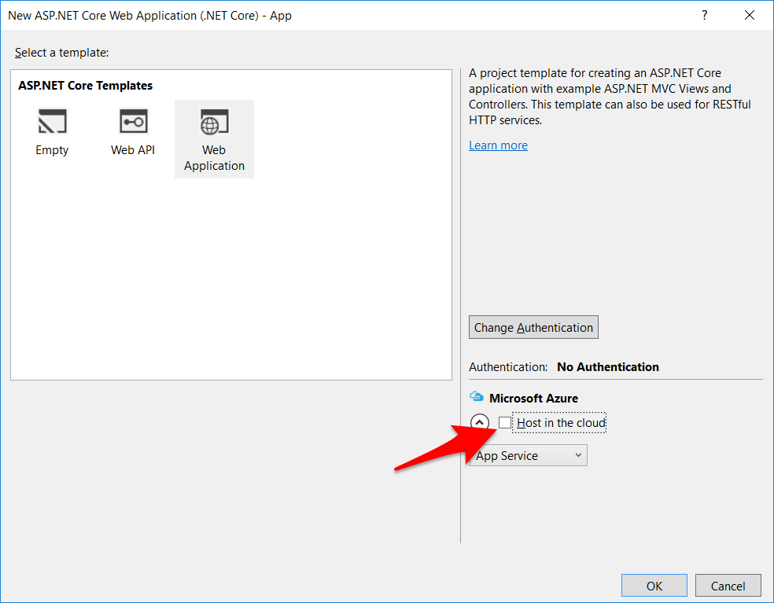

_Creating an ASP.NET Web Application._

* Click the **Change Authentication** button right above the **Host in the Cloud** checkbox.

  * In the resulting dialogue, select the **Individual User Accounts** radio button.

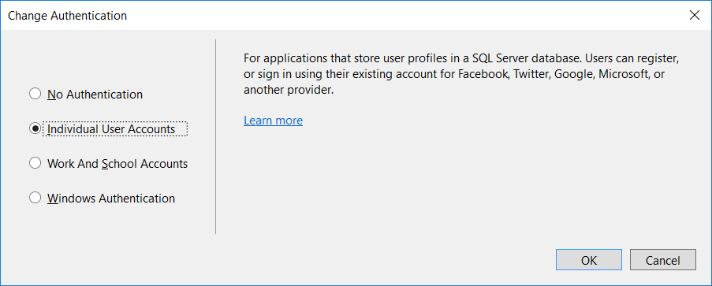

_Selecting an authentication scheme._

* Click **OK** on both prompts.

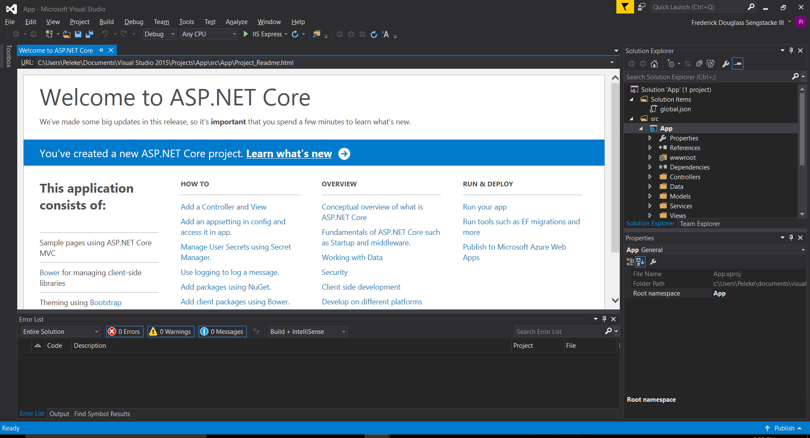

_The start view for a default project._

* Press `Ctrl + F5` to kick up the web server.

- - -

* For Mac students running Visual Studio IDE:

  * Start a new project using `cmd` + `shift` + `N`

  * Select `.NET Core > App > ASP .NET Core Web App`

  * Press `fn` + `F5` to start the server

- - -

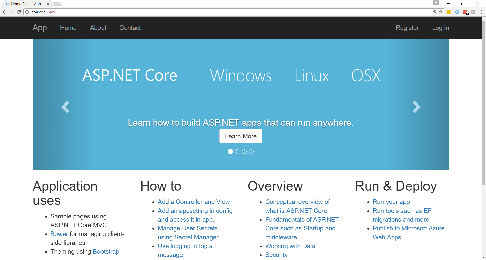

_Your first ASP.NET MVC application._

* Take a few minutes to troubleshoot any issues that may arise.

### 3. Instructor Do: Controllers  (0:15)

- - -

**Objectives Met**

* Create controllers that map responses to URL routes

* Use query parameters within routes

- - -

* Remind students of the organizational style MVC enforces.

  * Remind students that the **Controller** is responsible deciding what a user sees when they visit a URL.

* Explain that ASP.NET organizes models, views, and controllers into separate directories.

* Explain that Controllers live in the directory named `Controllers`.

  * Users will have three controllers: `AccountController`, `HomeController`, and `ManageController`.

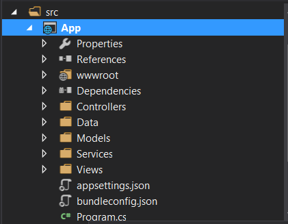

_ASP.NET MVC's Controllers directory._

* Open up `HomeController`, and instruct students to follow along.

* Explain the following points regarding the `HomeController`.

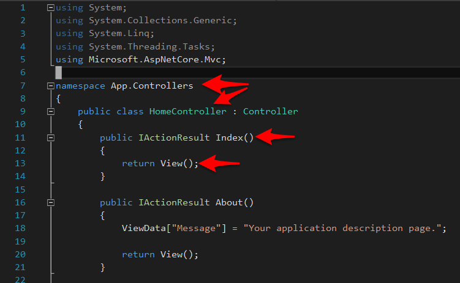

_This snippet demonstrates the majority of the functionality of HomeController._

* Point out that ASP.NET MVC uses the `App.Controllers` namespace to contain its controllers.

* Point out that the class is called `HomeController`.

  * Explain that each `Controller` is a class.

  * Explain that the name of the controller determines how ASP.NET MVC finds a route.

  * Explain that each method on the class that returns an `IActionResult` is responsible for returning a **View**.

    * Explain that each method returns something to the web browser that users can see.

    * Point out that, right now, that "something" is a `View()`, but that it can be as simple as a string.

      * We'll come back to this momentarily.

* Next, launch your site to demonstrate how ASP.NET MVC finds routes.

  * In Visual Studio IDE, hit: `Ctrl/Cmd` + `F5`.


* Point out that the home page displays at the URL `http://localhost` + port number.

  * the port number is variable when launching from Visual Studio IDE, so students may have different port numbers.

* Point out that ASP.NET MVC was able to map this URL to the home page of the site.

* Remind students that ASP.NET MVC uses the name of the Controller class, and the names of the methods defined on it, to determine which routes to serve.

* Explain that the formula is: `/[Controller]/[MethodName]/[Parameters]`

  * Explain that `[Controller]` stands for the name of the controller, _minus_ the world `Controller`.

  * Explain that `[MethodName]` is the name of the method in the controller class.

  * Explain that `[Parameters]` is a way to pass extra information to the route, if it needs it. We'll come back to this later.

* Ask a student to use this formula to visit the `Index` route of our `HomeController`.

  * They should tell you that the appropriate route is: `/Home/Index`.

  * Visit this route and demonstrate that it takes us to the same page that we visited before.

* Next, ask a student to explain how to use this formula to visit the `About` route of our `HomeController`.

  * They should tell you that the appropriate route is: `/Home/About`.

  * Visit this route and demonstrate that it takes us to the `About` page.

* Delete all route settings, and simply hit: `localhost` + port number.

  * Demonstrate that this calls up the home page, without route information.

  * Explain that this is because, if you add no route information, ASP.NET MVC serves the `Home/Index` route by default.

* Finally, explain how to add a Controller.

  * On Windows: Right click `Controllers`, click `Add`, and click `Controller`.

    * Select **MVC Controller - Empty**

    * Enter `AppController` for the name.

    * Demonstrate that this adds a new controller with all of the required boilerplate.

  * On Mac: Right click `Controllers`, click `Add`, and click `New File...`

    * Then select `ASP .NET Core`

    * Choose `MVC Controller Class`

    * Change the name to `AppController` and click `New`

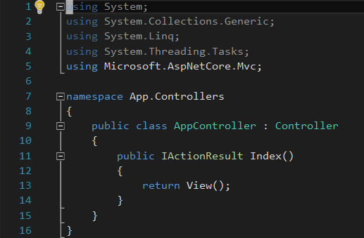

_A new, empty controller._

* For now, change the `IActionResult` function return type to `string`, and change the return statement to read: `return "This is the Index view.";`

  * Remind students that the return value of a Controller method is what users see in the browser. There is no reason we can't simply return a string.

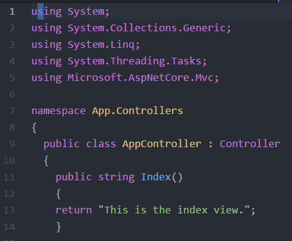

_Our controller, updated to work as expected._

### 4. Students Do: First Controllers  (0:20)

* Slack out the following instructions to students:

* **Instructions**:

  * Create an `AppController` using whichever procedure is appropriate to your operating system.

  * Inside of your `AppController`, create a method that responds to the route `Index`. Rather than returning a `View`, simply return a string which says: "This is the Index route." What should your method's return type be?

  * Add similar `About` and `Contact` routes.

  * Run your app when you finish. Are the URLs case sensitive?

### 5. Instructor Do: Review Activity  (0:15)

* Ask a student to explain how they created their `AppController`.

* Ask a student to explain how they created methods that respond to the `Index`, `About`, and `Contact` routes.

  * They should implement methods with these names, each of which returns a `string` value.

* Ask a student to explain whether they found URLs to be case sensitive.

  * URLs are not case sensitive.

* Slack out the `05-Controllers/Solved/Controller.cs` before moving on.

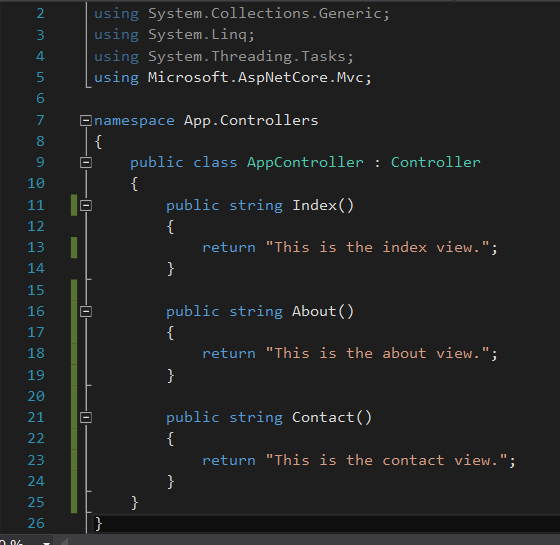

_The finished AppController.cs._

### 6. Instructor Do: Views  (0:15)

- - -

**Objectives Met**

* Create views that correspond to routes

- - -

* Point out that returning `string` values is not maintainable.

  * Point out that this would, in theory, require us to write our HTML in the string we return.

* Ask a student which component of MVC corresponds to what users actually _see_ in the browser.

  * The correct response is **View**.

* Explain that ASP.NET MVC organizes its views similarly to its Controllers.

  * Point out that there is a directory named **Views**,

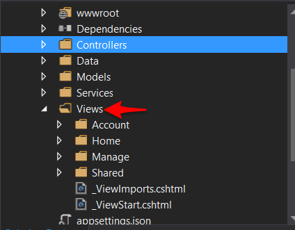

_Our project's Views directory._

* Explain that all view files go into this directory.

* Point out that there is a folder for each `Controller` that Visual Studio IDE made for us.

  * Explain that ASP.NET MVC requires you to create a separate subdirectory inside of `Views` for each Controller you create.

* Explain that you're about to create a new directory for your `AppController`.

  * Ask a student what it should be called.

    ```
    * The correct response is `App`.

    * Point out that this name corresponds to the version of the Controller name that appears in URLs.
    ```

* The process for creating a new View is a function of one's operating system.

  * On Windows, in Visual Studio IDE:

    * Right-click `Views` -> **Add** -> **New Folder**.

      * Name the new folder `App`.

      * Right-click `App` -> **Add New Item** -> **MVC View Page**.

  * On Mac, in Visual Studio IDE:

    * Right-click `Views` -> **Add** -> **New Folder**.

    * Name the new folder `App`.

    * Right-click `App` -> **Add** -> **New File..** -> **ASP.NET Core** -> **MVC View Page**.


* Delete everything in the new view file, and replace it with a simple HTML and, optionally, a paragraph: `<h2>This is your Index route.</h2>`.

* Return to the `AppController`.

  * Update the `Index` route to `return View();`

  * Update the `Index` route's return type to `IActionResult`.

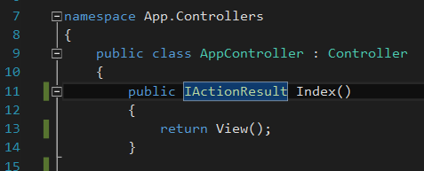

_Resetting our Index method to its defaults._

* Start a server, and hit the `app/index` route.

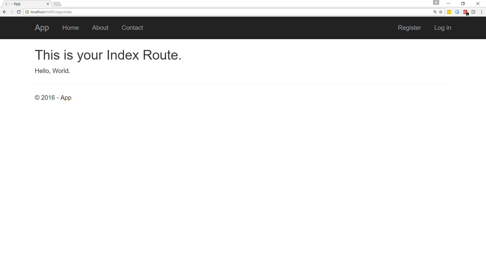

_The App View, complete with Bootstrap styling._

* Point out that there's a lot going on here, but that we'll review it step-by-step.

  * Remind students that the View file is named `index.cshtml`.

    * Explain that View templates in ASP.NET MVC are `cshtml` files—i.e., C# HTML files.

    * Explain that, when a method simply returns `View()`, ASP.NET MVC renders the `cshtml` file in `Views/[ControllerName]/[MethodName.cshtml]`.

      * In this case, the appropriate template lives in: `Views/App/index.cshtml`.

  * Point out that, when returning a `View()`, we must change the function's return type to `IActionResult`.

    * Explain that this is simply the type associated with a rendered template.

* Point out that, although we only defined a header and paragraph, our template appears with Bootstrap styles.

  * Ask a student to explain how this might be the case.

    * The correct response is that ASP.NET MVC allows us to create modular _child_ templates, which "plug into" larger _parent_ templates.

* Open up `Views/Shared/_layout.cshtml`.

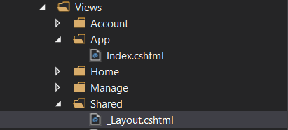

_Our overarching layout file lives in Views/Shared/\_layout.cshtml._

* Explain that the markup in this layout is _shared_ by all child views.

  * Explain that this allows us to define only the markup relevant to a given route in its corresponding view file.

* Explain that we can mark sections of our `_layout.cshtml` file to indicate that we want child templates to _replace_ content in those sections.

* Point out that the `<title>` tag of `_layout.cshtml` contains the markup: `@ViewData["Title"]`.

  * Point out that this looks quite like C#'s dictionary lookup syntax.

    * Explain that's because this _is_, in fact, dictionary lookup syntax.

    * Explain that all Controller methods can set key/value pairs on a dictionary called `ViewData`. These key/value pairs can then be accessed in templates with the `@ViweData["KeyName"]` syntax.

    * Explain that this allows us to pass variable data from a controller method to our templates.


_Accessing the ViewData dictionary in our layout.cshtml's title tag._

* Scroll down to the template's `<body>` tag.

  * Inside of the `<div class="container-body-content">` tag, point out the `@RenderBody()` method call.

    * Explain that this tells ASP.NET MVC to render the contents of your method-specific view templates inside of this `<div>` tag.

* Explain that this is everything students will need to know about ASP.NET MVC's view handling to finish their homework assignments.

  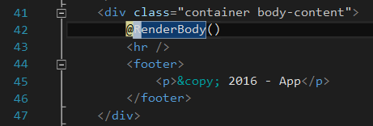

  _ASP.NET MVC's RenderBody() method at work._

* Finally, point out that our App's title, as it appears in the browser, is incorrect for our `App/Index` route.

  ![Our title is incorrect because we've failed to set ViewData\["Title"\].](Images/6-incorrect-title.png)

  _Our title is incorrect because we've failed to set `ViewData["Title"]`._

* Explain that we could set this in our controller methods.

  * Ask a student how they would set the `"Title"` key of `ViewData` to `"Index"`.

    * The correct response is with: `ViewData["Title"] = "Index"`

    * Point out that, while this works, it would be best to set the elsewhere.

      * In this application, the title will never change—it's a static property, and thus a view detail. MVC tells us that such details should live in the view layer, not the Controller layer.

* Explain that there is a better way to do it—setting the value directly in the template.

  * Open up `Views/App/index.cshtml`, and add `@{ ViewData["Title"] = "Index" }` to the top.

    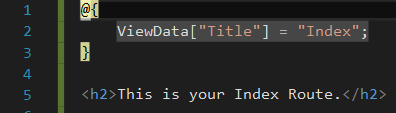

    _We can use this Razor template syntax to set ViewData values directly from the template._

### 7. Students Do: Views  (0:15)

* Slack out the following instructions to students.

  * **Instructions**:

    * Create new view files for your `AppController`'s `Index` and `About` routes. Return a `View()` from each of them. Make the appropriate changes to the methods' return types.

    * Update your index template such that it displays a user's first and last names. Set these values in the `ViewData` dictionary in your `Index` method.

    * Similarly, write a short description of your application in your `About` template. Use a variable called `"AppName"`. Set it in the `ViewData` dictionary in your `About` method.

### 8. Instructor Do: Review Activity  (0:15)

* Ask a student to explain how they scaffolded their `Index` and `About` views.

* Ask a student to explain how they displayed a user's first and last names in the `index` template.

  * The correct response is, by creating and accessing the appropriate keys in the `ViewData` dictionary. In the Controller: `ViewData["FirstName"] = "Jane"`—in the template: `@ViewData["FirstName"]`.

* Point out that setting values like this in our controller methods isn't very robust.

  * Explain that we can collect the values we want to display from something called a **query string**, which appears in the URL.

    * Remind students of the URL formula ASP.NET MVC uses to serve requests: `/[ControllerName]/[MethodName]/[Parameters]`.

  * Explain that query strings take the form: `?VariableName=VariableValue&AnotherVariableName=AnotherVariableValue...`

  * Give the following query string as an example: `localhost:8000/app/index?FirstName=David&LastName=Ogilvy`.

* Explain that, to access these values in our Controller methods, all we need to do is pass them as arguments.

  * Explain that the equals sign in the argument list tells ASP.NET MVC to use the provided string values as defaults if the user passes none in the query string. Be sure to demonstrate this.

* Explain that this allows us to set our dictionary values dynamically.


* Zip and slack out the `06-Views/Solved/solved` before dismissing class for their break.

- - -

### 9. BREAK (0:15)

- - -

### 10  Instructor Do: Scaffolding Models (0:15)

- - -

**Objectives Met**

* Scaffold resource models

- - -

* Point out that we _almost_ know enough to build a function web app.

  * Students can create views, and link them to controllers. This is already enough to build static sites on ASP.NET MVC!

  * Point out that, to build dynamic sites, we must learn how to store data.

  * Ask a student which of the MVC layers corresponds to data.

    * The correct response is **M**—**models**.

* Explain, in ASP.NET MVC, we define models as C# objects.

* Defining models is where instructions for Windows and Mac users diverge most substantially.

  * For Windows:

    * Right-click `Models` -> **Add** -> **Class**.

    * Select **Class**, and click **Add**.

    * This will add a file called `Models/Class.cs`. Change the name as appropriate to your model—for this example, use `Books`.

    * Add properties to the model.

      * These should include the properties you'd normally add, as well as an `ID` property.

    * Next, right-click `Views` -> **Add** -> **Controller**.

    * Select **MVC Controller with views, using Entity Framework** from the pop-up dialog, and click **Add**.

    * In the form that appears next, enter **Book (App.Models)** for the **Model Name**, and **ApplicationDbContext (App.Data)** for the **Data Context Class**.

      * This creates a view for each CRUD operation in `Views/Books`.

    * Next, we'll need to update the database to reflect the addition of our model.

      * Navigate to the project root folder in a command prompt or with Power Shell, and run the following commands:

        * `dotnet ef migrations add Initial`; then

          * Explain that **migrations** allow us to track of changes we make to the database.

        * `dotnet ef database update`.

    * Finally, launch the project from Visual Studio IDE, and navigate to the `/books` endpoint. You should see an Index view, complete with a `Create New` link.

- - -

For Mac:

* Right-click `Models` -> **New File...**.

* Select `General` - > `Empty Class`

* Change the name to `Books` and click `New`

* Add properties to the model.

  * These should include the properties you'd normally add, as well as an `ID` property.

* Right-click on the project file and select `Tools` > `Edit file`

* add the following lines to the .csproj file:

  ```
  <ItemGroup>
    <PackageReference Include="Microsoft.AspNetCore.All" Version="2.0.0" />
    <PackageReference Include="Microsoft.VisualStudio.Web.CodeGeneration.Design" Version="2.0.0" />
  </ItemGroup>
  <ItemGroup>
    <DotNetCliToolReference Include="Microsoft.EntityFrameworkCore.Tools.DotNet" Version="2.0.0" />
    <DotNetCliToolReference Include="Microsoft.VisualStudio.Web.CodeGeneration.Tools" Version="2.0.0" />
  </ItemGroup>
  ```

* In models, add a new empty class called `BookContext` and paste the following code:

  ```
  using Microsoft.EntityFrameworkCore;

  namespace App.Models
  {
      public class BookContext : DbContext
      {
          public BookContext(DbContextOptions<BookContext> options)
              : base(options)
          {
          }

          public DbSet<App.Models.Book> Book { get; set; }
      }
  }
  ```

* Add these two lines to the Startup.cs file:

  ```
  using Microsoft.EntityFrameworkCore;
  using App.Models;
  ```

* your configure services method should look like this:

  ```
  public void ConfigureServices(IServiceCollection services)
  {
    services.AddMvc();

    services.AddDbContext<BookContext>(options =>
   options.UseSqlite("Data Source=App.db"));
  }
  ```

* Now in the terminal, run the following commands:

  ```
  dotnet restore
  dotnet aspnet-codegenerator controller -name BookController -m Book -dc BookContext --relativeFolderPath Controllers --useDefaultLayout --referenceScriptLibraries
  ```

* You may need to restart Visual Studio to see your new files, then in terminal type:

  ```
  dotnet ef migrations add InitialCreate
  dotnet ef database update
  ```

### 11  Students Do: Creating Custom Models (0:20)

* Slack out the following instructions to students.

* **Instructions**:

  * Using whichever method is appropriate to your operating system, scaffold a new `Coffee` model.

  * Add `ID`; `Name`; `Origin`; and `Roast` properties to your model.

  * Run your migrations, and boot up your server.

  * Try creating and viewing a new model through the web browser.

  * Try creating a second model of your choosing.

### 12  Instructor Do: Review Activity  (0:15)

* Ask a student to explain how they scaffolded their `Coffee` models.

  * `Visual Studio IDE` users should have right-clicked on `Model`; added a class; and completed the other scaffolding forms.

  * `Visual Studio For Mac` users should have used `npm scaffold Coffee`.

* Demonstrate creating and viewing models through the browser.

* Live-code the creation of a new model, such as a `Song`.

* Take a moment to address student questions before `07-Models/Solved` and dismissing class.

* Be sure to remind students to **keep this project folder intact**, as we'll use it as a starting point for our next class. Be sure to do so yourself, as well.

### Lesson Plan Feedback

How did today's class go?

[Went Well](http://www.surveygizmo.com/s3/4325914/FS-Curriculum-Feedback?format=pt&sentiment=positive&lesson=21.02)

[Went Poorly](http://www.surveygizmo.com/s3/4325914/FS-Curriculum-Feedback?format=pt&sentiment=negative&lesson=21.02)
