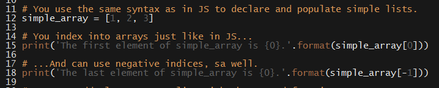

# 20.1 Lesson Plan - First Steps with Python

### Overview

The purpose of this lesson is familiarize students with the basics of Python.

`Summary: Complete activities 1-4 in Unit 21`

#### Instructor Priorities

* Python-specific learning objectives are listed below.

* Given an installation of Python 3.5.x, students should be able to:

  * Declare and manipulate variables that take advantage of Python's "duck typing";

  * Instantiate and populate lists and dictionaries;

  * Use Python's basic conditional control structures to implement branching behavior; and

  * Use Python's OO features to define classes and instantiate objects.

#### Instructor Notes

* Three hours is not enough time to provide more than cursory coverage of the language, and entails numerous omissions of essential concepts. These omissions are known and intentional. The point is that students should get enough to continue to experiment with the language. This will _not_ be "most of the language". This is fine.

* It may be easier to keep the example files open in one window, and demonstrate their examples in **Everyone Do** style in an interpreter on the projector.

* Make sure students install Python 3.4.x+ _before_ coming to class. Windows and Mac users can find installers on the [Python download page](https://www.python.org/downloads/release/python-352/).

  ```
  * Slack out the `Installation Instructions` before students come to class.
  ```

  .

* Have your TAs refer to the [Time Tracker](01-Day-TimeTracker.xlsx) to stay on track.

### Sample Class Video (Highly Recommended)
* To view an example class lecture visit (Note video may not reflect latest lesson plan): [Class Video](https://codingbootcamp.hosted.panopto.com/Panopto/Pages/Viewer.aspx?id=adfa2186-6880-4dae-ae21-a8c50188a7c5)

- - -

### Class Objectives

* After class, students should be able to:

  * Install Python on either a Windows or Mac computer; and

  * Create a command-line application using the basic features of the language.

- - -

### 1. Everyone Do: Verify Python Installation (0:05)

* Welcome students to class, and explain that today's lesson will be a "crash course" in Python.

* Have everyone fire up a terminal and execute the following command. 

  * Run: `python --version`


_Python version output._

* For class, students should be running Python 3.4.x. 

  * As a first line for troubleshooting have students try `python3` instead of `python`. On some systems, both are installed, but referred to differently.

  * This should pose no problems, as students were instructed to install the correct version of Python as part of last week's lesson.

  * Regardless, expect to troubleshoot some or other issue. Have your TAs available and reserve a few minutes for this purpose.

### 2. Instructor Do: Declarations & Basic Data Types (0:10)

* Open up `01-Console-IO/Examples/examples.py`

* Explain that, like JavaScript, Python does _not_ require you to declare variable "types". Unlike JavaScript, Python doesn't even require that you annotate variable declarations with `var`, `let`, or `const`—simply choose your variable's name, and assign its value.


_Very Pythonic variable declaration._

* Emphasize that we can store both strings and numbers without any special syntax—Python figures out the type of the data and handles it accordingly.

* Point out that Python has all of the same mathematical operators that JavaScript has, but that there are two notable differences. 

  * You'll probably want to drop into a shell as a class to demonstrate/tinker with these.

  * These are Python's [floor division](http://anh.cs.luc.edu/python/hands-on/3.1/handsonHtml/integer.html#division-and-remainders)  and exponentiation using `**`.


_Floor division and exponentiation._

* Explain the `print` function.

  * Explain that we'll talk about functions in greater detail later, but for now, students can simply take this one "at face value". For now, just point out that we call them just as we do in JavaScript: With the function name, parentheses, and a comma-delimited list of arguments.

  * Draw attention to the various ways of calling the `print` function. Students don't have to recognize all of them, strictly speaking, but each of them will come in handy throughout today's exercises. 


_Different ways to call print._

* Point out that we can declare more complex data types—including arrays and maps—but that we'll get some practice with these basics first.

* Finally, demonstrate the use of the `input` function.

### 3. Students Do: Echo Student Profiles to Console (0:10)

* Slack out the `01-Console-IO/Examples/examples.py` so students can refer to it as they work through the exercise.

* Slack out the `01-Console-IO/Unsolved/unsolved.py` file to students. It contains instructions, so you don't need to slack these out separately.

### 4. Instructor Do: Review Activity  (0:10)

* Open up `01-Console-IO/Solved/solved.py`. This activity is fairly straightforward, and is mainly intended to help students get some practice with Python's syntax.

* Ask a student how they were able to save student profile information.

  * They should respond that they used `input`.

* Ask a student how they printed the information to the console.

  * This is a straightforward use of `print`. Demonstrate alternate possible syntaxes for `print`, and commend any students who used them.

* Take any student questions. If none remain, move on to the next section.


_Console-based student profile prompts._

### 5. Instructor Do: Lists, Dictionaries, & Conditionals (0:15)

* This section will introduce students to the basic uses of lists, dictionaries, and conditional statements in Python.

  * The primary objective is to get students familiar with the syntax. Demonstrate it, then move on. They'll get practice with it after they get started on the activity and you've slacked out the examples for reference.

* Open up `02-Lists-Dicts-Conditions/Examples/list_examples.py`.

* First, explain that Python allows us to create and index into arrays much the same way that JavaScript does.

  * Point out that Python often refers to arrays as "lists".

  * Point out that we can use negative indices in Python, to index starting at the "back".



_Declaring and populating a simple array in Python._

* Next, demonstrate that you can add single elements to a list with the `append` method.

  * Point out that you can use either `+=` or the `extend` method to augment a list with another list.


_Appending single elements to an array, and extending it with an iterable._

* Then, demonstrate how to iterate over a list.

  * Point out that this is syntactically simpler than it is in JavaScript.


_Appending single elements to an array, and extending it with an iterable._

* Finally, demonstrate that we can "unpack" variables from an array into variables.

  * Point out that this is possible in ES6 via [destructuring assignment](http://developer.mozilla.org/en-US/docs/Web/JavaScript/Reference/Operators/Destructuring_assignment), if your class feels receptive.


_Python allows us to "unpack" an array into corresponding variables._

* Slack out the `02-Lists-Dicts-Conditions/Examples/list_examples.py` file for student reference.

* Open up the `02-Lists-Dicts-Conditions/Examples/dict_examples.py`.

* Begin by pointing out that Python's dicts are conceptually identical to JavaScript's objects, in the sense that they allow us to associate a _key_ with a _value_.

* Point out the similarity between the literal definition of a Python dict and a JavaScript object.


_Python dicts look very similar to JavaScript's objects._

* Demonstrate how to retrieve the value of a key. Point out that this is identical to retrieving a key's value from a JavaScript object using bracket notation.

* Briefly point out Python's syntax for retrieving the keys or values of a dictionary.


_Python's syntax for retrieving the value of a dictionary key._

* Next, point out that we can get both the key _and_ the value by using the `items` method.

  * Then, demonstrate how to use this to iterate over a dictionary.


_Iterating over a dictionary's items._

* Finally, point out that you _can_ iterate over a dictionary directly, but you'll only get its keys if you do this.


_Iterating over only a dictionary's keys._

* Slack out the `02-Lists-Dicts-Conditions/Examples/dict_examples.py` for student reference.

* Finally, open up the `02-Lists-Dicts-Conditions/Examples/conditionals_example.py`.

* Point out that Python's boolean values are `True` and `False`. Be sure to **emphasize the initial capital letter**.

* Explain that Python's `if`, `elif`, and `else` are conceptually identical to JavaScript's `if`, `else if`, and `else`. The only difference is that it's syntactically more compact in Python.


_Using if, elif, and else in Python._

* Next, explain that Python renders `&&` and `||` in English as `and` and `or`, respectively.


_Using and, or, and chained comparisons in Python._

* Finally, point out the `while True` trick, as well as the function of `break` and `continue`.

  * Give some context. Explain that an infinite loop makes sense if you'd like to wait for an indefinite period of time _until_ something happens—e.g., until a user inputs a certain value, etc.

  * Let students know they'll need this for their activity!


_Using while True; continue; and break._

* Slack out the `02-Lists-Dicts-Conditions/Examples/conditionals_example.py` for student reference.

* Students are likely to be a bit overwhelmed by all the new syntax. Reassure them that this is natural, and that muscle memory comes with practice...Which the next activity will give them ample amounts of.

### 6. Partners Do: Indefinite Student Profiles  (0:20)

* Slack out the `02-Lists-Dicts-Conditions/Unsolved/unsolved.py`. The file contains instructions, so there is no need to slack them out separately.

### 7. Instructor Do: Review Activity  (0:10)

* Open up the `02-Lists-Dicts-Conditions/Solved/solved.py`.

* Ask a student to explain how they wrapped their code in an infinite loop.

  * They should respond that they wrapped everything in a `while True` loop.

* Ask a student to explain how they stored students in an array.

* Ask a student to explain how they stored values directly in a "student dictionary".


_Declaring a list to store students; creating a new dictionary for each student; and wrapping the entire script in an infinite loop._

* Ask another student to explain how they implemented the confirmation prompts.

  * This isn't as straightforward an answer as the previous one, so let students share their solutions, and then comment on them with reference to the solution implementation.

* Ask a student to explain how they allowed users to enter either `Y` or `y` to confirm the information they entered.

  * Demonstrate the `lower` method in the interpreter, and point out how it was used in the solution.


_Implementing confirmation prompts and adding students to the list._

* Take a moment to answer any outstanding student questions before the break.

- - -

### 8. BREAK (0:15)

- - -

### 9. Instructor Do: Functions  (0:10)

* Open up `03-Functions/Examples/examples.py`.

* Explain that we define functions in Python with the `def` keyword.

  * The basic form is: `def function_name(parameter, list, here)`.

* Then, demonstrate how to call a function.

* Next, point out that Python allows us to use default arguments.

  * Feel free to point out that ES6 allows this, as well.


_Defining and calling functions, and using default arguments._

* Next, demonstrate Python's keyword arguments.

  * Emphasize that these allow us to define functions whose arguments are passed by _name_, rather than by position.

  * Point out that we can use positional arguments alongside keyword arguments, but that keyword arguments _must follow_ positional args.


_Keyword arguments allow us to use name function parameters._

* Finally, demonstrate how to get access to all of the positional or keyword arguments passed to a function.


_Retrieving all arguments passed to a function._

* Slack out the `03-Functions/Examples/examples.py` for student reference.

### 10.  Students Do: Refactor Student Information Tool  (0:15)

* Slack out the `03-Functions/Unsolved/unsolved.py`. Instructions are included in the file, so there is no need to slack them out separately.

### 11.  Instructor Do: Review Activity  (0:10)

* First, ask if anyone managed to figure out how to use modules.

  * Reassure students that it's okay if they didn't.

  * But, if someone did, ask them to explain how they used them.

* Point out that keeping all of your helper functions defined inside of the script gets very cluttered, very quickly.

  * Explain that it would be better to extract this into a separate file.

  * Explain that this is exactly what modules allow us to do.

* Briefly open up the `03-Functions/Solved/helpers.py`.

  * Point out that this file has a lot of function definitions. 

  8 Explain tha we'll look at them in detail momentarily.

  * For now, close the file, and open up `03-Functions/Solved/solved.py`

  * Explain the `from helpers import *` syntax.

    * Explain that this directs Python to **import** **all** (\*) functions from the file called **helpers.py**.

    * Explain that we can choose to import just a single function, as well.

    * Feel free to touch on Python's other import syntax(es), if you'd like.

* Return to the `03-Functions/Solved/helpers.py`.

* Ask students to explain their implementations for each of the functions required by the solution. Namely:

  * `get_student_information`;

  * `create_student`;

  * `print_student`;

  * `confirm`; and

  * `print_summary`.

  * Briefly point out the significance of docstrings. 

* Walk through the reference solution as students explain their solutions.

* Slack out the `03-Functions/Solved/solved.py` for student reference.

### 12.  Instructor Do: Classes & Objects  (0:15)

* Explain that, like JavaScript, Python is an object-oriented language.

* Explain that, unlike JavaScript, Python supports classical object-oriented programming.

* Open up the `04-Classes-and-Objects/Examples/examples.py`.

* Explain the significant syntax for defining classes in Python. In particular:

  * The `class` keyword;

  * The significance of the `__init__` method;

    * And the fact that we must pass `self` as a first argument to `__init__`;

  * The use of `self` inside of instance methods;

  * The syntax for instantiating an object, which does _not_ include `new`.


_The basics of class-based OOP in Python._

* Slack out the `04-Classes-and-Objects/Examples/examples.py` for student reference.

### 13.  Students Do: Create a Student Class (0:25)

* Slack out the `04-Classes-and-Objects/Unsolved/unsolved.py`. The file contains instructions, so there is no need to slack them out separately.

### 14.  Instructor Do: Review Activity  (0:10)

* Ask a student to explain how they implemented their `Student` class.

  * Check their response against `04-Classes-and-Objects/Solved/Student.py`.


_The reference solution for Student.py._

* Ask if anyone got as far as implementing a `Roster` class.

  * If so, ask them to explain how they implemented it.

  * Check their response against `04-Classes-and-Objects/Solved/Roster.py`.


_The reference solution for Student.py._

* Finally, ask someone to walk through how they restructured the logic of their main program.

  * Step through the `04-Classes-and-Objects/Solved/solved.py`.

  * Point out how much more succinct and readable this has become, in comparison to the first script we wrote in the beginning of class.


_Our student profile script, well on the way to being satisfactorily well-structured._

* Slack out the solution files for student reference.

* If time remains, foster discussion about the code students have written.

  * Ask a row if they can think of any ways to improve the structure of this program further.

  * When they respond, ask another row to critique the ideas, with questions like:

    * Can you think of something better?

    * What's good about these suggestions?

    * What Python structures would you use to implement these suggestions?

  * If there's time, have students try to improve their code. Otherwise, spend time discussing these questions and answering student questions.

### Lesson Plan Feedback

How did today's class go?

[Went Well](http://www.surveygizmo.com/s3/4325914/FS-Curriculum-Feedback?format=pt&sentiment=positive&lesson=21.01)

[Went Poorly](http://www.surveygizmo.com/s3/4325914/FS-Curriculum-Feedback?format=pt&sentiment=negative&lesson=21.01)
