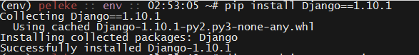
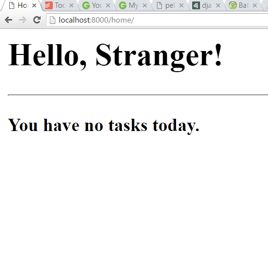

# 20.2 Lesson Plan - First Steps with Django

### Overview

The purpose of this lesson is familiarize students with the basics of Django.

`Summary: Complete activities 5-7 in Unit 21`

#### Instructor Priorities

* Python time!

#### Instructor Notes

* Django uses regular expressions to define routes. Have students complete the free levels of Code School's [Breaking the Ice with Regex](https://www.codeschool.com/courses/breaking-the-ice-with-regular-expressions) before coming to class.

  * It's not particularly important for students to come to class prepared to sling around regular expressions. The purpose of slacking out these exercises ahead of time is to ensure students are familiar with the concept of regex before dealing with Django's routing protocols.

* Slack out the `InstallationInstructions` ahead of time, so students come prepared with Python 3.4.x and virtualenv installations.

* Have your TAs refer to the [Time Tracker](02-Day-TimeTracker.xlsx) to stay on track.

### Sample Class Video (Highly Recommended)
* To view an example class lecture visit (Note video may not reflect latest lesson plan): [Class Video](https://codingbootcamp.hosted.panopto.com/Panopto/Pages/Viewer.aspx?id=f9343372-852a-4ef7-bfc4-a8c80001e214)

- - -

### Class Objectives

* After class, students should be able to:

  * Install Python on either a Windows or Mac computer; and

  * Create a command-line application using the basic features of the language.

- - -

### 1. Everyone Do: Verify Python & virtualenv Installation  (0:05)

* Welcome students, and explain that today's lesson will introduce Django, one of the most popular Python web frameworks.

  * Explain that, before getting started, we'll have to set up a virtual environment to work in.

  * Explain the following scenario:

    * Today, you build and deploy a project in the latest version of Django—1.10.1.

    * Next year, the project is running strong, and you continue to maintain it. But, you decide to start a _new_ project in the _next_ version of Django—say, 1.11.0.

    * If we started our first project by installing Django globally, upgrading that global installation to 1.11.0 will almost certainly prevent us from running our 1.10.1 project locally.

    * It would be better if we could install the _particular_ version of Django each _particular_ project requires.

    * Explain that this is precisely what virtual environments let us do.

  * Have students verify their virtualenv installations. 

    * Run: `virtualenv --version`. The particular version isn't crucial—what matters is that the package is installed. _NOTE: Windows users will need to have the $pythonhome/bin/Scripts directory in their path or else pip and virtualenv may no work from the terminal._

_virtualenv --version output._

* Next, create a folder for the Django project we'll use for the next two lessons, and change into it. You can create this anywhere, and name it anything.

* Create a virtualenv inside that folder, configured to use Python 3.

  * Have students check their default Python version with: `python --version`.

    * If the system default version is 3.4.x+, students can simply initialize their virtual environments with: `virtualenv $ENV_NAME`.

      * E.g., `virtualenv env`.

    * If the system default version is 2.7.x, they'll need to explicitly initialize with Python 3. See below.
    * If the user has spaces in the path of the env name errors may occur. For example: `/usr/jdoe/path to/working/folder` may experience errors creating the virtualenv.

  * Run: `virtualenv -p $PATH_TO_PYTHON3 $ENV_NAME`

    * E.g.: `virtualenv -p /usr/Scripts/python3 env`. 

    * Alternatively: `virtualenv --python=/usr/Scripts/python3 env`.

  * If students don't know the path to their Python 3 installation, explain they can find it by running: `which python3`.

    * Students using Bash or Zsh—which should be everyone—can substitute this directly with: `virtualenv -p`which python3`env`.

      * Backticks around `which python3` instruct Bash to evaluate the command and substitute its result in-place.

* Finally, activate the virtualenv.

  * Run: `source $ENV_NAME/Scripts/activate`.

    * E.g.: `source env/Scripts/activate`.
    * Windows (via Git Bash): `source env/Scripts/activate`

_Sourcing a virtualenv._

* Have your TAs available to troubleshoot.

### 2. Instructor Do: Introduce Django & MVC (0:05)

- - -

**Objectives Met**

* Implement an MVC-like architecture, even when one is not provided (e.g., raw PHP or in ground-up Node CRUD applications)

- - -

* Before installing Django, explain that it's what's called an "MVC Framework."

  * Point out that, when you build a Node app with Express, you're free to choose _exactly_ how and where you save your data.

  * Point out that this freedom is powerful, but can be inconvenient, as it requires you to "glue" everything together manually.

    * Point out the advantages of convention over configuration.

  * Explain that Django has an opinion as to how you should architect your application, and that the architecture it imposes is called MVC.

    * Refresh students' memory of MVC by explaining the below diagram.

      * Data is stored in **models**; **views** display the data to the user; and **controllers** handle user updates to the data.

      * Explain that, within Django, a more appropriate term is MTC—or, Model; Template; Controller.

        * This is because Django's "views" have responsibilities of controllers.

_An illustration of the MVC concept._

* Explain that Django's making this choice allows us to focus on _what_ our application does, rather than how the pieces fit together.

### 3. Everyone Do: Install Django & Create Project  (0:10)

- - -

**Objectives Met**

* Create a new project on the command line with `django-admin makeproject`

* Create "apps" within a project using `./manage.py startapp $APP`

- - -

* Now that students have some background on what Django _is_, it's time to install it. 

  * Tell them to source their virtualenvs if they haven't already, and run: `pip install Django==1.10.1`.

    * Note that students don't have to use `pip3` within a virtualenv initialized against Python 3.

* Explain that Django provides a command-line tool for creating new projects, called `django-admin`.

  * Have everyone create a new project with: `django-admin startproject app`.

    * You are, of course, free to name your application whatever you'd like. We've used `app` throughout the lesson plan for the sake of concreteness.

_installing django._

_Starting a new project with django-admin._

* Change into the `app` directory and `ls -sl` its contents.

_The starting point for new Django applications._

_The tree view of a new Django project._

* Explain that the `app` directory contains project-wide configuration files—this is where we set up database configuration, tell Django where static files are located, etc.

* Explain that `manage.py` is where Django's utility toolchain lives.

  * This is the tool you'll use to migrate databases, run the development server, create administrators, etc.

* Explain that this directory contains all of the files for a Django _project_, but that we develop specific functionality in what Django calls _apps_.

  * Ideally, each app is responsible for a specific set of related features.

  * A web app is a collection of different "feature sets." A Django project is the web app; each "feature set" is a Django app.

* Explain that, to initialize a new app, we use the `manage.py` tool.

  * Create a new app with `python manage.py startapp users`.

    * The general formula is: `python manage.py startapp $APP_NAME`.

    * A shorter alternative is: `./manage.py startapp users`, but this might not work on some students' machines.

* Display the contents of your project directory with `ls -sl`, and point out that this creates a new folder called `users`.

_Creating a new Django app._

* Explain that this directory is where we'll spend most of our development time.

* Finally, explain that, when you create a new app like this, you need to "register" it in Django's internal settings file.

  * Explain that this allows it to find important, app-specific files.

  * Open up `app/settings.py`, and scroll down to `INSTALLED_APPS`.

    * Inside the array, add: `users.apps.UsersConfig`, and make sure students do the same.

    * Explain that this is a one-time setup for every new app.

### 4. Instructor Do: Views and URLs (0:10)

- - -

**Objectives Met**

* Define views in `$APP/views.py`

  * Use the `HttpResponse` method to create stub view methods

* Wire views to URLs in `$APP/urls.py`

  * `include` those urls in `$PROJECT/urls.py`

- - -

* Remind students of Django's MVC paradigm.

* Explain that the first thing we'll explore is the Controller layer, since this is what allows us to bind UIs to data.

* Remind students that the "controller" in MVC is called a "view" in Django, and open up `users/views.py`.

  * Emphasize that the terminology isn't crucial, but that students do need to remember that `views.py` is where they define controllers, not UI details.

_The default views.py._

* Explain that each view is nothing more than a Python function.

  * Explain that, when a user hits a URL/route on your website, Django calls a function defined in `views.py`.

  * Explain that Django passes the user request as a parameter to each view function, so you can, for example, determine if it was a `GET` or `POST` request.

  * Explain that you need to tell Django which function to call when a user hits a given route elsewhere. We'll get to that after defining a few view functions.

* Explain that this is easier to understand with an example, so create a `home` route, and explain its components.

  * First, import `HttpResponse` from `django.http`.

    * To your imports, add: `from django.http import HttpResponse`.

      * Remind students that this instructs Python to import the `HttpResponse` function from the `django.http` package.

      * Explain that `HttpResponse` allows us to send a proper HTTP response to the browser, instead of just an HTML string.

  * Explain that each view function takes `request` as its first parameter.

  * Explain that you can perform whatever logic you need inside the function body.

  * Explain that the `return` value is what Django uses to render what users see.

    * Point out that returning HTML this way is a bit clunky...But, it will do for now.

      * We _want_ students to do things the clunky way, so that they'll begin to think about better solutions. We'll revisit this point as a review question after the next activity.

_A simple home view._

* Point out that this tells Django what to do when users hit the home page...But, we still need to tell it what route corresponds to that home page.

* Explain that you configure this in a different file, named `urls.py`.

  * Explain that each app can define its own URL patterns.

  * Save `views.py`, and create a file called `urls.py` in the app directory.

    * Explain that Django doesn't create this file in new apps, so students will need to create it themselves.

    * Explain that, to configure URLs, you need to import Django's URL configuration tools.

      * Add: `from django.conf.urls import url`.

    * Explain that, to map URLs to views, you need to import the views you just wrote.

      * Add: `from . import views`.

        * Remind students that this tells Django to import `views.py` from this directory (`.`).

    * Explain that Django expects you to store routes in an array called `urlpatterns`. Create this array.

    * Next, define a url for the home view thus:

      * `url(r'^home', view.home, name='home')`

        * Explain that this uses the Django-provided `url` function to map the route "<http://$SITE_URL/home>" to the function `home` that we just defined in `views.py` (represented here as `view.home`).

          * Explain that the `^` metacharacter indicates start-of-line. So, any URL that starts with `home` will map to `views.index`.

          * Explain that the `r''` syntax allows us to use special characters without escape sequences.

            * Explain that, in a normal string, we have to write `"\\"` to represent a single backslash. This is because the backslash on its own is used to indicate that a special character follows.

            * Explain that, if we prefix a string with `r`, we don't need to double-up backslashes.

            * Explain that this exists more or less only to make regular expressions more readable. There's nothing essential about using raw string literals—you could use normal strings with double backslashes instead—but some people simply find that a bit harder to stomach.

          * This is an incorrect regular expression—it's missing the end-of-line metacharacter, `$`. This is intentional. You'll fix this shortly.

        * Explain that you can give a string name to all of our routes, which you should always do for clarity.

          * Explain that we'll see how this is useful shortly. For now, students should remember it as a best practice.

    

    _Your user/urls.py configuration._

* Explain that this configures URLs for the `users` app, but that we still need to let the Django project as a whole know about these routes.

  * Reassure students that this is the last step for mapping URLs, and that it only needs to be done once per app.

* Navigate to `app/urls.py`, and explain that this is where you tell Django about the routes that each of its individual apps responds to.

  * Explain that we need to include another function from the `django.conf.urls` package, called `include`.

    * Explain that `include` allows us to easily...Well, _include_ urls from one of your apps.

    * Include the urls from `users/urls.py` by adding the following call to `url` to the `urlpatterns` list:

      * `url(r'', include('users.urls')),`

    * Explain that this tells Django that, whenever a user hits the site (e.g., `localhost:8000`), it should use the URLs defined in `users/urls.py` to figure out which view to load.

* Save the file and kick up a development server with `python manage.py runserver`.

  * Navigate to `localhost:8000/home/` and demonstrate that the route works as intended.

* Now, explain that the regular expression you used in `users/urls.py` isn't completely correct.

  * Ask a student to explain what matching for `r'^home'` means.

    * When they explain that it means to "match any string beginning with 'home'", commend the correct answer, but point out that the computer takes this literally.

    * Explain that this pattern matches _any_ string that begins with 'home'. 

      * Navigate to a few different routes to demonstrate this: `localhost:8000/home_route_we_didnt_map`, `localhost:8000/homeasdlfkja;sldfkjasdf/`, etc.

    * Stop the dev server; open up `users/urls.py`; and fix the regex by adding the `$` metacharacter.

      * Explain that this means "end-of-line". So, the updated regex means: "Match any string beginning with `home/`, _and which has nothing after._"

      * Explain that Django is helpful on this point, and "adds" the final slash for us if users forget it.

        * You can get the same behavior by marking the slash as optional with `r'^home/?$'`, but this deviates from the Django convention that all routes should end in a slash, and would confuse most students. As an instructor, it's good to remember you can do this, but it's best to avoid introducing optional items at this stage.

    * Start the server again, and demonstrate that this update fixes the problem.

  * Point out that regular expressions can be tricky because of the precision they demand, but point out that this is one of only a few gotchas that comes up in Django development.

    

    _The corrected home route._

### 5. Students Do: Stub Views & URL Mappings  (0:20)

* Slack out the following instructions to students.

  * **Instructions** | Setting up views and mapping them to routes in Django can seem labor-intensive at first, but you'll find that they become quite mechanical with practice. For this activity, you'll ned to do two things: Write three views, and map them to routes.

  * First, create three views: `index`, `detail`, and `add`.

  * In your `index` view, return an HTML string containing a header and a `<ul>` with two or three list items. They can say anything at all.

  * In your `detail` and `add` views, just return an HTML string containing headers. Something like "This is the detail/add view!" is fine.

  * Next, map these views to urls in `users/urls.py`. The routes should correspond to your method names.

  * Finally, make sure the Django project as a whole knows about the urls for your `users` app.

  * Kick up a development server and make sure everything's working properly in the browser.

  * _HINTS_ | Keep in mind that we're not returning pure strings — you need to import a function to turn them into proper Http responses. Also, don't forget that you can use """triple quotes to write multi-line strings in Python.""" This should make it easier to write your `index` view's HTML response.

  * Take a moment to think about your solution when you finish. Can you think of a way to make it more robust or elegant?

### 6. Instructor Do: Review Activity  (0:10)

* Before opening your own solution file, ask a student to explain how they implemented their `index`, `detail`, and `add` views.

  * Check their answers against your solution in `05-Views/Solved/users/views.py`.

    

    _The solution views.py._

* Ask a student to explain how they mapped their views to routes.

  * Check their answers against your solution in `05-Views/Solved/users/urls.py`.

    

    _The solution urls.py._

* Ask a student if they think this is the best solution available.

  * Ask them to explain why, or why not.

  * Ask another student to support or refute the first student's response—try to foster discussion on this point.

* Point out that writing HTML in a string like this is suboptimal not only because it's ugly, cumbersome, and inelegant, but because it **couples** our controller logic to our templates.

  * Explain: This means that, if we want to change the way our site looks, we have to open up our `views.py` file, and make changes there.

  * Explain how this is a nightmare for maintenance.

  * Ideally, we want to make changes to the way the site looks without having to change the way the controllers function—this is a major benefit of an MVC architecture.

* Explain that Django's templates allow us to do just that.

### 7. Instructor Do: Templates  (0:10)

- - -

**Objectives Met**

* Define and use app-specific templates in `$APP/templates/$APP`

  * Extend "base" layout files

  * Use blocks to modularize templates

* Use the `render` method to compile templates with context information

- - -

* Explain that, just as each app can map its own urls, so too can it maintain its own templates.

* Explain that app-specific templates should be placed within the app directory, inside a folder called `templates/$APP_NAME`.

  * Move into `users`, and then create these folders with: `mkdir -p templates/users`.

  * Explain the reason for the redundancy in folder names:

    * Explain that, when you refer to a template by name in one of your apps, Django looks for it in _every_ app's `template` folder, and uses the first one that it finds.

    * If you meant to use, say, the `index.html` template defined in the `users` app, but Django first looks in the `templates` directory of an app called `cards`, you'll get the wrong one in your UI.

    * This is why we create a folder with the app's name inside of the `templates` directory. It creates a **namespace**, so we can refer to templates precisely: `'users/index.html'` rather than simply `'index.html'`.

* Explain that we create our templates inside of this directory, and simply refer to them by name in our views.

* Explain that Django has its own templating syntax. It's similar to Handlebars in flavor, and so shouldn't take students too long to pick up.

  * Explain that we'll learn the template system details by example. create `templates/users/layout.html` to demonstrate.

* Explain that Django allows us to create **parent templates**, in which we condense markup common across templates.

  * Explain that this allows us to keep markup that appears everywhere—such as footers, navbars, etc.—in a single document, in turn allowing us to make site-wide changes by modifying a single document.

  * Explain that Django allows you to mark areas where child templates can "inject" their own content.

* Begin your demonstration by pasting a simple HTML document into `layout.html`.

  

  _Our starter HTML template._

* Explain that we don't have to do anything special to turn this into a "parent template"—all we need to do is tell child templates to use it.

  * Explain that we mark areas where child templates can inject their own content in "blocks."

  * Place a block inside of the title tag and body tags, as per the image below.

  * Explain that child templates refer to these blocks by name to override them., we simply mark blocks off so child templates can inject their own content.

    

    _Our starter template, updated with blocks for title and body content._

* Create a template for your `home` view: `templates/users/home.html`. 

* Add an `extends` clause at the top of the document, and override the parent template `block`s.

  

  _A child template extending users/layout.html_

* Explain that Django replaces `block` statements in parents with the content in correspondingly named child templates.

  * E.g., The contents of an extending template's `...` tags will be inserted in place of the parent's ``.

* Explain that Django allows you to use a number of Python control structures by simply wrapping them in `...` tags.

  * Demonstrate that Django offers `if/else` and `for` loops with this syntax.

  * Reassure students that they'll have this file for reference during their activity, so they don't need to commit this syntax to memory right away.

    

    _If/else in Django templates._

    

    _for loops in Django templates._

* Either finish filling out the `users/home.html` file, or simply copy and paste the completed example to save time.

* Briefly touch on the rationale behind each use of `for` and `if` tags, then slack out the file so students can refer to the syntax and logic during their activity.

* Remind students that the templates won't work unless we refer to them from the view. 

* Open up `views.py`, and replace your call to `HttpResponse` with a call to `render`:

  * `render(request, 'users/home.html', {})`

  * Explain that `render` "compiles" templates by binding variables in the HTML and executing the logic of template control structures.

    * Explain that the first argument to `render` will always be the user request object.

    * Explain that the second argument is always the name of the template you want to render.

    * Explain that the last argument is a dictionary, called the **context dictionary**, which contains the variables you used in the template.

      * Explain that the _keys_ of the context dictionary need to correspond to the names of the variables you referred to in the template.

        * Remind them that you used the variables `name` and `tasks` in the template.

      * Explain that you're purposefully passing an empty dictionary to demonstrate how the `if`/`else` control structures works.

* Prepare to kick up a dev server to demonstrate how everything works together.

  * You'll need to `makemigrations` and `migrate` before you do this. This is due to the way Django calls `render` internally.

    * Run: `python manage.py makemigrations && python manage.py migrate`.

    * You should do this off-screen, so as not to interrupt the continuity of the template lecture. 

    * You'll instruct students to run this command right before the next activity, so you'll get an opportunity to touch on it then.

* Run: `python manage.py runserver`, and navigate to `localhost:8000/home` to demonstrate.

_Our simple template, rendered._

* Point out that there was one step you didn't show, which was the `migrate` bit. 

  * Instruct students to run the migration commands you used earlier: `python manage.py makemigrations`, followed by `python manage.py migrate`.

  * Explain that this sets up the database so that Django can properly render and serve templates.

  * Explain that we'll talk more about migrations in the next section.

### 8. Partners Do: Base & View Templates  (0:20)

* Slack out the following instructions to students.

* **Instructions**:

  * The activity you wrote last time returned raw HTML strings to be rendered in the browser. Your task for this activity is to convert them to templates.

  * Start by creating the correct folder structure in your `users` directory.

  * Next, create a base template with the basic HTML structure. Pull in the Bootstrap CSS from MaxCDN, and put it in the document head: <https://www.bootstrapcdn.com/> 

  * Create three templates, one for each of your views, that extend this template.

  * Two of your views simply returned headers. Pass the string to the template as a variable named `header`, and render it in the appropriate tags.

  * In the template that includes a `ul`, send both the header string and an array of items to the template. Refer to the example template your instructor slacked out to you for the control structure syntax.

  * Once your list renders properly, see if you can add an `if` check to display a special message when the collection is empty.

  * If you get stuck, don't hesitate to reach out to a TA!

### 9. Instructor Do: Review Activity  (0:05)

* Open up your solutions in `06-Templates/Solved/users/templates/users`.

* First, ask a pair to explain how they rendered headers in the `detail` and `add` templates.

  * Follow-up by asking them to explain how they sent the data to the templates from their views.

  * Display your solution, and explain any differences between the two.

* Then, ask a pair, or a row, to explain how they rendered the headers and the list for the `index` template.

  * Display your solution, and explain any differences between the two.

* Congratulate students on coming this far.

  * Point out that there remains one major piece left: Models.

- - -

### 10.  BREAK (0:15)

- - -

### 11.  Everyone Do: Models & Models API  (0:20)

- - -

**Objectives Met**

* Define models using the Django ORM in `$APP/models.py`

  * Provide custom `__str__` methods for models

- - -

* Explain that models and databases go hand-in-hand.

  * Explain that models are simply Python objects that store information.

  * Explain that Django, essentially, uses models to talk to the database.

    * Explain that, when a user updates or creates a record—like, say, a to-do item—Django represents it as a Python object, and then converts that object to something we can save in the database.

    * Conversely, when a user wants to retrieve information from the database, Django first converts the stored information into a Python object, which can then be used from the view.

  * Explain that, because the details of this process are complicated,  Django provides an easy-to-use wrapper around it.

  * Open up `users/models.py`, and create a `User` class.

    * Explain that all Django models take `models.Model` as their Base Class.

      * Explain that this is what lets you use Django's ORM to map Python objects to the database.

      * You can cover this in more detail momentarily. For now, just get students to code along with you.

    * Ask students to help you develop a list of attributes we might expect a user to have.

      * Include a first and last name; email address; and age, just to introduce an extra data type.

    * Explain that creating a model with these attributes is quite straightforward.

      * Explain that the pattern is simply: `attribute_name = models.$ATTRIBUTE_TYPE(options)`.

        * Explain that Django has a _lot_ of built-in field types, available on the [documentation page](https://docs.djangoproject.com/en/1.10/ref/models/fields/#field-types). Encourage students to take a look at them when the data type of their field isn't obvious, but reassure them that only a few come up commonly.

      * Explain that the options you've passed are amongst the most common.

        * Explain that `null=False` disallows Django from storing a `null` value in the database.

        * Explain that `blank=False` disallows Django from storing an empty string as a value for the name or email attributes.

          * In case it comes up, be prepared to explain the difference between storing `null` values an empty strings.

      

      _Our User model._

* Explain that Django provides a special shell for us to test this out in. 

* Run: `python manage.py shell`. Explain that this drops us into a Python shell from which we can access all of Django's libraries.

* Run: `from users.models import User`.

  * Show students how to create a new user. 

    * Run: \`jane = User(first_name='Jane', last_name='Doe', email='jane@doe.com', age=72)

  * Next, print your user in the shell. Just type `jane`.

    * Point out that the default string representation—`<User: User object>`—is entirely useless.

    

    _Useless default string representation of a Python object._

* Reopen `users/models.py` and add a `__str__` method.

  * Explain that this method is what Python calls whenever it needs a string representation of an instance of the class.

  * Explain that the use of `self` is similar—but not identical—to the use of `this` in JavaScript objects.

    

    _Our User model, with a custom **str** method._

* Drop back into the Django shell, and repeat the above exercise. Demonstrate that the `__str__` method changes the way the shell reports the value of `jane`.

  

  _Enhanced representation of the User class after addition of the **str** method._

* Next, explain that Django models have a built-in `save` method. Try to call it on `jane`.

  * This raises an error. Call attention to the last line of the stacktrace, which reports that Django can find `no such table: user_User`.

    

    _Django throwing an error due to a nonexistent database table._

* Explain that, while we created a `User` model, we did _not_ update the database to store `User` information.

* Explain that, since we used Django's ORM to define our `User` model, it's quite easy to take care of this. 

  * Remind students of the "migrations" they ran earlier. 

  * Explain that "migration" is nothing more than an script that tells Django how to update to the database.

  * Explain that Django automatically takes care of applying updates to the database—that is, _migrating_ the database—as long as we use that `migrate` command to tell it to.

* Drop out of the shell, and have everyone run `python manage.py makemigrations`. 

  * Explain that this creates the migration itself—i.e., instructions as to how to update the database to reflect the new model we created.

* Next, run: `python manage.py migrate`.

  * Explain that this actually _runs_ the migration that `makemigrations` created.

* Explain that we're _finally_ ready to create, save, and retrieve `Users`.

  * Drop into the shell and create another `jane` object.

  * Save this object to the database.

  * Finally, retrieve it using `User.objects.all()`. This returns a collection containing all user objects we've saved to the database.

    

    _Creating, saving, and retrieving an object in Django._

* Explain that these same methods are available in your views for creating, saving, and retrieving users.

  * Point out that you can access an object's properties in a template via dot notation. Give a quick example of the syntax in your text-editor: `{{ user.first_name }}`. You don't need to actually pull up a template file or kick up a dev server to demonstrate this.

  * Let students know they'll need this information for their next activity.

- - -

#### Additional Information on OOP & Base Classes

* If you'd like to go into detail about Base Classes and subclassing, feel free to use the below information as a guide. Determine whether to cover this based on the pace of the class and your perception of your students' understanding.

  * Give the simple analogy that a dog is an animal. Dogs have certain traits in common with all other animals—they're multicellular, for instance.

    * Explain that, in object-oriented terms, a dog `is-a`(n) animal, and _inherits_ certain characteristics of animals by virtue of being one.

      * In other words, if a dog is an animal, we at least know that it has all the attributes and performs all the basic functions expected of an animal, even if we don't know anything about dogs in particular.

      * More abstractly, if you know that a northern hairy-nosed wombat is an animal, you know at least a few things about northern hairy-nosed wombats, even if you've never seen one...Or heard of them.

  * Explain that, in OOP, when a class `is-a` (super)class, it implies the class has at least the same attributes and methods as its super.

  * Explain that, in this case, we could say that `Animal` is the "base class" of `NorthernHairyNosedWombat` or `Dog`.

* Explain that, in Django, when we define classes whose base class is `models.Model`, it means it _inherits_ all the properties of Django's built in `models.Model` class. 

  * In particular, this means we can use all the methods that `models.Model` has available to map Python data to something we can store in the database.

* Remind students that it was _much_ easier to write the `User` model than it was to run through all these details.

  * Reassure them that they don't need to grok these details _right now_ in order to be effective Django developers. Just encourage them to keep it in the back of their minds as they move forward—it will make sense with time and experience.

- - -

### 12. Students Do: Display Models in Index & Detail Views (0:35)

* Slack out the following instructions to students.

  * **Instructions**:

    * Your task for this activity is to flesh out your `index` and `detail` using models.

    * To start, open up the Django shell using `manage.py`. Import your `User` class, and create/save a few users. Before moving on, retrieve all of them. Ensure you see what you expect to see.

    * Before moving on, try to retrieve a single user with the method: `User.objects.get`. We could retrieve the `jane` object we created before with `User.objects.get(first_name='Jane')`, or `User.objects.get(last_name='Doe')`. Do you see a pattern? How else could we retrieve the `jane` object? Test your hypothesis with the models you created.

    * Next, open up your views file. Update your `index` route to retrieve all of the Users you've saved, and send them out to the template for rendering. Don't forget to make the corresponding change in the template itself.

    * Start up a development server and hit your `index` route. Make sure you see what you expect.

    * Open up your views file again. and take a look at your `detail` view. Retrieve one of your users using `User.objects.get`, and pass this user to the template.

    * Update your template to display the user object you passed. Don't worry about displaying its specific properties yet—just make sure you're definitely passing the user you expect. _HINT_: This is a great place to use an `if` tag for debugging purposes!

    * Once you've verified that you're sending the user properly, update your template to display the user's properties. You don't have to build out a pretty UI for this, but you're free to have some fun with it if you'd like.

    * When you finish with that—you're done! Take a moment to review your solution. Is there anything you can fix or improve? In your detail view, can you think of a way to search for a particular user dynamically based on the request parameters?

    * Ask everyone around you if they're doing alright with the exercise. If you find someone who's having trouble, help them. Remember, this is your development team—if you finish early, their success becomes your responsibility.

### 13.  Instructor Do: Review Activity  (0:10)

* Ask a student to explain how they created and saved Users.

  * Drop into the shell as they explain, and follow their directions to create a User.

* Ask another student to explain how they retrieved a specific user with `User.objects.get`.

  * Take a moment to explain that this method allows you to retrieve users with an attribute that exactly matches the value you pass.

    * Thus: `User.objects.get(first_name='Smitty')` will return all users whose `first_name` field exactly matches the string `'Smitty'`.

* Ask a student to explain how they updated their template to display User profile information.

  * Open up `07-Models/Solved/users/models.py` to check your students' responses against the solution.

* Finally, ask a row of students to explain their thoughts on what they think they can improve. Ask another row how they might apply some of those ideas to improve their own solutions. Try to foster a discussion on this point.

### Lesson Plan Feedback

How did today's class go?

[Went Well](http://www.surveygizmo.com/s3/4325914/FS-Curriculum-Feedback?format=pt&sentiment=positive&lesson=21.02)

[Went Poorly](http://www.surveygizmo.com/s3/4325914/FS-Curriculum-Feedback?format=pt&sentiment=negative&lesson=21.02)
