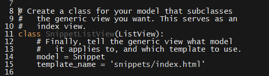
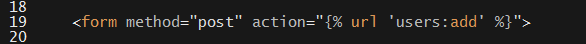
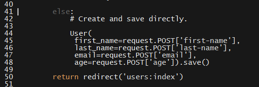

# 20.3 Lesson Plan - Django Forms & Request Handling

### Overview

Today's lesson plan will introduce students to Django's `Form` class; generic views; and best practices around sanitizing input and handling exceptions.

`Summary: Complete activities 8-11 in Unit 21`

##### Attention: If you’re teaching a part time section and this isn’t a Saturday, please use the “Weekday” tab inside of the "03-Day-TimeTracker.xlsx" for activity lengths instead of those printed on this lesson plan

#### Instructor Priorities

Today's Instructor Priorities coincide with Class Objectives.

Students should be able to:

* Use Django's `Form` class to accept, validate, and persist user input.

* Use generic views to quickly develop resource views.

* Use capture groups in URLs to build robust detail views.

* Use static files in local development.

* Refer to Django endpoints in templates with the `url` tag.

#### Instructor Notes

* Today's lesson builds on the activity from the last lessons. Make sure to slack out the `07-Models/Solved` to ensure a uniform starting point for today's activity.

* Have your TAs refer to the [Time Tracker](03-Day-TimeTracker.xlsx) to stay on track.

### Sample Class Video (Highly Recommended)
* To view an example class lecture visit (Note video may not reflect latest lesson plan): [Class Video](https://codingbootcamp.hosted.panopto.com/Panopto/Pages/Viewer.aspx?id=2663a2f2-d949-4bf8-aa4d-a8c900f85bf0)

- - -

#### Class Objectives

Students should be able to:

* Use Django's `Form` class to accept, validate, and persist user input.

* Use generic views to quickly develop resource views.

* Use capture groups in URLs to build robust detail views.

* Use static files in local development.

* Refer to Django endpoints in templates with the `url` tag.

- - -

### 1. Instructor Do: A Better Detail Route  (0:10)

**Objectives Met**

* Use the `render` method to compile templates with context information

- - -

* Welcome students to class, and remind them of the detail view they wrote towards the end of their last class. Pull up that activity's solution `3-Models/Solved/users/views.py` and ask a student to explain its logic.

  * Ask another student to elaborate on the deficiency of this solution.

* Point out that the main problem with this solution is that it hard-codes a particular user into the response. This is obviously not how applications work at scale.

* Explain that another way to look up users—or any record in a database, in fact—is to search by ID.

  * Explain that all objects stored in a database are stored with a unique ID. Because it's unique, it's the best way to retrieve individual records.

    * Point out that, if we use `Users.objects.get` to retrieve a user by name, there's no way to easily mitigate the problem of multiple users with coincident names.

    * Explain that unique IDs eliminate this problem.

  * Change the `User.objects.get(first_name='Jane')` query to use the object's ID.

    * The easiest way to determine the object's ID in this case is to drop into a shell and run: `User.objects.get(first_name='Jane').id`.

  * Kick up the dev server and demonstrate that everything still works as before.

* Point out that the ID is just a number.

  * Explain that, optimally, we'd hit a route like `/detail/3`, and display details for the model whose ID is 3.

  * Explain that, to do this, we need to _capture_ the number from the URL pattern.

* Open up `users/urls.py`, and update the details regex thus:

  * `url(r'^detail/(?P<user_id>[0-9]+)/$', ...)`

* Explain that, in Python, "capturing" a term in a regular expression requires this syntax: `(?P<name>pattern)`. In this case, we're naming our capture `user_id`, and matching the pattern `[0-9]+`.

  * Remind students that this matches any number of digits 0-9.

_Our updated detail route._

* Explain that Django passes the value it captures to the view associated with the URL as a parameter with the name `user_id`.

* Open up `users/views.py`, and update your `detail` view to receive a parameter called `user_id`.

* Explain that this allows you to access the number in the URL within the view function.

_Our updated detail view._

* Explain that this doesn't prevent users from requesting details on a model that doesn't exist.

  * Explain that you have to handle this manually in the view function.

  * Explain that students will get some practice with this in the activity, and that we'll review the concept as a class during review.

### 2. Partners Do: Fixing the Detail Route  (0:20)

* Slack out the following instructions to students

* **Instructions**:

  * Now that you know how to capture a term from a URL, update your `urls.py` to allow your own app to do this. It'll look just like your instructor's example.

  * Next, update your `detail` view to retrieve a user with the captured ID.

  * Start your development server and try your new route. 

  * What happens if you pass an ID that doesn't correspond to a user in your database? What should your application do in these circumstances?

  * Read about error handling in Python at this link: <https://wiki.python.org/moin/HandlingExceptions>

  * Explain to your partner how a `try`/`except` block works. We'll go over using them in the review.

  * Read about Django's Http404 Exception at this link: <https://docs.djangoproject.com/en/1.10/topics/http/views/#the-http404-exception>

  * If you have time, use the code snippet in the above to refactor your code to raise an `Http404` exception if someone requests details for a user that doesn't exist. You'll have to import `Http404` from `django.http`.

### 3. Instructor Do: Review Activity  (0:10)

* Ask a group to explain how they retrieved a user with the `user_id` passed into the route.

  * Explain that the proper way to do this is with `User.objects.get(id=user_id)`.

* Ask a group to explain the meaning of a `try` / `except` block.

  * Open up your `08-Capture-Groups/Solved/users/views.py`.

  * Explain that, if code in a `try` block causes an error, Python will look for an `except` block. If an `except` block exists, it will execute whatever code is in that block, rather than kill execution due to the error.

  * Explain that this allows us to keep our programs running in the event of an error by dealing with the problem, rather than simply letting the program die.

  * Explain that `raise` lets us let Python know of another error. 

    * Explain that, here, we've dealt with the problem of there being no user with a given ID by letting Django know it should display a `404 Not Found` page.

_Our detail view, now with error handling._

* Point out that we can use the `get_object_or_404` method to avoid having to use a `try`/`except` block.

_Using get_object_or_404 avoids the try/except blocks entirely._

* Take a moment to answer student questions before slacking out [solved](../../../../../01-Class-Content/21-regionalized-content/Django/01-Activities/08-Capture-Groups/Solved) and moving on.

### 4. Instructor Do: Generic Views  (0:10)

- - -

**Objectives Met**

* Use generic views to "scaffold" typical resource views

- - -

* Explain that there are certain things we'll want to do with almost any model.

  * Point out that we'll want to create, read, update, and delete (CRUD) just about any models we create.

  * Currently, our application displays a list of users at `index` and displays details at `detail/<user_id>`. These are examples of common views.

* Explain that Django provides a shortcut for common views like this, called **generic views**.

  * Explain that displaying a list of all models of a given type, and details of any given one, are amongst the generic views that Django provides.

* Explain that refactoring to generic views requires you to import the generic views you want to use; tell them which models you want them to display; and make minor updates to your `urls.py` to let Django know about the change.

* Open up your `09-Generic-Views/Examples/examples.py` to demonstrate the relevant syntax.

* Explain that you need to import the relevant generic views from `django.views.generic` before using them. Note that the image and example file refer to a model that doesn't exist, simply to ensure that the demo doesn't give students the answer to the upcoming activity.

_Importing generic views from django.http.generic._

* Explain that you need to create a view `class` that subclasses one of the generic views.

* Explain that, from there, you only need to define the `model` and `template_name` the view operates on. No additional view code is necessary.

_Creating a view class that subclasses a generic view._

* Explain that, since your view is now a class and not a function, you'll need to make one change to the `urls.py` file.

* Explain that this tells Django in advance that it needs to treat the view class as a function to work properly.

_Updating urls.py to reflect the refactor to generic views._

* Explain that Django provides a generic detail view, as well, which students will get practice with during the next activity.

  * Reassure them that this refactor is quite straightforward, and that we'll go over it thoroughly in the review.

  * Students will have to figure out Django's `add` and `update` generic views on the homework assignment, hence the opportunity to practice doing so here.

### 5. Students Do: Generic Views Refactor (0:20)

* Slack out the following instructions to students.

* **Instructions**:

  * For this activity, you'll be refactoring your code to use Django's generic list and detail views. The Django tutorial provides a walk-through for doing just this, so it helps to keep it handy: <https://docs.djangoproject.com/en/1.10/intro/tutorial04/>

  * Open up your `views.py` and import Django's generic list and detail views.

  * Next, create a class to replace your index view. Be sure to tell it which model and template to use.

  * Open up your `urls.py` and update the `index` route. This will look just like your instructor's example.

  * Now, open up your `index.html` template. Change your `users` variable to `user_list`. This is the name Django's generic views will pass to the template.

  * Next, you'll implement the detail view. In `views.py`, create a class to represent this view.

  * Tell this class which model and template to use. You don't need to do anything else, here.

  * Open up your `urls.py` again, and update your `detail` route. You'll make a change similar to that you made for your `index` route.

  * Change the name of your capture group to `pk`, instead of `user_id`. A model's ID is often called its "primary key", which is what "pk" is short for.

  * Finally, kick up a development server, and make sure everything works as before.

  * You'll notice something is a bit off in your index view. What is it? What's causing the error?

  * Can you think of any ways to fix this without updating your view?

  * If you have time, read this section in the Django documentation, and try to fix the problem: <https://docs.djangoproject.com/en/1.10/topics/class-based-views/generic-display/#adding-extra-context>

  * Don't worry if you don't. We'll cover this in review.

### 6. Instructor Do: Review Activity  (0:10)

* Ask a student to explain how they refactored their `index` and `detail` views to use Django's generic views.

* Ask a student to explain how they refactored their `urls.py` to reflect these changes.

* Ask a student to explain the mistake hinted at in the activity.

  * They should explain that the greeting is broken. It reads "Hello, !", but displays no name.

* Ask a student how you might address this problem without updating `views.py`.

  * Students are pretty creative, so open the floor to their thoughts. The answer you're looking for here is to update the template with an `` tag.

* Ask if anyone managed to solve the problem using the link provided in the activity.

  * Reassure students that it's fine if they didn't.

  * Explain that the problem is that, when we refactored to a generic view, we eliminated the `context` object we were sending.

  * Explain that the generic view passes its own `context` object, but that we have to add additional items manually.

  * Open up your solution `09-Generic-Views/Solved/users/views.py`, and point out the `get_context_data` function in the `UserListView` class.

_Overriding get_context_data in UserListView._

* Explain that Django's generic view base class provides a `get_context_data` method, which provides the default `context` for us, but that we can **override** that method if we want to add additional keys to the context dictionary.

  * Explain that providing an alternate definition for an inherited method is known as _overriding_.

  * Explain that we can use `super` to call the original method. 

    * Optionally explain that the super call in our overridden method has two parts:

      * `super(UserListView, self)` calls `super` with our `UserListView` class, and the current object, `self`.

        * Explain that a class can have multiple base classes in Python, so this just ensures we call the right method.

        * There's no need to be more precise than this at this stage.

      * The `.get_context_data(**kwargs)` calls the method `get_context_data(**kwargs)` on the return value of the `super` call.

      * This gives us the default `context` object that the generic view would pass to the template, which we can update manually.

    * Explain that, from there, it's as simple as building a `context` dict in any normal view.

      * Explain that we add a key, called `name`, and associate it with the value `'Adonis'`.

        * Optionally explain that we'd usually grab this name from the current user, but we're keeping it simple for the sake of example.

      * Explain that we then `return` this updated context, so that our template uses it in place of the default.

  * Explain that we can do this with any generic view.

* Sharp students will ask what happens to our error handling code. Explain that the generic views take care of this on their own.

* Take a moment to address any student questions, then zip and slack out the `09-Generic-Views/Solved` and move on.

### 7.  Everyone Do: Model Timestamps & Migrations  (0:15)

- - -

**Objectives Met**

* Provide an overridden `save` method to save `created` and `modified` timestamps (3)

  * Apply the logic of such an override to modify built-in behavior (3)

- - -

* Explain that there are several places we might want to take advantage of such overrides.

* Remind students that we often want to know when we saved or updated a model.

  * Point out our current `User` model doesn't afford this functionality.

* Open up `users/models.py`, and add `created` and `modified` fields. Explain that these will be `models.DateTimeField`s, and that we should set a `default` of `now` so that we can migrate our database.

_Adding created and modified fields to our User class._

* Next, override the models `save` method.

_Adding an overridden save method to our user model._

* Explain the method line-by-line.

  * Explain that this method accepts the current `user` object being saved (`self`), and any `*args` or `**kwargs` passed in, as well.

    * Explain that it's best practice to pass along `*args` and `**kwargs` when making super calls, in case base classes make use of them somewhere along the call chain.

  * Explain that `if not self.id` simply checks if this `user` has an ID yet. If it doesn't, that means it hasn't been saved in the database, which means we're creating it just now.

  * Explain that `self.created = timezone.now()` simply sets the model's `created` timestamp to "now".

  * Explain that `self.modified = timezone.now()` lives outside of an `if` check because it should always update `modified`. 

  * Explain that our `return` statement simply calls `super` to finish up the job of creating the object and saving it to the database.

    * Point out that this call is isomorphic to the one we used in `get_context_data`: `super(CurrentClass, self).method_name(*args, **kwargs)`.

* Point out that we need to remember to import the `django.util.timezone` method.

_Importing timezone._

* Explain that, to update the database to reflect this change to our models, we'll need to run `python manage.py makemigrations` and `python manage.py migrate`.

  * Explain that it's safe to ignore the warning Django produces.

_Making migrations after a model change._

- - -

### 8.  BREAK 0:45

- - -

### 9. Instructor Do: Forms & GET/POST Requests (0:15)

**Objectives Met**

* Handle either `GET` or `POST` requests in the appropriate views

* Link manually built forms to Django views

- - -

* Point out that we've done a good job of simplifying our index and detail views, but that we still need to implement our `add` view.

* Explain that Django provides helpers for doing this, but that we'll start by doing it manually to understand the process in detail.

  * **Instructor Note**: Students will first implement a form by hand, and then refactor it to use Django's form helpers. Their homework will give them an opportunity to refactor to generic views.

* Explain that the first step is simply to add a form in our `templates/users/add.html` template.

  * Open up this template, and add the `form` boilerplate.

    * When you fill out the `method` attribute, ask a student to explain what HTTP verb corresponds to _sending_ information to the server.

    * Point out that Django requires us to put a `` template tag within our `form` tags. Explain that this is an important security measure that Django handles for us, and that the tag is required.

    * Leave the `action` attribute blank for now. We'll return to this shortly.

_Basic form boilerplate. We'll fill out the action attribute later._

* Ask a student to enumerate the fields we have on our `User` class.

  * Our `User` class has `first_name`; `last_name`; `email`; and `age` fields.

* Explain that the first step to filling out our `add` view is simply providing inputs for each of these fields.

* Ask a student to help you fill out the `input` tag for the user's `first_name`.

  * Point out that this will look the same for the `last_name` and `email` fields, because they're all textual.

_Inputs and labels for the user's first and last name, and email address._

* Ask a student to help you fill out the `input` tag for the user's `age`.

  * Point out that we can use HTML5 types to provide client-side validation.

_Input and label for the user's age field._

* Ask a student what we need to add to allow users to actually submit the form.

  * Just a submit control.

_A submit control for our form._

* Point out that this is all we need to collect information for our user model.

* Ask a student to explain how this information gets to Django's view functions.

  * We configure the form's `action` attribute to send the information to the right method.

* Explain that we refer to server-side methods in terms of the route that calls them.

  * Explain that it's bad practice to hardcode a URL: `action="localhost:8000/add/"` isn't very maintainable.

  * Explain that Django provides helpers that figure out which route to hit based on names we pass, and all we need to do is configure our `users` app with a name.

* Open up `users/urls.py`, and add the declaration: `app_name = 'users'`.

_Giving our users app a name we can refer to._

* Point out that each of our URLs has a `name` attribute associated with it, as well. Explain that an `app_name` and named URLS is all we need to refer to routes robustly in our templates.

* Open up `users/templates/add.html` again. Fill out the `action` attribute thus:

  * `action=""`

  * Explain that this instructs Django to send the form's data to the method called `add` in the app called `users`.

_Using Django's template functions to refer to the proper view._

* Next, open up `users/views.py`. Move to your `add` view.

* Explain that the `request` object has an attribute called `method`, which allows you to check if it was sent as a `GET` or `POST` request.

  * Explain that you can check which was sent with an `if` check: `if request.method === 'GET'`.

* Explain that, if the `request` was sent as a `POST` request it will have an attribute, called `POST`, which is a dictionary.

  * Explain that we can look up the values the user sent from the form with `request.POST['input-name']`.

* Explain that students will build out their `add` view using this information in the next activity.

  * Reassure them that we'll go over the details during review.

### 10. Partners Do: Implementing the Add View  (0:30)

* Slack out the following instructions to students.

* **Instructions**:

  * For starters, implement the form in your `add.html` template. You've just seen how to do this—it will look the same as your instructor's example. Be sure to add an `app_name` in your `urls.py`, and set up your `action` attribute correctly.
      
  * Next, open up `views.py`. In your `add` view, check if the request came in as a `GET` or `POST` request. Save the value in a variable called `request_type`, and pass this to the template as the value of the `header` key. This way, you can see which type of request is rendering the view.

  * Start your development server, and check the value of `request_type`. What is it when you hit the route directly? What about when you click the submit button?

  * Once you're convinced your `request_type` check is working properly, open up `users/views/py` again.

  * What should you do if a user sends a `GET` request? Do you have anything to process, or do you just want to render the template and context like you've been doing? Come to a conclusion on this with your partner.

  * If a user sends a `POST` request, you know you'll have a `POST` dictionary with the values they submitted available. Explain to your partner what the names of the keys will be. If you'd like, test your hypothesis by sending the `request.POST` dictionary back to the template, and printing the values of its keys somewhere. You can access them with bracket syntax just like you would in Python: `{{ post_dict['key'] }}`.

  * How do you create a new user with these values? Create one, and save it.

  * Use your form to send some values to your view function. Then, manually hit your `index` view to see if Django saved your data.

  * If it works as expected—congratulations! You've finished the required portion of the activity. If you still have time, work through the points below.

  * While it's possible to manually navigate to your index view to check if everything worked, it would really be better if Django did that automatically. Read about Django's redirect method, and use it to accomplish this: <https://docs.djangoproject.com/en/1.10/topics/http/shortcuts/#redirect> . HINT: Use the same syntax you used in the `` tag to refer to the route you want to redirect to.

  * Try to create a user without entering an email address, or either name. What happens? Can you think of any ways to address this? Discuss with your partner, and be prepared to share your ideas with the class.

  * If you'd like to take a stab at dealing with this yourself, look up and use the HTML5 `required` attribute. Then, think about what you could do in your view to address the problem.

### 11. Instructor Do: Review Activity  (0:10)

* Ask a student to explain how they added the form to their `add.html` template.

  * Since you reviewed this in lecture, keep this section brief.

  * Ask them specifically about the `action` attribute, and the corresponding change to `urls.py`.

* Show your solution template in `10-Add-Users/Solved/users/templates/users/add.html` for comparison.

_Naming the app in urls.py_

_Using Django's template functions to refer to the proper view._

* Open your solution `10-Add-Users/Solved/users/views.py` for reference, but don't let students see it.

* Ask a student to explain how they checked for a `GET` vs `POST` request in their view.

_Using if to check for a GET vs POST request._

* Ask a group to explain how they handled a `GET` request.

  * Proper handling is to return the same response as before, which was implicitly our response to a `GET` request.

* Ask a student to explain how they handled a `POST` request.

  * Explain that you're only interested in how they collected and saved the information from the `POST` dictionary—students don't have to discuss error handling yet.

  * Students should have collected the values from the `request.POST` dictionary and used them to create a new `user`.

_Creating a User with POST data._

* Ask if any group managed to implement the `redirect` method.

  * If so, let them explain their solution to the class.

  * If not, refer to your solution file, and explain:

    * That we can `from django.shortcuts import redirect`; and

    * In our view, `return redirect('users:index')`.

      * Point out that this uses the same syntax to refer to routes that we used in our templates.

_Redirecting to a named route._

* Now, turn your attention to error handling.

* Ask a group if they could think of any solutions to solving the problem of malformed data.

  * Explain that you can use the HTML5 `required` attribute to prevent form submission until a user provides a value for the input.

* Ask the class as a whole to take two minutes to discuss whether this is sufficient with their partners. Ask them to come up with an explanation as to why, as well.

  * Reassure them that they don't have to develop foolproof responses—explain that this is just for the sake of discussion.

* Ask for a show of hands as to which groups think the `required` attribute is sufficient.

* Explain that this is, in fact, _not_ a perfectly robust solution.

  * Point out that that, for normal users, `required` is probably alright.

  * Explain that malicious users can easily bypass this client-side validation, however.

  * Launch a development server and navigate to your `add` route. Open up your developer tools, and demonstrate that bypassing the `required` attribute is as simple as deleting it from the relevant `input` element.

  * Point out that it's even easier than this. We can update the button with a single attribute to bypass all client-side validation: `<button class="btn btn-primary" type="submit" formnovalidate>`.

* Explain that proper validation requires us to check the integrity of our data in the view function, as well.

* Open up your `10-Add-Users/Solved/users/views.py`, and explain the validation logic in the `add` method.

  * Explain that we first ensure that the `POST` dictionary includes all of the keys we expect.

    * If it doesn't, we send back an `error`, notifying the user of the first key they failed to submit.

    * If it does, we initialize and save a user with the information that we now know is there.

_Simple form validation in our add view._

* Point out that, while this works, it ends up being a lot of code to write, debug, and maintain.

* Explain that Django offers built-in classes to help mitigate the inherent complexity of form validation.

### 12.  Instructor Do: Form Helpers (0:10)

- - -

**Objectives Met**

* Use built-in form helpers to avoid having to write HTML forms by hand

- - -

* Point out that there's a one-to-one correspondence between the data we collect from form inputs and the fields on a model class.

* Explain that Django takes advantage of this correspondence to build a `Form` class that lets you define form fields the same way you define model fields.

* Explain that you put your forms in `users/forms.py`, which we'll have to create.

  * Create this file, and to the top, add: `from django import forms`.

_Setting up our forms.py._

* Explain that we add fields to this class the same way we add them to our models.

  * Add an `EmailField`, and explain the options.

  * Explain that students will have to add the other fields in the activity.

    * Reassure them that this will be straightforward.

_Adding an EmailField to our form._

* Explain that, once you've defined a form, we need to update `views.py` to make use of it

* Open up `views.py`, and import the `UserForm` you just created.

_Importing our UserForm in views.py._

* Explain that we can instantiate the `UserForm` in our `add` method.

  * Explain that instantiating the `UserForm` class gives us objects containing HTML that we can use in our template.

* Explain that, if a user sends a get request, we'll send a variable called `form` to our template through the `context` dictionary.

  * Explain that this gives us access to the HTML in our template.

_Instantiating and sending a UserForm to our template._

* Next, open up your `users/templates/users/add.html` template.

* Explain that, now that we have the `form` variable in our template, we can update our HTML `form`.

* Delete the `text` and `number` fields, and replace them with a `for` loop.

  * Explain that this inserts errors and a `label` and `input` tag that Django generates for each field we added to our `UserForm` class.

    * Explain that Django validates input based on the options you pass to the fields in your `UserForm`. In our case, we added an `EmailField` with a `max_length` of `256`. If a user enters an email longer than this, Django will reject the submission and populate `field.errors` to display in the template.

    * Explain that `field.label_tag` is the HTML for the input's `label`.

    * Explain that `field` is the `input` itself.

  * Point out that we still need to provide:

    * The `form` tag, because we need to specify the `method` and `action` attributes; and

    * A submit control.

_Refactoring the form in our add.html template._

* Explain that this takes care of handling `GET` requests.

* Return to your `views.py`. and explain that handling `POST` requests, complete with validation, is much easier with a form object than manual logic.

  * Delete all of the validation code in `views.py`.

* Explain that we can instantiate a form with `request.POST` as an argument.

  * This checks to make sure that all of the keys we want are present, and that the data is valid.

* Demonstrate how to instantiate the `UserForm`: `form = UserForm(request.POST)`.

* Explain that the `form` object has a method called `is_valid`, which tells you if the form data is present and valid.

  * Explain that, if it is, you can access the data in `form.cleaned_data`. 

    * Explain that this dict holds keys whose names correspond to the fields on our `UserForm`. So, `forms.cleaned_data['first_name']`, rather than `'first-name'`.

  * Explain that you can then create a new `User` with the contents of `form.cleaned_data`.

* Explain that, if the form isn't valid, you should simply render the template as you do for `GET` requests. This will pass along the form and any errors the user should know about.

_Using the form object in our add view._

* Explain that students will have to figure out the details in the activity.

  * Reassure them that we'll go over the details in the review.

### 13.  Students Do: Refactoring the Add View (0:30)

* Slack out the following instructions to students.

* **Instructions**:

  * Create a file to put your forms in, and import the class you need.

  * Create a form class for your User, and equip it with the right fields.

  * While you're at it, update your `User` model's `email` field to use an `EmailField` rather than a `CharField`. What two commands do you need to run to integrate this change?

  * Next, open up your views file. Import your form, and drop down to your `add` view.

  * When a user hits your site with a `GET` request, pass the rendered form to the template.

  * Update your template to use the `form` attributes passed in the `context` dictionary. 

  * Back in your views file, update your `POST` branch. Create a new form with the right argument, and check if the data is valid.

  * What should you do if the data _is_ valid? What about if it isn't? Implement the proper behavior for each case.

  * Start a development server and make sure everything works properly.

  * You'll notice that the form looks different than it did when you wrote it by hand. This is because Django's defaults are different from those you chose for your form.

  * You can change this behavior if you want. Read about Widgets in the Django Forms documentation: <https://docs.djangoproject.com/en/1.10/ref/forms/widgets/#customizing-widget-instances> 

  * If you have time, see if you can fix the problem for at least one of the inputs. You'll need to specify a widget for the form field, and set its class attributes the way you had them before.

  * Can you imagine a better solution, or is this good enough?

### 14.  Instructor Do: Review Activity  (0:10)

* Ask a student to explain how they filled out the `UserForm`.

  * Point out that all fields are `required` by default, so we don't need to pass that as an option.

_The completed UserForm._

* Ask a student to explain how they updated their template to use the `form` object.

_The completed UserForm.user-form_

* Ask a student to explain how they handled `GET` requests in their `add` view.

_Handling GET requests with a UserForm._

* Ask a student to explain how they handled `POST` requests in their `add` view.

_Handling POSt requests in the view._

* Explain that we can restore the classes we had on our `input` tags by instantiating the form fields with a `widget` argument.

  * Explain that this tells Django which HTML tags to use to render our input, and allows us to specify any attributes we might want to associated with it.

_Adding attributes to an input widget._

* Start a dev server and hit your `add` route to demonstrate that this restores the classes to our `input`s.

  * Point out that it's not very DRY, though. Optimally, we'd have a directive somewhere that adds the 'form-control' class to _any_ input.

  * Explain that there is a way to do this, but that it will be left as an extra credit assignment for the homework.

* Take a moment to answer any student questions before slacking out the `11-Form-Helpers/Solved` and dismissing class.

### Lesson Plan Feedback

How did today's class go?

[Went Well](http://www.surveygizmo.com/s3/4325914/FS-Curriculum-Feedback?format=pt&sentiment=positive&lesson=21.03)

[Went Poorly](http://www.surveygizmo.com/s3/4325914/FS-Curriculum-Feedback?format=pt&sentiment=negative&lesson=21.03)
