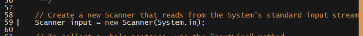

# 20.1 Lesson Plan - First Steps with Java

### Overview

The purpose of this lesson is to provide students with basic facility in the Java programming language.

`Summary: Complete activities 1-8 in Unit 21`

#### Instructor Priorities

* Java-specific learning objectives include:

  * Given a functional installation of Java 8 SE, students should be able to:

    * Label the type of each variable that appears in a program; and

    * Make meaningful use the difference between static and instance members.

#### Instructor Notes

* Three hours is not enough time to provide more than cursory coverage of the language, and entails numerous omissions of essential concepts. These omissions are known and intentional. The point is that students should get enough to continue to experiment with the language. This will be "most of the language", and that is fine.

* Installing Java on Mac and PC is straightforward. Regardless, you should slack out the appropriate installation instructions ahead of time.

  * Instructions for [installing on a Mac](http://www.java.com/en/download/help/mac_install.xml) and installing on a PC via the [online installer](http://www.java.com/en/download/help/windows_manual_download.xml) or the [offline installer](http://www.java.com/en/download/help/windows_offline_download.xml).

  * Emphasize that students must install **Java 8**, as this lesson makes use of one of its version specific features: [Lambda expressions](http://docs.oracle.com/javase/tutorial/java/javaOO/lambdaexpressions.html).

  * Make students running Bash on Windows 10 aware that a bug in the embedded Linux environment precludes their installing Java 8. They will have to run their code from the Windows cmd terminal or Powershell.

* It may be easier to keep the example files open in one window, and demonstrate their examples in **Everyone Do** style in an interpreter on the projector.

* Have your TAs refer to the [Time Tracker](01-Day-TimeTracker.xlsx) to stay on track.

### Class Objectives

* After class, students should be able to:

  * Install Java on either a Windows or Mac computer; and

  * Create a console application using the basic features of the language.

- - -

### 1. Everyone Do: Verify Java Installation (0:05)

* Welcome students to class, and explain that today's lesson will be a "crash course" in Java.

* Have everyone fire up a terminal and execute the following command. 

  * Run: `java -version`

_Java version output._

* For class, students should be running Java 8 (version 1.8.x). 

  * This should pose no problems if you instruct students to install Java ahead of time.

  * Regardless, you should expect to troubleshoot. Have your TAs available and reserve a few minutes for this purpose.

### 2. Instructor Do: Data Types In Java (0:10)

* Explain that Java is built specifically to facilitate the design and implementation of large, complicated software systems. 

  * As such, there's a bit more boilerplate to it than there is with JavaScript, Python, Ruby, etc.

  * Explain that another fundamental difference between Java and JavaScript is that Java is a **compiled** language. This means that it must be converted from source code to something the computer can understand, called **byte code**, _before_ being executed.

    * This is by contrast to JavaScript, Python, Ruby, etc., where we can run source code "directly".

* Open up [01-Ins_Console-IO-Demo/console/ConsoleIO.java](../../../../../01-Class-Content/21-regionalized-content/Java/01-Activities/01-Ins_Console-IO-Demo/console/ConsoleIO.java)

  * Point out the `package` statement at the top.

    * Explain that this statement tells Java which package the current file belongs to, and that a **package** is conceptually analogous to a JavaScript module.

    * Explain that your directory structure must match your package name. If you have a file called `ConsoleIO.java` in a package named `com.bootcamp.console`, Java expects your directories to look like `com/bootcamp/console/ConsoleIO.java`. 

      * In our case, we've placed `Console.java` in `package console`, so Java expects `console/ConsoleIO.java`.

_Java's typical package statement._

* Point out that the `import` statement is conceptually analogous to Node's `require`.

  * Don't linger on this point. We'll come back to it momentarily.

* Point out that we kick off the meat of our file with `public class ConsoleIO`. 

  * Explain that this creates a class, called ConsoleIO, which is _publicly visible_. In other words, it creates a class that you can use in _any_ Java code.

    * Explain that a _class_ in Java is a bit different from a class in JavaScript. 

      * In Java, a class can be used to define the "shape" of objects.

      * In this case, we aren't using the class to create new objects, so it's just a "wrapper" for our code. In other words, this class is just a way for us to keep things organized.

  * Reassure students that it's okay if they don't fully understand this bit right now. It gets clearer with practice.

* Explain that the `public static void main` syntax refers to a function called `main`.

  * Explain that we'll cover functions in more detail later.

  * For now, point out that this is the so-called "entry point" to our application. In other words, this is the function Java looks for to start your app.

* Explain that, unlike JavaScript, Java requires you to declare variable "types".

_Very Java variable declaration._

* Explain that Java exposes many built-in types, but that students will only need a subset for today's activities. This subset includes:

  * `String`, the data type used to indicate strings;

  * `int`, the data type used to indicate numbers between -231 and 232;

    * If a student asks, explain that the `long` data type allows you to accurately store values outside of this range.

  * `double`, a data type used to store "decimal values"; and

  * `boolean`, a data type used to store boolean values.

* Point out that Java has all of the same mathematical operators that JavaScript has. The syntax for all of the familiar mathematical operations is the same.

* Explain the `System.out.println` and `System.out.print` functions.

  * Explain that we'll talk about functions in greater detail later, but for now, students can simply take this one "at face value". For now, just point out that we call them just as we do in JavaScript: With the function name, parentheses, and a comma-delimited list of arguments.

  * Explain how these two functions differ: `println` prints its argument and a line break, whereas `print` simply prints its argument.

_Java's System.out.println function._

* Explain how to use `String.format` using the comments in the examples file.

* Point out that we can declare more complex data types &mdash; including arrays and maps &mdash; but that we'll get some practice with these basics first.

* Finally, demonstrate how to instantiate and use a `Scanner`.

  * First, point out that, to read input from command line, we need to use an object called a `Scanner`.

    * Explain that, to access this class, we need to import it. Jump to the beginning of the file to demonstrate the import statement.

    * Explain that the Scanner class comes from a built-in package called `java.util`. 

      * This is like using `require` to pull in built-in Node module.

    * Demonstrate how to instantiate a Scanner using `new`.

      * Point out that we use the class name to type the object.

      * Explain that `System.in` is a direct hook into the system's standard input stream. The reason we can't use it directly is because it's only capable of reading _bytes_. A Scanner provides an extra layer of abstraction and allows us to work with familiar data types rather than raw data.

_Instantiating a Scanner object._

* Explain that, to wait for and read user input, we use an appropriate method on Scanner.

  * Since Java is statically typed, Scanner provides different methods for reading different types of input.

  * Explain the following methods:

    * `nextLine`, which reads user input, including any white space or newline characters, and returns it as a String;

    * `next`, which reads a single word of user input, and returns it as a String;

    * `nextInt`, which attempts to parse user input as an integer, and returns the result if successful; and 

    * `nextDouble`, which attempts to parse user input as a double, and returns the result of successful.

  * Explain that providing the wrong type can kill a program.

    * For instance, feeding a String to `nextInt` will result in an Exception.

_Various next methods in Java._

* Finally, demonstrate how to compile and run Java.

  * To keep it simple, show students to compile using: `javac *.java`.

  * To run the compiled ConsoleIO.class file, run: `java -cp ../ console.ConsoleIO`

    * Explain that `-cp` &mdash; which stands for classpath &mdash; tells Java where to look for package and class that you specify afterwards.

      * In this case, we tell Java to look for the folder called `console` in the parent directory; and within that folder, look for a file called `ConsoleIO.class`.

      * This is why our folder structures have to match our package statements. If they don't, Java won't be able to find our files properly.

### 3. Students Do: Echo Student Profiles To Console (0:10)

* Slack out [01-Ins_Console-IO-Demo/console/ConsoleIO.java](../../../../../01-Class-Content/21-regionalized-content/Java/01-Activities/01-Ins_Console-IO-Demo/console/ConsoleIO.java) so students can refer to it as they work through the exercise.

* Slack out [02-Stu_Console-IO/Unsolved](../../../../../01-Class-Content/21-regionalized-content/Java/01-Activities/02-Stu_Console-IO/Unsolved) to students.

* Let students know that they should use `Scanner.nextLine` to read input for this activity.

  * This is because `Scanner.next` doesn't consume newlines, and so complicates the solution a little more than is warranted for the level of today's introduction.

### 4. Instructor Do: Review Activity  (0:10)

* Open up [02-Stu_Console-IO/Solved](../../../../../01-Class-Content/21-regionalized-content/Java/01-Activities/02-Stu_Console-IO/Solved). This activity is fairly straightforward, and is mainly intended to help students get some practice with Java's syntax.

* Ask a student how they set up their program to receive user input.

  * They should respond that they instantiated a Scanner object.

* Ask a student how they were able to save student profile information.

  * They should respond that they used `Scanner.nextLine`, and stored the result of the call in a String variable.

* Ask a student how they printed the information to the console.

  * This is a straightforward use of `System.out.println`.

* Take any student questions. If none remain, move on to the next section.

_Console-based student profile prompts._

_Printing the user's input._

### 5. Instructor Do: Lists, Dictionaries, & Conditionals (0:15)

* This section will introduce students to the basic uses of arrays, array lists, hashmaps, and conditional statements in Java.

  * The primary objective is to get students familiar with the syntax. Demonstrate it, then move on. The activity affords ample practice opportunity.

* Open up [03-Ins_Arrays-Maps-Conditions-Demo/collections/Arrays.java](../../../../../01-Class-Content/21-regionalized-content/Java/01-Activities/03-Ins_Arrays-Maps-Conditions-Demo/collections/Arrays.java).

* Explain that in Java, arrays must be created with a certain length, and can only hold data of a certain type.

  * Explain that, once set, that length can't change.

  * This is (obviously) in contrast to JavaScript.

* Demonstrate how to instantiate a typed array in Java.

  * The comments in the example file are fairly self explanatory.

  * First, demonstrate the syntax for creating an array of a given type.

  * Then, demonstrate how to instantiate an array with a `new` call.

_Declaring and instantiating an array._

* Demonstrate the two ways to populate an array:

  * Either by directly setting values on instantiation with brace notation; or

  * By setting the value of each index sequentially.

_Populating an array at creation time; and populating an existing array by setting indices._

* Finally, demonstrate how to iterate over an array using the same syntax available in JavaScript...

_C-style for-loop in Java._

* ...And with Java-specific `for-in` syntax.

_Java-specific for-in syntax._

* Point out that arrays in Java are more cumbersome to work with than they are in languages like JavaScript, Python, or Ruby.

* Explain that Java offers another data type, called the ArrayList, which behaves like an array but doesn't impose a length constraint.

* Open up [03-Ins_Arrays-Maps-Conditions-Demo/collections/ArrayLists.java](../../../../../01-Class-Content/21-regionalized-content/Java/01-Activities/03-Ins_Arrays-Maps-Conditions-Demo/collections/ArrayLists.java)

* First, point out that you need to `import java.util.ArrayList` to use this.

_Importing java.util.ArrayList._

* Next, explain how to instantiate an ArrayList.

  * Call attention to the bracket syntax. Explain that this is simply Java's way of specifying the type of object that goes into a collection.

  * Point out that you don't need to specify the type on the right hand side of the assignment statement, but it's perfectly valid syntax to do so.

_Instantiating an ArrayList over Strings._

* Next, demonstrate that you can add single elements to an ArrayList with the `add` method.

_Appending single elements to an ArrayList with add._

* Then, demonstrate how to remove the item at a specific index.

_Removing a specific element in an ArrayList with remove._

* Next, demonstrate how to set the value of an element at a specific index with `set`.

_Setting the value of a specific element with set._

* Finally, demonstrate how to iterate over an ArrayList using the same for-in syntax as for arrays.

_Iterating an ArrayList._

* Point out that ArrayLists are a more versatile abstraction than Arrays.

  * ArrayLists are often preferable to raw arrays, but students are free to use either in their activities.

* Next, we'll cover Java's HashMaps. Open up [03-Ins_Arrays-Maps-Conditions-Demo/collections/HashMaps.java](../../../../../01-Class-Content/21-regionalized-content/Java/01-Activities/03-Ins_Arrays-Maps-Conditions-Demo/collections/HashMaps.java).

* Explain that a HashMap is conceptually analogous to a JavaScript object.

* Explain that, when you instantiate a HashMap, you need to specify both the type of its keys and its values.

_Instantiating a HashMap whose String keys map to Integer values._

* Point out that we must say `Integer` instead of `int`; `Double` instead of `double`; and `Boolean` instead of `boolean` if we use them as key or value types.

  * This is because collections can only contain objects, so Java must convert primitives to their corresponding wrapper types to insert them.

  * This procedure is called autoboxing. Feel free to explain it if students ask, but don't feel the need to belabor the point.

* Explain that we set the value of a key with the `put` method, and retrieve the value of a key with the `get` method.

  * Point out that we can use `getOrDefault` to retrieve the value of a key, _or_ a default value we specify if the key doesn't exist. This is safer than a simple call to `get`.

_Basic HashMap methods: `put`, `get`, and `getOrdefault`._

* Finally, demonstrate how to iterate over a HashMap using a lambda expression.

_Iterating over the keys and values of a HashMap in Java 8._

* Finally, open up the [03-Ins_Arrays-Maps-Conditions-Demo/collections/Conditionals.java](../../../../../01-Class-Content/21-regionalized-content/Java/01-Activities/03-Ins_Arrays-Maps-Conditions-Demo/collections/Conditionals.java).

* Explain that Java's conditional statements are the same as JavaScript's.

_C-style conditional statements._

* Explain that Scanner objects offer a way for us to check if the standard input stream has data of a certain type _before_ we consume it.

_Verifying the type of our incoming data._

* Students are likely to be a bit overwhelmed by all the new syntax. Reassure them that this is natural, and that muscle memory comes with practice...Which the next activity will give them ample amounts of.

  * Slack out [03-Ins_Arrays-Maps-Conditions-Demo/collections](../../../../../01-Class-Content/21-regionalized-content/Java/01-Activities/03-Ins_Arrays-Maps-Conditions-Demo/collections), and tell students to refer to them as they work through the activity.

### 6. Partners Do: Indefinite Student Profiles  (0:15)

* Slack out [04-Stu_Arrays-Maps-Conditions/Unsolved](../../../../../01-Class-Content/21-regionalized-content/Java/01-Activities/04-Stu_Arrays-Maps-Conditions/Unsolved).

* Students will need to initialize an `ArrayList<HashMap<String, String>>`. This declaration is a bit unintuitive by virtue of its unfamiliar syntax, so it may be worthwhile to give a fairly explicit hint that students can insert a HashMap&lt;String, String> into an ArrayList if they get the syntax right.

  * If you expect this to be a huge sticking point for students, feel free to just give them the answer here. Let them know they are encouraged to ask a TA to verify their solution, or guide them in the right direction on this point.

* Also point out that, since we want to allow users to create an _indefinitely long_ list of students, ArrayList is the correct data type—students should _not_ try to use an array.

### 7. Instructor Do: Review Activity  (0:10)

* Open up the [04-Stu_Arrays-Maps-Conditions/Solved](../../../../../01-Class-Content/21-regionalized-content/Java/01-Activities/04-Stu_Arrays-Maps-Conditions/Solved)

* Ask a student to explain how they created a list of students maps

  * They should have initialized an ArrayList of HashMaps: `ArrayList<HashMap<String, String>>`.

_Initializing an ArrayList over HashMaps._

* Ask a student how they initialized the HashMap to store their student's information.

  * They should have initialized a `HashMap<String, String>`.

_Initializing a HashMap&lt;String, String> for student information._

* Ask students to explain how they iterated over:

  * Their student HashMap; and

  * Their list of students.

_Iterating over a HashMap with a lambda expression._

_Iterating over an ArrayList with for-in syntax._

* Ask a student to explain the bracket syntax used to initialize the HashMap.

  * They should explain that it indicates that both the maps keys and its values are strings.

* Slack out `04-Stu_Arrays-Maps-Conditions/Solved` before moving on.

- - -

### 8. Break (0:45)

- - -

### 9. Instructor Do: Functions  (0:20)

* Explain that the next section will introduce students to functions in Java.

  * Point out that students have already been using functions extensively.

* Explain that, in Java, functions are (somewhat interchangeably) referred to s _methods_.

  * Functions can only exist inside a class, in which context they're referred to as methods.

* Explain that functions in Java are less flexible than they are in JavaScript.

  * Just as Java requires that variables be typed, so too does it require that programmers define what type a function returns.

* Open up [05-Ins_Functions-Demo/functions/Functions.java](../../../../../01-Class-Content/21-regionalized-content/Java/01-Activities/05-Ins_Functions-Demo/functions/Functions.java).

* The example file contains extensive notes on the mechanics of functions, so refer to that file for explanations. 

  * In particular, it covers:

    * Return types;

    * Defining package-private functions;

    * `public` and `private` access modifiers;

    * Basic generic methods.

* You'll have to add `static` after the access modifier for each function in the example file for it to compile.

  * For your convenience, there's a file in the same directory, `05-Ins_Functions-Demo/functions/Functions.java`, in which this keyword is already present.

  * You're free to discuss the difference between static and instance members here, if you'd like. You'll cover it in the next section, either way.

### 10.  Students Do: Refactor Student Information Tool  (0:15)

* Slack out [06-Stu_Functions/Unsolved](../../../../../01-Class-Content/21-regionalized-content/Java/01-Activities/06-Stu_Functions/Unsolved).

* Point out that students will have to make all of their functions `static` for their code to compile.

### 11.  Instructor Do: Review Activity  (0:10)

* Open up the [06-Stu_Functions/Solved](../../../../../01-Class-Content/21-regionalized-content/Java/01-Activities/06-Stu_Functions/Solved).

* Explain that there are several ways to implement the functionality required by the activity, and that your reference solution represents just one of them.

* Ask a student to explain how they created a function to prompt a user for input, and store the user's input in a HashMap.

_A function that prompts for, and stores, user input._

* Ask a student to explain how they created a function that prints a confirmation message you pass to it, and returns the user's input.

_A function that prints a message passed to it, and returns the user's input._

* Ask a student to explain how they wrote a function that iterates over a list of student HashMaps, printing their keys and values.

_A function that iterates over a list of student HashMaps._

* Point out how these functions are used to refactor the body of the application.

  * Point out that it's gradually become cleaner as we refactor to increasingly abstract patterns.

* Slack out [06-Stu_Functions/Solved](../../../../../01-Class-Content/21-regionalized-content/Java/01-Activities/06-Stu_Functions/Solved) before moving on.

### 12.  Instructor Do: Classes & Objects  (0:15)

* Explain that the last topic of the day's lesson will be classes and objects.

* Explain that Java features immensely powerful tools for writing object-oriented code.

  * Explain that much of this unfortunately falls outside the scope of today's class, but encourage students interested in learning more about OOP and software design to take further steps with Java. 

* Open up the [07-Ins_Classes-and-Objects-Demo/classes/User.java](../../../../../01-Class-Content/21-regionalized-content/Java/01-Activities/07-Ins_Classes-and-Objects-Demo/classes/User.java).

* Explain that the `public class` syntax that students have seen so much of, predictably, tells Java to create a **class**.

  * Explain that a class is a "blueprint" for creating objects. 

    * In this sense, classes in Java are similar to classes in JavaScript. Don't push the analogy too far, though, lest students make the mistake that they _are_ the same.

  * Explain that classes can be instantiated. This means you can use them to create new objects.

  * Explain that classes are also entities in and of themselves. 

    * A blueprint defines how to build a house. But the blueprint itself has attributes—it's generally blue, and it's usually heavily annotated with useful information, etc.

    * Explain that this means classes can have properties and methods, as well.

      * Explain that properties and methods that belong to the _class_ — that is, the _blueprint_ as opposed to the _objects_ (or _house_), are called **static** properties or methods.

      * Point out the `static int` field called `sUsersCreated`.

        * Explain that we increment this variable whenever we create a new user.

        * Point out that it doesn't make sense for a single user to know how many users have been created. That's "knowledge" that belongs to the class itself. Thus, we make it static.

          * Point out that this isn't a very good pattern for production code. We've used it here just for illustration.

_Defining a class with a static field and member variables._

* Explain that we can declare **member variables**, or fields, inside of the class. These are properties that each object we instantiate will have.

* Explain that classes can have a **constructor**. Like in JavaScript, this is a function that initializes an object.

  * Point out that constructors have the same name as the class they instantiate.

  * Point out that the meaning of `this` in Java is _much_ more straightforward than it is in JavaScript. It _always_ refers to "this object".

_Defining a Constructor in Java._

* Explain that `public` methods are methods that anyone can use.

* Explain that `private` methods are methods that can only be used inside of the class.

  * Explain that this might be useful if you want to use an algorithm inside of a class, but want to be able to change that algorithm without having to worry about breaking client code.

  * It's all right if students don't fully understand the architectural utility of privacy at the moment. Just be sure to mention it.

_Public and private methods in Java._

* Open up the [07-Ins_Classes-and-Objects-Demo/classes/Classes.java](../../../../../01-Class-Content/21-regionalized-content/Java/01-Activities/07-Ins_Classes-and-Objects-Demo/classes/Classes.java)

* Demonstrate instantiating an object and calling its public methods.

_Instantiating a new object, and calling methods on the instance._

* Point out that, if we try to call a private method, Java will throw an exception (an error, in JavaScript terms).

* Explain that the order in which we compile our classes matters. `Classes.java` will look for `User.class` when you compile it, but throw an error if it can't find it.

  * To circumvent this issue, simply use `javac *.java` to compile everything.

### 13.  Students Do: Create A Student Class (0:20)

* Slack out [08-Stu_Classes-and-Objects/Unsolved](../../../../../01-Class-Content/21-regionalized-content/Java/01-Activities/08-Stu_Classes-and-Objects/Unsolved).

### 14.  Instructor Do: Review Activity  (0:10)

* Before opening any solutions, ask a student to explain how they implemented their `Student` class.

  * Ask other students in their row if their implementations agreed or disagreed in any way.

* Open up [08-Stu_Classes-and-Objects/Solved](../../../../../01-Class-Content/21-regionalized-content/Java/01-Activities/08-Stu_Classes-and-Objects/Solved), and check your students' solution against it.

* Repeat the above procedure for the Roster class.

  * This is just a simple wrapper around ArrayList.

* Finally, ask a student to explain where they used their classes in their `ConsoleIO.java` file.

  * They should explain that they replaced the student HashMap with a `Student` object, and the students `ArrayList` with a `Roster` object.

* Open up [08-Stu_Classes-and-Objects/Solved/console/ConsoleIO.java](../../../../../01-Class-Content/21-regionalized-content/Java/01-Activities/08-Stu_Classes-and-Objects/Solved/console/ConsoleIO.java), and explain:

  * That you can make the `Scanner` and `Roster` static variables on the class.

  * Confirm that the reference solution also replaces the student HashMap with a `Student` object.

* Point out how much cleaner the code has become after refactoring.

* If time remains, foster a discussion on further refactoring options.

  * What problems remain?

  * What parts of the code are still ugly? What would make them cleaner?

* Slack out [08-Stu_Classes-and-Objects/Solved](../../../../../01-Class-Content/21-regionalized-content/Java/01-Activities/08-Stu_Classes-and-Objects/Solved) before dismissing class.

### Lesson Plan Feedback

How did today's class go?

[Went Well](http://www.surveygizmo.com/s3/4325914/FS-Curriculum-Feedback?format=pt&sentiment=positive&lesson=21.01)

[Went Poorly](http://www.surveygizmo.com/s3/4325914/FS-Curriculum-Feedback?format=pt&sentiment=negative&lesson=21.01)
