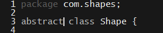

# 20.2 Lesson Plan - Thinking Deeply About OOP

### Overview

Today's lesson will give students more practice with Java's OOP tools, and introduce object-oriented design best practices.

`Summary: Complete activities 9-14 in Unit 21`

### Instructor Objectives

After today's lesson, students should be able to:

* Implement abstract class hierarchies using classes;

* Articulate the benefits of encapsulation;

* Use classes and interfaces to separate implementation from interface;

* Use interfaces to describe the behavior of a set of classes.

### Instructor Notes

* The focus of today's lesson is to introduce students to the basic principles of object-oriented program design. Today's material is abstract and potentially challenging, so we introduce minimal new syntax.

* Have your TAs refer to the [Time Tracker](02-Day-TimeTracker.xlsx) to stay on track.

- - -

#### Class Objectives

After today's lesson, students should be able to:

* Design and build class hierarchies in Java;

* Use interfaces to describe behavior;

* Articulate the value of coding to an interface.

#### Key Terms

* Data and Behavior

* Fields and Methods

- - -

### 1. Instructor Do: Thinking About Classes (0:15)

- - -

**Objectives Met**

- - -

* Remind students that the last activity of their previous class required them to implement a Student Class, and that using classes to build our programs is a basic practice of object-oriented programming (OOP).

* Remind students that classes provide us with a powerful way to organize our code.

  * Explain that, while powerful, class-based design is not trivial.

* Explain that today's class will introduce some basic design principles for students to keep in mind when designing object-oriented systems.

  * Explain that these principles are language-agnostic. Students can, and should, apply them to programs written in Java; Python; or any other object-oriented language.

* As a review, explain that:

  * Object-oriented programming is predicated on the idea that software systems should be decomposed into their constituent units of functionality.

  * These units of functionality, which we might think of as _modules_, can then be used as "building blocks" to construct the system.

  * The idea is that this allows us to write better-organized code that is intrinsically easier to modify and maintain than unstructured programs.

* Refer to the`Student` class they built last class.

  * Ask a student to explain what makes any one `Student` different from any other.

    * Their names, email, address, etc. &mdash; the value of the _fields_ we declare on the class.

  * Ask a student to explain what all `Student`s have in common.

    * `Student`s are identical with regard to the methods we can call on them.

* Explain that this points out an essential characteristic of all objects.

  * Objects have certain values associated with them, which differentiate them from other objects of the same class.

  * Objects have certain behaviors associated with them—their **methods** &mdash; which they have in common with other objects of the same class.

  * Classes are a blueprint of sorts, which allows us to define the ways objects of a given class will look in general, and how they will be similar or different to one another.

    * **Fields** are (generally) configurable attributes that will (generally) be different between objects.

    * **Methods** are consistent across instances of a class.

    * In other words &mdash; data can be different, but behaviors on that data will be the same.

* Remind students that this can all be summarized thus: "Classes are a tool for associating **data** with **behavior** by way of a 'blueprint'."

  * Reiterate that fields represent data, and methods represent behavior using that data.

  * Refer to the  `Student` class for an example. The student's `firstName`, `lastName`, etc., are _data_. The `report` method, which prints the data, is a _behavior_ on that data.

* Point out that a natural question that arises is that of how one should best organize data and behavior.

* Remind students that classes afford the additional benefit of allowing us to keep some data and behavior private, and expose only the ones we choose to make public.

  * Explain that the advantage is that we can use private methods and data to produce _public_ results, but have the freedom to change the private method without affecting client code.

  * Consider the Heap data type, for example.

    * Explain that a Heap is just a data type with a special sort of ordering.

    * Explain that heaps can be represented as arrays with structural invariants, or as graphs.

    * If we create a Heap data type that people can use in their programs, we _don't_ want them to rely on us using an array or a graph.

      * Both can guarantee the heap invariant. But, if we start out using an array, and eventually decide to use a graph because we realized it's more efficient, any code that relied on our implementation being based on an array will break.

      * This is one reason we want to hide implementation details: It affords greater flexibility.

* Explain that today's class will explore both of these issues in detail.

### 2. Students Do: Designing Shape Classes  (0:15)

* Zip and slack out [09-Stu_Shapes/Unsolved](../../../../../01-Class-Content/21-regionalized-content/Java/01-Activities/09-Stu_Shapes/Unsolved), and instruct students to unzip it somewhere on their computers.

* Before starting the clock, briefly explain that Java allows you to define variable declarations `final`.

  * For example: `private final int age`.

  * Explain that a variable declared `final` can only be assigned to _once_.

    * E.g., if we assign: `private final int age = 22`, it is an _error_ to write `age = 23` after.

    * Explain that it's best practice to declare variables `final` by default, unless it becomes clear there's a good reason for them to be mutable.

* Slack out the following instructions to students.

* **Instructions**:

  * Your task for this activity is to build two classes: `Triangle` and `Square`. We'll assume that our classes are all "regular" shapes &mdash; i.e., their sides are all the same length. Users should be able to call three—and only three—methods on each shape: `area`, `perimeter`, and `getSides`.

  * Each class should have a field, called `sideLength`, which records the length of its sides. Should this field be `static`? Should it be `private` or `public`?

  * Each class should have a field, called `sides`, which keeps track of how many sides it has. Should this field be `static`? Should it be `private` or `public`?

  * Each class should have a method, called `area`, which uses the shape's side length to calculate its area. Feel free to Google the formula.

  * Each class should have a method, called `perimeter`, which uses the shape's side length to calculate its perimeter. Feel free to Google the formula.

  * When you're done implementing, execute the `run.sh` script (`bash run.sh` on mac) to make sure everything works as expected.

  * Take a look at the `getHeight` method in your `Triangle` class. Should this be `private` or `public`?

  * Take a moment to think about your solutions. Is there anything unsatisfying about them? What would be better than what you have?

### 3. Instructor Do: Review Activity  (0:10)

* Open up [09-Stu_Shapes/Solved](../../../../../01-Class-Content/21-regionalized-content/Java/01-Activities/09-Stu_Shapes/Solved).

* Ask a student to explain how they declared their `Square` and `Triangle` classes' instance variables.

  * They should declare `sideLength` as a `private final int`. This is not `static` because it changes from shape to shape.

  * Explain that, in this case, we should declare `sides` as a `static` variable. All `Square`s will have 4 sides, and all `Triangle`s will have 3 sides. This is a property of the _class_, not any individual object.

    * Emphasize that the number of sides that a `Square` or `Triangle` has is a property of `Square`s or `Triangle`s, generally—this is what is meant by `static. But, any given`Square\` probably has a different side length than any other—this is what is meant by an _instance property_.

* Ask a student to explain their implementation of the `Square` class's `area` and `perimeter` methods.

* Ask a student to explain their implementation of the `Triangle` class's `area` and `perimeter` methods.

* Ask a student whether `Triangle.getHeight` method should be `public` or `private`.

  * Explain that it should be `private`. Remember, our spec said that both Shapes should only expose three methods: `area`, `perimeter`, and `getSides`.

    * Since our API doesn't include `getHeight`, we shouldn't expose the method.

    * This is a (minor) example of implementation hiding. People who use a `Triangle` know that they can get its area, but don't know anything _for certain_ about how that area is calculated.

* Ask a student if they see anything suboptimal with these solutions.

  * Point out that `Triangle` and `Square` have the same API and the same fields. People who use a `Triangle` expect to be able to call the same methods on a `Square`, because both are shapes exposing the same methods.

    * Point out that, if we add a method to `Triangle`, we have to add it to `Square`, as well.

    * Remind students of how easy it can be, especially on large teams, to forget to adhere

  * Point out that these classes differ only in the details of how their `area` and `perimeter` methods are _implemented_.

* Explain that it would be better if we could put everything they have in common in one place, and keep only the methods that are different in the `Triangle` and `Square` classes.

### 4. Instructor Do: Subclasses & Extends (0:15)

- - -

**Objectives Met**

* Students should be able to use `extends` to define subclasses

* Students should be familiar with the term **polymorphism**

- - -

* Explain that Java allows us to define classes that **inherit** from other classes.

  * Explain that, if a `Person` class has public `getFirstName` and `getLastName` methods, a `Student` class that inherits from `Person` would _also_ have public `getFirstName` and `getLastName` methods.

* Explain that classes that inherit from other classes are called **subclasses**.

* Explain that, to create a subclass, we use the `extends` keyword.

  * Open up your [10-Ins_Subclasses-Demo/com/examples](../../../../../01-Class-Content/21-regionalized-content/Java/01-Activities/10-Ins_Subclasses-Demo/com/examples).

  * Open up `Animal.java`.

* Explain that we have an `Animal` class, which contains `move` and `feed` methods.

  * Briefly point out that _all_ animals can move and all animals have to feed.

_Methods that will be common to all Animal objects._

* Next, open [10-Ins_Subclasses-Demo/com/examples/Dog.java](../../../../../01-Class-Content/21-regionalized-content/Java/01-Activities/10-Ins_Subclasses-Demo/com/examples/Dog.java)

  * Explain the `class Dog extends Animal` clause.

    * Explain that this means `Dog` is a **subclass** of `Animal`.

      * Explain that `Animal` is called the **superclass** of `Dog`.

      * Explain that this means `Dog` has access to the fields and method on the class it `extends`.

        * So, even though our `Dog` only defines `bark` and `howl` methods, we can call `move` and `feed` methods on our `Dog` &mdash; because these are behaviors shared by all `Animal`s.

      * Open up `Animal.java`, and point out that its `feed` method sets `this.fed = true`. This means that, when we call `feed` on a `Dog`, its `fed` field will be set to `true`.

      * Explain that, in Java, a given class can only have one superclass.

    * Explain that, in `Dog`'s constructor, we can call the superclass's constructor with `super`.

      * Ask a student to explain what this might do in our particular case.

        * Explain that, in this case, it sets the `name` field in `Animal` to the value we pass it from `Dog`.

        * Emphasize that it's just a special type of function call.

_Dog extends Animal._

* Briefly, open [10-Ins_Subclasses-Demo/com/examples/Cat.java](../../../../../01-Class-Content/21-regionalized-content/Java/01-Activities/10-Ins_Subclasses-Demo/com/examples/Cat.java)

  * Point out that it also `extends Animal`, and only defines `meow` and `purr` methods.

_Our Cat class._

* Open up [10-Ins_Subclasses-Demo/com/examples/Test.java](../../../../../01-Class-Content/21-regionalized-content/Java/01-Activities/10-Ins_Subclasses-Demo/com/examples/Test.java).

  * Point out that we can, in fact, instantiate a `Dog` can call its `move` and `feed` methods.

  * Point out that we can instantiate a `Dog` or a `Cat` as an `Animal`.

_Instantiating a Dog and Cat as an Animal._

* Explain that we can always instantiate a subclass as an instance of its superclass.

* This is because a `Dog` is-a(n) `Animal`, and a `Cat` is-a(n) `Animal`, so it makes sense to be able to instantiate them as such.

* Explain that using the superclass to instantiate subclasses is called **polymorphism**.

  * Explain that this is just a fancy way to say that an `Animal` object can come in "many shapes" &mdash; i.e., it can be a `Dog`, or a `Cat`, or anything that `extends Animal`.

  * Emphasize that this is an important word in the world of object-oriented programming &mdash; students should be familiar with this word for interviews.

  * Reassure them that this isn't critical knowledge right now.

* Run the `runtest.sh` script, and demonstrate that everything works as expected.

  * In particular, point out that, even though we instantiated `buddy_two` and `fluffy` as `Animal`s, Java still knew which subclass they belonged to.

    * This illustrates that objects declared as `Animal`s can come in "many shapes."

### 5. Partners Do: Re-architecting Shapes  (0:30)

* Zip and slack out the [11-Stu_Subclasses/Unsolved](../../../../../01-Class-Content/21-regionalized-content/Java/01-Activities/11-Stu_Subclasses/Unsolved) folder for this activity.

* Slack out the following instructions:

  * **Instructions**:

    * Think back to your `Triangle` and `Square` class. What did they have in common? What **class** of object are `Triangle` and `Shape`?

    * Create a class that "wraps up" the fields and methods that `Triangle` and `Class` had in common. What should you call this? Don't make these fields `private`.

    * What fields and methods in `Triangle` and `Square`, if any, are unique to each class? In other words, are there any fields or methods on `Triangle` or `Square` that you can't put in your new superclass?

    * If so, rewrite your `Triangle` and `Square` methods such that they _only_ contain fields and methods unique to them.

    * When you're done, run your `runtest.sh` script, and make sure everything works as expected. Feel free to open up `Test.java` to play with things, yourself.

    * When you're finished, take some time to discuss your solution with your partner. Is this the best you can do?

    * As a matter of fact, there _is_ a way to extract _all_ the functionality in `Triangle` and `Square` into a single class. What do you need to do to accomplish this? How would you distinguish between a `Triangle` and a `Square`? You don't have to implement this solution on your own &mdash; just think about it, and be prepared to share your thoughts with the class.

### 6. Instructor Do: Review Activity  (0:10)

* Open up your [11-Stu_Subclasses/Solved](../../../../../01-Class-Content/21-regionalized-content/Java/01-Activities/11-Stu_Subclasses/Solved).

* Ask a student to explain what superclass they wrote for `Triangle` and `Square`.

  * You're looking for either `Shape` (expected) or `Polygon` (better).

* Ask a student to explain what fields they put in the `Shape` class.

  * They should have moved the `static sides` and member `sideLength` variables to the `Shape` superclass.

_Moving common fields to Shape.java._

* Point out that the solution uses the `protected` modifier instead of `private`.

  * Explain that `private` _really means_ private. If we declare a field `private` in `Shape`, we can't access it in `Triangle`.

  * Explain that `protected` is like `private`, with the one difference that **subclasses also have access**.

    * So, if `private` means, "no one can see this but me", `protected` means, "no one can sees but me **and my children**."

* Ask a student to explain what methods they put in the `Shape` class.

  * They should have moved the `perimeter` and `getSides` methods into the `Shape` class.

_Moving common methods to Shape.java._

* Ask a student to explain what methods they kept in the `Square` and `Triangle` classes.

  * They should have kept `area` in these classes.

  * Ask a student to explain why this makes sense.

    * Explain that these belong in the subclasses because **each uses a different implementation**.

_The area implementation for Square—different from that of Triangle._

_The area implementation for Square—different from that of Triangle._

* Open up your solution [11-Stu_Subclasses/Solved/com/shapes/Shape.java](../../../../../01-Class-Content/21-regionalized-content/Java/01-Activities/11-Stu_Subclasses/Solved/com/shapes/Shape.java), and briefly talk through how it hits each of these points.

* Point out that, even though both our `Triangle` and our `Square` implement `area` differently, we might still want to specify that each _should_ have an `area` method.

  * After all, all 2D shapes have an area, so it would make sense for us to enforce that all `Shape`s have an `area` method.

* Explain that Java lets us do this with `abstract` methods.

  * Explain that an `abstract` method is one that doesn't have an implementation, but that subclasses are _required_ to implement.

    * If they don't implement `abstract` methods in their superclass, the compiler will complain.

* Add an `abstract double area ();` declaration to `Shape.java`.

_An abstract area method._

* Explain that, if we put `abstract` methods in a class, we also have to mark the class as `abstract`.

_Marking the Shape class abstract._

* Explain that this is how we force anyone extending `Shape` to put an `area` method in their subclass.

  * Point out that the fact that this is an `abstract` method allows them to implement however they want—one way for a `Triangle,` one way for a `Square`.

  * Optionally, delete the `area` method from `Triangle` and try to compile everything: `javac -cp ../../ *.java`. This demonstrates the compiler error.

* Optionally, add an `@Override` annotation to the `area` method in `Triangle` or `Square`.

  * Explain that this is a way to tell Java that this method lives in the superclass.

    * Explain that we don't _need_ to do this, but if we do, the compiler will make sure we define the method with the right return type and parameters.

    * Explain that "messages to the compiler" like this are called **annotations**.

    * Reassure students that they don't have to remember how to use the `@Override` annotation &mdash; they just have to know it exists, as it's common in other people's code.

_Adding an @Override annotation to a method._

* Zip and slack out [11-Stu_Subclasses/Solved](../../../../../01-Class-Content/21-regionalized-content/Java/01-Activities/11-Stu_Subclasses/Solved) for student reference.

- - -

### 7. BREAK (0:15)

- - -

### 8. Instructor Do: Describing Behaviors with Interfaces (0:10)

**Objectives Met**

* Students should be able to use interfaces to define APIs

- - -

* Point out that our abstract `Shape` class provides behavior for classes that extend it &mdash; our `Square` class gets a `perimeter` method for free, for example.

  * Explain that this is called **implementation inheritance** &mdash; subclasses _inherit_ an implementation of `perimeter`.

* Point out that the `Shape` class also functions to _describe_ its subclasses with the abstract method `area`.

  * `Shape` doesn't provide an implementation of `area`, but it does tell users that their subclasses _must_ have an `area` method.

* Point out that `Shape` does two things.

  * By defining an `area` method signature but not implementing it, in some cases, it tells us _what behaviors its subclasses should have_.

  * By implementing methods like `getSides` and `perimeter`, in other cases, it tells us _how its subclasses behave_.

* Explain that Java has a tool that lets us _only_ define what behaviors a subclass should have, _without_ providing _any_ implementations.

  * Explain that these tools are called _interfaces_.

  * Explain that they allow us to define what an object will look like, and what behaviors it will have, but let us define the specifics in our subclasses.

    * Explain that this flexibility can be useful when working with classes like `Square` or `Triangle`.

* Explain that an interface is effectively just a list of things you can do with an object.

  * The interface for our `Triangle`, for example, includes the following methods:

    * `area`, defined on `Triangle`;

    * `getSides`, defined on `Shape`;

    * `perimeter`, defined on `Shape`.

  * Point out that the interface for `Triangle` _does not_ include `getHeight`, because this is `private`.

* Open up [12-Ins_Interfaces-Demo/com/examples/Animal.java](../../../../../01-Class-Content/21-regionalized-content/Java/01-Activities/12-Ins_Interfaces-Demo/com/examples/Animal.java) in 3-Interfaces.

  * Explain that this is the version of `Animal` we had before.

  * Point out that `AnimalOld` has a `name` field.

  * Point out that, while an animal _can_ have a `name`, not _all_ animals do.

    * Point out that, from a modeling perspective, putting a `name` field on an Animal class isn't good practice.

  * Point out that only _pets_ have names. So, we might want to put `name` in a class called `Pet`, and extend from that.

    * Remind students that we can only have one parent class, so this isn't an option in Java.

    * Explain that this is one of the problems interfaces solve.

  * Delete the `name` field and constructor from `Animal.java`.

* Open up [12-Ins_Interfaces-Demo/com/examples/Pet.java](../../../../../01-Class-Content/21-regionalized-content/Java/01-Activities/12-Ins_Interfaces-Demo/com/examples/Pet.java).

  * Point out that `Pet` is declared with the keyword `interface`, _not_ class.

  * Point out that `Pet` contains the field `name`, just like any class could.

  * Point out that `Pet` contains the abstract method `cuddle`.

    * Explain that interfaces _can only contain_ abstract methods, but that we don't need to mark them `abstract`. Since they _have_ to be abstract, Java doesn't need to be told.

    * Point out that we (unfortunately) can't list the fields an object should have in an interface. But, we can specify behaviors that imply the existence of certain fields, as we've done in `Pet` with `name`.

* Our Pet interface, with getName (implying there is a `name` field) and cuddle method

* Next, open up [12-Ins_Interfaces-Demo/com/examples/Dog.java](../../../../../01-Class-Content/21-regionalized-content/Java/01-Activities/12-Ins_Interfaces-Demo/com/examples/Dog.java).

  * Point out that we still extend `Animal`, but now we also implement Pet.

    * Explain that `implements` just means: "I guarantee that this class has all of the fields and methods you mentioned in Pet.java."

  * Point out that we've added a `private final String name` to `Dog`.

  * Point out that we've also added a `cuddle` method to `Dog`.

_Our updated Dog class, which now implements the Pet interface._

* Open up [12-Ins_Interfaces-Demo/com/examples/Cat.java](../../../../../01-Class-Content/21-regionalized-content/Java/01-Activities/12-Ins_Interfaces-Demo/com/examples/Cat.java), and demonstrate that we've added the same field and method there.

_Our updated Cat class, now implementing the Pet interface._

* Reassure students that it's okay if this feels uncomfortable to them. This is all pretty abstract, and takes some getting-used-to.

  * Take a moment to answer student questions.

* Open up [12-Ins_Interfaces-Demo/com/examples/Test.java](../../../../../01-Class-Content/21-regionalized-content/Java/01-Activities/12-Ins_Interfaces-Demo/com/examples/Test.java), and demonstrate that we still write our client code the same way.

  * Point out that there's one potential difference: Now, we can instantiate a `Cat` or `Dog` as a `Pet` _or_ an `Animal`.

  * Explain that objects are considered subclasses of the interfaces they implement, as well as the classes they extend.

  * Explain that this gives us great flexibility in defining our objects, because we can implement as many interfaces as we want, but only extend one superclass.

  * Remind students that this is called **polymorphism**—a `Pet` can be either a `Cat` or a `Dog`.

  * Point out that `cuddle` is implemented identically in both `Cat` and `Dog`.

    * Ask a student if this is optimal.

      * Ask them to explain why.

    * Point out that it would be a bad idea to put it into `Animal`, so we can't solve the problem that way.

    * Explain that, since we refer to `this.name` in the `cuddle` method, we can't put it into the interface.

      * The easiest way to help students understand why is to point out that _any_ class can implement `Pet`, but not all of them necessarily have a `name` attribute.

    * Explain that this is an intrinsic limitation to using interfaces in Java.

    * Explain that, if we _don't_ use a `this` reference, we actually _can_ put the method in the interface by using the `default` keyword.

      * Change the `cuddle` method to simply print `"Cuddle cuddle!"`, and add it as a default method in `Pet`.

      * Compile and run your code to demonstrate that it works just as before.

_Using polymorphism to initialize a Dog and Cat as Pets._

_Java 8 allows us to define default methods in interfaces._

* Acknowledge that interfaces can be difficult to understand at first.

  * Reassure students that this is the kind of thing that becomes intuitive with time and experience. The important thing right now is to understand the syntax and _think_ about these design issues as you code. Finding the "right answer" or implementing the "right design" isn't the point at this stage.

### 9. Everyone Do: Interface Case Study (0:15)

* Explain that the easiest way to understand interfaces, and object oriented design in general, is reading good examples of it.

  * Where better to start than Java itself?

* Explain that we'll take fifteen minutes to discuss some interfaces used in the Java language.

* Explain that a "collection" is any data structure that you can put multiple objects in.

  * Explain that Java defines a _lot_ of collections—it has ArrayLists, Sets, HashMaps...

  * Point out that all of these collections have certain things in common—like the ability to add elements, or check for emptiness—but that each collection does these things differently.

    * Point out that an ArrayList would insert an item differently than a HashMap would.

    * Explain that this is why a collections _interface_ makes more sense than a collections _superclass_.

* Open up the documentation for the [Java Collections interface](https://docs.oracle.com/javase/7/docs/api/java/util/Collection.html), and scroll down to the **Method Summary**.

  * Choose a few methods on the list, and further discuss why it makes sense to specify them in an interface rather than implement them in a superclass.

    * Have students compare the behavior of `ArrayList` and `Hashmap` (which they know about), and `Set` (which they don't).

      * Briefly explain that a `Set` is just a "bag" of unique items. It can contain unique objects, and have a size, but those objects **are not ordered**.

  * As an example, ask students to discuss why `ArrayList` and `HashMap` can't have the same `add` method.

    * Discussion is more important than correct answers. But, before moving on, tell students that it's because an `ArrayList` just adds the item to an array, whereas `HashMap` has to keep track of an _association_. Both data types can add elements, but have to do so in intrinsically different ways.

  * What about `clear`? `size`?

    * `ArrayList` and `Set` remove a single object reference. A `HashMap` has to remove both a key _and_ an associated value.

    * `ArrayList` and `Set` just return the number of items they contain. A `HashMap` returns the number of key/value pairs, which is _not_ the number of objects "inside" of it (it's half that number).

  * Feel free to discuss other interfaces, as well. Consider reviewing the [List interface](https://docs.oracle.com/javase/8/docs/api/java/util/List.html), which implements `Collection`.

### 10.  Partners Do: Design Printable and DatabaseService Interfaces (0:30)

* Slack out the following instructions to students.

* **Instructions**:

  * This activity will give you some experience designing and implementing interfaces. Consider the class of items you can print. This includes books and magazines, but might also include web pages and PDFs. As a designer, do you want to consider _all_ printable items? Or do you want to restrict yourself to only one subset? Can you account for the behavior of both? In a real project, requirements will define boundaries, but for now, draw them based on what you think is possible.

  * Once you've got a working list of things you can print, come up with some methods that each of them should have.

  * Collect these methods into an interface called `Printable`.

  * Once you're satisfied with your `Printable` interface, choose some of the classes you thought of earlier, and make them implement `Printable`. Instead of implementing each method, just comment out what each might do in pseudocode. Does it look like each of your classes will implement their `Printable` methods uniquely? Discuss with your partner whether interfaces seem like a useful approach, here. If not, can you think of any alternatives?

  * You'll have to switch gears a bit for the next part of this activity. Take a moment to discuss what an Object Relational Mappers (ORM) is with your partner. To refresh your memory, they're tools that let you talk to _any_ database. Sequelize, for example, lets you use MySQL; PostgreSQL; or MongoDB.

  * Obviously, MySQL, PostgreSQL, and MongoDB are each very different tools—otherwise, people wouldn't make such a big deal about choosing between them! The advantage to a tool like Sequelize is that it lets us use each of them without worrying about the individual details. In other words, Sequelize defines a(n) common **\_** for interacting with _any_ database (fill in the blank).

  * Imagine you're in the early stages of building such an ORM. You want your users to be able to use a single set of methods to talk to any database they'd like. What Java tool do you use to specify these methods?

  * Let's call your specification a `DatabaseService`. Create a file for it; declare it properly; and brainstorm some methods you think belong on this service. You'll probably want to be able to `add` or `insert` items, for instance. What else? Don't worry about coming up with _everything_. Just get a few good examples down. Be prepared to discuss your choice of methods with the class!

### 11. Instructor Do: Review Activity (0;10)

* Ask a group to explain what different classes they could come up with that you might be able to print.

  * Our examples are `Book` and `PDF`, but there are obviously many possible answers.

  * We chose these to demonstrate the wide variety of "printable objects".

    * Point out that the fact that there are so many things that are `Printable` helps clarify another reason that interfaces are useful. It just wouldn't make sense for a `Book` and a `PDF` to share a superclass just because you can print both of them.

    * Emphasize that interfaces are useful for defining _common behaviors_ amongst _unrelated objects/classes_.

* Ask a group to explain what methods they put in their `Printable` class.

  * Our examples include `print`; `getPageCount`; and `renderForPrinting`. But students will have some excellent alternatives.

* Ask a group to explain if their example classes would implement their `Printable` methods uniquely.

  * Our examples would, but this is by design. Students might have good examples of common implementations.

    * In this case, good solutions might include:

      * Using patterns like mixins (in JavaScript);

      * Using language features that allow you to implement interfaces that hold state, like traits in Scala or Groovy; or

      * If possible, redesigning your class hierarchy such that your common behaviors _can_ logically be extracted into a superclass.

    * Students aren't expected to come up with these particular answers, but they're available for you to refer to if the discussion calls for it.

* Ask a group to answer the Sequelize question: Sequelize defines a(n) **interface** for interacting with databases.

  * API is a fine alternate answer. If someone uses this answer instead, commend the response, and point out that the terms "interface" and "API" are often used interchangeably.

* Ask a group to answer the first `DatabaseService` question:

  * What Java tool do you use to specify \[the methods of an ORM]? | The `interface`.

* Ask a few groups to explain what methods they included on their `DatabaseService` interface, and why.

  * More importantly, ask a few groups to explain the logic as to why this should be an interface.

  * The reason is that `DatabaseService` specifies a set of behaviors that a tool should have. But, because the tool will have to talk to MySQL, _or_ PostgreSQL, _or_ MongoDB, etc., its implementation will have to change based on which database its configured to talk to.

  * **This is the most important point for students to understand**. Try to ensure that at least three groups are able to articulate this logic to you.

* After reviewing the exercise, congratulate students on having made it through a tough lesson.

  * Point out that, while OOP is popular enough that we often take it for granted, it really is a nuanced subject.

  * Remind students that the purpose of today's lesson was both to introduce new, essential Java syntax, and introduce some fundamental ideas and best practices of OOP design philosophy.

  * Encourage students to think about these design problems _every time_ they have to build a new application. The brief questions and guidelines in [Supplements/ThingsToRemember.md](Supplements/ThingsToRemember.md) are useful starting points at this stage.

  * Remind students that today's lesson introduced the [Supplements/FourPrinciplesOfOOP.md](Supplements/FourPrinciplesOfOOP.md), which can be important for interviews and reading more about OOP.

    * Emphasize that it's really more important to understand the concepts than know the lingo.

    * But, point out that the vocabulary is easy to remember, so it's worth reviewing from time to time.

  * Remind students that the real advantage to learning principles of design is the fact that they can use them in _any_ language, on _any_ project.

    * Point out that JavaScript doesn't have classes the same way that Java does.

    * Point out this means we can't build class hierarchies or use interfaces the same way.

    * But, point out that we _can_ apply other principles &mdash; we can create and compose small, highly specialized objects to build big systems out of small pieces and we can use prototypes to share methods, for example.

    * Finally, point out that most other languages students will use later &mdash; Python, Ruby, PHP, C#, etc. &mdash; have classes very similar, if not identical, to Java's. In these languages, they can apply these principles _directly_.

      * Emphasize that students should feel particularly empowered to be grappling with this material at this stage. Reassure them that, while it's hard now, they _will_ master it; and when they do, it will be a skill that they will apply in _all_ of their languages, and on _every_ project.

* Take a moment to answer any outstanding questions before dismissing class.

### Lesson Plan Feedback

How did today's class go?

[Went Well](http://www.surveygizmo.com/s3/4325914/FS-Curriculum-Feedback?format=pt&sentiment=positive&lesson=21.02)

[Went Poorly](http://www.surveygizmo.com/s3/4325914/FS-Curriculum-Feedback?format=pt&sentiment=negative&lesson=21.02)
