# 20.3 Lesson Plan - Loose Ends & More on Design

### Overview

Today's lesson plan will introduce students to additional essentials of core Java and design—specifically: Error handling and Exceptions; Generics; and Immutable classes.

`Summary: Complete activities 14 - 19 in Unit 21`

##### Attention: If you’re teaching a part time section and this isn’t a Saturday, please use the “Weekday” tab inside of the "03-Day-TimeTracker.xlsx" for activity lengths instead of those printed on this lesson plan

### Instructor Objectives

### Instructor Notes

* Have your TAs refer to the [Time Tracker](03-Day-TimeTracker.xlsx) to stay on track.

#### Class Objectives

After today's lesson, students should be able to:

* Preempt and recover from checked exceptions;

* Specify a method's checked exceptions;

* Implement immutable classes;

* Use assertions to design code by contract.

- - -

### 1. Instructor Do: Exceptions & Error Handling (0:20)

* Point out that students have now seen a substantial amount of core Java.

* Explain that one important point we have yet to cover is that of error handling.

  * Point out that it's common for programs to run into problem conditions that interrupt execution.

  * Explain that programming languages have tools to allow you to _catch_ problems when they occur, and, if possible, recover from them, and continue on.

* Explain that, in Java, there are two types of "problem conditions".

  * One is called an **error**. Explain that, in Java, errors represent _serious_ problems that you shouldn't bother dealing with &mdash; like, say, the network goes down; the hard drive gets corrupted; or the operating system hiccups for whatever reason. Students won't be programming around errors. To quote the [Java docs](http://docs.oracle.com/javase/7/docs/api/java/lang/Error.html)

    > An Error...indicates serious problems that a reasonable application should not try to catch.

  * The other type of problem condition is called an **exception**. The term comes from the fact that problem conditions are **exception**-al occurrences.

* Explain that Java has `Error` and `Exception` classes specifically for making it easier to deal with such problem conditions.

  * Explain that, whenever an exception occurs, Java creates an object that contains information about what caused it.

    * Explain that, when this happens, your program stops running, and Java looks for a piece of code that knows how to deal with the error information it generated.

    * If it can't find any code that knows how to deal with the error, it kills execution and prints a stacktrace.

* Explain that, if we're proactive, we can identify portions of code where exceptions might occur, and tell Java what to do about it should they occur.

* Open up the [documentation for Exception](https://docs.oracle.com/javase/7/docs/api/java/lang/Exception.html?is-external=true), and scroll down to the **Method Summary**.

  * Reiterate that, when Java creates a bare `Exception`, it includes information about what caused the error.

  * Explain that exceptions can also be created with a `String message` to make them a bit friendlier.

  * Finally, explain that exceptions can also be created with a `Throwable cause`.

    * Explain that `Throwable` is the superclass for `Error` and `Exception`.

      * Basically, a `Throwable` is "anything that went wrong."

    * Explain that, sometimes, one problem can cause another.

      * For example, if the network dies when you're trying to download a picture, it might cause your program to complain that it can't do anything with an empty file. So, a `NetworkError` might cause a `FileEmptyException`.

      * The reason we have the `Exception(String message, Throwable cause)` constructor is just so we can keep track of all the details whenever something goes wrong.

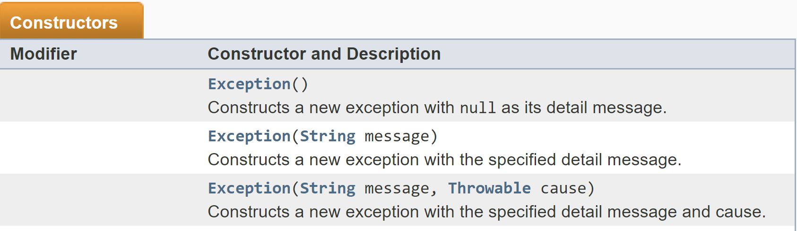

_The three main constructors for the Exception class._

* Explain that we'll next turn our attention to how to actually deal with exceptions.

* Open up [14-Ins_Exceptions-Demo/com/exceptions/Throw.java](../../../../../01-Class-Content/21-regionalized-content/Java/01-Activities/14-Ins_Exceptions-Demo/com/exceptions/Throw.java).

  * Explain that `throw new Exception("Oh no! A disaster!")` tells Java that an exception has occurred, and that it should look for code that knows how to handle it.

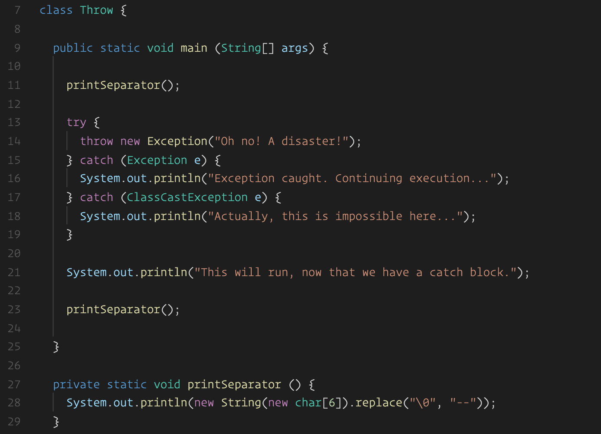

_Manually throwing an Exception._

* Point out that there is no such code in this file.

* Try to compile and run the file via `run.sh`. Point out that Java prevents us from doing so

* Run `Throw.java` via the `run.sh` script, and demonstrate that the exception we threw kills the program.

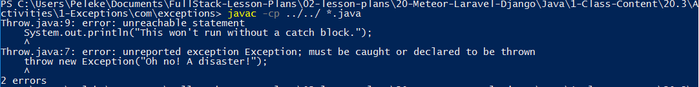

_Note that Java forces us to handle the exception we threw._

* Reopen `Throw.java`, and wrap the `throws` statement in `try`/`catch` blocks.

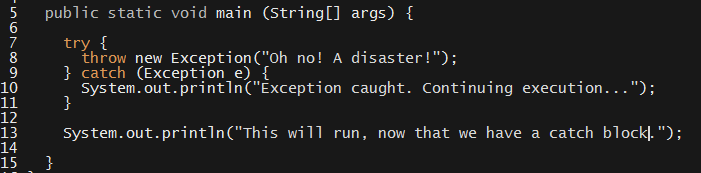

_Handling the Exception with try/catch._

* Explain the syntax of these blocks.

  * Explain that `try { ... }` tells Java: "Run the code inside these brackets. If anything goes wrong, run the code in the `catch` block.

  * Explain that `catch (Exception e) { ... }` tells Java: "If an `Exception` causes a problem, run the code in this block to fix it."

  * In this case, we just print the history of the error (i.e., the stacktrace), and then continue execution.

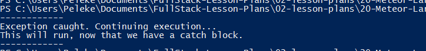

_Nothing special to report—the program executes swimmingly._

* Explain that Java has many different exception types.

  * Explain that we can have several `catch` clauses, each for a different exception.

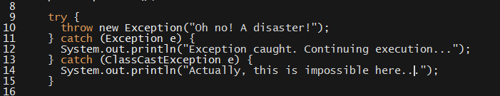

_Catching several exceptions._

* Explain that, if you write code that _might_ throw an `Exception`, Java _requires_ you to wrap it in a `try`/`catch` block.

  * Explain that the compiler will point out exactly which exceptions these are, and exactly which lines you need to catch them on, so students shouldn't be intimidated by the prospect of having to learn them all.

  * When Java tells you what exceptions to catch, you should catch those specific exceptions. In other words, use the specific exception's name in your `catch` block, not `Exception`.

### 2. Students Do: Handling Errors  (0:20)

* Slack out [15-Stu_Exceptions/Unsolved](../../../../../01-Class-Content/21-regionalized-content/Java/01-Activities/15-Stu_Exceptions/Unsolved).

* Slack out the following instructions.

* **Instructions**:

  * You've been provided a `Polygon` class, which you instantiate by passing a number of edges and a side length: `new Polygon(vertices, sideLength)`. The class requires that you pass a number greater than 3 for `vertices`, and a nonzero number for `sideLength`.

  * Instantiate a `Polygon` in `Test.java`, and try to call its `area` method. Use the `run.sh` script to run it. What happens? Can you explain why?

  * Wrap the appropriate blocks around your code. Just print to the console for now. The compiler will give you the name of the exceptions you need to catch. In your code, you'll need to put `Polygon.` in front of them. It will look like this: `Polygon.$EXCEPTION_NAME`.

  * Run your code again, and make sure everything works.

  * When you're done, try to print the `Polygon` you instantiated outside of the `try`/`catch` block. What happens? Can you explain why?

### 3. Instructor Do: Review Activity  (0:15)

* Ask a student to explain what happened when they tried to instantiate a `Polygon` class and run their program.

  * They should have gotten a compiler error about an `InsufficientVerticesException` and an `InvalidSideLengthException`.

* Ask a student to explain why this happened.

  * The reason this happened is because `Polygon` _might_ throw either of these exceptions on construction. So, Java _requires_ that we tell it what to do, just in case.

* Ask a student to explain the code they used to suppress the compiler error.

  * They should have used `try`/`catch`/`catch` blocks.

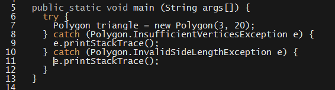

_Handling two exceptions with two catch blocks._

* Explain that `e.printStackTrace` prints information about the error to the console.

* Explain that, since we're handling both exceptions the same way, we can use an alternate syntax to catch _either_ exception with a single `catch` block.

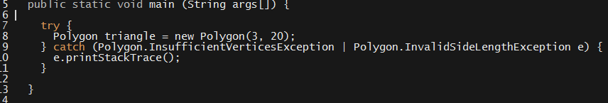

_Using "or" to catch either exception._

* Ask a student to explain what happened when they tried to use their `Polygon` outside of the `try` block.

  * They should get a "cannot find symbol" error from the compiler.

  * Explain that this is because, if the code in the `try` block throws, the `Polygon` _won't_ be initialized &mdash; even if the `catch` block recovers the exception successfully &mdash; so it isn't in scope for the rest of the program.

* Ask a row to hypothesize how Java was able to tell us that there were exceptions we need to account for.

  * Students shouldn't know this yet, so let this be an open-ended question.

  * Explain that we actually have to tell Java if we want compiler warnings like this.

* Open up the `Polygon` class.

  * There's a possibly intimidating amount of code here, but the bulk of it is documentation.

  * Point out that the constructor has a `throws` clause.

    * Explain that, in addition to a return type and parameters, we can declare the exceptions that a function throws.

    * In this case, we declare that the constructor can throw two exceptions. So, whenever we use it, we have to account for both.

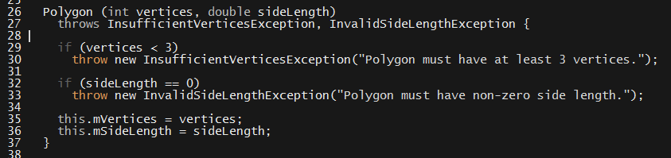

_A throws clause on the constructor._

* Scroll down to the bottom of the class, where the custom exceptions are defined.

  * Point out that we can put classes inside of classes. Explained that these are called **nested classes**.

    * Acknowledge that this looks a little strange at first, but that it's really quite straightforward to use.

    * Explain that we create the class like any other, and can refer to it inside of `Polygon` directly.

    * Explain that, in other classes, we have to specify that these live in `Polygon`. That's why we had to write `Polygon.InvalidSideLengthException` in `Test.java`.

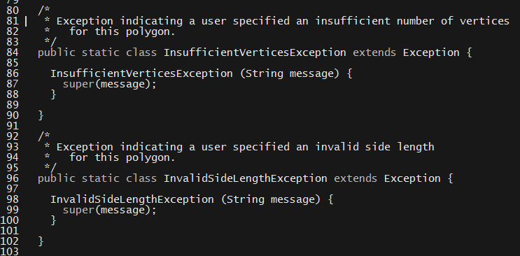

_Custom exceptions in the Polygon class._

* Point out that defining a custom exception is quite straightforward. We just extend `Exception` and override its `String message` constructor.

  * Point out that this lets us use custom exception names without a whole lot of trouble.

  * Explain that we can extend the other constructors if necessary. It often isn't.

* Explain that nested classes are useful for defining classes you _only_ use inside of the class you define them in.

### 4. Everyone Do: Refactor & Checked vs. Unchecked Exceptions (0:20)

* Point out that, in this case, we're referring to the exception both in `Polygon`, _and_ in `Test`.

* Have everyone open up `Test.java`. Explain that one way we can refer to the `Polygon` exceptions directly is to use an `import static` statement.

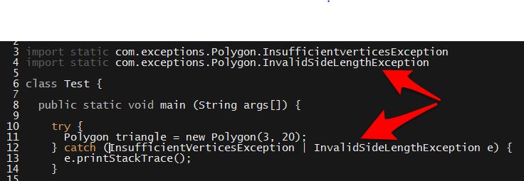

_Using import static to refer to exception nested classes directly._

* Explain that this allows us to refer to `public static` declarations in other classes directly.

  * If we don't `import static`, we'd have to say `Polygon.InvalidSideLengthException`.

* Explain that, in general, it's best to avoid `import static`.

  * Explain that it's it's fine, here, but it can get messy on larger projects.

  * This is because `import static` sometimes results in name clashes.

  * Get rid of the `import static` statements. We won't need them in a moment.

* Explain that we don't _have_ to keep our custom exceptions inside of `Polygon`. If we remove them, we can get rid of the `import static` statements.

* Have everyone open up `Polygon.java`, and scroll down to the custom exceptions.

  * Ask a student how they think we should move these exceptions out. Make sure they know this isn't a trick question, as it's deceptively easy.

  * Explain that all we need to do is move it into its own class, and remove the `static` keyword.

* Explain that, at this point, we can compile and run our program as before.

* Point out that our project will get cluttered pretty quickly if we just leave everything in the same directory like this.

  * Explain that we can create a directory specifically for our exceptions, called `custom`.

* Have everyone follow along through the following steps.

  * Alongside `Test.java`, make this new directory with; `mkdir custom`

  * Move the custom exceptions into this new folder: `mv *Exception.java custom`.

    * Remind students that this creates another **package**, so we'll need to import these exceptions in our `Test` and `Polygon` classes.

  * In both `Test.java` and `Polygon.java`, add this import statement:

    * `import com.exceptions.custom.*`

  * Explain that this imports everything (`*`) in the `com.exceptions.custom` directory.

  * Run the program again, to demonstrate that everything works as before.

* Finally, point out that instantiating a `Polygon` with bad data is really a programming mistake.

  * We can't really `catch` the exception and fix the problem &mdash; it's just up to the programmer not to screw up.

* Because this is the case, we probably shouldn't _force_ programmers to catch the exception. We should just trust that the read the documentation for `Polygon` and know what they're doing.

* Explain that, since we subclassed `Exception`, we created what Java calls **checked exceptions**.

  * Whenever a method throws an exception that subclasses `Exception`, Java requires you to catch it. Since the compiler _checks_ for these, we call these exceptions **checked exceptions**.

* Explain that there's another class of Exception in Java, called `RuntimeException`.

  * Explain that runtime exceptions should be used to indicate the programmer made a mistake. The compiler does _not_ check for these exceptions. So, we call them **unchecked exceptions**.

* Open up your custom exception classes. Ask a student to explain which line of code you need to change to turn these into unchecked exceptions.

  * Simply change `extends Exception` to `extends RuntimeException`.

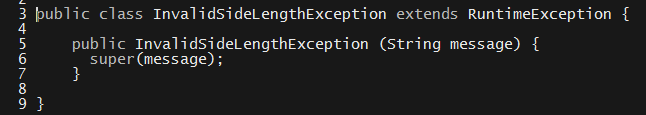

_Extending RuntimeException in our custom exception classes._

* Open up `Test.java` and get rid of the `try`/`catch` block. Demonstrate that the program runs just as before.

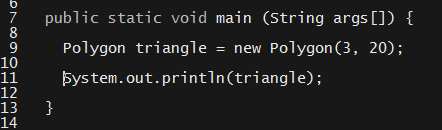

_Removing try/catch after refactoring to subclass RuntimeException._

### 5. Instructor Do: Variadic Functions & Streams  (0:15)

- - -

**Objectives Met**

* Students should be able to create methods with a variable number of arguments.

* Students should be able to articulate the difference between a stream and a collection.

* Students should be able to convert collections to streams with `stream`.

* Students should be able to use `forEach` on a `stream`.

* Students should be able to define a lambda expressions as an argument to `forEach`.

- - -

* Point out that Java's precision can make it feel much "heavier" than more dynamic languages, like JavaScript.

  * Explain that this has its strengths, but that it can be syntactically cumbersome.

* Explain that there are ways to program more "freely". The first thing we'll look at is writing functions that take arbitrary number of arguments.

* Point out that, in JavaScript, we can pass as many arguments to a function as we want.

  * Even if we define a function with two parameters, it's legal to pass more: `function multiply (x, y)` _can_ be called as `multiply(2, 2, 3, 4, 5)`.

  * Point out that, in Java, this engenders a compiler error.

* Explain that Java provides an easy way to define these functions. Open up [17-Ins_Varargs-Demo/com/varargs/Varargs.java](../../../../../01-Class-Content/21-regionalized-content/Java/01-Activities/17-Ins_Varargs-Demo/com/varargs/Varargs.java) to demonstrate.

* Point out the ellipsis (`...`) in the definition of the `greetStudents` method.

  * Explain that this means, "accept an arbitrary number of `String` arguments, and put them in an array called `names`".

    * Point out that this collects them into a raw array, _not_ an `ArrayList`.

  * Also, point out that we can use `final` on the parameter. This means we can't reassign it in the method body. Remind students that using `final` liberally is good practice.

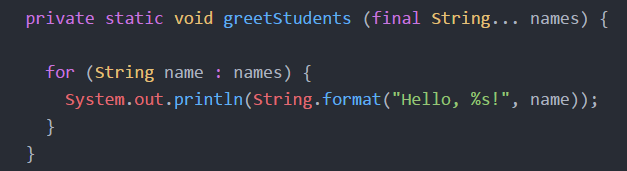

_Defining a variadic function over String._

* Demonstrate the function by calling it in `main` with a list of students' names.

* Point out that, when we define functions like this, we'll generally be doing something with the list that users pass us.

  * Explain that Java also provides special methods for operating on lists.

* Point out that we've used a `for` loop to print the elements of `names`.

* Explain that all `Collections` have a method, called `stream`, which turns the collection into a _stream_.

  * To explain the difference, explain or act out the following scenario:

    * Fill a bag with items. It can be anything &mdash; pens, pen caps, phones, gold nuggets, anything.

    * Hand a student the bag, and have them go through and name each item.

      * Explain that the bag is a collection of things. It's like a `Set` in Java.

      * Explain that naming each item is like using a `for` loop on the `Set`, and calling the `name` function on each one.

    * Now, take the bag back. Hand an individual item to the student, and tell them to name each one.

      * Do this until the bag is empty.

    * Point out that this is different from what we did the first time. Instead of giving the student the `Set`, and having them go through each item, we handed them each item _directly_.

      * This is the difference between a collection and a stream. A collection is a _group of things_. A _stream_ is _a thing at a time_.

    * Point out that, in this case, the student didn't use a `for` loop on the `Set`, and call `name` on each item. Instead, they _just_ called `name` on each item &mdash; someone else took care of looping.

  * Explain that all collections in Java have a method called `stream`, which transforms it from a _collection_ of things to a _stream_.

  * Explain that we first have to import the correct method from Java's `Arrays` package.

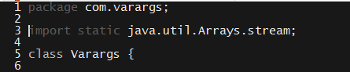

_Importing the stream method from Arrays._

* In `Varargs.java`, change the `greetStudents` method to call `stream` with `names` as its argument.


_Defining a variadic function over String._

* Explain that this turns it from an array to an object called a `Stream`.

  * Explain that all `Stream` objects have a `forEach` method, which lets you call a function on each item individually.

  * Explain that, when using `forEach`, we can pass the function we want to call directly. This is _just_ like passing a callback to a function in JavaScript!

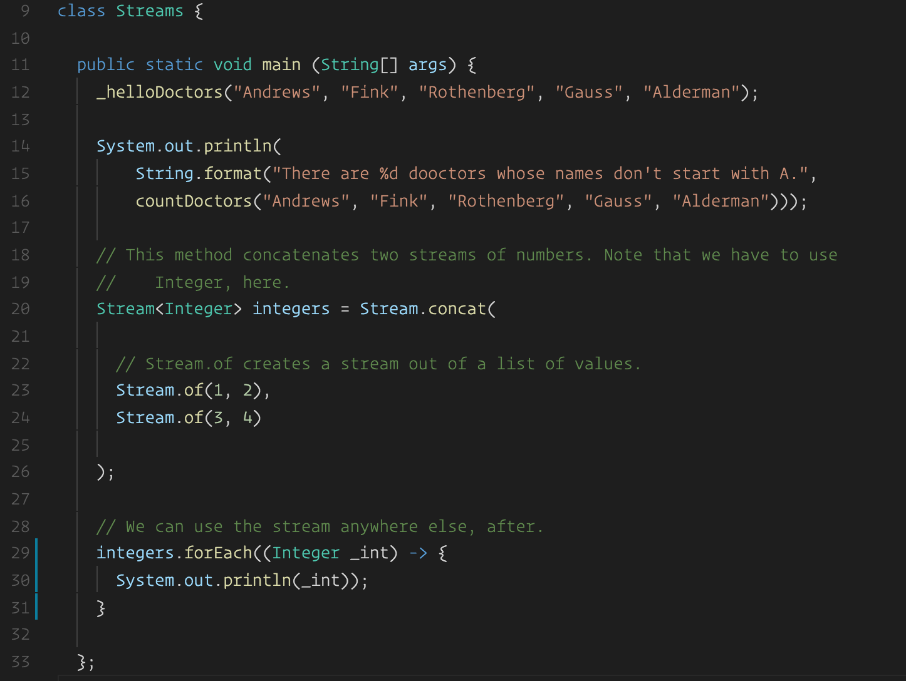

_Using a lambda expression to print each element in names with a call to forEach._

* Explain that Java calls these "callbacks" **lambda expressions**.

  * Explain their syntax:

    * Explain that they consist of a parameter list followed by an arrow: `->`.

    * Explain that we include a method body in braces, just like we would when defining a normal function.

    * Point out that we can get rid of the braces if we want to put the entire expression on one line.

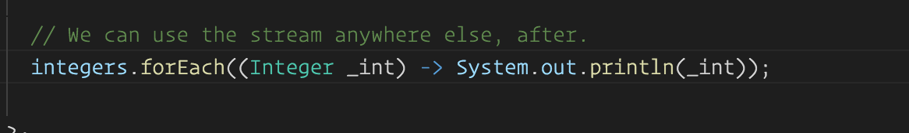

_One-line lambda expression without braces._

* Run the file to demonstrate how everything works.

* Point out that doing all that refactoring just to get rid of a `for` loop is silly.

  * Explain that the real reason for learning this concept is the fact that `Stream` offers a _lot_ of other methods, which we'll take a look at after the next activity.

### 6. Partners Do: Variadic Functions & Streams  (0:15)

* Slack out [16-Stu_Varargs/Unsolved](../../../../../01-Class-Content/21-regionalized-content/Java/01-Activities/16-Stu_Varargs/Unsolved).

* Slack out the following instructions.

  * **Instructions**:

    * Explain the difference between a collection and a stream to your partner. Can you think of when it would make sense to use a stream instead of a collection data type?

    * Create a function that takes an arbitrary number of `String` names and prints each one with the title `"Dr"`. Use a `for` loop.

    * Compile it down and make sure it works. Then, convert it to use a `stream`.

    * Update your function such that it excludes any name starting with the letter `"A"`. Use `String.startsWith("letter")` for this. You should `import java.util.ArrayList` for this.

    * Now you're working with an `ArrayList`. All classes that extend Java's `Collections` interface have a `stream` method that you can call on them directly (e.g., `list.stream()`). Do so, and simply chain your `forEach` call.

    * This demonstrates a useful general point. All Java classes that extend the `Collections` interface have a `stream` method you can call like this. It's a bit cleaner than working with raw arrays.

    * This isn't the most elegant solution available. What's awkward about it?

### 6. Instructor Do: Review Activity  (0:15)

* Ask a group to explain the difference between a collection and a stream.

  * Ask them to explain when it might make sense to use a stream instead of a collection.

  * Explain that this often makes sense if we're unsure of how many items we'll receive, or if the items arrive over time. In either case, we can't use a collection, because we don't have all the items!

* Ask a group to explain how they implemented their `average` method with a `for` loop.

  * Ask the same group to explain how they converted it to use a `stream`.

* Ask a group to explain how they excluded numbers greater than 10 from their averaging routine.

* Show students your [17-Ins_Varargs-Demo/com/varargs/Varargs.java](../../../../../01-Class-Content/21-regionalized-content/Java/01-Activities/17-Ins_Varargs-Demo/com/varargs/Varargs.java) for comparison.

* Point out that it's awkward to use both a `for` loop and a `forEach` call in the same function.

  * Explain that we'll take a look at better methods for accomplishing this sort of thing after the break.

  * Feel free to start the break early.

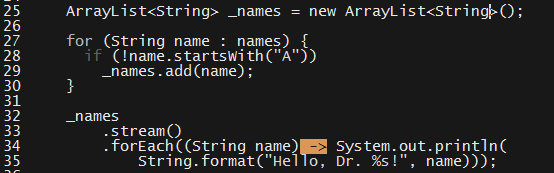

_Using both a for and forEach loop feels a bit awkward._

- - -

### 7. BREAK (0:45)

- - -

### 8. Instructor Do: Stream Methods (0:30)

* **Instructor Note**: This section is largely lecture, hence its designation as an **Instructor Do**. However, do ensure that everyone joins you in writing and running code when you demonstrate new methods.

* Point out that it was a bit awkward to _first_ filter our array, and _then_ loop through it.

  * Return to the bag example from earlier.  Imagine we want to do something with everything that is _not_ a pen.

    * If we use a collection. We must go through the bag; remove the pens; create a new collection from the result; and _then_ do our work.

    * There are a few ways to use it if we use streams. Explain that the most elegant approach requires two students.

      * Explain that the first student will only do _one_ thing: Pass the second student pens, and throw away anything that _isn't_ a pen.

      * Explain that the second student will do the "work"—in this case, count the pens they receive.

      * Point out that, in this approach, the first student passes along a _filtered_ version of the stream.

      * Explain that we can do a similar thing in Java.

* Open up the solution to the last exercise.

  * Get rid of the `for` loop.

  * Chain a call to `filter` after `stream`, and have it check the first letter of each `name`.

    * Explain that `filter` takes a function that returns a boolean. It throws away every element that causes the function to return `false`, and passes along every element that causes it to return `true`.

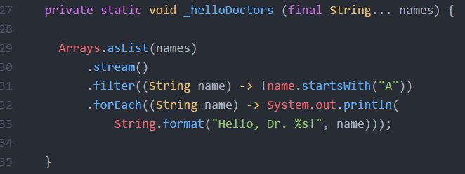

_Filtering a stream._

* Run the file to demonstrate that this does the same thing that our original solution did.

* Explain that `Stream` objects also have a `count` method, which returns the number of items that pass through them.

* Explain that we can use this to count how many doctors names don't start with A.

  * Delete the `forEach` expression and replace it with a call to `count`.

  * Point out that `filter` returns a `Stream`, which is why we can chain our call `count`.

  * Explain that streams can have a _lot_ of elements, which is why `count` returns a `long`.

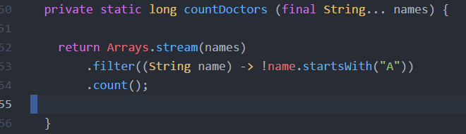

_Counting stream elements with count._

* Point out how much cleaner it is to chain simple stream operations like this than to use bulky `for` loops.

* Explain that there are four major methods on `Stream` objects. The first of these is `filter`, which students have already seen.

* Explain that the second major method is called `map`.

  * Whereas `filter` removes elements from a list, `map` turns each element into something different.

  * In other words, `map` takes a stream as input; do something to each of its elements; and return a new stream with the result.

* Explain that this sounds weird in English, but is straightforward to program with.

  * Explain the updated `helloDoctors` method in [18-Ins_Stream-Methods-Demo/com/varargs/Streams.java](../../../../../01-Class-Content/21-regionalized-content/Java/01-Activities/18-Ins_Stream-Methods-Demo/com/varargs/Streams.java).

    * Point out that one-line lambda expressions don't need braces _or_ a return statement. Java returns the last evaluated expression automatically.

  * Point out that another way to write our `helloDoctors` method is to create a stream of strings that say `"Hello, Dr ${name}!"`, and print each one.

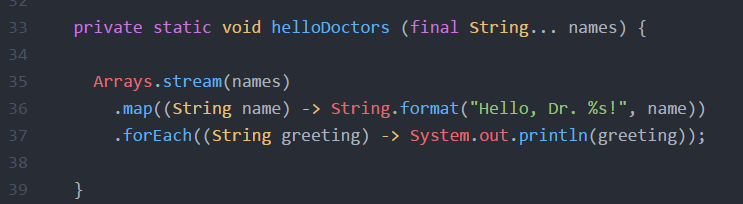

_Using map to create a new String from an old one._

* This can be a challenging concept, so take a moment to discuss some examples. Ask individual students how to write `map` functions that:

  * ...Takes a stream of integers and returns a stream of their squares?

    * `map((int _int) -> _int * _int)` OR `map((int _int) -> Math.pow(_int, 2))`

  * ...Takes a stream of names and returns their capitalized versions? Remind them of `String.toUpperCase`.

    * `map((string name) -> name.toUpperCase())`

  * ...Takes a stream of `Person` objects, each of which has a `String firstName` and `String lastName`, and return a stream of full names?

    ```
    * `map((Person person) -> String.format("%s %s", person.getFirstName(), person.getLastName()))`
    ```

* Explain that the third major method on `Stream` objects is `concat`.

  * Ask a student to explain string concatenation.

  * Point out that concatenation just means to put two things directly together. We can concatenate more than strings.

    * Open your browser console and demonstrate that we can concatenate arrays in JavaScript, for example: `[1, 2].concat([3, 4]) // 1, 2, 3, 4]`

* Explain that we'll often want to put two streams together, and that Java has a method for doing just this.

* Explain the `Stream.concat` example in [18-Ins_Stream-Methods-Demo/com/streams/Streams.java](../../../../../01-Class-Content/21-regionalized-content/Java/01-Activities/18-Ins_Stream-Methods-Demo/com/streams/Streams.java).

  * First, explain that we have to import the `Stream` package, so we can use all of the methods it has to offer.

  * Refer to line 22. Explain that the `Stream.concat` function takes two `Stream` objects; concatenates them; and returns the result.

  * Point out that, in this example, we create two streams directly with `Stream.of`.

    * Explain that this function takes a list of values, and turns them in to a stream.

  * Finally, demonstrate that we can use the stream later, just like any other.

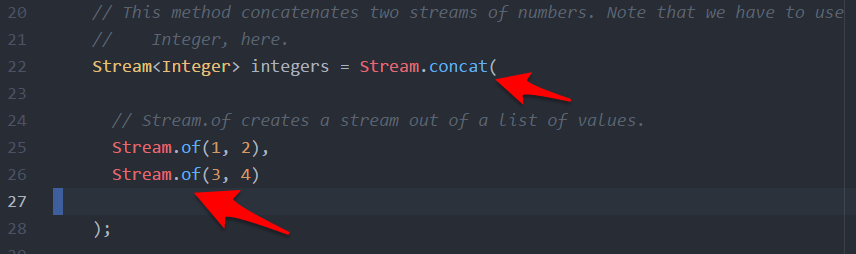

_Creating and concatenating two Streams in-place._

* Point out that this can be useful when you need to collect streams from multiple sources into one.

* Explain that there's only one more major method on streams to learn: `reduce`.

  * Explain that `reduce` can take a bit of practice to grok, so it's okay if students feel uncomfortable with it at first.

* Explain that `reduce` provides a way to _reduce_ a stream into a single value.

* Scroll to the `average` function in `Streams.java`.

* Point out that, while this is fine, it might be nice to do this with streams, instead.

  * Again, we sometimes _have_ to use streams instead of collections, so it's useful knowledge.

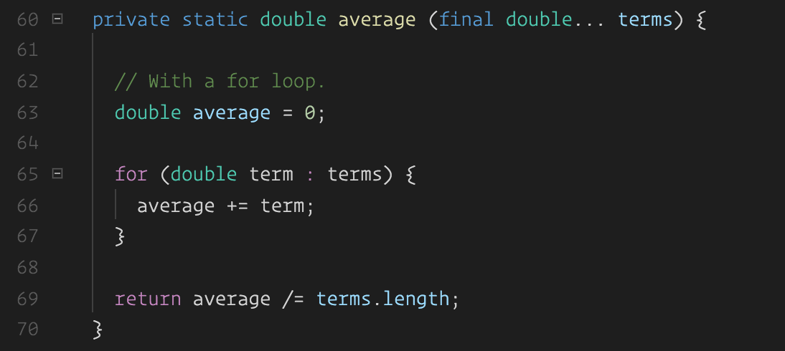

_Finding the average of an array of doubles._

* Explain that taking a list of numbers and turning it into a _single_ average is an example of _reducing_ the list into a _single_ result.

  * That means it's a perfect candidate for the `reduce` operation.

* Scroll down to `_average`. Explain each line.

  * The very first line converts the array into a stream.

  * The second line is the call to `reduce`.

    * Explain that, just like `map` and `filter`, `reduce` looks at each element of the stream one-by-one.

    * Point out that `reduce` receives two parameters: 0, and a lambda expression. Explain the lambda expression, first.

      * Explain that `current` is the element that `reduce` is looking at _right now_.

      * Explain that `total += current` means, "add the current term to the number, `total`."

      * Explain that the first argument to `reduce`&mdash; 0 &mdash; is the value that `total` has when `reduce` first starts.

    * Explain that, after it sees every element, `reduce` returns the value of `total`.

  * Finally, explain that `/ terms.length` simply divides `total` by the length of `terms`, so we get the average.

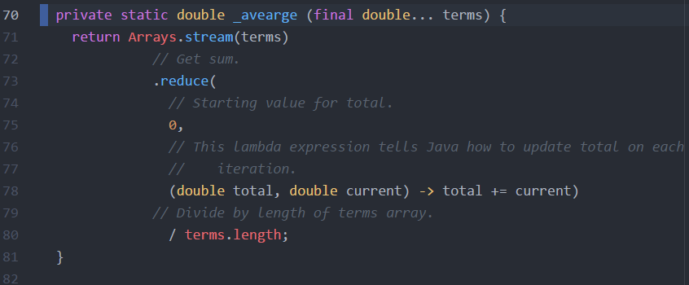

_Using reduce to calculate the average of an array of terms._

### 9. Partners Do: Stream Methods  (0:30)

* Slack out [19-Stu_Stream-Methods/Unsolved](../../../../../01-Class-Content/21-regionalized-content/Java/01-Activities/19-Stu_Stream-Methods/Unsolved).

* Slack out the following instructions:

  * **Instructions**:

    * Your first task is to create a `Stream` of user-input names.

    * First, create a `Scanner` object. Make it a `private static` variable on your class.

    * Create a method that prompts the user for a number with `System.out.print`, and collects their input with your scanner's `nextLine` method.

    * Create a method that calls the method you just wrote `int N` times with a `String message` as a prompt, and saves the results in an `ArrayList`.

    * In your `main` method, call that method to collect five names. Turn the `ArrayList` into a stream, and save that stream to a variable.

    * Using that stream as a starting point, create a new one that throws out every name starting with `"A"`.

    * Add "Dr." to the remaining names.

    * Turn this stream into a single String which says, "Hello, Dr. John, Dr. Jenny, Dr. Melody". Your names will be different, of course. What function will you use for this? What should your initial value be? Discuss carefully with your partner.

    * Save the string you created above into a variable.

    * Finally, print that variable. Print it with an exclamation mark at the end.

    * If you have time, extract the above stream logic into a separate function that accepts a `Stream` and returns a `String`. Instead of saving the stream of names, create and pass it directly to your new method. This should reduce your `main` method into just two lines.

### 10.  Instructor Do: Review Activity  (0:15)

* Remind students that there was nothing easy about this exercise. It's okay if they found it challenging!

* Start by reminding students how to instantiate a `Scanner`.

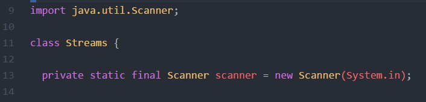

_Instantiating a Scanner around System.in._

* Next, ask a student how they wrote the method to prompt users and collect input.

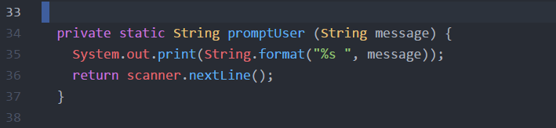

_Prompting a user for a name._

* Ask a student to explain how they wrote the method to prompt users `N` times.

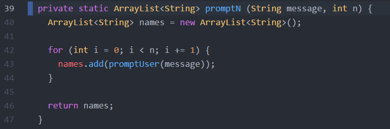

_Prompting a user for a name N times._

* Ask a student to explain how they converted the `ArrayList` to a `Stream`.

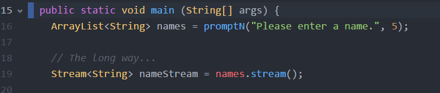

_A simple call to stream() converts an ArrayList to a Stream._

* Ask a student to explain how they got rid of names starting with the letter A.

* Ask a student to explain how they converted each name to contain the title "Dr.".

* Ask a student to explain how they converted the resulting stream of names to a greeting.

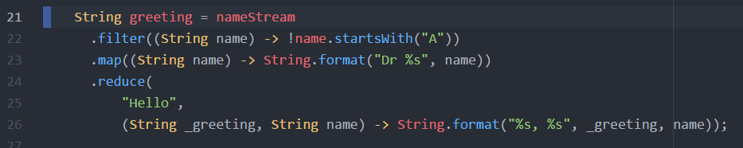

_Using filter, map, and reduce to create a greeting._

```
* This is the part that will require the most time. Explain the following:

    * Our starting term should be "Hello", because this is what we'll add names to.

    * Every time we see a new name, we want to update it with ", ${name}". So, we return the result of `String.format(""%s, %s", _greeting, name)`.

        * Students can also use: `_greeting += ", " + name`.

    * Remind students that `reduce` returns a string, so they need to save the result of all of these stream operations to a `String` variable to hang onto it.
```

* Finally, ask a student to explain how they printed the final result.
* Take a moment to answer student questions.

  * If students seem comfortable with the material, explain how you can extract the stream operations into their own function()`reduceGreeting`).

  * If not, feel free to skip this bit. Prioritize review.

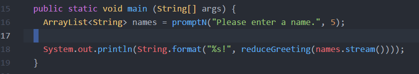

_Condensing the main method to use the reduceGreeting method._

* Before dismissing class, explain that the _real_ advantage to learning these stream operations is the fact that they're useful in _many_ more places than Java.

  * Explain that programming with streams is the foundation for whole style of programming, called functional programming.

  * Explain that, since this is a style of programming, it's not restricted to a single programming language. This is _not_ "just a Java thing".

  * To illustrate, open up [19_Stu_Stream-Methods/Solved/streams.js](../../../../../01-Class-Content/21-regionalized-content/Java/01-Activities/19-Stu_Stream-Methods/Solved/streams.js).

    * Explain that JavaScript arrays have `map`, `filter`, `reduce`, `concat`, and `forEach` methods, as well!

    * Briefly show students the JavaScript version of the program they just wrote.

      * Point out that they can even use the same arrow syntax, but that it uses `=` instead of `-` in JavaScript.

      * Don't belabor the point or explain the details of arrow functions &mdash; just make it clear that we can process lists with exactly the same logic in JavaScript.

    * Slack out [19-Stu_Stream-Methods/Solved/streams.js](../../../../../01-Class-Content/21-regionalized-content/Java/01-Activities/19-Stu_Stream-Methods/Solved/streams.js), and encourage students to practice stream programming in both JavaScript and Java whenever they have the chance. It's a powerful technique, and just requires a bit of practice to feel natural.

### Lesson Plan Feedback

How did today's class go?

[Went Well](http://www.surveygizmo.com/s3/4325914/FS-Curriculum-Feedback?format=pt&sentiment=positive&lesson=21.03)

[Went Poorly](http://www.surveygizmo.com/s3/4325914/FS-Curriculum-Feedback?format=pt&sentiment=negative&lesson=21.03)
