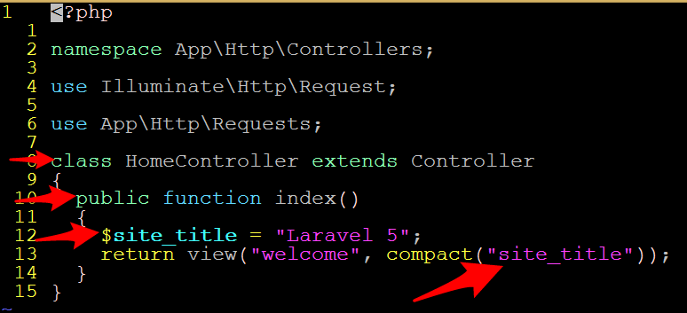

# 20.2 Lesson Plan - Learning Laravel

### Overview

Today's lesson will introduce students to the fundamentals of Laravel, including

1. [Templating with Blade](https://laravel.com/docs/5.1/blade);

2. [Using Controllers to link logic to views](https://laravel.com/docs/5.1/controllers);

3. [Models](https://laravel.com/docs/5.1/eloquent#introduction) and [migrations](https://laravel.com/docs/5.1/migrations); and

4. PHP Artisan.

`Overview: Complete activities 5-11 in Unit 21`

#### Instructor Priorities

Students should be able to:

1. Display data in Blade templates;

2. Create controllers, and associate them with views;

3. Create models, and use them within controllers;

4. Use Artisan to scaffold boilerplate.

#### Instructor Notes

* Solutions are distributed as the entire Laravel project directory, less the `vendor` folder.

* Students running OS X are liable to have difficulties installing Composer. This is by and large due to the fact that the Composer-provided scripts install to the directory in which they're executed, rather than to a directory necessarily on the user's PATH. Windows users are fortunate enough to have a [straightforward installer](http://getcomposer.org/doc/00-intro.md#installation-windows). Regardless, **tell your students to install Composer and Laravel beforehand**. This will greatly reduce the amount of time spent troubleshooting in class.

  * The following terminal command _should_ install directly to `/usr/local/bin`, on PATH by default: `curl -sS https://getcomposer.org/installer | sudo php -- --install-dir=/usr/local/bin --filename=composer`

  * Alternatively, tell students to follow the instructions on the [Composer page](http://getcomposer.org/download/), with **one crucial modification**:

    * On line 3, instead of `php composer-setup.php`, have them run `php composer-setup.php --install-dir=/usr/local/bin`.

    * This installs Composer to a directory that should already be on the PATH.

  * Additionally, be sure to notify students that they _must_ have Laravel installed before class. [Installation instructions are on the home site](https://laravel.com/docs/5.5/installation).

  * Be sure to share these instructions with students **before class starts**.

* The most important outcome of the Laravel unit is that students should be able to **create and edit models via form inputs**. Focus on the latter half of today's class to facilitate this.

* Have your TAs reference the [TimeTracker](02-Day-TimeTracker.xlsx) to help keep track of time during class.

- - -

### Class Objectives

* To develop familiarity with Laravel's view and controller layers;

* To use PHP Artisan's generators to streamline the development process; and

* To develop basic facility with Laravel's query builder and Eloquent models.

### 1. Instructor Do: Welcome Students & Introduce Laravel (5 min.)

Take a moment to greet students, and introduce Laravel with the following points:

* Laravel is an MVC Framework that makes it easy to develop database-backed websites.

* It provides:

  * An extensible templating system;

  * A powerful backend that makes it easy to use a variety of SQL-based databases (SQLite, PostgreSQL, or MySQL);

  * All of PHP's object-oriented programming features, as well as [all the new features and speed of PHP 7](http://php.net/releases/7_0_0.php); and

  * A high-productivity workflow. Laravel generates a generous amount of boilerplate for you.

    * Likely to be one of students' favorite parts of the framework.

_Relative popularity of PHP frameworks._

### 2. Everyone Do: Verify Laravel Installation (10 min.)

* Installing Laravel requires a tool called Composer.

* This installation is easier than that for PHP, but expect trouble regardless. Have your TAs on-hand to troubleshoot. Move on early if everything goes smoothly.

* Tell students that they can think of Composer as NPM for PHP projects.

* Slack out the following instructions to students:

* **Instructions**

  * Visit Composer's Downloads page: <https://getcomposer.org/download/>

  * Mac and Windows users will need to do slightly different things from here.

  * **Mac Users** Run `cd /usr/local/bin`, and run the script on the Composer site. You may need `sudo`.

    * After installing composer, run this command to move the tool into your path: `mv composer.phar /usr/local/bin/composer`. This will let you run composer simply by typing `composer` in your terminal.
      * Run `composer --version` in your terminal. Your window should display a version statement. If it instead shows an error message, consult a TA.

  * **Windows Users** // Create a directory for Compuser, such as `c:\composer`, and `cd` into it. Add this directory to your `%PATH%`. Then, run the script on the Composer site in the directory you just created. (Alternatively, you can just download and run `Composer-Setup.exe`)

    * When you're done, run: `composer --version`. If it worked, you'll get a version statement.

  * Now that you have Composer, you can install the Laravel command line tool by running: `composer global require "laravel/installer"`

    * If you're on a mac, run this command to add Laravel to your PATH: `export PATH="~/.composer/vendor/bin:$PATH"`

  * To verify your Laravel installation, run `laravel --version`.

    * This lesson will use Laravel 5.2.x. 5.3.x was written after this draft, and introduces breaking changes to project structure.

* Cut this short as soon as you're certain everyone is good to go—try to use as little of the 10 minute allowance as possible.

### 3. Instructor Do: Hello, Laravel (5 min.)

* Demonstrate how to create a new project with Laravel:

  * Ordinarily, one runs: `laravel new ProjectName`

  * For the sake of this lesson, instead do: `composer create-project laravel/laravel ProjectName 5.2.x`.

    * Again—this is to prevent issues due to the 5.3 update.

_Creating a new Laravel project._

* Explain that this creates a project in a new directory called ProjectName.

* Change into the project directory.

  * Mention that students should initialize and commit to a Git repo immediately.

* Run: `php artisan serve`.

* Visit `localhost:8000` to show off the demo page.

### 4. Students Do: Hello, Laravel (3 min.)

* Slack out the following instructions to students:

* **Instructions**

  * Create a new Laravel project.

  * Change into the project directory.

  * Serve the demo site.

_Laravel's boot page._

### 5. Instructor Do: Review (2 min.)

* Take a moment to point out that we served the site with a tool called PHP Artisan.

* Explain that Artisan will be our primary tool for scaffolding boilerplate and managing workflow.

* In the command line, run: `php artisan`

* Make sure students know that they won't be responsible for learning all—or even most—of Artisan's functionality. Just make sure they know how to access this help prompt, and encourage them to check it out from time to time.

### 6. Instructor Do: Laravel's Blade (5 min.)

* Let students know that the first thing we'll cover is Laravel's templates.

Open [07-Basic-Templates/Examples](../../../../../01-Class-Content/21-regionalized-content/Laravel/01-Activities/07-Basic-Templates/Examples)

* Tell students that static assets—such as images; css; etc—live in `resources`, and that templates live in `resources/views`.

_Resources directory in the starting project._

* Open up `resources/views/welcome.blade.php`. Point out that it looks just like HTML...because it is.

* Remind students raw PHP allows you to require HTML to build modular web pages.

* Tell students that Blade allows us to do the same thing.

  * Open up `07-Basic-Templates/Examples/layout.blade.php`, and review the following points.

    * Note the line with `@yield('content')` inside the `body` tag. This is similar to`require './content.php`, in that we _replace_ the `@yield` statement with the contents of a different file.

_@yield statement._

* Any number of child views can use `layout.blade.php` as a base, and substitute their own content anywhere a `@yield` statement appears.

  * Open up `home.blade.php`, and cover the following:

    * Point out the `@extends('layout')` line at the top. This tells Blade to look for a file in the `resources/views` directory, called `layout.blade.php`, as the basis for this template.

    * This line ensures that our template will render exactly like `layout.blade.php`, _except_ for where we override `@yield` blocks.

    * Point out the `@section('content')...@stop` block. Blade inserts everything in this block where the `@yield` statement appears in the parent.

    * Explain that you have a choice between `@stop` or `@endsection` to end a block, but should stick to one or the other.

_Basic Blade directives._

### 7. Students Do: Modularizing Templates (10 min.)

* Slack out the following instructions to students:

* **Instructions**

  * Find the template used as your project's current homepage.

  * Which sections of this template should be common to all pages on the site? Extract these to a base layout file.

  * Which sections of the template are specific to the home page? Allow child templates to override these sections.

  * Allow child templates to override the page's `<title>`.

  * Create a template for an About page. We can't load it yet, so all it needs is a header, for now.

### 8. Instructor Do: Review Activity (5 min.)

* Walk through the solution in `07-Basic-Templates/Solutions/resources/views`.

* Call on different students to explain what they moved out of the template, and why.

_Annotated layout.blade.php._

_Annotated welcome.blade.php._

### 9. Instructor Do: Routes (10 min.)

The files for this section are at `08-Routes/Example` and `08-Routes/Solutions`.

* Point out that we didn't have to do any work for Laravel to figure out that we wanted to load `welcome.blade.php` when we hit `localhost:8000`.

* Explain that this is because Laravel has already registered this route for us.

* Open up `app/Http/routes.php`.

* Explain that routes are registered with the following formula:

  * `Route::METHOD(ENDPOINT, HANDLER)`

* Let students know that they have the most common HTTP methods available: GET, POST, PUT/PATCH, and DELETE.

  * We'll touch on each of these individually through the lessons and assignments.

* Explain that an ENDPOINT can be any string, and that the initial slash is optional.

  * Optionally, demonstrate, by deleting it from the definition of the default route.

* Explain that the HANDLER is just a function.

* Explain that the call `view('welcome')` tells Laravel to look for a template called `welcome.blade.php`, and render it.

  

  _An example route._

* Explain that we can pass data to our templates from our controllers, as well.

  * Demonstrate by storing the string `Laravel 5` in a variable (e.g., `$site_title`) and passing it to the view using `compact`.

  * Explain that `compact` lets us refer to the variables whose names we pass it in the template, and that they'll have the value set in the route.

  * Open up `welcome.blade.php`; replace "Laravel 5" with {{ $site_title }}; and show that the site displays as before.

_Variable interpolation in the template._

### 10. Students Do: Create an About Me (10 min.)

* Slack out the following instructions to students:

* **Instructions**

  * Create a route that displays the About template you created earlier.

  * Using Artisan, check that it serves as expected.

  * Add some information to your about page. Style it however you'd like, but include the following information:

    * First Name;

    * Last Name; and

    * Email Address.

  * Pass these values to your view from your route.

    * _HINT_: The function you use for this is not limited to a single argument!

  * Replace the default styling with Bootstrap, if you want to. This step is optional.

### 11. Instructor Do: Review Activity (5 min.)

* Change to `08-Routes/Solutions`, and open `app/Http/routes.php`.

* Walk through the solution, and take some time to answer student questions.

* Slack the solution out to students, so they can refer to them later.

_Annotated solution._

### 12. Instructor Do: Introduce Controllers (5 min.)

* This is acceptable for demonstration, but not production. Remind students that it's best to separate content from `routes.php`, which developers should only use for registering routes.

* Explain that Laravel provides Controllers to handle the kind of logic we just put in our About route.

* Explain that creating controllers is such a common task that Artisan can do it immediately.

* Run: `php artisan make:controller HomeController`.

* Explain that this command creates `HomeController` in `app/Http/Controllers`. Open it up.

* Explain that a Controller is a class, and that each of its methods tells the application how to respond to a specific route.

* Proceed by example:

  * Create an index method: `public function index()`. Explain that this will handle our default route.

_index method in HomeController._

* Open `app/Http/routes.php`. Copy and paste the default route's logic into the index method.

* Update the route: `Route::get("", "HomeController@index");`

_Refactoring routes.php._

* Explain the syntax for referencing a Controller method:

  * `CONTROLLER@METHOD`

* Serve the site and show that everything works as before.

### 13. Partners Do: Refactor About Me (10 min.)

* Slack out the following instructions to students.

* **Instructions**

  * Create an AboutController.

  * Move the logic from your About route into the controller.

  * Serve your site, and make sure everything works as expected.

  * if you finish early, feel free to continue with the remaining challenge.

  * Instead of a single first name, last name, and email, create three arrays, containing both your and your partner's names and emails.

  * Loop through each array in the template, and using a list, print:

    * Our names are: YOUR FULL NAME // PARTNER FULL NAME

    * Our emails are: YOUR EMAIL // PARTNER EMAIL

  * _HINT_ Where should you define full names to make this easy?

  * _HINT_: The Blade documentation on foreach is here: <https://laravel.com/docs/5.1/blade#control-structures>. But, you _can_ use raw PHP for this—Blade is just a convenience.

### 14. Instructor Do: Review Activity (5 min.)

* Ask a student how they solved the problem of printing full names.

* Change to `09-Controllers/Solutions` and open `app/Http/Controllers/AboutController.php`.

_Annotated routes.php._

* Walk students through the solution.

  * This is intentionally clumsy. We're about to see a better way to do this.

_Annotated AboutController.php._

* Open up `09-Controllers/Solutions/resources/views/about.blade.php`. Review the syntax of Blade's `@foreach` directive.

* Slack these files out to students, so they can refer to them later.

- - -

### 15. BREAK (10 min.)

- - -

### 16. Instructor Do: Models, Migrations, & Resource Controllers (15 min.)

The files for this section are in `10-Models/Examples`.

* Point out that models save us from the clumsiness of manipulating data in our controllers.

* Explain that models are simply objects, which allows us to associate logically related data and behavior for convenience and modularity.

  * Point out that this is conceptually identical to what students have used JavaScript objects for.

* Explain that using models in Laravel requires two steps:

  * The creation of the model; and

  * The creation of a migration.

* Explain that a **migration** is simply a way to tell the database that we're updating it with a new **model**.

  * Emphasize that the two go hand in hand: When we create or update a model, we must create a migration.

* Let students know that Laravel creates both a User model and a User migration for every new project, since most applications require it.

* Open up `10-Models/Examples` and open `database/migrations`. Open the migration for creating the users table.

* Explain that a migration is just a class with two methods: `up` and `down`.

* Explain that the `up` method is called when we upgrade our database, and `down` is used when we revert to an older version of it.

* Point out that PHP objects are different from SQL data. Migrations are how we translate our object's structure to something intelligible to the database.

* Explain each `$table` statement. Simply running through the comments is okay.

_Migration for create_users_table._

* Explain that Laravel knows what attributes we want on our User object based on the columns in the database table, so we don't need to create a detailed class ourselves.

* Shifting gears, ask a student what sorts of things they'd probably be doing with a User model.

* Point out that we'll be using all the REST verbs with almost all of our models. No matter what data we store, we'll probably need to be able to create; update; view; and delete it.

* Instead of manually creating all of these routes, we can use Artisan to scaffold a Controller with stubs for all of these actions.

* Run: `php artisan make:controller UsersController --resource`, and open `UsersController.php`.

* Quickly showcase the boilerplate that Laravel generates.

* In the top of the file, add: `use App\User;`, and mention that this needs to appear in any Controller that uses the User model.

_User resource controller._

* Demonstrate how to set this up in `routes.php`:

  * `Route::resource('user', 'UsersController');`

_UsersController in routes.php._

* Mention that Laravel determines which method to call based on which HTTP method your application sends, and which URL the application requests. Explain that:

  * `POST` requests call `store`;

  * `DELETE` requests call `destroy`;

  * `PUT` and `PATCH` requests call `update`; and

  * `GET` requests trigger `index`, `create`, `edit`, or `show`, depending on the request URL.

  * Tell students not to worry about remembering these details now. It'll stick with practice.

### 18. Partners Do: Managing Users (35 min.)

* For the remainder of class, students will tinker with forms and HTTP controllers.

* Treat this as an assisted mini-project. Students should not expect to finish the entire exercise, and instructors should not expect them to. The purpose of the activity is to get students tinkering with Laravel—not build a full application. The crucial checkpoints are the following:

  * Students are able to use Blade to create templates that extend from a "base" `layout.blade.php`;

  * Students are able to "wire" controllers to templates using `routes.php`;

  * Students are able to pass data to Blade templates from controllers;

  * Students are able to pass data from templates to controllers via form inputs;

  * Students are able to create models with data submitted through forms.

  * Ensuring most students achieve the **first three** of these objectives is priority. It's okay to leave the last two for your review, and simply explain the solutions/slack them out to students so they can review them for homework. Lesson 20.3 will provide more extensive coverage of models and forms

  * You are encouraged to provide guidance on each of these outcomes throughout the activity, at intervals. You way wish to check-in with the class at large every 10 minutes to cover "pain points", and have your TAs actively engaging with students as they work.

* First, tell students to run: `touch database/database.sqlite`.

* Make sure you're in `11-Models`, and slack out both `.env` and `config/database.php`. Tell students to overwrite their local copies with what you've sent out.

  * This saves the time of setting up and troubleshooting database connections. We'll walk students through this detail during Lesson 20.3.

* Slack out `check_db.php`. Tell students to run: `php artisan tinker check_db.php`.

  * Have your TAs available to troubleshoot, if necessary.

  * Let students know that `php artisan tinker` allows them to run PHP with all the tools Laravel provides. So, they can "tinker" with the framework directly.

* Once students are good to go, slack out the instructions below.

  * Explain the solutions to

  * After ca. 7 minutes have elapsed, demonstrate how to retrieve `POST` data from a `$request` object.

* **Instructions**:

  * This will be a big activity, but don't be intimidated by the length of the instructions! They're detailed to make it easier on you. Finish as much as you can, but don't worry it if you don't get through everything. Focus on wrapping your head around controllers, routes, and views. If that feels good, move on to tackling models. Do _not_ hesitate to ask for help throughout—your instructor and TAs fully expect to be doing rounds for the next half hour!

  * To start, create a resource controller for your Users model, and add it to your routes.

  * Open your `UsersController`. Find the method that creates a new user, and have it return a view called `users.create`. The '.' tells Laravel to look for `resources/views/users/create.blade.php`. _HINT_: It helps to keep the documentation open, just in case: <https://laravel.com/docs/5.1/controllers#restful-resource-controllers>

  * Create this template. Start by inserting a simple header, serving your site, and hitting the correct route to make sure it works.

  * Add a form to the template. It should include the following:

    * A label and an input for a name;

    * A label and an input for an email;

    * A label and an input for a password; and

    * A submit button.

    * Laravel also requires you to add a csrf field. You can put this anywhere within your `<form></form>` tags, but just stick it in the bottom for now. _HINT_: The docs are here: <https://laravel.com/docs/master/helpers#method-csrf-field>

  * What should your form's `action` attribute be if you're creating a user? What should your form's `method` be if you're creating a user? Refer to the HTTP Controllers documentation if you've forgotten. Alternatively, run `php artisan route:list` for a hint. If it's not immediately obvious, ask a TA for a refresher!

  * Return to your controller. Find the method that receives the data from the form, and `var_dump` the data it received. This is similar to JavaScript's `console.log`, but puts the information right into the browser. _HINT_: If your input field had a `name` attribute of `name`, you'd write: `var_dump($request->name)`. Do this for all of your for inputs to make sure your form is wired up properly.

  * Once you've gotten here—congratulations! This is the **major milestone** for this activity. The rest is important, but it's okay if you don't get through it all, as your next lesson will cover it in greater detail.

  * Once you're sure your route is receiving the form data, make sure you can use the `User` model in your controller. _HINT_: You have to add a line to the top of the file. You saw this earlier.

  * Next, create a new User before your `var_dump` statements.

  * Set your new user's `name`, `email`, and `password` properties. _HINT_: This is actually straightforward. Instead of  `var_dump` statements, set your User's properties. It'll look very similar to getting the data from the `$request`!

  * All models have a `save` method that saves them to the database. Simply call it on your user to save it.

    * _HINT_: This entire method will look exactly like the example in _Basic Inserts_: <https://laravel.com/docs/5.1/eloquent#basic-inserts>

  * Your final task is to send your user back to the "Create User" form.

    * First, do this with `return view(...)`. Use `compact` to accomplish this.

    * Then, do it with `return redirect(...)`. Instead of passing the template name, you pass the URL you want to redirect to. In this case, they differ by only one character.

    * Finally, do it by calling Laravel's built-in `back` method: `return redirect()->back();`

      * This is the best practice when dealing with forms.

  * If you've gotten through all of this, take a breather. Kudos for getting through it all!

### 19. Instructor Do: Review Activity (10 min.)

* Walk students through the solution, focusing on how to link the form to the controller.

_The final form._

* Take some time to answer student questions.

### 20. Instructor Do: List Users (Optional) (10 min.)

* Point out that it would be nice to be able to see the users we add.

* In Artisan Tinker, demonstrate how to retrieve all users:

  * `User::all();`

* Explain that the `::` syntax represents a _static_ method. This is a method that is defined on the `User` class _itself_, _not_ on the individual users.

  * Consider giving the example of a static method that increments a counter whenever a user creates a new `User`. This isn't a method that would make sense to put on an individual user object, but which would rather belong on the `User` class.

    * No, this probably wouldn't be great design, but it might help illustrate the concept.

* Tell students that they'll explore database queries in great detail during the next session. For now, we'll just use this one to demonstrate the common task of listing all of a certain type of model.

  * Your next task will be to walk students through building such a list in the `index` method. The solution is in `11-Index/Solutions`, if you'd simply like to show it off. If you'd prefer to code it out as you go, start with the solution to the previous exercise.

* Explain that the `index` method of a resource controller is often used for retrieving and displaying such a list.

* Ask a student how you'd retrieve and store all users in a variable.

  * If they get stuck, ask them how to finish the following line with the method you just showed them: `$users = ...`

  * `var_dump` the `$users` variable for demonstration.

* Next, create a template called `users/index.blade.php`. Iterate over your users, and print each user's name in an `<li></li>`.

  * Highlight  Blade's `@foreach` syntax.

  * As a final note, show them how to use PHP's `isEmpty` method, along with Blade's `@if...@else` statements, to only display users if the `$users` array is populated.

_Blade's foreach syntax._

* Then, ask a student what remains to be done for this template to be functional.

* If they get stuck, ask them if our controller is finished.

* Go back and pass your `$users` to the template.

_UsersController's index method._

* Kick up a server to demonstrate what this looks like in action.

### Lesson Plan Feedback

How did today's class go?

[Went Well](http://www.surveygizmo.com/s3/4325914/FS-Curriculum-Feedback?format=pt&sentiment=positive&lesson=21.02)

[Went Poorly](http://www.surveygizmo.com/s3/4325914/FS-Curriculum-Feedback?format=pt&sentiment=negative&lesson=21.02)
