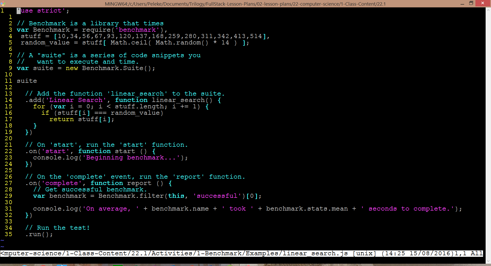
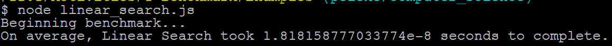
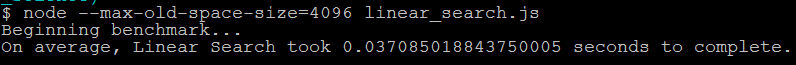
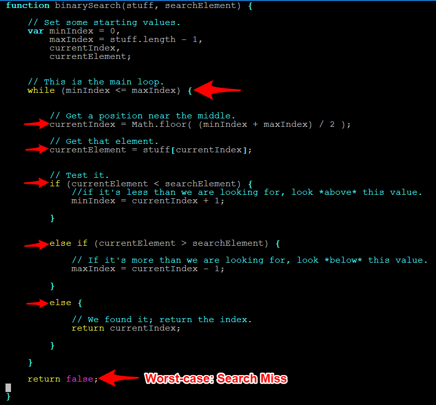

## 22.1 Lesson Plan - Basics of Algorithms <!--links--> &nbsp;  &nbsp; [➡️](../02-Day/02-Day-LessonPlan.md)

### Instructors and TAs: Please take the End-Course Instructional Staff Survey

Trilogy as a company values transparency and data-driven change quite highly. As we grow, we know there will be areas that need improvement. It’s hard for us to know what these areas are unless we’re asking questions. Your candid input truly matters to us, as you are vital members of the Trilogy team. In addition to the individual feedback at the end of lesson plans
we would appreciate your feedback at the following link:
[https://docs.google.com/forms/d/e/1FAIpQLSdWXdBydy047_Ys1wm6D5iJY_J-0Mo0BqCjfGc4Er2Bz9jo5g/viewform](https://docs.google.com/forms/d/e/1FAIpQLSdWXdBydy047_Ys1wm6D5iJY_J-0Mo0BqCjfGc4Er2Bz9jo5g/viewform)

### Overview

In this class, we will be introducing students to the fundamental concept of algorithm development and efficiency. We will then be leaving them with the remainder of class to work on projects.

`Summary: Complete activities 1-2 in Unit 22`

#### Instructor Priorities

* Students should be able to define the word _algorithm_.

* Students should be able to define the term _benchmarking_.

* Students should be able to explain how benchmarking allows us to evaluate algorithms for their efficiency. Namely, by providing us with **measurements of how long it took to run them**.

* Students should understand the notion of linear time complexity.

  * Namely, they should be able to identify that an algorithm that takes twice as long to execute when you double the size of its input; three times as long to execute when you triple the size of the input; etc., are _linear_.

  * You'll use the term time complexity in the lesson plan, but it's not essential that students remember it today.

* Students should be able to identify algorithms with non-linear time complexity.

* In particular, they should understand that binary search is much faster than linear, and be able to articulate why:

  * Doubling the input array increases the amount of time the algorithm take to run, but by much less than a factor of two.

#### Instructor Notes

* [Visual Go](http://visualgo.net/) is a great resource for visualizing algorithms and data structures.

* [Show this linear search visualization](https://www.cs.usfca.edu/~galles/visualization/Search.html) around section 3.

* Have your TAs refer to the [TimeTracker](01-Day-TimeTracker.xlsx) to stay on task.

* **Extra Resources:** Send out the following link before or after class and encourage students to tackle the algorithm questions in [Whiteboarding Overview and Questions](https://www.gitbook.com/read/book/the-coding-bootcamp/whiteboarding-algorithms-and-interview-questions?key=technicalInterview). This was given with the course pre-work but after this week, students should be able to accomplish those questions.

- - -

### Class Objectives

* Students should understand what algorithms are, and the basics of how to evaluate them.

* Students should be able to identify linear-time and non-linear-time algorithms.

- - -

### 1. Students Do: Students Research "Algorithm" (10 min)

* At the start of class, welcome students then have them research definitions to the word "algorithm". Specifically, have them answer the following questions:


```
* What is an algorithm?

* What are some examples of common computer science algorithms?

* How do you determine if one algorithm is better than another?
```

### 2. Everyone Do: Students Share Responses (5 min)

* Students share their responses. Instructor listens with bemusement.

### 3. Instructor Do: Algorithm Definition (10 min)

* Choose your own definition or use the one below:

> An algorithm is a set of steps to solve a problem or perform a calculation.

* Then mention that we've been using algorithms all along.

* Algorithms can be as simple as breaking down the steps to create a PB&J Sandwich to more complex tasks like creating random number generators, looping through arrays, or optimizing a search engine's results.

* The study of algorithms thus has to do with finding new ways to solve the same problems, more efficiently—and with better handling of "scale".

### 4. Students Do: Simple For Loop Search (10 min)

* Have students complete the following task:

* **Instructions:**

  ```javascript
  var stuff = [10,34,56,67,93,120,137,168,259,280,311,342,413,514];

  var random_value = stuff[ Math.floor( Math.random() * 14 ) ];
  ```

  * Write a `for` loop that looks at each index of the array to see if it matches the random value

  * If it does match the random value display an alert box with the index of the array and the value

### 5. Instructor Do: Review the solution to the previous problem (10 min)

* Open up `0-Benchmark/Solutions/linearSearch.js`.

* Explain that this is an example of a "linear search".

* Explain that, if we double the length of the array we're searching, we double the amount of time it takes to search. If we triple the length of the input, we triple the amount of time it takes...Etc.

* Explain that this is why it's called linear: Any increase in the size of the input array implies a _linear_ increase in the amount of time we have to wait for the algorithm to finish.

* [Show this visualization](https://www.cs.usfca.edu/~galles/visualization/Search.html) to help students see what's going on, and to prompt questions.

* Ask students to calculate the minimum and maximum number of iterations it would take to find the random number.

  * Answer: Minimum: 1; Maximum: 14.

* This isn't a big deal for data sets this small. Today's computers are able to perform such a search almost instantaneously.

* In fact, let's time it.

### 6. Students Do: Time The Search (5 min.)

* Explain that there are ways to determine precisely how long it takes to execute a piece of code.

* Explain that [Benchmark.js](https://benchmarkjs.com/) is one such timing library.

  * Explain that _benchmarking_ is the practice of testing how long an algorithm takes to run.

* Briefly describe Benchmark's functionality. Explain that it:

  * Executes a piece of code several times, so it get an accurate picture of how long it takes to run on average;

  * Automatically determines how many times to run the code to calculate statistics;

  * Provides details such as standard deviation/variance, etc.

* Open up `01-Benchmark/Examples/linearSearch.js`, and briefly explain the points below.



_Major methods of Benchmark.js._

* Zip and Slack out `01-Benchmark`, and instruct students to unzip the archive.

  * This includes Benchmark and its dependencies, so we don't have to waste time creating an NPM project, installing dependencies, etc.

* Explain that we won't use most of Benchmark's methods, and that it's fine if students don't remember all the details (e.g., the logic inside the `on('completed'...)` method; event names; etc.).

  * What matters is that they understand that **Benchmark times code**.

* Explain that, as developers, we will always be eminently interested in the **amount of time an algorithm takes to run**. Benchmarking allows us to determine, objectively, **which algorithms take the least time** in certain cases.

* Have students run `linearSearch.js`. Call on a few students to share their benchmarks. Sample results from my machine are below.



_Results of running benchmarks on a Dell Envy w/ Intel i7 2.7GHz and 16Gb RAM._

### 7. Instructor Do: Time a MUCH LARGER Search (1 min)

* Reopen `linearSearch.js`, and change the value of `length` to `1000000000`.

* Have students explain the difference between this code and the old code. Ask a couple of students if this code should be faster; slower; or just as fast as the previous code. Why?

  * Essentially, the only difference is we've _increased_ the number of elements in our array, which _decreases_ the probability we'll find our `random_value` in any given iteration.

  * This code should take longer to run, because there's a lower chance our loop will find the right number on each iteration.

### 8. Students Do: Time The Search (2 min)

* Now have students re-time their search. Their old code will work for this example as well.

  * Sufficiently large values of `length` will cause `heap size exceeded` errors. If/when students run into this, have them run the benchmark with the following command:

    * `node --max-old-space-size=4096 linearSearch.js`


```
* Explain that this increases the amount of space available for the Node process.

* Alternatively, they can simply reduce `length` until the error disappears. They'll still get a big enough value to illustrate that this code takes longer.
```

* Point out that now the code starts to take longer, and now we're beginning to see the limitations of our "linear approach".



_Results of running benchmarks on a Dell Envy w/ Intel i7 2.7GHz and 16Gb RAM._

* Ask students the max number of steps (or instructions) it would take to solve this.

  * Answer: 1000000000, or `length`.

### 9. Everyone Do: How Could We Improve? (12 min)

* Explain that, as developers, our primary concerns are choosing the algorithm that runs most quickly.

  * Feel free to mention space efficiency, as well. Be aware that we have no exercises for space efficiency, so don't get too sidetracked if you decide to mention it.

* Point out that we've discussed two ways to sort a list.

* Emphasize that this demonstrates that there are often multiple approaches to solving the same problems.

  * Explain that some of those approaches are better than others, depending on the problem we're trying to solve.

* Have students try to pseudocode or research a better approach.

  * Students shouldn't be coding at this point—simply thinking of ways to come up with a better solution.

### 10. Students Do: Binary Search (25 min)

* Have students research the concept of "binary search".

* See if they can create their own method for creating a binary search based on their reading. They may find binary searches in other programming languages—or simply abstractly, allow them to try and create a binary search on their own.

### 11. Instructor Do: Binary Search Revealed (20 min)

* Explain binary search by analogy to finding words in a dictionary.

  * When looking for the word, say, _diaphanous_, one might open the dictionary to a random page, and see which section of the dictionary they end up in.

  * If they opened to the section for the letter H on page 100, they know to only look in the portion of the dictionary to the _left_ of page 100, and ignore the entire chunk of pages to the right.

  * Proceeding in this way allows them to quickly find the word they're looking for by discarding large, irrelevant portions of the search space.

* Open up `02-Binary-Search/Examples/binarySearch.js`, and walk students through its essential steps.



_The essential steps of the binary search algorithm._

* [Show this visualization](https://www.cs.usfca.edu/~galles/visualization/Search.html) to help students see what's going on, and to prompt questions.

  * [Visual Go](http://visualgo.net/bst) has another beautiful animation, which you may prefer to use.

* Point out that what makes this code effective is that we pre-sort a list of numbers in a range. Then, in each round, we check if the number we're trying is less than or more than the random number. Based on that we can effectively "halve" the number of options we still need to try.

* Ask when this code might be less efficient.

* Answer: Large, unsorted lists, which we would first have to sort and then search (O(n log n)). In this case, direct linear search is faster (O(n)).


```
* Of course, in practice, the one-time cost incurred by sorting might be worth it to enable algorithms that assume sorted input.
```

* Point out that binary search is _fast_. If we double the size of the input array, it will take longer, but it will _not_ increase by a factor of two.

* Point out that this is an example of a non-linear time complexity.

* For the curious, feel free to point out that binary search is O(log n).


```
* Reassure less confident students that this isn't a crucial detail at the moment.
```

### 12. Students Do: Project Work (Remainder)

* If time allows:

* Ask a student to define the word algorithm.

* Ask a student to explain how they might choose, _objectively_, between two different algorithms.

* Answer: Benchmarking/timing running time.

* Ask students what the time complexity is for an algorithm that takes twice as long to run if you double the size of its input; three times as long if you triple the size of its input; etc.

  * Linear.

* Ask a student to explain why binary search is so fast.

* Answer: Because it halves the search space on each iteration.

* Ask a student to name one essential difference between binary search and linear search.

* Answer: Time complexity. At worst, linear search will always take longer than binary search.

* Ask a student to explain when one might use binary search.

* Answer: When searching in a sorted array; or, when we have the option of sorting the array before we search.

* Ask a student to explain when one might opt for linear search.

* Answer: when searching in an unsorted array in situations where we _can't_ sort the array first.


```
 * E.g., when searching an array of elements on which no ordering can be imposed. An array filled with different data types is a good example.
```

* Address questions as they arise.

* If none do, slack out the link to [Interview Bit](http://www.interviewbit.com/).

  * Encourage them to spend at least ten minutes a day working on these questions, even after (maybe **especially** after!) finishing the Boot Camp.

  * Reassure them that this isn't _necessary_, but will drastically boost their confidence for technical interviews in the future.

* Allow students to work on projects for the remainder of the class period.

### Lesson Plan Feedback

How did today's class go?

[Went Well](http://www.surveygizmo.com/s3/4325914/FS-Curriculum-Feedback?format=pt&sentiment=positive&lesson=22.01)

[Went Poorly](http://www.surveygizmo.com/s3/4325914/FS-Curriculum-Feedback?format=pt&sentiment=negative&lesson=22.01)
