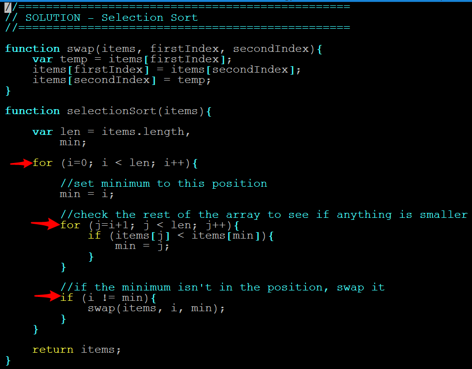
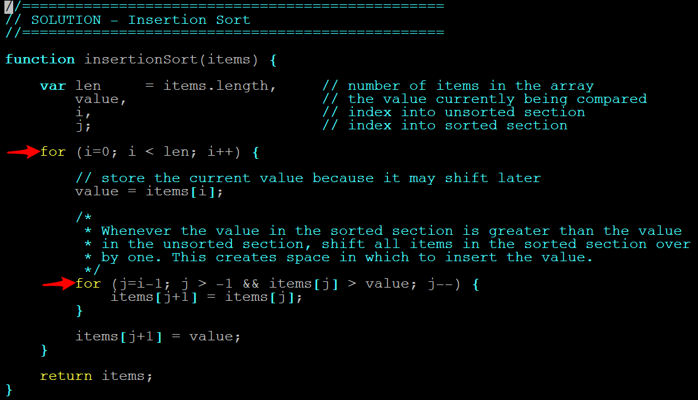

## 22.2 Lesson Plan - Sorting Algorithms <!--links--> &nbsp; [⬅️](../01-Day/01-Day-LessonPlan.md) &nbsp; [➡️](../03-Day/03-Day-LessonPlan.md)

### Overview

In this class, we will be introducing students to sorting algorithms. If time and student interest are appropriate, instructors are free to touch on `06-Lodash`. We will then be leaving them with the remainder of class to work on projects.

`Summary: Complete activities 3-5 in Unit 22`

#### Instructor Priorities

* Students should be able to express the insertion sort algorithm in pseudocode.

* **Reach**: Students should be able to implement insertion sort in JavaScript.

* Students should be able to articulate the main cases in which insertion sort is more efficient than quick-sort. Namely:

* For small arrays; and

* For mostly-sorted arrays.

* Students should be able to express quick-sort in pseudocode.

* Students should be able to explain why selecting algorithms depends on knowledge of the data they will be operating on. Namely, because:

* Different algorithms have different strengths and weaknesses—e.g., insertion sort handles nearly sorted arrays quickly, but quick-sort is substantially faster on mostly unordered inputs.

* Selecting an algorithm means choosing the best tool for your particular use case.

#### Instructor Notes

* This site is fantastic for getting visualizations of how the sorts work <https://visualgo.net/en/sorting>. If you prefer, you can show students videos from this link immediately after each "sort" method is revealed. Otherwise, you can save it until the end and have students look at it then.

* You may want to warn students that today is hard. And that it's okay if they don't completely get everything today.

* Have students slack you when they finish activities. If you're able to move through things quickly, and have time at the end of the lesson, consider reviewing the Lodash Extras towards the end of class.

### Sample Class Video (Highly Recommended)
* To view an example class lecture visit (Note video may not reflect latest lesson plan): [Class Video](https://codingbootcamp.hosted.panopto.com/Panopto/Pages/Viewer.aspx?id=c9ffbc44-a267-4a3e-9b01-bd7c353480bf)

- - -

### Class Objectives

* Students should be able to express the insertion sort algorithm in pseudocode.

* Students should be able to express the quick-sort algorithm in pseudocode.

* Students should be able to explain why choosing an algorithm involve tradeoffs.

- - -

### 1. Students Do: Sorting By Hand (5 min)

* Start a stopwatch...

* Then slack out the following numbers to students.

* 201, 39, 54, 461, 93, 377, 413, 176, 164, 317, 109, 113, 36, 235, 17, 60, 53, 474, 257, 48

* Have students spend the next five minutes sorting the numbers in ascending order (without using any code).

* When students are done have them raise their hand and slack you when they are done.

* Call time on your stopwatch when the first one finishes.

### 2. Everyone Do: Sorting Strategy (10 min)

* Have the student who finished first share their approach to the sorting process.

* Specifically, how did they approach the following:

* Where did they start in the list?

* What did they do with the first number?

* How did they handle the comparison of numbers?

* Did they just go in a straight line down the list?

* Would they approach the problem any differently if they were given 200 numbers instead?

### 3. Instructor Do: From Mind to Machine (5 min)

* Explain that an algorithm is simply a systematic set of steps that accomplish some goal.

* Convey that this process of breaking down the steps associated with a complex process is really the heart of algorithm development.

* Then convey that as an algorithm developer, you will have to look at the same steps and try to think of the most efficient ways for a computer to iteratively tackle the problem.

### 4. Instructor Do: Selection Sort (5 min)

* As a first stab at this from a computational perspective, we could use the following approach:

* Scan through the list and find the smallest number possible. (This would require looping through and checking which number is greater than 0, but smaller than all other numbers)

* We would then say that this is our 1st number.

* We would then loop through and check which number is bigger than this smallest number, but smaller than any other number.

* This would then be our second number.

* And so on...

### 5. Students Do: Implement Selection Sort (25 min)

* Slack out the following files and instruction to students:

* **Files:**

* `03-Selection-Sort/Examples/algorithmStarter.js`

* **Instructions**:

  * Using the below approach as a guide, implement the "Selection Sort" in JavaScript.

    1. Scan through the list and find the smallest number possible. This requires looping through and checking which number is greater than 0, but smaller than all other numbers.
    2. We would then say that this is our first number.
    3. We would then loop through and check which number is bigger than this smallest number, but smaller than any other number.
    4. This would then be our second number.
    5. And so on...

* Then, test your algorithm with each of the commented out arrays of data. As a bonus, use Benchmark.js to time it in both cases.

### 6. Instructor Do: Review Selection Sort (10 min)

* Open up `03-Selection-Sort/Solutions/selectionSort.js`, and walk through its essential steps with students.

  

  _The defining steps of selection sort._

* Then, point out that this is one of the more inefficient sorting algorithms.

* Slack out [the link to Visual Go](https://visualgo.net/en/sorting), and play the video for the "Select Sort".

* Then, have students try to explain to partners about why it's so inefficient.

* Specifically, ask them to think about:

  * The number of "steps" the computer needs to run; and

  * Whether they can think of a way to _reduce_ this number of steps.

* After a few minutes, call on a student to explain the inefficiency.

  * If they have trouble articulating their thoughts, call on the entire row.

### 7. Students Do: Insertion Sort (10 min)

* Next, have students go through the process of sorting the original numbers by hand again.

* This time, ask them to articulate how their intuitive approach differs _algorithmically_ from the "Selection Sort" method.

  * I.e., ask them to articulate what steps are different between their intuitive approach, and selection sort.

  * Answer: Students are using something akin to _insertion sort_. I.e., they are looking through each of the numbers and then moving it "in between" the numbers it falls between.

    * The algorithmic difference is that selection sort scans the entire array once for _each element_ it encounters.

### 8. Instructor Do: Insertion Sort (10 min)

* [Play the video for insertion sort](https://visualgo.net/en/sorting).

  * Point out that insertion sort moves elements into their desired location more quickly. It doesn't have to loop through the entire set of numbers each time to move a single element.

### 9. Students Do: Implement Insertion Sort (25 min)

* Then, slack out the following files and instructions.

* **Files**

* `04-Insertion-Sort/Examples/algorithmStarter.js`

* **Instructions**

  * Using the pseudo-code below and what you can research online, implement Insertion sort in JavaScript.

    ```
    - start at the beginning of the array

    - move into a loop

    - compare only 2 values

    - swap if left is more than right

    - repeat until this current value is less than the right value OR the value is at the far right of the array

    - pseudo code:

    for i ← 1 to length(A) - 1

        j ← i

        while j > 0 and A[j-1] > A[j]

            swap A[j] and A[j-1]

            j ← j - 1

        end while

    end for
    * Then, test your algorithm with each of the commented out arrays of data. As a bonus, use Benchmark.js to time it in both cases.
    ```

### 10. Instructor Do: Insertion Sort Review (10 min)

* `04-Insertion-Sort/Solutions/insertionSort.js`, and walk students through the essential steps of insertion sort.

  

  _The defining steps of insertion sort._

* Emphasize that algorithms take time, practice, and study. They are anything but intuitive. It's okay if this still feels overwhelming.

- - -

### 11. BREAK (15 min)

- - -

### 12. Instructor Do: Quick-Sort (15 min)

* Point out how intuitive insertion sort is—it's the most "natural" way for humans to sort things.

* Point out that this is a major advantage from the standpoint of implementation. Since insertion sort "makes sense", it's easy to write it correctly.

* Explain that, while simple, insertion sort is [intolerably slow for average arrays](http://delab.csd.auth.gr/courses/c_ds/insertion_bubblesort_analysis.pdf), with a running time of O(n<sup>2</sup>).

* Students haven't been introduced to asymptotic analysis yet, so explain the quadratic running time with something like:

  * "If we double the number of items we're sorting, it will take _four_ times as long to finish. If we triple the amount of items, it will take _nine_ times as long. If we want to sort five times as many items, it's _twenty five_ times as long. Etc..."

* In other words, the amount of "work"—or machine instructions—that insertion sort needs to do to sort an array increases too quickly for it to work fast enough in practice.

* Explain that, if we're clever, we can write code that _minimizes_ the amount of work the computer needs to do to sort the array.

* Emphasize that this requires us to be _clever_. Efficient sorting methods aren't as intuitive as methods like insertion or selection sort.

* Now is a good time to point out the frequent tradeoff between performant and readable code.

* Explain that one such clever method is called _quick-sort_, so named because it's...well, really quick.

* For motivation, point out that quick-sort was developed [specifically because insertion sort is sometimes too slow](http://anothercasualcoder.blogspot.com/2015/03/my-quickshort-interview-with-sir-tony.html).

* Explain that the high-level sketch of quick-sort looks something like this:

* Select an element from the array. This element is called the **pivot**.

  * Choosing a pivot is a somewhat complicated detail. If someone asks, it's fine to explain that we can choose one at random.

* Next, begin sorting by iterating through the array. Rearrange the array's elements such that:

  * Every element _less_ than the pivot comes before it; and
  * Every element _greater_ than the pivot comes after it.
  * This puts the pivot in the right place—i.e., this is where the pivot will appear when the array is finally sorted.

* This process is called _partitioning_.

  * Taken independently, the elements to the left of the pivot comprise an array. The same is true for the elements to the right.

* Repeat the above steps in each of the sub-arrays generated from partitioning.

  * Since these sub-arrays get smaller with each iteration, we'll eventually try to sort arrays with one element.
  * Once we get here, we're done—the array is sorted.

* Reassure students that it's okay if this doesn't make sense at first. The point is to illustrate that some "unnatural" algorithms can, in fact, be very fast.

* Slack out the [Visual Go](https://visualgo.net/en/sorting) link again, and have students watch the video for quick-sort.

### 13. Instructor Do: Which is Best? (15 min)

* Ask students which algorithm they think is best.

* After hearing a few responses, answer the question for them: "It depends".

* Certain sorts are better in certain situations.

* Let them know the efficiencies of sorting algorithms depends on things like:

  * How big the data set is—insertion sort is a good default for small arrays.
  * How ordered the data is—i.e., whether it's completely out of order, or partially sorted.
  * How many unique elements there are.

* It's not obvious, but on average, quick-sort is _much_ faster in practice than either insertion or selection sort.

  * But, insertion sort wins for small arrays, and for arrays that are already almost sorted.

* Next, open the file `JS Sort`, and point out that JavaScript has a built-in sort method for arrays, `sort()`.

* Point out that uses algorithm like these under the hood.

* Explain that different browsers have different JavaScript "engines", each written differently. So, the details of JavaScript's `sort()` method can differ from environment to environment.

* To point out a big project using quick-sort, [Chrome's V8 engine uses quick-sort for general arrays, and Insertion sort for arrays with fewer than 10 elements](https://github.com/v8/v8/blob/master/src/js/array.js) (ca. 760-844).

* Demo the `05-Quicksort/Solutions/quickSortExample.js` file in your terminal to illustrate how much faster quick-sort is when dealing with large amounts of data.

### 14. Students Do: Sorting Algorithms Visuals (10 min)

* Have students spend a few moments looking at the [visuals on this page](http://www.sorting-algorithms.com/).

* Let them see for themselves that an algorithm's performance depends greatly on the initial conditions of its input.

  * Emphasize that **one's choice of algorithm depends on the expected input**.

### 15. Students Do: Pseudocode Quick-Sort (20 min.)

* Slack out the following instructions to students.

* **Instruction**:

* Write a (pseudocode!) implementation of quick-sort. You can assume that `partition` and `select_pivot` functions are already written for you.

* Keep in mind the idea of recursion: <https://en.wikipedia.org/wiki/Recursion_(computer_science)#Recursive_functions_and_algorithms>

* Don't sweat it if you're unsure of your solution—pseudocode affords a lot of freedom, and we'll review things together shortly. Regardless, be prepared to explain your work!

### 16. Instructor Do: Review Quick-Sort Pseudocode (10 min.)

* Open up `05-Quicksort/Solutions/quicksort_pseudo.md`, and review the code.

* Focus on explaining the recursive nature of quick-sort.

* Ask a student, or row, to explain the recursion.

* Because `partition` puts the `pivot` where it will appear in the final, sorted array.

* Recursing repeats the process for each subarray, gradually putting `pivot`s in the right place.

* Reassure students that it's okay if this is still a bit confusing. They won't need to implement these algorithms soon, if ever.

* Regardless, encourage them to study on their own. Algorithms are a great way to become a better programmer.

* Keep in mind that this exercise is more concerned with fostering _algorithmic thinking_ than we are with correct implementation. Foster a discussion, and don't get mired in the details of implementing `partition`, etc.

#### Review

If you have time, review the following questions before allowing students to work on projects:

1. If you had to choose to always use insertion sort, or always use quick-sort, which would you choose?

   * Answer: Quick-Sort is faster in general, but the **choice depends on the input**.

2. When would you use insertion sort?

   * Answer: For small arrays, and for arrays that are almost sorted.

3. When would you use quick-sort?

   * Answer: For arrays that are likely to be mostly unsorted.

4. Why do we need to know something about our input before we choose a sort method?

   * Answer: The best choice in certain cases may be the worst in others. For example:
   * Insertion sort is faster than quick-sort for almost-sorted arrays.
   * But, insertion sort is _much_ slower than quick-sort for reversed arrays.

Address any questions that may arise.

1. If none do, slack out the link to [Interview Bit](http://www.interviewbit.com/).

2. Encourage them to spend at least ten minutes a day working on these questions, even after (maybe **especially** after!) finishing the Boot Camp.

3. Reassure them that this isn't _necessary_, but will drastically boost their confidence for technical interviews in the future.

4. Dismiss students to work on projects for the remainder of class.

### Lesson Plan Feedback

How did today's class go?

[Went Well](http://www.surveygizmo.com/s3/4325914/FS-Curriculum-Feedback?format=pt&sentiment=positive&lesson=22.02)

[Went Poorly](http://www.surveygizmo.com/s3/4325914/FS-Curriculum-Feedback?format=pt&sentiment=negative&lesson=22.02)
